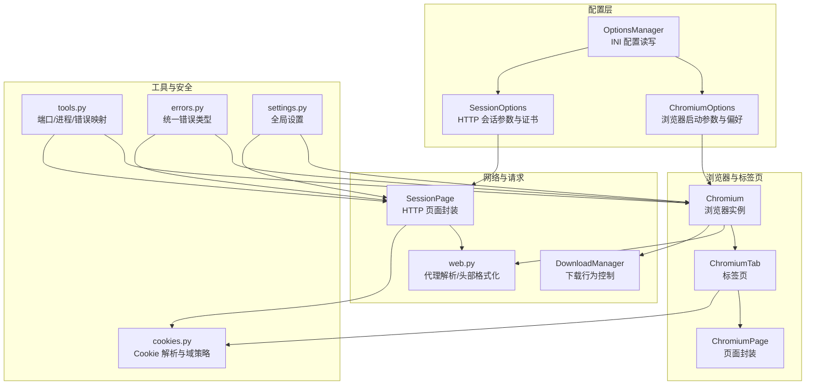
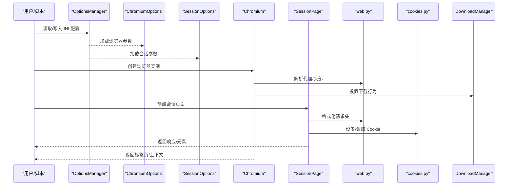
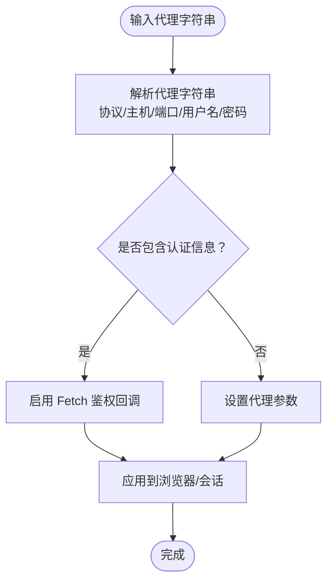
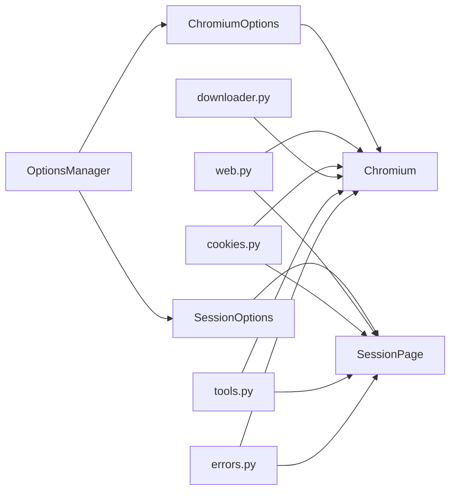

# 安全使用与合规

<cite>
**本文引用的文件**
- [chromium_options.py](file://DrissionPage/_configs/chromium_options.py)
- [session_options.py](file://DrissionPage/_configs/session_options.py)
- [options_manage.py](file://DrissionPage/_configs/options_manage.py)
- [chromium.py](file://DrissionPage/_browsers/chromium.py)
- [web.py](file://DrissionPage/_functions/web.py)
- [tools.py](file://DrissionPage/_functions/tools.py)
- [cookies.py](file://DrissionPage/_functions/cookies.py)
- [session_page.py](file://DrissionPage/_pages/session_page.py)
- [chromium_page.py](file://DrissionPage/_pages/chromium_page.py)
- [downloader.py](file://DrissionPage/_units/downloader.py)
- [errors.py](file://DrissionPage/errors.py)
- [settings.py](file://DrissionPage/_functions/settings.py)
</cite>

## 目录
1. [简介](#简介)
2. [项目结构](#项目结构)
3. [核心组件](#核心组件)
4. [架构总览](#架构总览)
5. [详细组件分析](#详细组件分析)
6. [依赖分析](#依赖分析)
7. [性能考虑](#性能考虑)
8. [故障排查指南](#故障排查指南)
9. [结论](#结论)
10. [附录](#附录)

## 简介
本指南围绕 DrissionPage 在网络安全、数据隐私、反爬虫对抗、请求头与用户代理、法律合规以及安全审计与漏洞检测等方面的安全使用与合规实践展开。文档以代码库为依据，结合组件职责与实现细节，提供可操作的策略与最佳实践，帮助开发者在自动化场景中平衡效率与安全。

## 项目结构
DrissionPage 的安全相关能力主要分布在以下模块：
- 配置层：Chromium 选项、会话选项、配置管理
- 浏览器与标签页：Chromium 浏览器、ChromiumTab/ChromiumPage
- 请求与网络：SessionPage、HTTP 会话封装、代理与证书
- 工具与辅助：代理解析、端口管理、错误映射、下载管理
- Cookie 与隐私：Cookie 解析与设置、域名与同源策略
- 错误与日志：统一错误类型与提示

图表来源
- [chromium_options.py:16-417](file://DrissionPage/_configs/chromium_options.py#L16-L417)
- [session_options.py:20-372](file://DrissionPage/_configs/session_options.py#L20-L372)
- [options_manage.py:15-143](file://DrissionPage/_configs/options_manage.py#L15-L143)
- [chromium.py:33-730](file://DrissionPage/_browsers/chromium.py#L33-L730)
- [web.py:321-349](file://DrissionPage/_functions/web.py#L321-L349)
- [downloader.py:18-200](file://DrissionPage/_units/downloader.py#L18-L200)
- [tools.py:21-213](file://DrissionPage/_functions/tools.py#L21-L213)
- [cookies.py:18-243](file://DrissionPage/_functions/cookies.py#L18-L243)
- [session_page.py:25-200](file://DrissionPage/_pages/session_page.py#L25-L200)
- [errors.py:11-95](file://DrissionPage/errors.py#L11-L95)
- [settings.py:13-69](file://DrissionPage/_functions/settings.py#L13-L69)

章节来源
- [chromium_options.py:16-417](file://DrissionPage/_configs/chromium_options.py#L16-L417)
- [session_options.py:20-372](file://DrissionPage/_configs/session_options.py#L20-L372)
- [options_manage.py:15-143](file://DrissionPage/_configs/options_manage.py#L15-L143)
- [chromium.py:33-730](file://DrissionPage/_browsers/chromium.py#L33-L730)
- [web.py:321-349](file://DrissionPage/_functions/web.py#L321-L349)
- [downloader.py:18-200](file://DrissionPage/_units/downloader.py#L18-L200)
- [tools.py:21-213](file://DrissionPage/_functions/tools.py#L21-L213)
- [cookies.py:18-243](file://DrissionPage/_functions/cookies.py#L18-L243)
- [session_page.py:25-200](file://DrissionPage/_pages/session_page.py#L25-L200)
- [errors.py:11-95](file://DrissionPage/errors.py#L11-L95)
- [settings.py:13-69](file://DrissionPage/_functions/settings.py#L13-L69)

## 核心组件
- ChromiumOptions：集中管理浏览器启动参数、用户代理、代理、证书忽略、下载路径、超时、重试等。支持从 INI 文件加载与保存，便于统一配置与审计。
- SessionOptions：封装 HTTP 会话的 headers、cookies、auth、proxies、verify、cert、timeout、重试等，支持从 INI 读取与导出。
- OptionsManager：INI 配置的读取、写入与默认值初始化，确保配置一致性与可追溯性。
- Chromium：浏览器生命周期管理、连接与断开、上下文隔离、代理与隐私沙盒、下载行为设置。
- SessionPage：基于 requests.Session 的页面封装，提供 get/post、元素选择、Cookie 管理与编码处理。
- web.py：代理字符串解析、请求头格式化、URL 绝对化等网络辅助函数。
- cookies.py：Cookie 格式化、域与路径推断、安全标志处理、跨域设置。
- downloader.py：下载行为控制、重命名/覆盖策略、取消与清理。
- tools.py：端口探测与占用检查、进程与窗口管理、等待与错误映射。
- errors.py：统一错误类型，便于安全事件的捕获与告警。
- settings.py：全局超时、语言、调试开关等设置，影响安全策略的默认行为。

章节来源
- [chromium_options.py:16-417](file://DrissionPage/_configs/chromium_options.py#L16-L417)
- [session_options.py:20-372](file://DrissionPage/_configs/session_options.py#L20-L372)
- [options_manage.py:15-143](file://DrissionPage/_configs/options_manage.py#L15-L143)
- [chromium.py:33-730](file://DrissionPage/_browsers/chromium.py#L33-L730)
- [session_page.py:25-200](file://DrissionPage/_pages/session_page.py#L25-L200)
- [web.py:304-349](file://DrissionPage/_functions/web.py#L304-L349)
- [cookies.py:18-243](file://DrissionPage/_functions/cookies.py#L18-L243)
- [downloader.py:18-200](file://DrissionPage/_units/downloader.py#L18-L200)
- [tools.py:21-213](file://DrissionPage/_functions/tools.py#L21-L213)
- [errors.py:11-95](file://DrissionPage/errors.py#L11-L95)
- [settings.py:13-69](file://DrissionPage/_functions/settings.py#L13-L69)

## 架构总览
下图展示安全相关的关键交互：配置层通过 INI 管理浏览器与会话参数；Chromium 负责浏览器进程与 DevTools 协议交互；SessionPage 封装 HTTP 会话；web.py 提供代理与头部处理；cookies.py 管理 Cookie 域与安全标志；downloader.py 控制下载行为；tools.py 提供端口与错误映射；errors.py 统一异常类型。

图表来源
- [options_manage.py:15-143](file://DrissionPage/_configs/options_manage.py#L15-L143)
- [chromium_options.py:16-417](file://DrissionPage/_configs/chromium_options.py#L16-L417)
- [session_options.py:20-372](file://DrissionPage/_configs/session_options.py#L20-L372)
- [chromium.py:33-730](file://DrissionPage/_browsers/chromium.py#L33-L730)
- [session_page.py:25-200](file://DrissionPage/_pages/session_page.py#L25-L200)
- [web.py:304-349](file://DrissionPage/_functions/web.py#L304-L349)
- [cookies.py:18-243](file://DrissionPage/_functions/cookies.py#L18-L243)
- [downloader.py:18-200](file://DrissionPage/_units/downloader.py#L18-L200)

## 详细组件分析

### HTTPS 处理与证书验证
- ChromiumOptions 支持忽略证书错误的启动参数，适用于测试环境或特殊网络环境，但不建议在生产使用。
- SessionOptions 提供 verify 与 cert 参数，用于控制 SSL 证书验证与客户端证书，建议在生产中保持默认验证开启，并仅在受控场景关闭。
- cookies.py 对 Cookie 的 secure 标志进行处理，确保安全 Cookie 仅在 HTTPS 下传输。

章节来源
- [chromium_options.py:286-288](file://DrissionPage/_configs/chromium_options.py#L286-L288)
- [session_options.py:213-223](file://DrissionPage/_configs/session_options.py#L213-L223)
- [cookies.py:189-218](file://DrissionPage/_functions/cookies.py#L189-L218)

### 代理配置与鉴权
- ChromiumOptions 与 Chromium 内部均支持代理设置，Chromium 会在存在代理鉴权时启用 Fetch 模块处理鉴权回调。
- web.py 提供代理字符串解析，支持多种格式，自动提取协议、主机、端口与认证信息。
- SessionOptions 支持为 HTTP/HTTPS 分别设置代理，便于细粒度控制。

图表来源
- [web.py:321-349](file://DrissionPage/_functions/web.py#L321-L349)
- [chromium.py:86-96](file://DrissionPage/_browsers/chromium.py#L86-L96)
- [chromium.py:638-642](file://DrissionPage/_browsers/chromium.py#L638-L642)
- [session_options.py:115-117](file://DrissionPage/_configs/session_options.py#L115-L117)

章节来源
- [web.py:321-349](file://DrissionPage/_functions/web.py#L321-L349)
- [chromium.py:86-96](file://DrissionPage/_browsers/chromium.py#L86-L96)
- [chromium.py:638-642](file://DrissionPage/_browsers/chromium.py#L638-L642)
- [session_options.py:115-117](file://DrissionPage/_configs/session_options.py#L115-L117)

### 用户代理与请求头
- ChromiumOptions 支持设置用户代理，避免被站点识别为自动化。
- SessionOptions 支持设置 headers，web.py 提供头部格式化逻辑，移除无效伪头部并规范化键名。
- SessionPage 在发起请求前合并/覆盖 headers，确保一致性。

章节来源
- [chromium_options.py:290-291](file://DrissionPage/_configs/chromium_options.py#L290-L291)
- [session_options.py:142-156](file://DrissionPage/_configs/session_options.py#L142-L156)
- [web.py:304-318](file://DrissionPage/_functions/web.py#L304-L318)
- [session_page.py:198-200](file://DrissionPage/_pages/session_page.py#L198-L200)

### 数据隐私与敏感信息处理
- cookies.py 实现了 Cookie 的格式化与域推断，严格遵守 secure、sameSite、__Host- 前缀等安全约束，避免在非安全上下文下发 Cookie。
- SessionPage 与 Chromium 在 Cookie 设置时优先使用页面 URL 推断域，减少跨域污染风险。
- 下载管理器支持重命名与覆盖策略，避免文件冲突导致的数据泄露。

章节来源
- [cookies.py:101-147](file://DrissionPage/_functions/cookies.py#L101-L147)
- [cookies.py:162-218](file://DrissionPage/_functions/cookies.py#L162-L218)
- [downloader.py:115-168](file://DrissionPage/_units/downloader.py#L115-L168)

### 反爬虫对抗与合规操作
- ChromiumOptions 提供隐身模式、禁用图片/JavaScript、静音等参数，降低指纹暴露与资源消耗。
- SessionOptions 提供重试机制与超时控制，避免因瞬时网络波动触发反爬策略。
- tools.py 提供端口占用检测与进程清理，确保多实例运行时的稳定性与隔离性。

章节来源
- [chromium_options.py:265-281](file://DrissionPage/_configs/chromium_options.py#L265-L281)
- [session_options.py:127-132](file://DrissionPage/_configs/session_options.py#L127-L132)
- [tools.py:21-56](file://DrissionPage/_functions/tools.py#L21-L56)

### 法律合规与风险防范
- 使用 ignore-certificate-errors 或关闭 verify 仅限受控测试环境，生产必须保持默认验证。
- 代理与鉴权信息应妥善保管，避免硬编码在代码中；优先通过配置文件或密钥管理服务注入。
- 下载路径与临时目录需限制访问权限，防止敏感数据外泄。
- 日志与错误输出避免泄露 Cookie、Token、URL 参数等敏感信息。

章节来源
- [chromium_options.py:286-288](file://DrissionPage/_configs/chromium_options.py#L286-L288)
- [session_options.py:213-223](file://DrissionPage/_configs/session_options.py#L213-L223)
- [downloader.py:18-36](file://DrissionPage/_units/downloader.py#L18-L36)

### 安全审计与漏洞检测
- 使用统一错误类型（errors.py）捕获与记录异常，便于审计与溯源。
- 通过 Settings 调整超时与调试级别，辅助定位网络与证书相关问题。
- 结合 DownloadManager 的状态与回调，监控下载过程中的异常与失败。

章节来源
- [errors.py:11-95](file://DrissionPage/errors.py#L11-L95)
- [settings.py:13-69](file://DrissionPage/_functions/settings.py#L13-L69)
- [downloader.py:115-175](file://DrissionPage/_units/downloader.py#L115-L175)

## 依赖分析
- 配置层（ChromiumOptions、SessionOptions、OptionsManager）为上层组件提供统一的参数来源，降低耦合。
- Chromium 与 SessionPage 分别面向浏览器与 HTTP 两种网络栈，彼此独立又共享代理与 Cookie 策略。
- web.py 与 cookies.py 作为网络与隐私的基础设施，被多处组件复用。
- tools.py 提供底层系统与进程能力，支撑稳定运行与安全隔离。

图表来源
- [options_manage.py:15-143](file://DrissionPage/_configs/options_manage.py#L15-L143)
- [chromium_options.py:16-417](file://DrissionPage/_configs/chromium_options.py#L16-L417)
- [session_options.py:20-372](file://DrissionPage/_configs/session_options.py#L20-L372)
- [chromium.py:33-730](file://DrissionPage/_browsers/chromium.py#L33-L730)
- [session_page.py:25-200](file://DrissionPage/_pages/session_page.py#L25-L200)
- [web.py:304-349](file://DrissionPage/_functions/web.py#L304-L349)
- [cookies.py:18-243](file://DrissionPage/_functions/cookies.py#L18-L243)
- [downloader.py:18-200](file://DrissionPage/_units/downloader.py#L18-L200)
- [tools.py:21-213](file://DrissionPage/_functions/tools.py#L21-L213)
- [errors.py:11-95](file://DrissionPage/errors.py#L11-L95)

章节来源
- [options_manage.py:15-143](file://DrissionPage/_configs/options_manage.py#L15-L143)
- [chromium_options.py:16-417](file://DrissionPage/_configs/chromium_options.py#L16-L417)
- [session_options.py:20-372](file://DrissionPage/_configs/session_options.py#L20-L372)
- [chromium.py:33-730](file://DrissionPage/_browsers/chromium.py#L33-L730)
- [session_page.py:25-200](file://DrissionPage/_pages/session_page.py#L25-L200)
- [web.py:304-349](file://DrissionPage/_functions/web.py#L304-L349)
- [cookies.py:18-243](file://DrissionPage/_functions/cookies.py#L18-L243)
- [downloader.py:18-200](file://DrissionPage/_units/downloader.py#L18-L200)
- [tools.py:21-213](file://DrissionPage/_functions/tools.py#L21-L213)
- [errors.py:11-95](file://DrissionPage/errors.py#L11-L95)

## 性能考虑
- 合理设置超时与重试，避免长时间阻塞引发资源泄漏。
- 在高并发场景下，使用独立的浏览器上下文与下载路径，减少锁竞争与 I/O 抖动。
- 关闭不必要的资源加载（如图片、JavaScript）可显著降低带宽与内存占用。

## 故障排查指南
- 证书相关错误：确认 verify 与 cert 设置；必要时使用受信 CA 列表或自签名证书路径。
- 代理鉴权失败：检查代理字符串格式与认证信息；确保 Fetch 鉴权回调已启用。
- Cookie 异常：核对 secure、sameSite、__Host- 前缀与域匹配；优先使用页面 URL 推断域。
- 下载失败：检查下载路径权限与磁盘空间；根据策略选择重命名或覆盖。
- 连接超时/断开：调整超时与重试；检查端口占用与防火墙规则。

章节来源
- [errors.py:11-95](file://DrissionPage/errors.py#L11-L95)
- [tools.py:21-56](file://DrissionPage/_functions/tools.py#L21-L56)
- [downloader.py:18-36](file://DrissionPage/_units/downloader.py#L18-L36)
- [cookies.py:189-218](file://DrissionPage/_functions/cookies.py#L189-L218)
- [chromium.py:86-96](file://DrissionPage/_browsers/chromium.py#L86-L96)

## 结论
通过在配置层统一管理浏览器与会话参数，在网络层严格控制代理与证书，在隐私层规范 Cookie 与下载行为，并辅以完善的错误处理与审计机制，DrissionPage 能够在自动化场景中兼顾效率与安全。建议在生产环境中默认启用证书验证、最小化指纹暴露、谨慎处理敏感信息，并建立持续的安全审计与漏洞检测流程。

## 附录
- 最佳实践清单
  - 生产环境保持默认证书验证；测试环境再考虑关闭。
  - 使用配置文件管理代理与鉴权信息，避免硬编码。
  - 明确下载路径与权限，启用重命名策略。
  - 合理设置超时与重试，避免触发反爬策略。
  - 定期更新公共后缀列表，确保 Cookie 域推断准确。