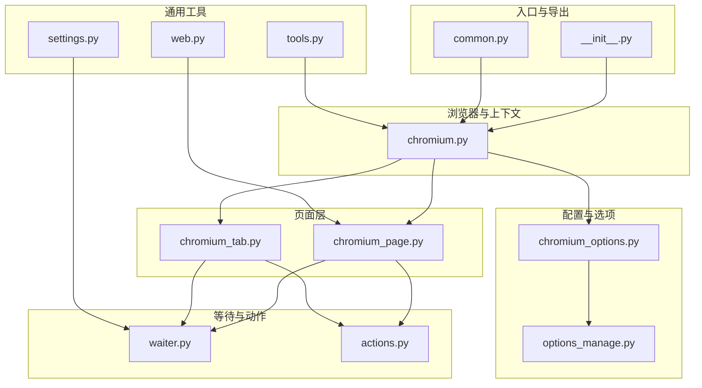
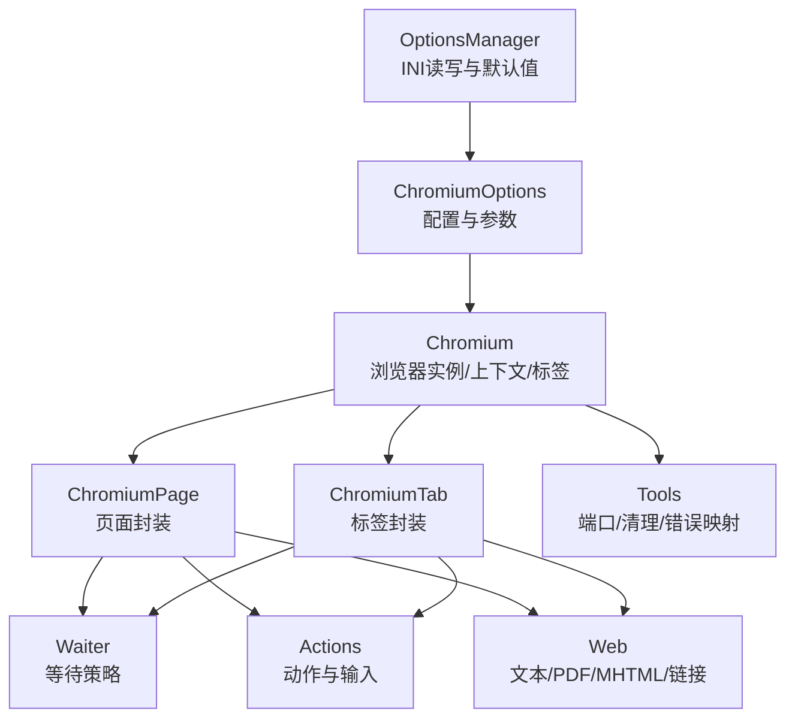
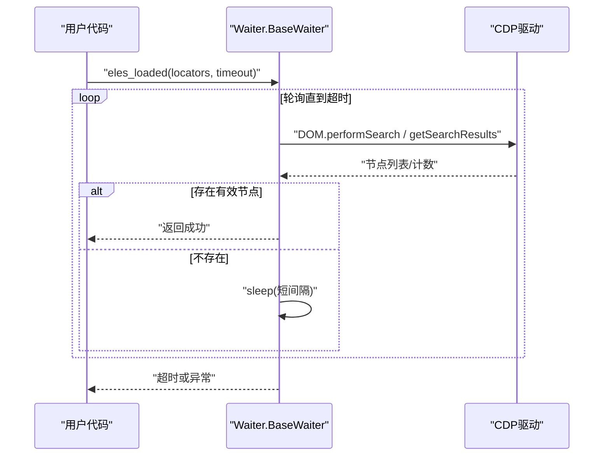
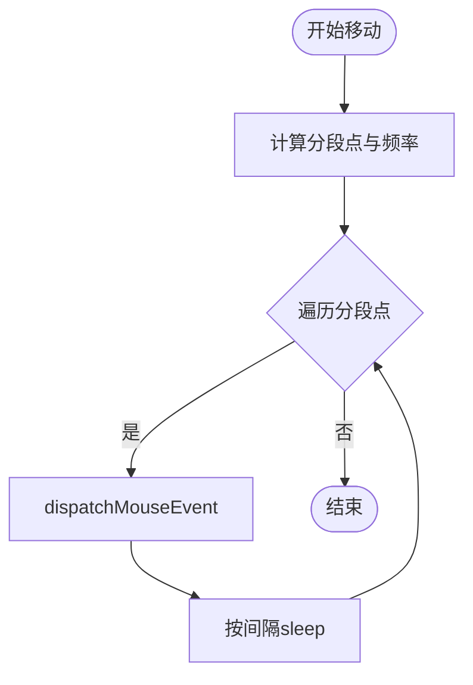
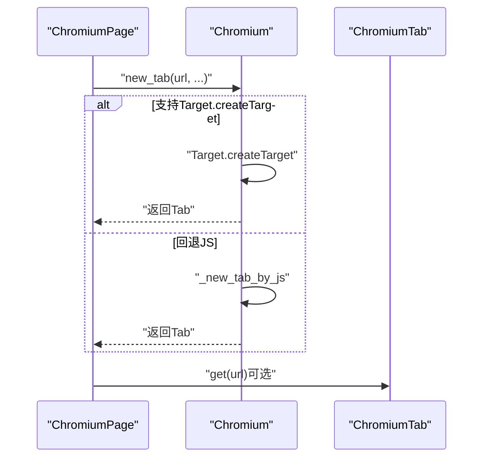
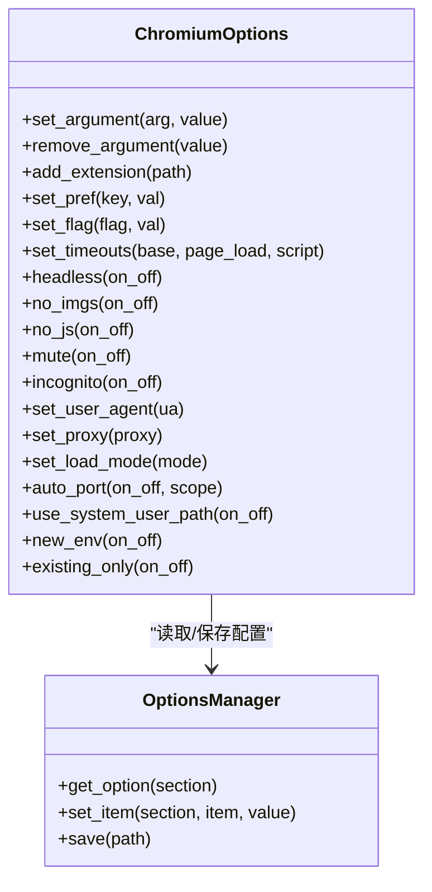
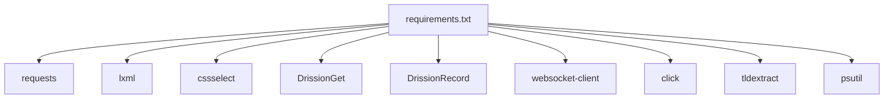

# 性能优化实践

<cite>
**本文引用的文件**
- [__init__.py](file://DrissionPage/__init__.py)
- [common.py](file://DrissionPage/common.py)
- [chromium_options.py](file://DrissionPage/_configs/chromium_options.py)
- [options_manage.py](file://DrissionPage/_configs/options_manage.py)
- [chromium.py](file://DrissionPage/_browsers/chromium.py)
- [chromium_page.py](file://DrissionPage/_pages/chromium_page.py)
- [chromium_tab.py](file://DrissionPage/_pages/chromium_tab.py)
- [actions.py](file://DrissionPage/_units/actions.py)
- [waiter.py](file://DrissionPage/_units/waiter.py)
- [tools.py](file://DrissionPage/_functions/tools.py)
- [web.py](file://DrissionPage/_functions/web.py)
- [settings.py](file://DrissionPage/_functions/settings.py)
- [requirements.txt](file://requirements.txt)
</cite>

## 目录
1. [简介](#简介)
2. [项目结构](#项目结构)
3. [核心组件](#核心组件)
4. [架构总览](#架构总览)
5. [详细组件分析](#详细组件分析)
6. [依赖分析](#依赖分析)
7. [性能考量](#性能考量)
8. [故障排查指南](#故障排查指南)
9. [结论](#结论)
10. [附录](#附录)

## 简介
本文件面向使用 DrissionPage 的开发者，系统性梳理其性能优化实践，覆盖元素定位优化、等待策略选择、内存与资源管理、并发与多标签处理、浏览器与网络配置优化、大数据量与批量操作技巧、性能监控与调试方法等。文中所有分析均基于仓库源码，配合可视化图示帮助读者快速落地。

## 项目结构
DrissionPage 采用模块化分层设计：浏览器层（Chromium）、页面层（ChromiumPage/ChromiumTab）、会话与等待器（SessionPage/Waiter）、动作与输入（Actions）、配置与选项（ChromiumOptions/OptionsManager）、通用工具（Tools/Web）等。核心入口通过模块导出对外暴露。

**图表来源**
- [__init__.py:22-29](file://DrissionPage/__init__.py#L22-L29)
- [common.py:18-19](file://DrissionPage/common.py#L18-L19)
- [chromium.py:33-127](file://DrissionPage/_browsers/chromium.py#L33-L127)
- [chromium_page.py:17-103](file://DrissionPage/_pages/chromium_page.py#L17-L103)
- [chromium_tab.py:22-238](file://DrissionPage/_pages/chromium_tab.py#L22-L238)
- [waiter.py:15-433](file://DrissionPage/_units/waiter.py#L15-L433)
- [actions.py:16-266](file://DrissionPage/_units/actions.py#L16-L266)
- [chromium_options.py:16-417](file://DrissionPage/_configs/chromium_options.py#L16-L417)
- [options_manage.py:15-143](file://DrissionPage/_configs/options_manage.py#L15-L143)
- [tools.py:21-213](file://DrissionPage/_functions/tools.py#L21-L213)
- [web.py:1-349](file://DrissionPage/_functions/web.py#L1-L349)
- [settings.py:13-69](file://DrissionPage/_functions/settings.py#L13-L69)

**章节来源**
- [__init__.py:22-29](file://DrissionPage/__init__.py#L22-L29)
- [common.py:18-19](file://DrissionPage/common.py#L18-L19)

## 核心组件
- 浏览器与上下文：Chromium 负责启动/连接浏览器、管理上下文与标签页、下载与缓存控制、断线重连等。
- 页面与标签：ChromiumPage/ChromiumTab 提供统一的页面操作接口，支持 d/s 模式切换、超时设置继承、Cookie 同步等。
- 等待与轮询：Waiter 提供元素状态、URL/标题变化、下载完成、弹窗关闭等等待策略；内置基于时间片的轮询与超时控制。
- 动作与输入：Actions 封装鼠标移动、点击、滚轮、键盘输入、拖拽等，支持平滑轨迹与节流。
- 配置与选项：ChromiumOptions/OptionsManager 提供参数注入、偏好设置、超时、代理、用户数据目录、缓存路径等。
- 工具与通用：Tools 提供端口查找、进程清理、错误映射；Web 提供文本提取、链接归一化、PDF/MHTML 导出等。

**章节来源**
- [chromium.py:33-127](file://DrissionPage/_browsers/chromium.py#L33-L127)
- [chromium_page.py:17-103](file://DrissionPage/_pages/chromium_page.py#L17-L103)
- [chromium_tab.py:22-238](file://DrissionPage/_pages/chromium_tab.py#L22-L238)
- [waiter.py:15-433](file://DrissionPage/_units/waiter.py#L15-L433)
- [actions.py:16-266](file://DrissionPage/_units/actions.py#L16-L266)
- [chromium_options.py:16-417](file://DrissionPage/_configs/chromium_options.py#L16-L417)
- [options_manage.py:15-143](file://DrissionPage/_configs/options_manage.py#L15-L143)
- [tools.py:21-213](file://DrissionPage/_functions/tools.py#L21-L213)
- [web.py:1-349](file://DrissionPage/_functions/web.py#L1-L349)
- [settings.py:13-69](file://DrissionPage/_functions/settings.py#L13-L69)

## 架构总览
下图展示 DrissionPage 的关键交互：ChromiumOptions/OptionsManager 驱动浏览器启动与配置；Chromium 管理浏览器生命周期与标签；ChromiumPage/ChromiumTab 提供页面 API；Waiter/Actions 提供等待与动作；Tools/Web 提供工具与通用能力。

**图表来源**
- [chromium_options.py:16-417](file://DrissionPage/_configs/chromium_options.py#L16-L417)
- [options_manage.py:15-143](file://DrissionPage/_configs/options_manage.py#L15-L143)
- [chromium.py:33-127](file://DrissionPage/_browsers/chromium.py#L33-L127)
- [chromium_page.py:17-103](file://DrissionPage/_pages/chromium_page.py#L17-L103)
- [chromium_tab.py:22-238](file://DrissionPage/_pages/chromium_tab.py#L22-L238)
- [waiter.py:15-433](file://DrissionPage/_units/waiter.py#L15-L433)
- [actions.py:16-266](file://DrissionPage/_units/actions.py#L16-L266)
- [tools.py:21-213](file://DrissionPage/_functions/tools.py#L21-L213)
- [web.py:1-349](file://DrissionPage/_functions/web.py#L1-L349)

## 详细组件分析

### 元素定位与等待策略
- 定位等待：Waiter.eles_loaded 支持按多种定位器批量等待，内部通过 DOM 搜索与结果判定，结合超时循环，避免盲目 sleep。
- 元素状态等待：ElementWaiter 提供可见/隐藏、可点击、禁用/删除、停止移动等细粒度等待，减少误判与重复查询。
- URL/标题变化：BaseWaiter.url_change/title_change 基于 Target 接口轮询判断，适合异步导航场景。
- 下载等待：BrowserWaiter/ChromiumTabWaiter 提供下载开始/完成标志位轮询，支持超时取消。

**图表来源**
- [waiter.py:115-162](file://DrissionPage/_units/waiter.py#L115-L162)

**章节来源**
- [waiter.py:85-162](file://DrissionPage/_units/waiter.py#L85-L162)
- [waiter.py:237-276](file://DrissionPage/_units/waiter.py#L237-L276)
- [waiter.py:289-409](file://DrissionPage/_units/waiter.py#L289-L409)

### 动作与输入优化
- 平滑移动：Actions.move 将长距离移动拆分为多个点，按固定频率 dispatch 鼠标事件，降低抖动与卡顿。
- 可视区域滚动：move_to 前先滚动至元素可视区域，避免元素被遮挡导致的定位失败。
- 键盘修饰符：支持组合键，自动维护修饰符状态，减少重复按键开销。

**图表来源**
- [actions.py:65-83](file://DrissionPage/_units/actions.py#L65-L83)

**章节来源**
- [actions.py:25-83](file://DrissionPage/_units/actions.py#L25-L83)
- [actions.py:160-212](file://DrissionPage/_units/actions.py#L160-L212)

### 浏览器与标签页管理
- 单例标签：ChromiumTab 使用锁与字典缓存，singleton_tab_obj 控制是否复用标签对象，减少重复初始化。
- 新标签创建：优先 Target.createTarget，失败回退 JS 打开方式，保证在隐身模式下也能创建标签。
- 断线恢复：reconnect 重建 Driver 与会话，重新发现目标，降低长时间运行的中断影响。
- 缓存与 Cookie 清理：clear_cache 支持清理缓存与 Cookie，避免历史数据干扰。

**图表来源**
- [chromium_page.py:89-90](file://DrissionPage/_pages/chromium_page.py#L89-L90)
- [chromium.py:235-270](file://DrissionPage/_browsers/chromium.py#L235-L270)
- [chromium.py:710-720](file://DrissionPage/_browsers/chromium.py#L710-L720)

**章节来源**
- [chromium_tab.py:22-36](file://DrissionPage/_pages/chromium_tab.py#L22-L36)
- [chromium.py:328-372](file://DrissionPage/_browsers/chromium.py#L328-L372)
- [chromium.py:461-471](file://DrissionPage/_browsers/chromium.py#L461-L471)

### 配置与网络优化
- 参数注入：ChromiumOptions 支持 --headless、--disable-images、--disable-javascript、--mute-audio、--incognito、--user-agent、--proxy-server 等，按需裁剪资源消耗。
- 偏好设置：set_pref/set_flag 可调整浏览器偏好与实验开关，减少不必要的渲染与网络行为。
- 超时控制：set_timeouts(base/page_load/script) 与 Settings.cdp_timeout/broswer_connect_timeout 影响整体响应速度与稳定性。
- 自动端口与用户数据：auto_port/use_system_user_path/new_env/existing_only 控制进程与数据隔离，提升并发稳定性。

**图表来源**
- [chromium_options.py:16-417](file://DrissionPage/_configs/chromium_options.py#L16-L417)
- [options_manage.py:15-143](file://DrissionPage/_configs/options_manage.py#L15-L143)

**章节来源**
- [chromium_options.py:166-171](file://DrissionPage/_configs/chromium_options.py#L166-L171)
- [chromium_options.py:265-281](file://DrissionPage/_configs/chromium_options.py#L265-L281)
- [chromium_options.py:298-303](file://DrissionPage/_configs/chromium_options.py#L298-L303)
- [chromium_options.py:354-358](file://DrissionPage/_configs/chromium_options.py#L354-L358)
- [chromium_options.py:350-352](file://DrissionPage/_configs/chromium_options.py#L350-L352)
- [chromium_options.py:246-254](file://DrissionPage/_configs/chromium_options.py#L246-L254)
- [settings.py:46-53](file://DrissionPage/_functions/settings.py#L46-L53)

### 大数据量与批量操作
- 批量元素等待：eles_loaded 支持传入多个定位器，统一等待，减少多次轮询成本。
- 文本提取：get_ele_txt 采用递归遍历与规则化，避免多余 DOM 查询；location_in_viewport/offset_scroll 预处理滚动，提升定位命中率。
- PDF/MHTML 导出：save_page/get_pdf/get_mhtml 支持离线快照与打印输出，适合大批量页面归档。

**章节来源**
- [waiter.py:115-162](file://DrissionPage/_units/waiter.py#L115-L162)
- [web.py:20-104](file://DrissionPage/_functions/web.py#L20-L104)
- [web.py:110-134](file://DrissionPage/_functions/web.py#L110-L134)
- [web.py:198-254](file://DrissionPage/_functions/web.py#L198-L254)

### 并发与资源清理
- 端口分配：PortFinder 使用随机范围+锁+临时目录校验，避免端口冲突；定期清理过期占用。
- 进程与数据清理：ensure_del_dir/quit 结合 psutil 与系统命令，确保浏览器进程与用户数据目录释放。
- 会话与目标管理：Tabs 维护 session/target/frame 上下文映射，断线时清理对应资源，防止泄漏。

**章节来源**
- [tools.py:21-56](file://DrissionPage/_functions/tools.py#L21-L56)
- [tools.py:200-213](file://DrissionPage/_functions/tools.py#L200-L213)
- [chromium.py:328-372](file://DrissionPage/_browsers/chromium.py#L328-L372)
- [chromium.py:565-684](file://DrissionPage/_browsers/chromium.py#L565-L684)

## 依赖分析
- 外部依赖：requests、lxml、cssselect、DrissionGet、DrissionRecord、websocket-client、click、tldextract、psutil。
- 关键依赖用途：HTTP 请求与会话、DOM 解析、CSS 选择器、CDP 通信、文件与下载、进程管理。

**图表来源**
- [requirements.txt:1-9](file://requirements.txt#L1-L9)

**章节来源**
- [requirements.txt:1-9](file://requirements.txt#L1-L9)

## 性能考量
- 元素定位
  - 优先使用稳定定位器（id/xpath），减少模糊匹配。
  - 批量等待 eles_loaded，避免逐个等待。
  - 预滚动至可视区域，减少定位失败重试。
- 等待策略
  - 根据场景选择合适的等待类型：元素状态/URL/标题/下载。
  - 合理设置超时与轮询间隔，避免过短导致频繁查询，过长导致阻塞。
- 内存与资源
  - 合理使用 singleton_tab_obj，减少对象重复创建。
  - 及时关闭不需要的标签与会话，释放内存。
  - 定期 clear_cache/clear_cookies，避免缓存膨胀。
- 并发与多标签
  - 使用 auto_port 与独立用户数据目录，避免端口与数据冲突。
  - 在隐身模式下谨慎创建标签，必要时回退 JS 方案。
- 浏览器与网络
  - 按需禁用图片/脚本/音频，显著降低带宽与 CPU 占用。
  - 设置合理的超时与代理，避免阻塞。
- 大数据量
  - 使用批量等待与导出（PDF/MHTML），减少单次处理压力。
  - 文本提取前预处理滚动与可见性，减少无效查询。

[本节为通用指导，无需具体文件分析]

## 故障排查指南
- 错误映射：raise_error 将底层 CDP 错误映射为具体异常类型，便于定位问题（如上下文丢失、元素丢失、页面断开、超时等）。
- 端口与连接：PortFinder 提供可用端口检测与清理；connect 失败时检查地址/端口与浏览器版本。
- 断线与重连：reconnect 重建会话并重新发现目标；quit 支持强制终止与数据清理。
- 调试与日志：Settings._debug 控制调试级别；可通过 wait_until 自定义轮询逻辑辅助诊断。

**章节来源**
- [tools.py:157-198](file://DrissionPage/_functions/tools.py#L157-L198)
- [chromium.py:314-320](file://DrissionPage/_browsers/chromium.py#L314-L320)
- [chromium.py:328-372](file://DrissionPage/_browsers/chromium.py#L328-L372)
- [settings.py:23-23](file://DrissionPage/_functions/settings.py#L23-L23)

## 结论
通过合理配置浏览器参数、优化元素定位与等待策略、控制动作与输入节奏、规范资源与并发管理，并结合完善的错误映射与断线恢复机制，DrissionPage 能在复杂场景下保持高效与稳定。建议在实际项目中根据业务特征调优超时、禁用不必要的资源加载，并采用批量与导出策略处理大规模任务。

## 附录
- 性能测试与基准
  - 建议使用 perf_counter 记录关键步骤耗时，对比不同等待策略与浏览器参数的效果。
  - 对批量元素等待与导出流程分别建立基线，逐步引入优化项并回归验证。
- 最佳实践清单
  - 定位器稳定化、批量等待、预滚动、禁用图片/脚本/音频、合理超时、断线重连、资源及时清理、并发隔离。

[本节为通用指导，无需具体文件分析]