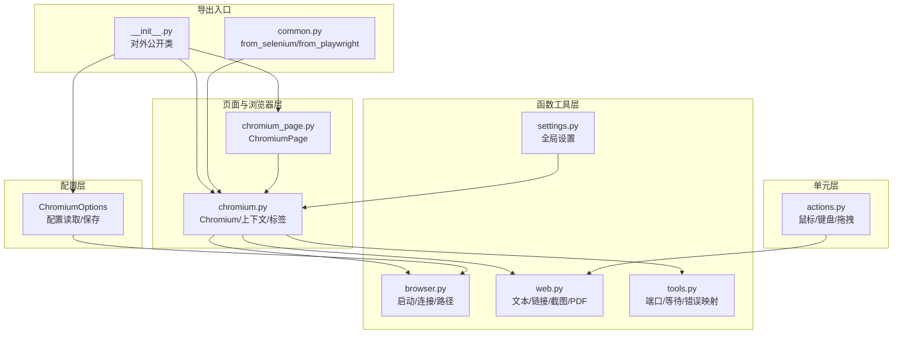
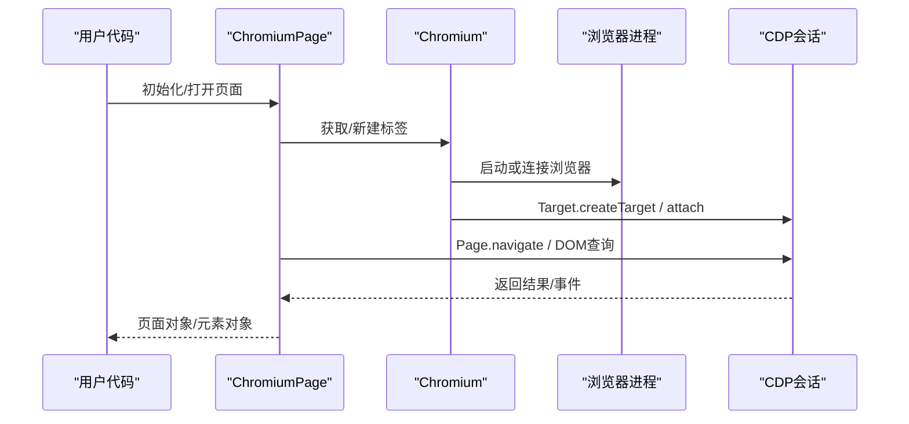
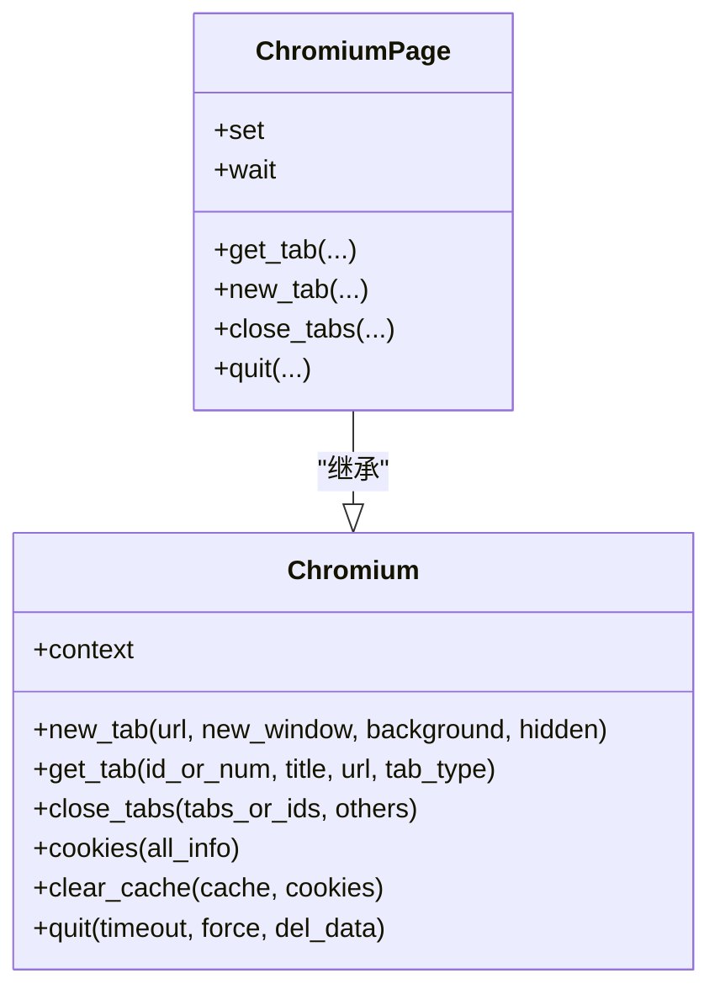
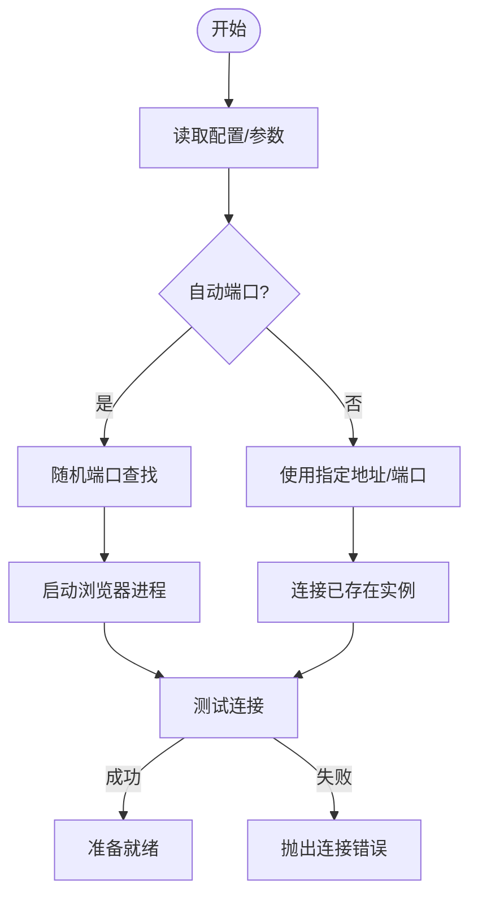
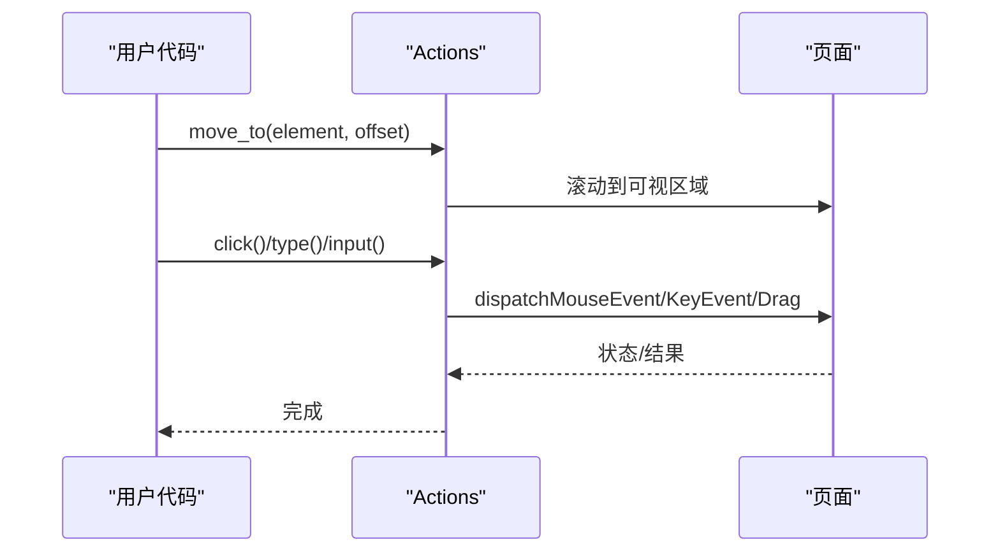
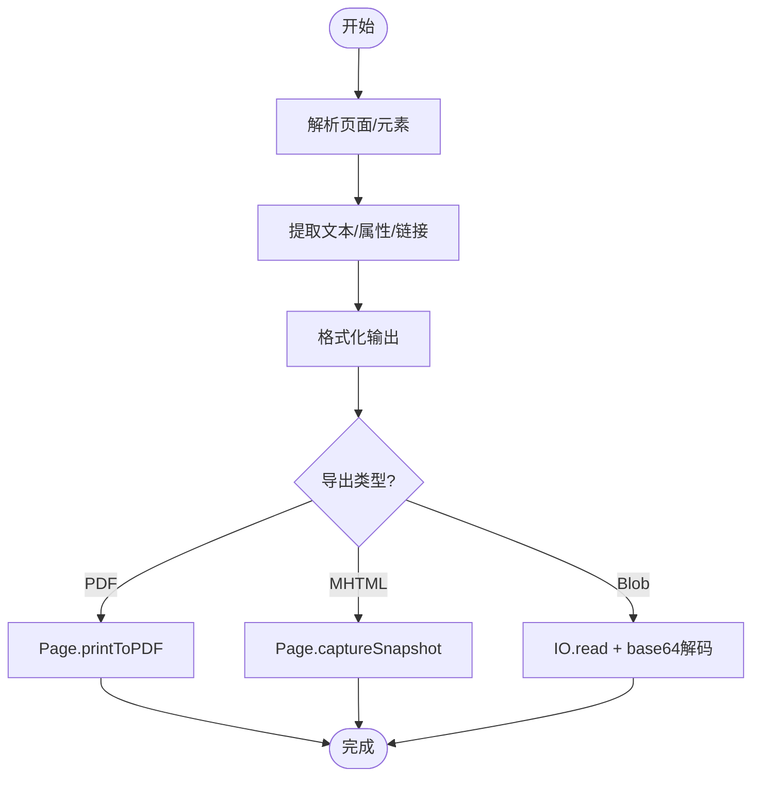
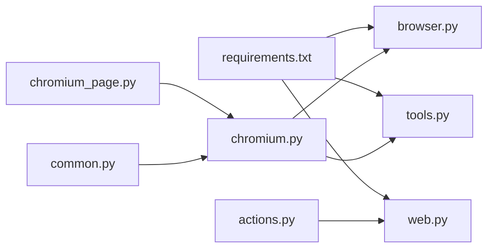

# 示例与最佳实践

<cite>
**本文引用的文件**   
- [DrissionPage/__init__.py](file://DrissionPage/__init__.py)
- [DrissionPage/common.py](file://DrissionPage/common.py)
- [DrissionPage/errors.py](file://DrissionPage/errors.py)
- [requirements.txt](file://requirements.txt)
- [DrissionPage/_functions/browser.py](file://DrissionPage/_functions/browser.py)
- [DrissionPage/_browsers/chromium.py](file://DrissionPage/_browsers/chromium.py)
- [DrissionPage/_pages/chromium_page.py](file://DrissionPage/_pages/chromium_page.py)
- [DrissionPage/_functions/web.py](file://DrissionPage/_functions/web.py)
- [DrissionPage/_functions/tools.py](file://DrissionPage/_functions/tools.py)
- [DrissionPage/_units/actions.py](file://DrissionPage/_units/actions.py)
- [DrissionPage/_configs/chromium_options.py](file://DrissionPage/_configs/chromium_options.py)
- [DrissionPage/_functions/settings.py](file://DrissionPage/_functions/settings.py)
</cite>

## 目录
1. [简介](#简介)
2. [项目结构](#项目结构)
3. [核心组件](#核心组件)
4. [架构总览](#架构总览)
5. [详细组件分析](#详细组件分析)
6. [依赖分析](#依赖分析)
7. [性能考虑](#性能考虑)
8. [故障排除指南](#故障排除指南)
9. [结论](#结论)
10. [附录](#附录)

## 简介
本指南面向使用 DrissionPage 的工程师与自动化从业者，提供系统化的实用示例与最佳实践，覆盖网页爬取、表单填写、数据提取、自动化测试等常见场景；并给出性能优化、错误处理、代码组织、调试与故障排除、与其他库集成、安全合规以及生产部署运维的建议。

## 项目结构
DrissionPage 采用模块化分层设计：
- 配置层：ChromiumOptions、配置读取与保存
- 函数工具层：浏览器连接、设置、工具函数、Web 辅助
- 单元层：动作、等待、监听、下载、权限、截图等
- 页面与浏览器层：Chromium、ChromiumPage、ChromiumTab
- 错误体系：统一的异常类型

**图示来源**
- [DrissionPage/__init__.py:1-29](file://DrissionPage/__init__.py#L1-L29)
- [DrissionPage/common.py:1-57](file://DrissionPage/common.py#L1-L57)
- [DrissionPage/_configs/chromium_options.py:1-417](file://DrissionPage/_configs/chromium_options.py#L1-L417)
- [DrissionPage/_functions/browser.py:1-439](file://DrissionPage/_functions/browser.py#L1-L439)
- [DrissionPage/_functions/web.py:1-349](file://DrissionPage/_functions/web.py#L1-L349)
- [DrissionPage/_functions/tools.py:1-213](file://DrissionPage/_functions/tools.py#L1-L213)
- [DrissionPage/_functions/settings.py:1-69](file://DrissionPage/_functions/settings.py#L1-L69)
- [DrissionPage/_units/actions.py:1-266](file://DrissionPage/_units/actions.py#L1-L266)
- [DrissionPage/_browsers/chromium.py:1-730](file://DrissionPage/_browsers/chromium.py#L1-L730)
- [DrissionPage/_pages/chromium_page.py:1-103](file://DrissionPage/_pages/chromium_page.py#L1-L103)

**章节来源**
- [DrissionPage/__init__.py:1-29](file://DrissionPage/__init__.py#L1-L29)
- [DrissionPage/common.py:1-57](file://DrissionPage/common.py#L1-L57)

## 核心组件
- Chromium：浏览器实例管理、标签生命周期、上下文隔离、下载管理、代理设置、隐私沙盒处理
- ChromiumPage：页面封装，继承自 ChromiumTab，提供页面级等待、设置、标签切换等
- ChromiumOptions：浏览器启动参数、用户数据目录、扩展、偏好、标志位、超时、重试策略、代理、端口等
- Actions：鼠标移动、点击、滚轮、键盘输入、拖拽等
- Web 工具：文本提取、链接补全、PDF/MHTML 导出、Blob 读取、树形打印
- Tools：端口发现、等待直到条件成立、错误映射、临时目录清理
- Settings：全局开关（如元素不存在是否抛错、CDP 超时、语言等）
- 错误体系：统一异常类型，便于捕获与区分

**章节来源**
- [DrissionPage/_browsers/chromium.py:33-730](file://DrissionPage/_browsers/chromium.py#L33-L730)
- [DrissionPage/_pages/chromium_page.py:17-103](file://DrissionPage/_pages/chromium_page.py#L17-L103)
- [DrissionPage/_configs/chromium_options.py:16-417](file://DrissionPage/_configs/chromium_options.py#L16-L417)
- [DrissionPage/_units/actions.py:16-266](file://DrissionPage/_units/actions.py#L16-L266)
- [DrissionPage/_functions/web.py:1-349](file://DrissionPage/_functions/web.py#L1-L349)
- [DrissionPage/_functions/tools.py:1-213](file://DrissionPage/_functions/tools.py#L1-L213)
- [DrissionPage/_functions/settings.py:13-69](file://DrissionPage/_functions/settings.py#L13-L69)
- [DrissionPage/errors.py:11-95](file://DrissionPage/errors.py#L11-L95)

## 架构总览
DrissionPage 通过 DevTools Protocol（CDP）与浏览器交互，支持本地启动或连接已有浏览器实例。ChromiumPage 提供页面级 API，Chromium 管理标签与上下文，ChromiumOptions 控制启动行为，Actions 提供底层交互能力。

**图示来源**
- [DrissionPage/_pages/chromium_page.py:33-103](file://DrissionPage/_pages/chromium_page.py#L33-L103)
- [DrissionPage/_browsers/chromium.py:235-270](file://DrissionPage/_browsers/chromium.py#L235-L270)
- [DrissionPage/_functions/browser.py:24-87](file://DrissionPage/_functions/browser.py#L24-L87)

## 详细组件分析

### 组件一：Chromium 与 ChromiumPage
- 功能要点
  - 单例浏览器管理、上下文隔离、标签生命周期
  - 新建标签、隐藏标签、新窗口、后台标签
  - 代理设置、下载行为、隐私沙盒弹窗处理
  - 连接断开处理、进程清理、用户数据目录管理
- 使用建议
  - 使用 ChromiumOptions 控制启动参数与用户数据目录
  - 对需要隔离的业务使用 new_context
  - 使用 new_tab/new_window/background/hidden 组合控制标签行为
  - 结束时调用 quit 并根据需要清理用户数据

**图示来源**
- [DrissionPage/_browsers/chromium.py:133-472](file://DrissionPage/_browsers/chromium.py#L133-L472)
- [DrissionPage/_pages/chromium_page.py:17-103](file://DrissionPage/_pages/chromium_page.py#L17-L103)

**章节来源**
- [DrissionPage/_browsers/chromium.py:211-327](file://DrissionPage/_browsers/chromium.py#L211-L327)
- [DrissionPage/_pages/chromium_page.py:82-103](file://DrissionPage/_pages/chromium_page.py#L82-L103)

### 组件二：ChromiumOptions 与浏览器启动
- 功能要点
  - 参数：用户数据目录、扩展、偏好、标志位、地址、端口、加载模式、隐身、静音、证书错误忽略、UA、代理、超时、重试次数等
  - 支持自动端口、现有实例只读、系统用户数据目录复制
  - 配置持久化到 ini 文件
- 最佳实践
  - 将下载目录、临时目录、日志目录集中管理
  - 隐身模式适合高隔离场景，普通模式适合复用登录态
  - 使用 auto_port 避免端口冲突，结合临时用户数据目录
  - 代理统一在 ChromiumOptions 中设置，避免重复配置

**图示来源**
- [DrissionPage/_configs/chromium_options.py:323-358](file://DrissionPage/_configs/chromium_options.py#L323-L358)
- [DrissionPage/_functions/browser.py:24-87](file://DrissionPage/_functions/browser.py#L24-L87)

**章节来源**
- [DrissionPage/_configs/chromium_options.py:16-417](file://DrissionPage/_configs/chromium_options.py#L16-L417)
- [DrissionPage/_functions/browser.py:90-120](file://DrissionPage/_functions/browser.py#L90-L120)

### 组件三：Actions 与表单自动化
- 功能要点
  - 移动到元素/坐标、点击、右键、中键、长按、释放
  - 滚轮滚动、方向键移动、键盘输入、组合键
  - 拖拽文件/文本到页面
- 最佳实践
  - 先滚动到可视区域再交互
  - 输入前先清空或聚焦
  - 批量输入时设置合理的间隔
  - 拖拽时明确目标区域偏移

**图示来源**
- [DrissionPage/_units/actions.py:25-266](file://DrissionPage/_units/actions.py#L25-L266)

**章节来源**
- [DrissionPage/_units/actions.py:16-266](file://DrissionPage/_units/actions.py#L16-L266)

### 组件四：数据提取与页面导出
- 文本提取：get_ele_txt 支持多种标签规则、换行与缩进处理
- 链接处理：make_absolute_link 统一相对/绝对链接
- 导出：MHTML/PDF 导出，Blob 读取
- 树形打印：tree 可视化 DOM 结构
- 最佳实践
  - 使用 XPath/CSS 选择器配合 get_ele_txt 提取结构化文本
  - PDF 导出时设置打印背景、页边距、页眉页脚模板
  - Blob 数据优先使用 base64 解码后写入文件

**图示来源**
- [DrissionPage/_functions/web.py:20-104](file://DrissionPage/_functions/web.py#L20-L104)
- [DrissionPage/_functions/web.py:169-255](file://DrissionPage/_functions/web.py#L169-L255)

**章节来源**
- [DrissionPage/_functions/web.py:1-349](file://DrissionPage/_functions/web.py#L1-L349)

### 组件五：等待与超时控制
- wait_until：等待条件成立
- Settings：CDP 超时、浏览器连接超时、元素不存在是否抛错等
- 最佳实践
  - 明确超时时间，避免无限等待
  - 对不稳定网络/资源使用重试策略（ChromiumOptions.retry_times）
  - 使用 Page/Element 的内置等待器（如 wait.load_start）

**章节来源**
- [DrissionPage/_functions/tools.py:139-148](file://DrissionPage/_functions/tools.py#L139-L148)
- [DrissionPage/_functions/settings.py:13-69](file://DrissionPage/_functions/settings.py#L13-L69)
- [DrissionPage/_configs/chromium_options.py:166-171](file://DrissionPage/_configs/chromium_options.py#L166-L171)

### 组件六：错误处理与异常管理
- 异常类型：ElementNotFoundError、AlertExistsError、ContextLostError、PageDisconnectedError、JavaScriptError、NoRectError、BrowserConnectError、CookieFormatError、LocatorError、UnknownError 等
- 错误映射：tools.raise_error 将 CDP 错误映射为具体异常
- 最佳实践
  - 区分业务异常与系统异常，有针对性地重试或降级
  - 对不可恢复错误记录上下文信息（页面 URL、元素定位、截图等）
  - 在 finally 中清理资源（关闭标签、退出浏览器）

**章节来源**
- [DrissionPage/errors.py:11-95](file://DrissionPage/errors.py#L11-L95)
- [DrissionPage/_functions/tools.py:157-197](file://DrissionPage/_functions/tools.py#L157-L197)

## 依赖分析
- 外部依赖：requests、lxml、cssselect、DrissionGet、DrissionRecord、websocket-client、click、tldextract、psutil
- 内部模块耦合
  - Chromium 依赖 browser.py（启动/连接）、tools（端口/等待/错误映射）
  - ChromiumPage 依赖 Chromium
  - Actions 依赖 web（viewport 判断）
  - web.py 依赖 DrissionRecord（文件名合法性）
  - common.py 提供 from_selenium/from_playwright 适配

**图示来源**
- [requirements.txt:1-9](file://requirements.txt#L1-L9)
- [DrissionPage/_functions/browser.py:1-439](file://DrissionPage/_functions/browser.py#L1-L439)
- [DrissionPage/_functions/web.py:1-349](file://DrissionPage/_functions/web.py#L1-L349)
- [DrissionPage/_functions/tools.py:1-213](file://DrissionPage/_functions/tools.py#L1-L213)
- [DrissionPage/_browsers/chromium.py:1-730](file://DrissionPage/_browsers/chromium.py#L1-L730)
- [DrissionPage/_pages/chromium_page.py:1-103](file://DrissionPage/_pages/chromium_page.py#L1-L103)
- [DrissionPage/_units/actions.py:1-266](file://DrissionPage/_units/actions.py#L1-L266)
- [DrissionPage/common.py:22-57](file://DrissionPage/common.py#L22-L57)

**章节来源**
- [requirements.txt:1-9](file://requirements.txt#L1-L9)

## 性能考虑
- 启动优化
  - 使用 auto_port 与临时用户数据目录，避免端口占用与数据污染
  - 关闭图片/JS/音频可显著降低内存与 CPU 占用（ChromiumOptions.no_imgs/no_js/mute）
  - 合理设置缓存目录（set_cache_path）与下载目录（set_download_path）
- 交互优化
  - Actions 移动轨迹平滑，但过小的 duration 会增加 CDP 压力；建议适度增大
  - 滚动到可视区域后再交互，减少元素定位失败
- 等待与重试
  - 明确超时与重试策略，避免长时间阻塞
  - 对网络波动使用指数退避或抖动
- 导出与大文件
  - PDF 导出时尽量关闭背景打印以提升速度
  - Blob 读取后及时释放内存，避免长时间持有大对象

[本节为通用指导，无需特定文件引用]

## 故障排除指南
- 连接失败
  - 检查地址/端口是否被占用，必要时启用 auto_port
  - 确认浏览器版本与协议兼容性
- 元素不存在
  - 使用 Settings.raise_when_ele_not_found 控制抛错策略
  - 使用 wait 或 wait_until 等待元素出现
- JavaScript 错误
  - 捕获 JavaScriptError，检查函数声明与参数
- 下载与权限
  - 确保下载目录可写，必要时设置下载行为
  - 处理隐私沙盒弹窗（自动关闭）
- 资源清理
  - 退出时调用 quit，必要时强制清理用户数据目录

**章节来源**
- [DrissionPage/_functions/browser.py:192-211](file://DrissionPage/_functions/browser.py#L192-L211)
- [DrissionPage/_functions/tools.py:157-197](file://DrissionPage/_functions/tools.py#L157-L197)
- [DrissionPage/_browsers/chromium.py:686-708](file://DrissionPage/_browsers/chromium.py#L686-L708)

## 结论
DrissionPage 提供了从浏览器启动、页面交互到数据导出的完整链路。通过合理配置 ChromiumOptions、规范使用 Actions、建立完善的等待与错误处理机制，并结合性能优化与安全合规策略，可在复杂场景下稳定高效地完成网页爬取、表单自动化与数据提取任务。

[本节为总结，无需特定文件引用]

## 附录

### 常见使用场景与示例路径
- 网页爬取
  - 启动浏览器并打开页面：[ChromiumPage 初始化:33-44](file://DrissionPage/_pages/chromium_page.py#L33-L44)
  - 设置代理与用户数据目录：[ChromiumOptions.set_proxy:293-296](file://DrissionPage/_configs/chromium_options.py#L293-L296)、[set_user_data_path:340-344](file://DrissionPage/_configs/chromium_options.py#L340-L344)
  - 等待页面加载完成：[refresh/forward/back:514-532](file://DrissionPage/_pages/chromium_page.py#L514-L532)
- 表单填写
  - 输入文本与组合键：[Actions.type/input:190-216](file://DrissionPage/_units/actions.py#L190-L216)
  - 拖拽文件/文本：[Actions.drag_in:218-255](file://DrissionPage/_units/actions.py#L218-L255)
- 数据提取
  - 文本提取与格式化：[get_ele_txt/format_html:20-107](file://DrissionPage/_functions/web.py#L20-L107)
  - 链接补全：[make_absolute_link:137-157](file://DrissionPage/_functions/web.py#L137-L157)
  - 导出 PDF/MHTML：[get_pdf/get_mhtml:234-254](file://DrissionPage/_functions/web.py#L234-L254)
- 自动化测试
  - 等待与断言：[wait_until:139-148](file://DrissionPage/_functions/tools.py#L139-L148)、[Settings:25-63](file://DrissionPage/_functions/settings.py#L25-L63)
  - 截图与树形打印：[tree:257-302](file://DrissionPage/_functions/web.py#L257-L302)

### 与其他库的集成
- Selenium/Playwright 互操作
  - 从 Selenium WebDriver 创建 Chromium 实例：[from_selenium:22-29](file://DrissionPage/common.py#L22-L29)
  - 从 Playwright Page/Browser 创建 Chromium 实例：[from_playwright:32-56](file://DrissionPage/common.py#L32-L56)

**章节来源**
- [DrissionPage/common.py:22-56](file://DrissionPage/common.py#L22-L56)

### 安全使用与合规操作
- 遵守 Robots 协议，限制抓取频率与并发度
- 对敏感数据进行脱敏与加密存储
- 使用隐身模式或独立上下文隔离不同业务
- 明确使用条款与法律合规要求，避免用于非法用途

[本节为通用指导，无需特定文件引用]

### 生产环境部署与运维
- 进程管理：使用 auto_port 与临时用户数据目录，避免资源泄漏
- 日志与监控：记录关键事件（导航、元素交互、异常）与耗时指标
- 容器化：固定下载与缓存目录挂载，避免权限问题
- 版本升级：关注浏览器与协议变更，提前验证

[本节为通用指导，无需特定文件引用]