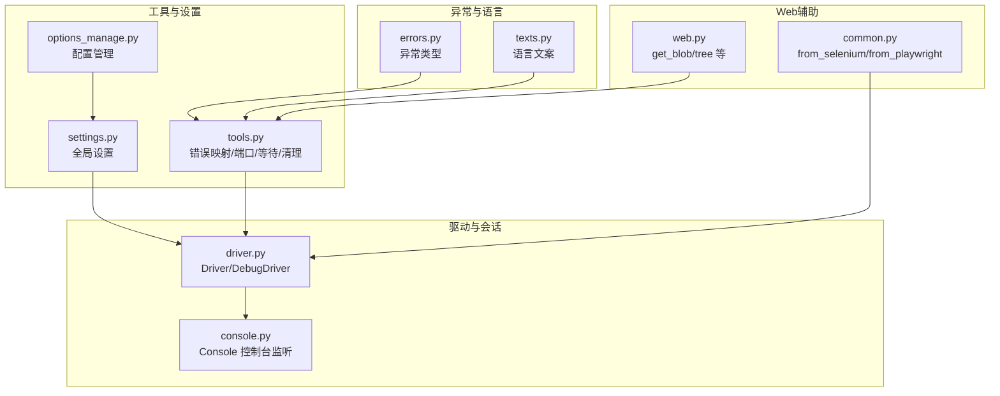
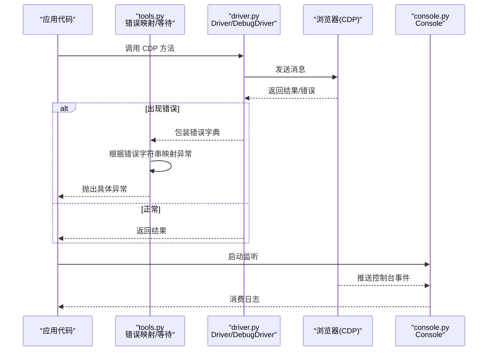
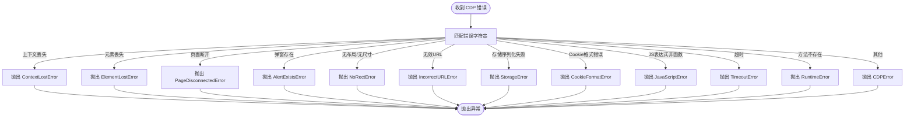
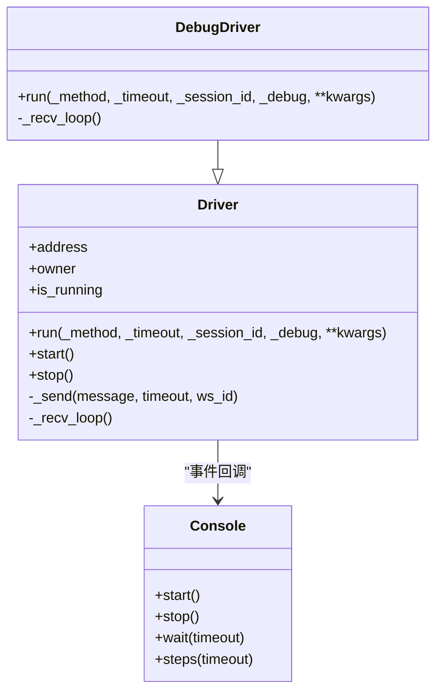
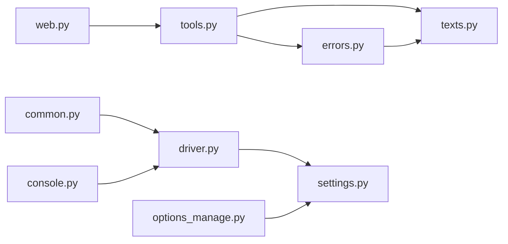
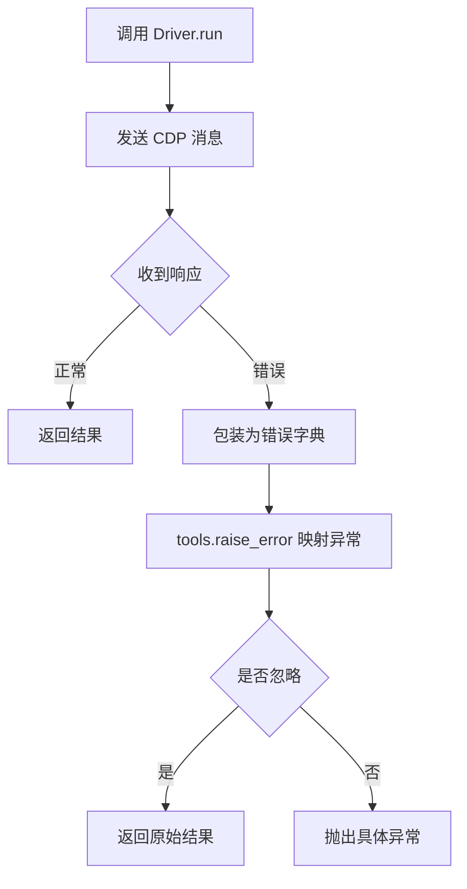

# 错误处理与调试

<cite>
**本文引用的文件**
- [errors.py](file://DrissionPage/errors.py)
- [tools.py](file://DrissionPage/_functions/tools.py)
- [settings.py](file://DrissionPage/_functions/settings.py)
- [driver.py](file://DrissionPage/_base/driver.py)
- [console.py](file://DrissionPage/_units/console.py)
- [options_manage.py](file://DrissionPage/_configs/options_manage.py)
- [web.py](file://DrissionPage/_functions/web.py)
- [common.py](file://DrissionPage/common.py)
- [texts.py](file://DrissionPage/_functions/texts.py)
</cite>

## 目录
1. [简介](#简介)
2. [项目结构](#项目结构)
3. [核心组件](#核心组件)
4. [架构总览](#架构总览)
5. [详细组件分析](#详细组件分析)
6. [依赖分析](#依赖分析)
7. [性能考量](#性能考量)
8. [故障排除指南](#故障排除指南)
9. [结论](#结论)
10. [附录](#附录)

## 简介
本指南面向使用 DrissionPage 的开发者，系统性梳理其错误处理与调试机制，涵盖异常类型、连接错误、元素定位失败、超时错误、日志与错误追踪、常见问题诊断与恢复策略，并给出生产环境监控与告警建议。文档基于仓库源码进行分析，避免臆测，确保可操作性与可追溯性。

## 项目结构
围绕错误处理与调试的关键模块如下：
- 异常定义层：统一的异常基类与具体异常类型
- 工具与适配层：错误映射、端口探测、等待工具、清理工具
- 驱动与会话层：WebSocket 连接、CDP 调用、调试输出
- 日志与控制台层：浏览器控制台事件捕获
- 配置与语言层：超时、重试、语言文案、配置持久化
- Web 辅助层：通用工具函数（如获取 blob、树形打印）

图表来源
- [errors.py:11-95](file://DrissionPage/errors.py#L11-L95)
- [tools.py:157-198](file://DrissionPage/_functions/tools.py#L157-L198)
- [settings.py:13-69](file://DrissionPage/_functions/settings.py#L13-L69)
- [driver.py:24-227](file://DrissionPage/_base/driver.py#L24-L227)
- [console.py:14-99](file://DrissionPage/_units/console.py#L14-L99)
- [options_manage.py:15-143](file://DrissionPage/_configs/options_manage.py#L15-L143)
- [web.py:169-196](file://DrissionPage/_functions/web.py#L169-L196)
- [common.py:22-57](file://DrissionPage/common.py#L22-L57)

章节来源
- [errors.py:11-95](file://DrissionPage/errors.py#L11-L95)
- [tools.py:157-198](file://DrissionPage/_functions/tools.py#L157-L198)
- [settings.py:13-69](file://DrissionPage/_functions/settings.py#L13-L69)
- [driver.py:24-227](file://DrissionPage/_base/driver.py#L24-L227)
- [console.py:14-99](file://DrissionPage/_units/console.py#L14-L99)
- [options_manage.py:15-143](file://DrissionPage/_configs/options_manage.py#L15-L143)
- [web.py:169-196](file://DrissionPage/_functions/web.py#L169-L196)
- [common.py:22-57](file://DrissionPage/common.py#L22-L57)

## 核心组件
- 异常体系：统一继承自基础异常类，便于统一处理与国际化文案输出
- 错误映射：根据 CDP 返回的错误字符串映射到具体异常类型
- 设置与超时：集中控制 CDP 超时、连接超时、重试策略
- 驱动与调试：WebSocket 连接、CDP 方法调用、可选调试输出
- 控制台监听：捕获浏览器控制台日志，辅助定位前端错误
- 配置管理：INI 文件读写、默认值、重试次数与间隔
- Web 工具：获取 blob、树形打印等辅助能力

章节来源
- [errors.py:11-95](file://DrissionPage/errors.py#L11-L95)
- [tools.py:157-198](file://DrissionPage/_functions/tools.py#L157-L198)
- [settings.py:13-69](file://DrissionPage/_functions/settings.py#L13-L69)
- [driver.py:24-227](file://DrissionPage/_base/driver.py#L24-L227)
- [console.py:14-99](file://DrissionPage/_units/console.py#L14-L99)
- [options_manage.py:15-143](file://DrissionPage/_configs/options_manage.py#L15-L143)
- [web.py:169-196](file://DrissionPage/_functions/web.py#L169-L196)

## 架构总览
DrissionPage 的错误处理与调试贯穿“异常定义—错误映射—设置—驱动—日志”的链路，形成闭环。

图表来源
- [tools.py:157-198](file://DrissionPage/_functions/tools.py#L157-L198)
- [driver.py:102-118](file://DrissionPage/_base/driver.py#L102-L118)
- [console.py:30-87](file://DrissionPage/_units/console.py#L30-L87)

## 详细组件分析

### 异常类型与错误映射
- 异常基类：统一处理参数化文案输出
- 具体异常：覆盖上下文丢失、元素丢失、页面断开、JS 错误、无矩形、连接错误、Cookie 格式、CDP 错误等
- 错误映射：根据 CDP 返回的 error 字段字符串精确匹配，必要时携带参数（如 URL、方法、参数）
- 忽略策略：支持忽略特定异常或全部忽略，返回原始结果而不抛出

图表来源
- [tools.py:157-198](file://DrissionPage/_functions/tools.py#L157-L198)
- [errors.py:21-95](file://DrissionPage/errors.py#L21-L95)

章节来源
- [errors.py:11-95](file://DrissionPage/errors.py#L11-L95)
- [tools.py:157-198](file://DrissionPage/_functions/tools.py#L157-L198)

### 设置与超时控制
- 关键设置项：元素未找到/点击失败/等待失败的抛出开关；CDP 超时；浏览器连接超时；自动处理弹窗；语言；调试开关
- 配置持久化：INI 文件读写、默认值、重试次数与间隔
- 使用建议：在测试环境提高超时容忍度，在生产环境严格限制超时并开启日志

章节来源
- [settings.py:13-69](file://DrissionPage/_functions/settings.py#L13-L69)
- [options_manage.py:15-143](file://DrissionPage/_configs/options_manage.py#L15-L143)

### 驱动与调试输出
- Driver：负责 WebSocket 连接、发送/接收、超时与断开处理、事件分发
- DebugDriver：在 Driver 基础上增加可选调试输出，按方法前缀过滤打印
- 超时与断开：统一包装为错误字典，交由错误映射处理
- 弹窗处理：通过标志位拦截特定输入/运行时方法，避免误操作

图表来源
- [driver.py:24-227](file://DrissionPage/_base/driver.py#L24-L227)
- [console.py:14-99](file://DrissionPage/_units/console.py#L14-L99)

章节来源
- [driver.py:24-227](file://DrissionPage/_base/driver.py#L24-L227)
- [console.py:14-99](file://DrissionPage/_units/console.py#L14-L99)

### 控制台日志捕获
- Console：启用 Log/Runtime 事件监听，将消息放入队列，支持阻塞等待与迭代消费
- 适用场景：定位前端 JS 报错、网络请求异常、控制台输出
- 注意事项：未启用时调用等待会抛出“未监听”异常

章节来源
- [console.py:30-87](file://DrissionPage/_units/console.py#L30-L87)

### Web 工具与辅助
- get_blob：将 blob 链接转为 base64 或二进制，异常时抛出运行时错误
- tree：打印页面 DOM 树，辅助定位元素与结构问题
- from_selenium/from_playwright：从外部驱动对象生成 Chromium 对象，失败时抛出运行时错误

章节来源
- [web.py:169-196](file://DrissionPage/_functions/web.py#L169-L196)
- [web.py:257-302](file://DrissionPage/_functions/web.py#L257-L302)
- [common.py:22-57](file://DrissionPage/common.py#L22-L57)

## 依赖分析
- 错误映射依赖语言文案模块，保证异常信息本地化
- 驱动依赖设置模块，统一超时与连接行为
- 控制台依赖驱动的事件回调机制
- 配置管理为设置模块提供持久化能力

图表来源
- [tools.py:17-18](file://DrissionPage/_functions/tools.py#L17-L18)
- [driver.py:18-19](file://DrissionPage/_base/driver.py#L18-L19)
- [console.py:11](file://DrissionPage/_units/console.py#L11)
- [options_manage.py:12](file://DrissionPage/_configs/options_manage.py#L12)
- [web.py:17](file://DrissionPage/_functions/web.py#L17)
- [common.py:8-16](file://DrissionPage/common.py#L8-L16)

章节来源
- [tools.py:17-18](file://DrissionPage/_functions/tools.py#L17-L18)
- [driver.py:18-19](file://DrissionPage/_base/driver.py#L18-L19)
- [console.py:11](file://DrissionPage/_units/console.py#L11)
- [options_manage.py:12](file://DrissionPage/_configs/options_manage.py#L12)
- [web.py:17](file://DrissionPage/_functions/web.py#L17)
- [common.py:8-16](file://DrissionPage/common.py#L8-L16)

## 性能考量
- 超时与重试：合理设置 CDP 超时与连接超时，避免长时间阻塞；结合等待工具进行短周期轮询
- 端口探测：随机端口分配与占用检测，减少端口冲突导致的重试成本
- 清理与回收：确保异常路径释放资源，避免临时目录残留
- 日志级别：生产环境建议关闭调试输出，降低 I/O 开销

[本节为通用指导，无需列出具体文件来源]

## 故障排除指南

### 连接错误
- 症状：浏览器连接失败、端口占用、握手失败
- 定位要点：
  - 检查浏览器是否启动、端口是否正确、是否添加调试端口启动参数
  - 使用端口探测工具确认端口可用
  - 升级 WebSocket 客户端库以避免握手 403
- 处理建议：
  - 提升连接超时阈值，重试连接
  - 在 Linux 系统添加无沙箱参数
  - 使用配置管理模块设置默认端口与用户目录

章节来源
- [driver.py:120-132](file://DrissionPage/_base/driver.py#L120-L132)
- [tools.py:58-64](file://DrissionPage/_functions/tools.py#L58-L64)
- [options_manage.py:48-66](file://DrissionPage/_configs/options_manage.py#L48-L66)

### 元素定位失败
- 症状：元素未找到、元素对象失效、页面刷新导致上下文丢失
- 定位要点：
  - 使用树形打印查看 DOM 结构
  - 判断是否处于新标签页或框架内
  - 检查定位符格式与支持性
- 处理建议：
  - 设置“元素未找到时抛出”开关，统一捕获
  - 使用等待工具等待元素出现
  - 切换到正确的上下文或标签页

章节来源
- [errors.py:21-35](file://DrissionPage/errors.py#L21-L35)
- [web.py:257-302](file://DrissionPage/_functions/web.py#L257-L302)
- [settings.py:26-28](file://DrissionPage/_functions/settings.py#L26-L28)

### 超时错误
- 症状：CDP 请求超时、页面加载超时、等待超时
- 定位要点：
  - 检查 CDP 超时设置与网络状况
  - 观察浏览器是否卡死或响应缓慢
- 处理建议：
  - 适当提升超时阈值
  - 分阶段等待（先等页面加载，再等元素）
  - 使用等待工具进行短周期轮询

章节来源
- [driver.py:102-118](file://DrissionPage/_base/driver.py#L102-L118)
- [tools.py:139-148](file://DrissionPage/_functions/tools.py#L139-L148)
- [settings.py:46-53](file://DrissionPage/_functions/settings.py#L46-L53)

### JavaScript 运行错误
- 症状：JS 表达式无法解析为函数、JS 运行时异常
- 定位要点：
  - 检查传入的 JS 片段语法
  - 使用控制台监听捕获前端错误
- 处理建议：
  - 修正 JS 表达式
  - 在生产环境自动处理弹窗，避免阻塞

章节来源
- [tools.py:182-183](file://DrissionPage/_functions/tools.py#L182-L183)
- [console.py:30-87](file://DrissionPage/_units/console.py#L30-L87)
- [settings.py:56-58](file://DrissionPage/_functions/settings.py#L56-L58)

### Cookie 与存储错误
- 症状：Cookie 格式不正确、存储序列化失败
- 定位要点：
  - 检查 Cookie 字段完整性与域设置
- 处理建议：
  - 修正 Cookie 字段
  - 明确 domain/url 设置

章节来源
- [tools.py:178-179](file://DrissionPage/_functions/tools.py#L178-L179)
- [tools.py:177](file://DrissionPage/_functions/tools.py#L177)

### 日志记录与错误追踪
- 浏览器控制台：启用 Console 监听，消费消息队列
- 调试输出：DebugDriver 可按方法前缀打印发送/接收消息
- 文案与反馈：异常信息包含版本、方法、参数、提示信息，便于上报

章节来源
- [console.py:30-87](file://DrissionPage/_units/console.py#L30-L87)
- [driver.py:170-194](file://DrissionPage/_base/driver.py#L170-L194)
- [texts.py:216-221](file://DrissionPage/_functions/texts.py#L216-L221)

### 常见问题诊断与恢复
- 从外部驱动生成对象失败：检查调试地址、进程权限、管理员权限提示
- 端口冲突：使用端口探测与随机端口策略
- 资源清理：确保异常路径删除临时目录，避免权限问题

章节来源
- [common.py:22-57](file://DrissionPage/common.py#L22-L57)
- [tools.py:58-64](file://DrissionPage/_functions/tools.py#L58-L64)
- [tools.py:200-212](file://DrissionPage/_functions/tools.py#L200-L212)

### 生产环境监控与告警建议
- 指标采集：连接成功率、CDP 超时率、元素定位失败率、控制台错误数
- 告警策略：超时率突增、连接失败率上升、控制台高频错误
- 日志分级：区分调试、信息、警告、错误等级别输出
- 自动恢复：连接断开时自动重连、超时重试、上下文重建

[本节为通用指导，无需列出具体文件来源]

## 结论
DrissionPage 的错误处理与调试体系以“异常类型—错误映射—设置—驱动—日志”为主线，既保证了异常的可诊断性，也提供了丰富的调试手段。通过合理配置超时与重试、启用控制台监听、利用等待工具与树形打印，可在复杂场景中快速定位问题并恢复服务。生产环境中应加强监控与告警，配合自动恢复策略，提升稳定性与可观测性。

[本节为总结性内容，无需列出具体文件来源]

## 附录

### 常用异常一览（按类别）
- 连接与会话：BrowserConnectError、PageDisconnectedError
- 元素与上下文：ElementNotFoundError、ElementLostError、ContextLostError
- 超时与无效：WaitTimeoutError、IncorrectURLError
- JavaScript 与存储：JavaScriptError、StorageError、CookieFormatError
- 其他：NoRectError、AlertExistsError、CDPError、UnknownError

章节来源
- [errors.py:21-95](file://DrissionPage/errors.py#L21-L95)

### 关键流程图：CDP 调用与错误映射

图表来源
- [driver.py:102-118](file://DrissionPage/_base/driver.py#L102-L118)
- [tools.py:157-198](file://DrissionPage/_functions/tools.py#L157-L198)