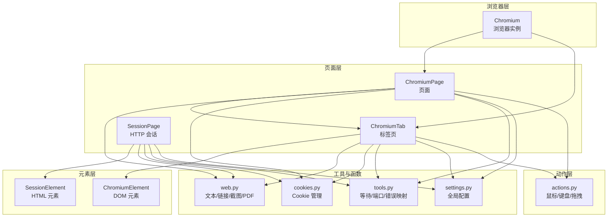
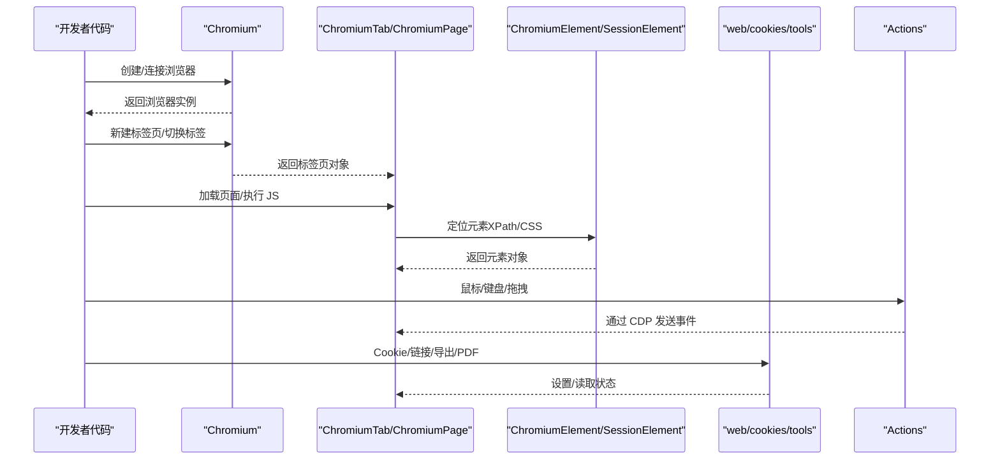
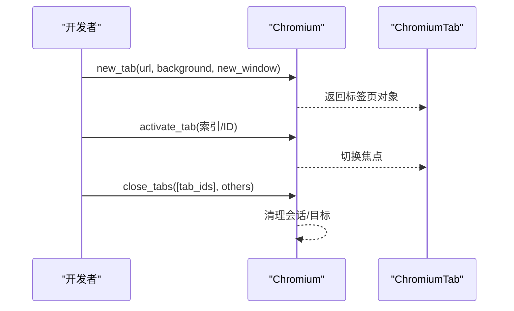
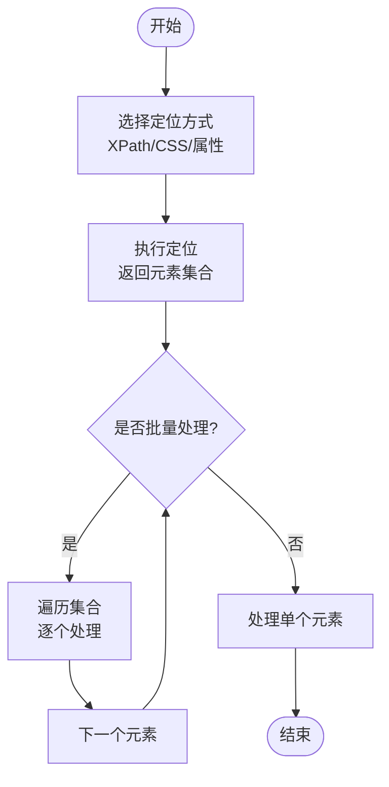
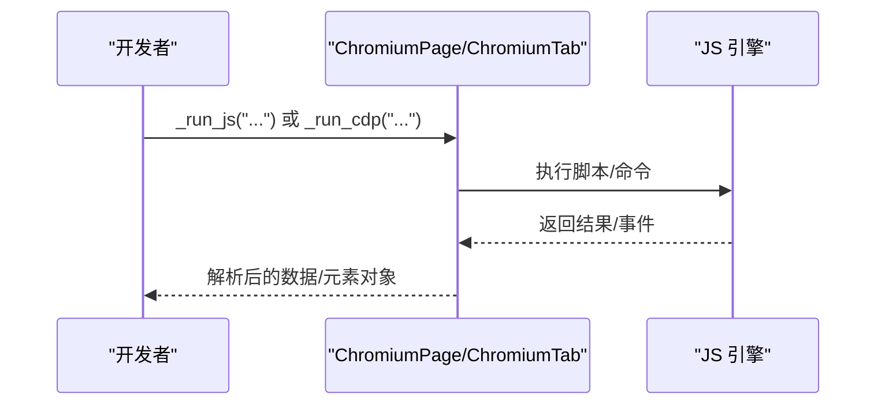
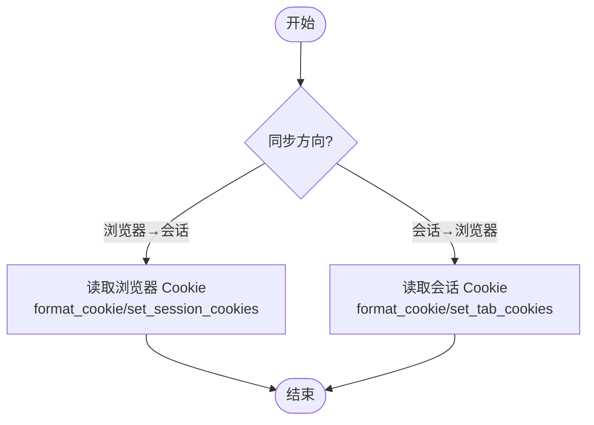
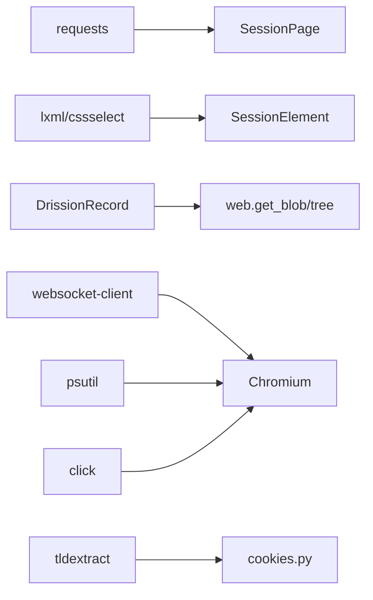

# 高级应用示例

<cite>
**本文引用的文件**
- [__init__.py](file://DrissionPage/__init__.py)
- [common.py](file://DrissionPage/common.py)
- [version.py](file://DrissionPage/version.py)
- [requirements.txt](file://requirements.txt)
- [chromium.py](file://DrissionPage/_browsers/chromium.py)
- [chromium_page.py](file://DrissionPage/_pages/chromium_page.py)
- [chromium_tab.py](file://DrissionPage/_pages/chromium_tab.py)
- [chromium_tab.pyi](file://DrissionPage/_pages/chromium_tab.pyi)
- [session_page.py](file://DrissionPage/_pages/session_page.py)
- [session_element.py](file://DrissionPage/_elements/session_element.py)
- [chromium_element.py](file://DrissionPage/_elements/chromium_element.py)
- [web.py](file://DrissionPage/_functions/web.py)
- [tools.py](file://DrissionPage/_functions/tools.py)
- [cookies.py](file://DrissionPage/_functions/cookies.py)
- [settings.py](file://DrissionPage/_functions/settings.py)
- [actions.py](file://DrissionPage/_units/actions.py)
</cite>

## 目录
1. [简介](#简介)
2. [项目结构](#项目结构)
3. [核心组件](#核心组件)
4. [架构总览](#架构总览)
5. [详细组件分析](#详细组件分析)
6. [依赖分析](#依赖分析)
7. [性能考量](#性能考量)
8. [故障排查指南](#故障排查指南)
9. [结论](#结论)
10. [附录](#附录)

## 简介
本文件面向希望在真实业务中落地 DrissionPage 的工程师，提供一套“高级应用示例”的系统化说明，覆盖多标签页操作、批量元素处理、动态内容抓取、JavaScript 执行、Cookie 管理、自动化测试与数据爬取策略、反爬虫应对、性能优化与内存管理、以及与 pandas、requests、BeautifulSoup 等生态库的集成范式。文档以仓库源码为依据，结合类图、序列图与流程图，帮助读者快速构建稳定高效的自动化与数据采集系统。

## 项目结构
DrissionPage 采用分层与职责分离的设计：
- 浏览器层：Chromium 对象负责与浏览器进程交互、标签页生命周期管理、上下文隔离、下载与代理等。
- 页面层：ChromiumPage/ChromiumTab 提供页面级操作；SessionPage 提供纯 HTTP 会话能力。
- 元素层：ChromiumElement、SessionElement 封装 DOM/HTML 元素的定位与访问。
- 工具与函数层：web、cookies、tools、settings 等模块提供通用能力。
- 单元与动作层：actions 提供鼠标键盘拖拽等高阶交互。

图表来源
- [chromium.py:33-120](file://DrissionPage/_browsers/chromium.py#L33-L120)
- [chromium_page.py:17-103](file://DrissionPage/_pages/chromium_page.py#L17-L103)
- [chromium_tab.py:41-237](file://DrissionPage/_pages/chromium_tab.py#L41-L237)
- [session_page.py:25-294](file://DrissionPage/_pages/session_page.py#L25-L294)
- [session_element.py:23-301](file://DrissionPage/_elements/session_element.py#L23-L301)
- [chromium_element.py:355-1320](file://DrissionPage/_elements/chromium_element.py#L355-L1320)
- [web.py:1-349](file://DrissionPage/_functions/web.py#L1-L349)
- [cookies.py:1-243](file://DrissionPage/_functions/cookies.py#L1-L243)
- [tools.py:1-213](file://DrissionPage/_functions/tools.py#L1-L213)
- [settings.py:1-69](file://DrissionPage/_functions/settings.py#L1-L69)
- [actions.py:16-266](file://DrissionPage/_units/actions.py#L16-L266)

章节来源
- [chromium.py:33-120](file://DrissionPage/_browsers/chromium.py#L33-L120)
- [chromium_page.py:17-103](file://DrissionPage/_pages/chromium_page.py#L17-L103)
- [chromium_tab.py:41-237](file://DrissionPage/_pages/chromium_tab.py#L41-L237)
- [session_page.py:25-294](file://DrissionPage/_pages/session_page.py#L25-L294)

## 核心组件
- 浏览器与上下文
  - Chromium：统一管理浏览器生命周期、标签页集合、上下文隔离、下载、代理、隐私沙盒弹窗处理等。
  - ChromiumContext：支持独立上下文与代理配置，便于多账号/多区域隔离。
- 页面与标签
  - ChromiumPage：页面级入口，提供标签页数量、最新标签、切换、新建、关闭等能力。
  - ChromiumTab：标签页级入口，支持 cookies 双向同步（浏览器↔会话）、保存 PDF/MHTML、CDP/JS 执行等。
  - SessionPage：基于 requests 的纯 HTTP 会话，适合静态/接口型数据抓取与低开销场景。
- 元素与定位
  - ChromiumElement：DOM 元素封装，支持属性、文本、HTML、XPath/CSS 定位、父子兄弟关系、JS 执行等。
  - SessionElement：HTML 文档元素封装，基于 lxml，支持 XPath/CSS 定位、属性修正（href/src 绝对化）等。
- 动作与交互
  - Actions：鼠标移动/点击/滚轮、键盘输入、组合键、拖拽文件/文本等，支持平滑轨迹与视口坐标转换。
- 工具与配置
  - web：文本提取、绝对链接拼接、PDF/MHTML 导出、树形打印、请求头格式化、代理解析等。
  - cookies：Cookie 格式化、域匹配、浏览器/会话双向设置、同站策略处理等。
  - tools：端口探测、等待 until、错误映射、临时目录清理、隐藏/显示浏览器窗口等。
  - settings：全局开关（异常抛出、单例标签、CDP 超时、语言等）。

章节来源
- [chromium.py:211-327](file://DrissionPage/_browsers/chromium.py#L211-L327)
- [chromium_page.py:57-103](file://DrissionPage/_pages/chromium_page.py#L57-L103)
- [chromium_tab.py:195-237](file://DrissionPage/_pages/chromium_tab.py#L195-L237)
- [session_page.py:104-196](file://DrissionPage/_pages/session_page.py#L104-L196)
- [session_element.py:169-301](file://DrissionPage/_elements/session_element.py#L169-L301)
- [chromium_element.py:355-1320](file://DrissionPage/_elements/chromium_element.py#L355-L1320)
- [actions.py:16-266](file://DrissionPage/_units/actions.py#L16-L266)
- [web.py:169-349](file://DrissionPage/_functions/web.py#L169-L349)
- [cookies.py:74-218](file://DrissionPage/_functions/cookies.py#L74-L218)
- [tools.py:139-213](file://DrissionPage/_functions/tools.py#L139-L213)
- [settings.py:13-69](file://DrissionPage/_functions/settings.py#L13-L69)

## 架构总览
下图展示 DrissionPage 的核心交互：浏览器通过 CDP 与页面通信，页面通过元素层进行 DOM/HTML 操作，工具层提供通用能力，动作层提供高阶交互。

图表来源
- [chromium.py:235-327](file://DrissionPage/_browsers/chromium.py#L235-L327)
- [chromium_page.py:82-103](file://DrissionPage/_pages/chromium_page.py#L82-L103)
- [chromium_tab.py:195-237](file://DrissionPage/_pages/chromium_tab.py#L195-L237)
- [session_element.py:169-301](file://DrissionPage/_elements/session_element.py#L169-L301)
- [chromium_element.py:355-1320](file://DrissionPage/_elements/chromium_element.py#L355-L1320)
- [web.py:169-349](file://DrissionPage/_functions/web.py#L169-L349)
- [cookies.py:74-218](file://DrissionPage/_functions/cookies.py#L74-L218)
- [actions.py:16-266](file://DrissionPage/_units/actions.py#L16-L266)

## 详细组件分析

### 多标签页操作
- 新建/激活/关闭标签页
  - 使用 Chromium.new_tab/new_context/get_tab/get_tabs/close_tabs/activate_tab 等方法。
  - 支持隐藏、后台、新窗口模式，以及上下文隔离。
- 最新标签与标签计数
  - ChromiumPage 提供 tabs_count、tab_ids、latest_tab 等便捷属性。
- 生命周期与断连处理
  - Chromium 内部维护 Tabs 映射，监听 Target 事件，处理断开与回收。

图表来源
- [chromium.py:235-327](file://DrissionPage/_browsers/chromium.py#L235-L327)
- [chromium_page.py:82-103](file://DrissionPage/_pages/chromium_page.py#L82-L103)

章节来源
- [chromium.py:235-327](file://DrissionPage/_browsers/chromium.py#L235-L327)
- [chromium_page.py:57-103](file://DrissionPage/_pages/chromium_page.py#L57-L103)

### 批量元素处理
- 定位策略
  - ChromiumElement：支持 XPath/CSS/属性/文本等定位，支持父子兄弟关系遍历。
  - SessionElement：基于 lxml，支持 XPath/CSS，自动修正 href/src 绝对链接。
- 批量获取与筛选
  - 通过 eles/s_eles 返回集合，再进行二次筛选或迭代处理。
- 性能建议
  - 优先使用 CSS/XPath 精确选择器，减少跨框架/阴影 DOM 查询。
  - 对静态 HTML 使用 SessionElement，避免不必要的浏览器渲染成本。

图表来源
- [chromium_element.py:355-1320](file://DrissionPage/_elements/chromium_element.py#L355-L1320)
- [session_element.py:169-301](file://DrissionPage/_elements/session_element.py#L169-L301)

章节来源
- [chromium_element.py:355-1320](file://DrissionPage/_elements/chromium_element.py#L355-L1320)
- [session_element.py:169-301](file://DrissionPage/_elements/session_element.py#L169-L301)

### 动态内容抓取与 JavaScript 执行
- 页面加载与等待
  - 使用 ChromiumPage/ChromiumTab 的 wait 属性与内置等待器，结合 settings 控制超时。
- JS 执行
  - 通过 _run_js/_run_cdp 执行脚本与 CDP 命令，支持返回值解析与异常映射。
- 文本与结构提取
  - web.get_ele_txt 提取规范化文本；web.tree 打印树形结构辅助定位。
- Blob 与资源导出
  - web.get_blob 读取 blob 数据；web.get_pdf/get_mhtml 导出页面为 PDF/MHTML。

图表来源
- [chromium_tab.py:195-237](file://DrissionPage/_pages/chromium_tab.py#L195-L237)
- [web.py:169-349](file://DrissionPage/_functions/web.py#L169-L349)

章节来源
- [chromium_tab.py:195-237](file://DrissionPage/_pages/chromium_tab.py#L195-L237)
- [web.py:169-349](file://DrissionPage/_functions/web.py#L169-L349)

### Cookie 管理
- 浏览器与会话双向同步
  - ChromiumTab.cookies_to_session/cookies_to_browser 实现浏览器与 SessionPage 的 Cookie 同步。
- Cookie 格式化与域匹配
  - cookies.format_cookie、cookies.set_tab_cookies、cookies.set_session_cookies 处理域、路径、过期、同站策略等。
- 多上下文与隐私沙盒
  - new_context 支持代理与下载行为配置；自动处理隐私沙盒弹窗。

图表来源
- [chromium_tab.py:195-237](file://DrissionPage/_pages/chromium_tab.py#L195-L237)
- [cookies.py:74-218](file://DrissionPage/_functions/cookies.py#L74-L218)

章节来源
- [chromium_tab.py:195-237](file://DrissionPage/_pages/chromium_tab.py#L195-L237)
- [cookies.py:74-218](file://DrissionPage/_functions/cookies.py#L74-L218)

### 自动化测试与数据爬取策略
- 测试策略
  - 使用 Settings 控制异常抛出与等待失败行为；使用 tools.wait_until 实现自定义等待条件。
  - 使用 Actions 模拟用户交互，结合 wait 与截图/PDF 输出进行回归验证。
- 爬取策略
  - SessionPage 适合静态/接口型数据；ChromiumPage 适合动态渲染页面。
  - 使用 web.make_absolute_link 保证链接一致性；使用 web.format_headers 规范请求头。
- 反爬虫应对
  - 通过 new_context 配置代理与 UA；使用 cookies 管理登录态；合理控制请求频率与并发。

章节来源
- [settings.py:13-69](file://DrissionPage/_functions/settings.py#L13-L69)
- [tools.py:139-213](file://DrissionPage/_functions/tools.py#L139-L213)
- [session_page.py:104-196](file://DrissionPage/_pages/session_page.py#L104-L196)
- [web.py:169-349](file://DrissionPage/_functions/web.py#L169-L349)
- [chromium.py:211-327](file://DrissionPage/_browsers/chromium.py#L211-L327)

### 与其他 Python 库的集成
- 与 requests/pandas/BeautifulSoup 的协作
  - 使用 SessionPage 的 response/raw_data/html/json 获取数据，再交给 requests/pandas/BeautifulSoup 处理。
  - 注意编码问题：web.set_charset 与 SessionPage.encoding 控制。
- 与 DrissionPage 的互操作
  - common.from_selenium/from_playwright 将外部驱动对象桥接为 Chromium 实例，便于迁移与复用。

章节来源
- [session_page.py:64-196](file://DrissionPage/_pages/session_page.py#L64-L196)
- [web.py:272-294](file://DrissionPage/_functions/web.py#L272-L294)
- [common.py:22-57](file://DrissionPage/common.py#L22-L57)

### 性能优化与内存管理
- 选择合适的页面模型
  - 静态/接口数据优先 SessionPage；动态渲染使用 ChromiumPage。
- 减少不必要的渲染与网络
  - 合理设置超时与重试；关闭不需要的标签页；清理缓存与 Cookie。
- 动作与等待
  - 使用 Actions 的平滑移动与等待，避免频繁强制刷新。
- 错误与资源回收
  - 使用 tools.ensure_del_dir 清理用户数据目录；在异常分支及时 close/quit。

章节来源
- [chromium.py:328-372](file://DrissionPage/_browsers/chromium.py#L328-L372)
- [tools.py:200-213](file://DrissionPage/_functions/tools.py#L200-L213)
- [chromium_page.py:98-103](file://DrissionPage/_pages/chromium_page.py#L98-L103)

## 依赖分析
- 外部依赖
  - requests、lxml、cssselect、DrissionGet、DrissionRecord、websocket-client、click、tldextract、psutil。
- 内部模块耦合
  - 页面层依赖浏览器层；元素层依赖页面层；工具层被页面/元素/动作层广泛使用。
- 循环依赖
  - 未发现循环导入；模块职责清晰，通过接口调用解耦。

图表来源
- [requirements.txt:1-9](file://requirements.txt#L1-L9)
- [session_page.py:13-22](file://DrissionPage/_pages/session_page.py#L13-L22)
- [session_element.py:11-19](file://DrissionPage/_elements/session_element.py#L11-L19)
- [web.py:14-18](file://DrissionPage/_functions/web.py#L14-L18)
- [cookies.py:13-15](file://DrissionPage/_functions/cookies.py#L13-L15)
- [chromium.py:13-29](file://DrissionPage/_browsers/chromium.py#L13-L29)

章节来源
- [requirements.txt:1-9](file://requirements.txt#L1-L9)

## 性能考量
- 启动与连接
  - 使用 Settings.set_cdp_timeout 与 set_browser_connect_timeout 控制连接与 CDP 超时。
- 并发与重试
  - SessionPage.get/post 支持 retry/interval；tools.wait_until 提供自定义等待。
- 资源与内存
  - 及时 close/quit；合理清理用户数据目录；避免同时打开过多标签页。
- 导出与存储
  - PDF/MHTML 导出前先评估页面大小与资源；必要时预渲染或裁剪。

章节来源
- [settings.py:46-58](file://DrissionPage/_functions/settings.py#L46-L58)
- [session_page.py:104-196](file://DrissionPage/_pages/session_page.py#L104-L196)
- [tools.py:139-149](file://DrissionPage/_functions/tools.py#L139-L149)
- [chromium.py:328-372](file://DrissionPage/_browsers/chromium.py#L328-L372)

## 故障排查指南
- 常见错误映射
  - tools.raise_error 将 CDP 错误映射为具体异常类型，便于定位（上下文丢失、元素丢失、断开、URL 无效、存储错误、Cookie 格式错误、JS 错误、超时等）。
- 端口与连接
  - tools.PortFinder 提供随机端口分配与占用检测；tools.port_is_using 检查端口占用。
- 浏览器可见性
  - tools.show_or_hide_browser 通过 win32gui 控制窗口显示；需要安装 pypiwin32 与 win32process。
- 版本与依赖
  - version.py 提供版本号；requirements.txt 列出依赖；确保各模块版本兼容。

章节来源
- [tools.py:157-213](file://DrissionPage/_functions/tools.py#L157-L213)
- [tools.py:21-56](file://DrissionPage/_functions/tools.py#L21-L56)
- [tools.py:79-99](file://DrissionPage/_functions/tools.py#L79-L99)
- [version.py:8-9](file://DrissionPage/version.py#L8-L9)
- [requirements.txt:1-9](file://requirements.txt#L1-L9)

## 结论
通过以上高级应用示例，开发者可以在复杂业务场景中灵活运用 DrissionPage：多标签页并行、批量元素处理、动态内容抓取、JS 执行、Cookie 管理、与生态库集成、性能优化与内存管理，并结合反爬虫策略与自动化测试实践，构建稳定高效的自动化与数据采集系统。

## 附录
- 快速入口
  - 初始化：from DrissionPage import Chromium, ChromiumPage, SessionPage, ChromiumOptions
  - 集成外部驱动：from DrissionPage import from_selenium, from_playwright
- 最佳实践清单
  - 明确页面模型选择（SessionPage/ChromiumPage）。
  - 合理设置超时与重试，避免阻塞。
  - 使用 Actions 进行真实用户交互模拟。
  - 严格管理 Cookie 与上下文，规避登录态丢失。
  - 导出前评估资源规模，必要时预处理。
  - 使用 tools.wait_until 与 raise_error 辅助调试与健壮性。

章节来源
- [__init__.py:22-29](file://DrissionPage/__init__.py#L22-L29)
- [common.py:22-57](file://DrissionPage/common.py#L22-L57)