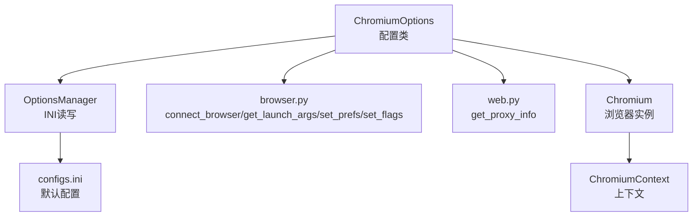
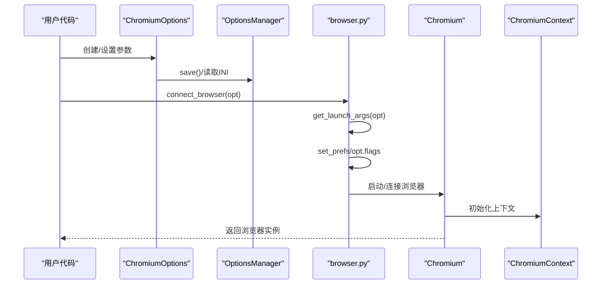
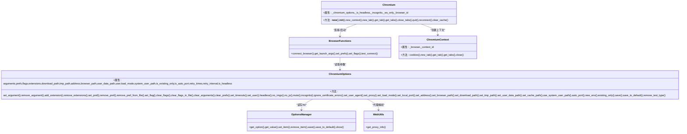

# Chromium 浏览器配置

<cite>
**本文引用的文件**
- [chromium_options.py](file://DrissionPage/_configs/chromium_options.py)
- [options_manage.py](file://DrissionPage/_configs/options_manage.py)
- [browser.py](file://DrissionPage/_functions/browser.py)
- [web.py](file://DrissionPage/_functions/web.py)
- [chromium.py](file://DrissionPage/_browsers/chromium.py)
- [chromium_context.py](file://DrissionPage/_browsers/chromium_context.py)
- [configs.ini](file://DrissionPage/_configs/configs.ini)
</cite>

## 目录
1. [简介](#简介)
2. [项目结构](#项目结构)
3. [核心组件](#核心组件)
4. [架构总览](#架构总览)
5. [详细组件分析](#详细组件分析)
6. [依赖关系分析](#依赖关系分析)
7. [性能考虑](#性能考虑)
8. [故障排查指南](#故障排查指南)
9. [结论](#结论)
10. [附录：配置示例与最佳实践](#附录配置示例与最佳实践)

## 简介
本文系统讲解 DrissionPage 中 ChromiumOptions 类的完整配置能力，覆盖浏览器启动参数、用户数据路径、扩展加载、偏好设置、性能优化、代理与证书错误处理、隐身模式等高级功能。通过源码级分析，帮助读者理解参数如何被解析、持久化与应用到实际浏览器启动流程中，并提供常见场景的配置模板与最佳实践建议。

## 项目结构
围绕 ChromiumOptions 的相关模块主要分布在以下位置：
- 配置定义与持久化：DrissionPage/_configs/chromium_options.py、DrissionPage/_configs/options_manage.py、DrissionPage/_configs/configs.ini
- 浏览器连接与启动：DrissionPage/_functions/browser.py
- 代理解析工具：DrissionPage/_functions/web.py
- 浏览器实例与上下文：DrissionPage/_browsers/chromium.py、DrissionPage/_browsers/chromium_context.py

图表来源
- [chromium_options.py:16-85](file://DrissionPage/_configs/chromium_options.py#L16-L85)
- [options_manage.py:15-78](file://DrissionPage/_configs/options_manage.py#L15-L78)
- [browser.py:24-87](file://DrissionPage/_functions/browser.py#L24-L87)
- [web.py:321-349](file://DrissionPage/_functions/web.py#L321-L349)
- [chromium.py:33-53](file://DrissionPage/_browsers/chromium.py#L33-L53)
- [chromium_context.py:7-62](file://DrissionPage/_browsers/chromium_context.py#L7-L62)
- [configs.ini:1-34](file://DrissionPage/_configs/configs.ini#L1-L34)

章节来源
- [chromium_options.py:16-85](file://DrissionPage/_configs/chromium_options.py#L16-L85)
- [options_manage.py:15-78](file://DrissionPage/_configs/options_manage.py#L15-L78)
- [configs.ini:1-34](file://DrissionPage/_configs/configs.ini#L1-L34)

## 核心组件
- ChromiumOptions：集中管理浏览器启动参数、扩展、偏好、标志位、超时、代理、下载路径、临时目录、用户数据路径、隐身模式、证书错误处理、加载模式、本地端口/自动端口、仅连接现有实例等。
- OptionsManager：负责从 INI 文件读取/写入配置，支持默认配置初始化与保存。
- browser.py：负责连接或启动浏览器，生成启动参数、处理扩展、写入偏好与实验标志、检测连接状态。
- web.py：提供代理字符串解析工具，支持 http(s)://user:pass@host:port 或 user:pass@host:port 两种格式。
- Chromium/ChromiumContext：浏览器实例与上下文，承载标签页管理、会话、等待器、状态等。

章节来源
- [chromium_options.py:16-417](file://DrissionPage/_configs/chromium_options.py#L16-L417)
- [options_manage.py:15-143](file://DrissionPage/_configs/options_manage.py#L15-L143)
- [browser.py:24-190](file://DrissionPage/_functions/browser.py#L24-L190)
- [web.py:321-349](file://DrissionPage/_functions/web.py#L321-L349)
- [chromium.py:33-137](file://DrissionPage/_browsers/chromium.py#L33-L137)
- [chromium_context.py:7-62](file://DrissionPage/_browsers/chromium_context.py#L7-L62)

## 架构总览
ChromiumOptions 作为配置入口，通过 OptionsManager 与 INI 文件交互；browser.py 将其转换为浏览器启动参数并执行连接/启动；Chromium/ChromiumContext 提供运行期的浏览器生命周期与上下文管理。

图表来源
- [chromium_options.py:364-417](file://DrissionPage/_configs/chromium_options.py#L364-L417)
- [options_manage.py:111-133](file://DrissionPage/_configs/options_manage.py#L111-L133)
- [browser.py:24-87](file://DrissionPage/_functions/browser.py#L24-L87)
- [chromium.py:33-137](file://DrissionPage/_browsers/chromium.py#L33-L137)

## 详细组件分析

### ChromiumOptions 类：配置全集与行为
- 属性与初始化
  - 从 INI 读取 arguments、browser_path、extensions、prefs、flags、address、load_mode、system_user_path、existing_only、new_env、timeouts、retry_times/retry_interval。
  - 解析 --headless、--user-data-dir、--profile-directory 等参数，标记 headless 状态、用户数据路径与用户文件夹。
  - 从 INI 读取默认代理，调用 set_proxy 应用到启动参数。
- 参数管理
  - set_argument/remove_argument/add_extension/remove_extensions：增删扩展与启动参数。
  - set_pref/remove_pref/remove_pref_from_file：管理 Preferences 文件中的用户设置项，支持从文件删除项。
  - set_flag/clear_flags/clear_flags_in_file：管理实验标志位，支持清空文件中的标志。
  - clear_arguments/clear_prefs：清空已设置的参数与偏好。
- 启动参数快捷方法
  - headless(on_off)：设置隐藏界面，支持传入 'new'。
  - no_imgs/on_js/mute/incognito：禁用图片/禁用 JS/静音/隐身模式。
  - ignore_certificate_errors：忽略证书错误。
  - set_user_agent：设置 User-Agent。
  - set_proxy：解析代理字符串并设置 --proxy-server。
  - set_load_mode：设置页面加载模式 normal/eager/none。
  - set_local_port/set_address：设置本地端口或地址，支持 ws/wss 协议。
  - set_browser_path：设置浏览器可执行文件名或 Edge。
  - set_download_path/set_tmp_path：设置下载与临时目录。
  - set_user_data_path/set_cache_path/use_system_user_path：用户数据路径、缓存目录、使用系统用户路径。
  - auto_port/new_env/existing_only：自动端口、新环境、仅连接现有实例。
  - set_timeouts：设置基础/页面加载/脚本超时。
  - set_retry：设置连接失败重试次数与间隔。
  - save/save_to_default：将当前配置保存到 INI，默认路径为 configs.ini。
  - remove_test_type：移除测试类型相关参数。
- 属性访问
  - download_path、browser_path、user_data_path、tmp_path、user、load_mode、timeouts、proxy、address、arguments、extensions、preferences、flags、system_user_path、is_existing_only、is_auto_port、retry_times、retry_interval、is_headless。

章节来源
- [chromium_options.py:16-417](file://DrissionPage/_configs/chromium_options.py#L16-L417)

### OptionsManager：INI 配置读写
- 支持从默认 configs.ini 或自定义路径读取配置，若文件不存在则初始化默认节与键值。
- 提供 get_option/get_value/set_item/remove_item/save/show 等接口。
- 默认配置包含 paths、chromium_options、session_options、timeouts、proxies、others 等节。

章节来源
- [options_manage.py:15-143](file://DrissionPage/_configs/options_manage.py#L15-L143)
- [configs.ini:1-34](file://DrissionPage/_configs/configs.ini#L1-L34)

### browser.py：启动与连接流程
- connect_browser
  - 若启用 auto_port，则使用 PortFinder 分配端口并更新 address。
  - 检测端口占用与 existing_only 条件，必要时尝试连接现有实例。
  - 生成启动参数 get_launch_args，处理扩展、用户数据路径、UA 设置。
  - 写入 prefs 与 flags，启动浏览器进程并轮询测试连接。
- get_launch_args
  - 过滤特定参数，收集扩展路径，生成最终启动参数列表。
- set_prefs/set_flags
  - 在用户数据目录写入 Preferences 与 Local State，支持删除文件中的偏好项与清空文件标志。
- test_connect
  - 通过 /json 接口轮询检测浏览器可用性。

章节来源
- [browser.py:24-190](file://DrissionPage/_functions/browser.py#L24-L190)

### web.py：代理解析工具
- get_proxy_info
  - 支持 http(s)://user:pass@host:port 与 user:pass@host:port 两种格式，返回 url、用户名、密码三元组。
  - ChromiumOptions.set_proxy 调用此工具解析代理字符串并设置 --proxy-server。

章节来源
- [web.py:321-349](file://DrissionPage/_functions/web.py#L321-L349)
- [chromium_options.py:293-296](file://DrissionPage/_configs/chromium_options.py#L293-L296)

### Chromium/ChromiumContext：运行期管理
- Chromium
  - 通过 handle_options/ run_browser 连接或启动浏览器，维护驱动、标签页、下载管理、超时、代理等。
  - 支持隐身模式检测、隐私沙盒对话处理、上下文隔离等。
- ChromiumContext
  - 基于浏览器上下文的标签页管理，支持 cookies、新建/获取标签页、关闭上下文等。

章节来源
- [chromium.py:33-137](file://DrissionPage/_browsers/chromium.py#L33-L137)
- [chromium_context.py:7-62](file://DrissionPage/_browsers/chromium_context.py#L7-L62)

## 依赖关系分析
- ChromiumOptions 依赖 OptionsManager 读取/保存配置，依赖 web.py 的代理解析。
- browser.py 依赖 ChromiumOptions 的参数，负责生成启动参数、写入 prefs/flags、启动/连接浏览器。
- Chromium/ChromiumContext 依赖 browser.py 的连接结果，提供运行期的标签页与上下文管理。

图表来源
- [chromium_options.py:16-417](file://DrissionPage/_configs/chromium_options.py#L16-L417)
- [options_manage.py:15-143](file://DrissionPage/_configs/options_manage.py#L15-L143)
- [browser.py:24-190](file://DrissionPage/_functions/browser.py#L24-L190)
- [web.py:321-349](file://DrissionPage/_functions/web.py#L321-L349)
- [chromium.py:33-137](file://DrissionPage/_browsers/chromium.py#L33-L137)
- [chromium_context.py:7-62](file://DrissionPage/_browsers/chromium_context.py#L7-L62)

## 性能考虑
- 禁用图片与 JavaScript
  - 使用 no_imgs/no_js 可显著降低网络与 CPU 占用，适合抓取与渲染无关的数据场景。
- 静音设置
  - 使用 mute 可避免音频播放带来的额外开销与噪音。
- 加载模式
  - set_load_mode 支持 normal/eager/none，eager/none 可减少 DOM 解析等待，提升响应速度。
- 缓存与用户数据路径
  - set_cache_path 与 set_user_data_path 可控制磁盘占用与复用登录状态，平衡性能与隐私。
- 自动端口与新环境
  - auto_port/new_env 可避免多实例冲突与数据污染，但会增加启动成本。
- 代理与证书错误
  - 合理设置代理可提升网络稳定性；ignore_certificate_errors 可绕过证书校验问题，但需注意安全风险。

[本节为通用性能建议，无需特定文件来源]

## 故障排查指南
- 浏览器连接失败
  - 检查 address/port 是否被占用，existing_only 条件是否满足；使用 test_connect 进行连通性验证。
- 代理设置无效
  - 确认代理字符串格式正确，get_proxy_info 能正确解析；ChromiumOptions.set_proxy 会设置 --proxy-server。
- 扩展加载失败
  - 扩展必须是目录而非文件；确保路径存在且可访问。
- 偏好设置未生效
  - 确保 user_data_path 已设置且 Preferences 文件存在；set_prefs 会在启动前写入。
- 证书错误导致页面异常
  - 使用 ignore_certificate_errors 快捷方法临时规避，生产环境建议修复证书链。

章节来源
- [browser.py:192-200](file://DrissionPage/_functions/browser.py#L192-L200)
- [chromium_options.py:293-296](file://DrissionPage/_configs/chromium_options.py#L293-L296)
- [browser.py:104-118](file://DrissionPage/_functions/browser.py#L104-L118)
- [browser.py:122-158](file://DrissionPage/_functions/browser.py#L122-L158)

## 结论
ChromiumOptions 提供了全面而灵活的 Chromium 浏览器配置能力，结合 OptionsManager 的 INI 管理、browser.py 的启动与连接逻辑、以及 Chromium/ChromiumContext 的运行期管理，形成了从“配置—启动—运行”的完整闭环。通过合理使用各项参数与快捷方法，可在不同场景下实现性能优化、隐私保护、网络加速与稳定性增强。

[本节为总结性内容，无需特定文件来源]

## 附录：配置示例与最佳实践

### 常见场景配置模板
- 无头模式抓取
  - 启用 headless，禁用图片与 JS，设置静音，调整加载模式为 eager。
  - 关联方法：headless、no_imgs、no_js、mute、set_load_mode。
- 隐身模式
  - 启用 incognito，避免本地数据影响。
  - 关联方法：incognito。
- 代理访问
  - 使用 set_proxy 设置代理，支持 http(s)://user:pass@host:port 或 user:pass@host:port。
  - 关联方法：set_proxy。
- 自定义用户数据路径
  - 使用 set_user_data_path 指定用户数据目录，便于复用登录状态或隔离环境。
  - 关联方法：set_user_data_path。
- 扩展加载
  - 使用 add_extension 添加扩展目录，确保扩展目录存在。
  - 关联方法：add_extension。
- 偏好设置
  - 使用 set_pref 设置 Preferences 中的键值，必要时配合 remove_pref_from_file 删除文件中的项。
  - 关联方法：set_pref、remove_pref_from_file。
- 实验标志
  - 使用 set_flag 设置实验项，或 clear_flags_in_file 清空文件中的标志。
  - 关联方法：set_flag、clear_flags_in_file。
- 端口与地址
  - 使用 set_local_port 或 set_address 指定本地端口或地址，支持 ws/wss。
  - 关联方法：set_local_port、set_address。
- 超时与重试
  - 使用 set_timeouts 与 set_retry 控制超时与重试策略。
  - 关联方法：set_timeouts、set_retry。

### 最佳实践建议
- 优先使用 INI 文件统一管理配置，便于团队共享与版本控制。
- 在 CI/CD 环境中启用 auto_port 与 new_env，避免端口冲突与数据污染。
- 抓取场景优先禁用图片与 JS，提升吞吐量；渲染场景保留默认设置。
- 代理与证书策略应与业务安全要求匹配，生产环境谨慎使用 ignore_certificate_errors。
- 定期清理缓存与用户数据目录，避免磁盘空间膨胀。

[本节为通用实践建议，无需特定文件来源]