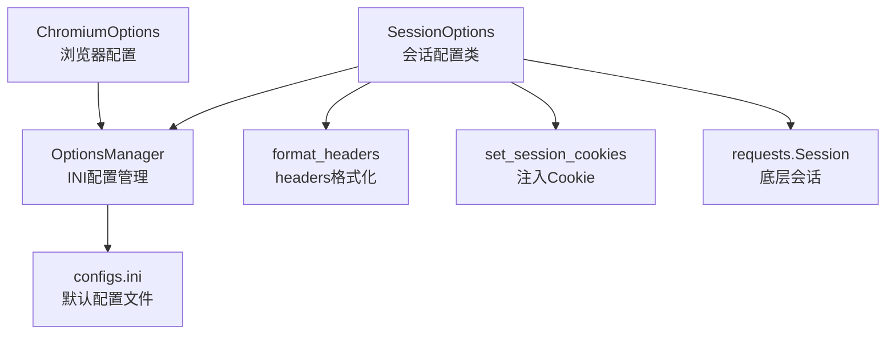
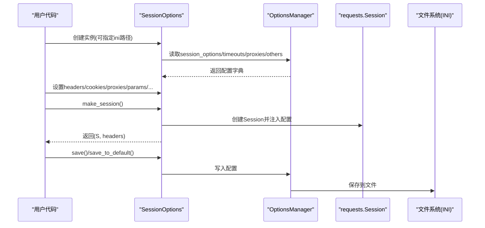
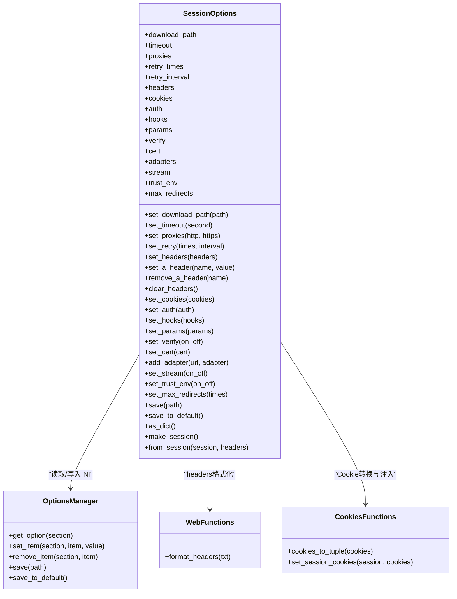

# HTTP 会话配置

<cite>
**本文引用的文件**
- [session_options.py](file://DrissionPage/_configs/session_options.py)
- [session_options.pyi](file://DrissionPage/_configs/session_options.pyi)
- [options_manage.py](file://DrissionPage/_configs/options_manage.py)
- [configs.ini](file://DrissionPage/_configs/configs.ini)
- [web.py](file://DrissionPage/_functions/web.py)
- [cookies.py](file://DrissionPage/_functions/cookies.py)
- [chromium_options.py](file://DrissionPage/_configs/chromium_options.py)
- [chromium_options.pyi](file://DrissionPage/_configs/chromium_options.pyi)
</cite>

## 目录
1. [简介](#简介)
2. [项目结构](#项目结构)
3. [核心组件](#核心组件)
4. [架构总览](#架构总览)
5. [详细组件分析](#详细组件分析)
6. [依赖关系分析](#依赖关系分析)
7. [性能考量](#性能考量)
8. [故障排查指南](#故障排查指南)
9. [结论](#结论)
10. [附录](#附录)

## 简介
本文档围绕 DrissionPage 中的 SessionOptions 类，系统性地介绍其在 HTTP 会话配置方面的功能与实践，涵盖会话超时、请求头管理、Cookie 处理、代理配置、会话持久化、连接池管理、SSL 证书验证、User-Agent 与 Accept-Language、Referer 等 HTTP 协议相关设置，并提供爬虫、API 调用、文件上传等典型场景的最佳配置建议。

## 项目结构
SessionOptions 位于配置模块中，通过 OptionsManager 读取/写入 INI 配置文件；其内部依赖 web.py 提供的 headers 格式化工具与 cookies.py 提供的 Cookie 转换与注入能力；同时与 ChromiumOptions 在代理与超时等配置上存在协同关系。

图表来源
- [session_options.py:20-372](file://DrissionPage/_configs/session_options.py#L20-L372)
- [options_manage.py:15-143](file://DrissionPage/_configs/options_manage.py#L15-L143)
- [configs.ini:1-34](file://DrissionPage/_configs/configs.ini#L1-L34)
- [web.py:304-318](file://DrissionPage/_functions/web.py#L304-L318)
- [cookies.py:74-87](file://DrissionPage/_functions/cookies.py#L74-L87)

章节来源
- [session_options.py:20-372](file://DrissionPage/_configs/session_options.py#L20-L372)
- [options_manage.py:15-143](file://DrissionPage/_configs/options_manage.py#L15-L143)
- [configs.ini:1-34](file://DrissionPage/_configs/configs.ini#L1-L34)

## 核心组件
- SessionOptions：封装 HTTP 会话的配置项，支持从 INI 文件读取、动态修改、序列化保存，并能生成 requests.Session 实例。
- OptionsManager：负责 INI 文件的读取、写入与节/键管理。
- format_headers：将浏览器复制的 headers 文本转换为字典，统一大小写键名。
- set_session_cookies：将多种来源的 Cookie 转换并注入到 requests.Session。
- requests.Session：底层 HTTP 会话对象，承载超时、代理、SSL、钩子、参数等配置。

章节来源
- [session_options.py:20-372](file://DrissionPage/_configs/session_options.py#L20-L372)
- [session_options.pyi:19-299](file://DrissionPage/_configs/session_options.pyi#L19-L299)
- [options_manage.py:15-143](file://DrissionPage/_configs/options_manage.py#L15-L143)
- [web.py:304-318](file://DrissionPage/_functions/web.py#L304-L318)
- [cookies.py:74-87](file://DrissionPage/_functions/cookies.py#L74-L87)

## 架构总览
SessionOptions 的生命周期包括：初始化读取 INI → 动态设置 → 生成 Session → 运行期使用 → 保存回 INI。其与 ChromiumOptions 在代理与超时方面存在互补关系，ChromiumOptions 更偏向浏览器侧配置，SessionOptions 更偏向 HTTP 会话层配置。

图表来源
- [session_options.py:22-336](file://DrissionPage/_configs/session_options.py#L22-L336)
- [options_manage.py:16-133](file://DrissionPage/_configs/options_manage.py#L16-L133)

## 详细组件分析

### 会话超时设置
- 基础超时：通过构造函数读取 INI 中的 base 超时；可通过 set_timeout 动态调整。
- 适用场景：网络波动较大时适当提高超时；API 调用对延迟敏感时降低超时。
- 注意事项：超时过长可能造成资源占用，过短可能导致误判。

章节来源
- [session_options.py:22-82](file://DrissionPage/_configs/session_options.py#L22-L82)
- [configs.ini:22-25](file://DrissionPage/_configs/configs.ini#L22-L25)

### 请求头管理
- 读取默认：INI 中的 headers 默认包含 User-Agent、Accept、Connection、Accept-Charset 等。
- 动态设置：set_headers 支持字典/字符串/None；set_a_header/set_a_header/remove_a_header/clear_headers 提供细粒度控制。
- 格式化：format_headers 将浏览器复制的文本转换为字典，过滤掉伪头部字段。
- 使用建议：
  - 爬虫：设置合理的 UA、Accept-Language、Referer，避免被反爬策略识别。
  - API：明确 Content-Type、Authorization 等必要头部。
  - 文件上传：确保 Content-Type 与 multipart/form-data 对应。

章节来源
- [session_options.py:54-55](file://DrissionPage/_configs/session_options.py#L54-L55)
- [session_options.py:142-168](file://DrissionPage/_configs/session_options.py#L142-L168)
- [web.py:304-318](file://DrissionPage/_functions/web.py#L304-L318)
- [configs.ini:19-20](file://DrissionPage/_configs/configs.ini#L19-L20)

### Cookie 处理
- 输入支持：Cookie、CookieJar、list、tuple、str、dict 等多种来源。
- 转换与注入：cookies_to_tuple 统一为元组格式；set_session_cookies 注入到 Session。
- 使用建议：登录后将响应 Cookie 保存为持久化 Cookie 列表，后续请求复用；注意域与路径匹配。

章节来源
- [session_options.py:176-179](file://DrissionPage/_configs/session_options.py#L176-L179)
- [cookies.py:47-87](file://DrissionPage/_functions/cookies.py#L47-L87)

### 代理配置
- 设置方式：set_proxies(http, https)；INI 中 http/https 代理分别存储。
- 与浏览器协同：ChromiumOptions 也支持代理设置，二者可配合使用。
- 使用建议：企业内网代理需考虑认证；HTTPS 代理需关注证书链。

章节来源
- [session_options.py:115-117](file://DrissionPage/_configs/session_options.py#L115-L117)
- [session_options.py:81](file://DrissionPage/_configs/session_options.py#L81)
- [configs.ini:27-29](file://DrissionPage/_configs/configs.ini#L27-L29)
- [chromium_options.py:59-61](file://DrissionPage/_configs/chromium_options.py#L59-L61)

### 会话持久化与连接池管理
- 会话持久化：通过 make_session 生成的 Session 对象可跨请求复用连接，减少握手开销。
- 连接池：requests 默认启用连接池；可通过自定义 HTTPAdapter 调整池大小、并发等。
- 适配器扩展：add_adapter(url, adapter) 可为特定域名挂载适配器，实现差异化配置。

章节来源
- [session_options.py:231-233](file://DrissionPage/_configs/session_options.py#L231-L233)
- [session_options.py:321-336](file://DrissionPage/_configs/session_options.py#L321-L336)

### SSL 证书验证与客户端证书
- 证书验证：set_verify(on_off) 控制是否校验证书链。
- 客户端证书：set_cert(cert) 支持 PEM 文件路径或 (cert, key) 元组。
- 使用建议：生产环境务必开启证书验证；私有 CA 或双向 TLS 场景按需配置。

章节来源
- [session_options.py:213-223](file://DrissionPage/_configs/session_options.py#L213-L223)

### User-Agent 与 Accept-Language、Referer
- User-Agent：默认来自 INI；可通过 set_a_header('user-agent', ...) 覆盖。
- Accept-Language：通过 set_a_header('accept-language', ...) 设置。
- Referer：通过 set_a_header('referer', ...) 设置。
- 使用建议：模拟真实浏览器行为，避免触发风控。

章节来源
- [configs.ini:19-20](file://DrissionPage/_configs/configs.ini#L19-L20)
- [session_options.py:151-164](file://DrissionPage/_configs/session_options.py#L151-L164)

### 钩子、查询参数、最大重定向、流式响应、信任环境变量
- 钩子：set_hooks(hooks) 注册回调。
- 查询参数：set_params(params) 附加 URL 查询参数。
- 最大重定向：set_max_redirects(times) 控制跟随重定向次数。
- 流式响应：set_stream(True) 适合大文件下载。
- 信任环境变量：set_trust_env(True) 使 Session 使用系统代理等环境变量。

章节来源
- [session_options.py:195-197](file://DrissionPage/_configs/session_options.py#L195-L197)
- [session_options.py:205-207](file://DrissionPage/_configs/session_options.py#L205-L207)
- [session_options.py:255-257](file://DrissionPage/_configs/session_options.py#L255-L257)
- [session_options.py:239-241](file://DrissionPage/_configs/session_options.py#L239-L241)
- [session_options.py:247-249](file://DrissionPage/_configs/session_options.py#L247-L249)

### 保存与恢复配置
- 保存：save(path)/save_to_default() 将当前配置写入 INI，支持标记删除项。
- 恢复：构造函数读取 INI 并应用到 SessionOptions。

章节来源
- [session_options.py:268-313](file://DrissionPage/_configs/session_options.py#L268-L313)
- [options_manage.py:102-133](file://DrissionPage/_configs/options_manage.py#L102-L133)

### 生成 Session 与从 Session 读取配置
- 生成：make_session() 返回 (Session, headers)；headers 从对象中分离，便于后续统一管理。
- 读取：from_session(session, headers) 将现有 Session 的配置还原到 SessionOptions。

章节来源
- [session_options.py:321-352](file://DrissionPage/_configs/session_options.py#L321-L352)

## 依赖关系分析

图表来源
- [session_options.py:20-372](file://DrissionPage/_configs/session_options.py#L20-L372)
- [options_manage.py:15-143](file://DrissionPage/_configs/options_manage.py#L15-L143)
- [web.py:304-318](file://DrissionPage/_functions/web.py#L304-L318)
- [cookies.py:47-87](file://DrissionPage/_functions/cookies.py#L47-L87)

## 性能考量
- 连接复用：通过 Session 复用 TCP 连接，减少握手成本。
- 超时设置：合理设置超时，避免长时间阻塞；对大文件下载启用流式响应。
- 代理与证书：代理链路与证书校验会增加延迟，仅在必要时开启。
- 重试策略：适度重试可提升稳定性，但频繁重试会放大网络压力。

## 故障排查指南
- 代理不可用
  - 检查代理地址格式与认证信息；确认网络连通性。
  - 参考：代理设置与 ChromiumOptions 的代理协同。
- SSL 证书错误
  - 生产环境请勿关闭证书验证；私有 CA 场景配置 verify/cert。
- Cookie 未生效
  - 确认 Cookie 的 domain/path 是否匹配目标站点；检查注入流程。
- 请求头异常
  - 使用 format_headers 规范化输入；避免包含伪头部字段。
- 保存配置失败
  - 确认 INI 文件路径可写；使用 save_to_default() 快速定位默认位置。

章节来源
- [session_options.py:268-313](file://DrissionPage/_configs/session_options.py#L268-L313)
- [options_manage.py:111-133](file://DrissionPage/_configs/options_manage.py#L111-L133)
- [web.py:304-318](file://DrissionPage/_functions/web.py#L304-L318)
- [cookies.py:74-87](file://DrissionPage/_functions/cookies.py#L74-L87)

## 结论
SessionOptions 提供了完善的 HTTP 会话配置能力，覆盖超时、请求头、Cookie、代理、SSL、连接池、重试等多个维度。结合 INI 文件管理与类型化接口，既满足快速上手，又支持复杂场景定制。建议在实际使用中遵循“最小必要原则”，按需启用特性，并做好性能与安全平衡。

## 附录

### 常见场景最佳配置方案

- 爬虫场景
  - 设置合理的 User-Agent 与 Accept-Language，必要时添加 Referer。
  - 启用适度重试与超时控制；按需使用代理。
  - 保持会话复用，避免频繁握手。
  - 参考：headers 管理、重试与超时、代理配置。

- API 调用
  - 明确设置 Content-Type、Authorization 等必要头部。
  - 严格控制超时，避免阻塞主线程。
  - 如需双向 TLS，配置客户端证书与证书验证。
  - 参考：headers 管理、SSL 配置、超时设置。

- 文件上传
  - 使用流式响应与合适的超时；确保 Content-Type 与 multipart/form-data 对应。
  - 代理与证书链稳定；必要时分块上传。
  - 参考：流式响应、代理与证书、超时设置。

### INI 配置要点
- session_options.headers：默认包含常用头部，可按需增删。
- timeouts.base：基础超时；可根据网络状况调整。
- proxies.http/https：代理地址；与 ChromiumOptions 的代理设置可协同。
- others.retry_times/retry_interval：失败重试次数与间隔。

章节来源
- [configs.ini:19-33](file://DrissionPage/_configs/configs.ini#L19-L33)