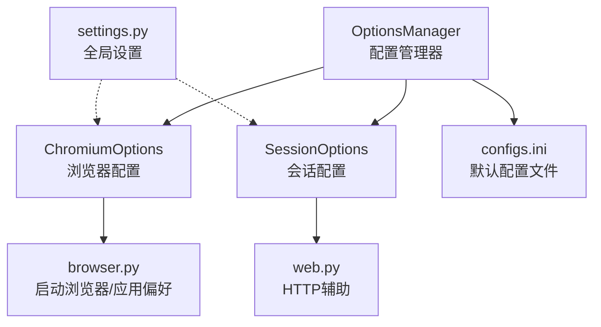
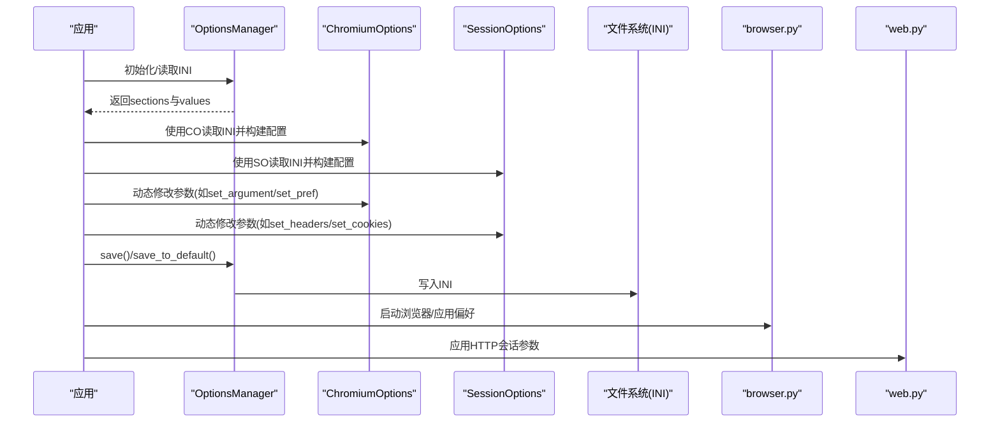
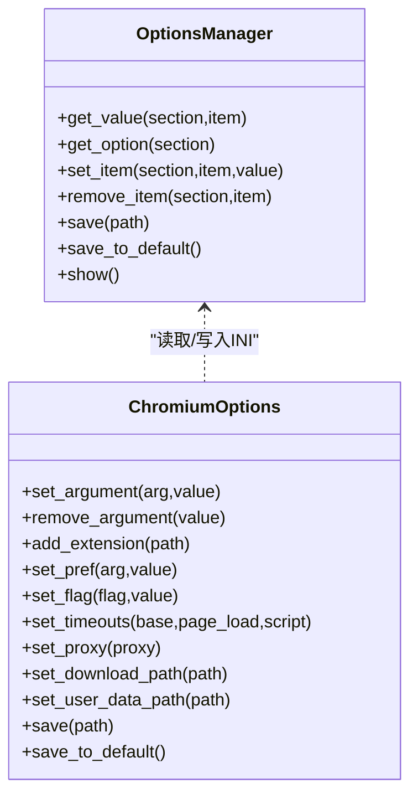
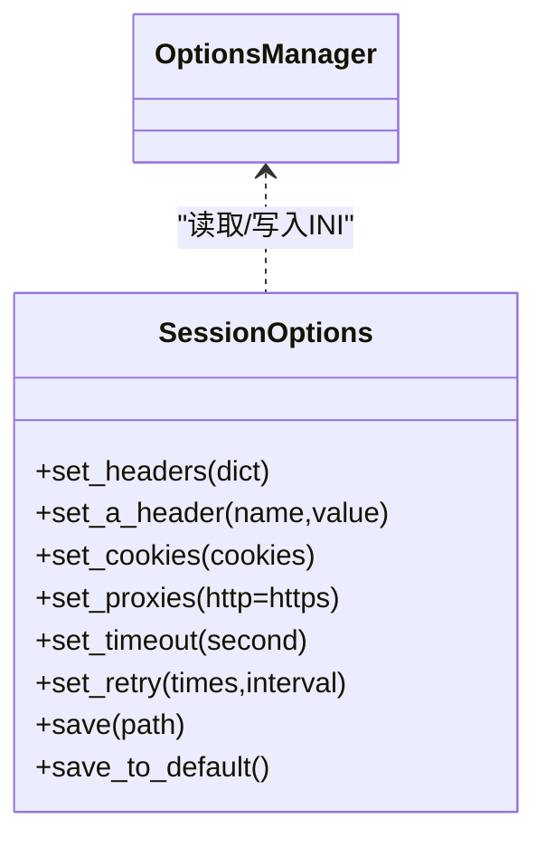
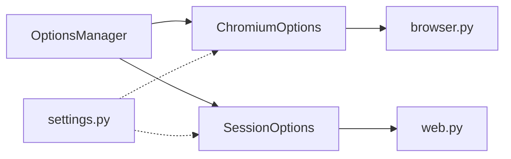

# 运行时配置

<cite>
**本文引用的文件**
- [options_manage.py](file://DrissionPage/_configs/options_manage.py)
- [chromium_options.py](file://DrissionPage/_configs/chromium_options.py)
- [session_options.py](file://DrissionPage/_configs/session_options.py)
- [configs.ini](file://DrissionPage/_configs/configs.ini)
- [settings.py](file://DrissionPage/_functions/settings.py)
- [web.py](file://DrissionPage/_functions/web.py)
- [browser.py](file://DrissionPage/_functions/browser.py)
- [__init__.py](file://DrissionPage/__init__.py)
- [texts.py](file://DrissionPage/_functions/texts.py)
</cite>

## 目录
1. [简介](#简介)
2. [项目结构](#项目结构)
3. [核心组件](#核心组件)
4. [架构总览](#架构总览)
5. [详细组件分析](#详细组件分析)
6. [依赖关系分析](#依赖关系分析)
7. [性能考量](#性能考量)
8. [故障排查指南](#故障排查指南)
9. [结论](#结论)
10. [附录](#附录)

## 简介
本章节系统性阐述 DrissionPage 的“运行时配置管理”。重点涵盖：
- 如何在程序运行过程中动态修改配置（含实时生效机制、影响范围、同步策略）
- 环境变量的使用方法（如何通过环境变量覆盖默认配置）
- 配置的保存与恢复（序列化、反序列化、备份与恢复）
- 最佳实践（热更新、配置监控、配置审计）

## 项目结构
DrissionPage 的配置体系围绕三个核心模块展开：
- 配置管理器：统一读取、写入、展示配置
- 浏览器配置：ChromiumOptions，封装浏览器启动参数、偏好、代理、超时等
- 会话配置：SessionOptions，封装 HTTP 会话头、Cookie、代理、超时等

图表来源
- [options_manage.py:15-143](file://DrissionPage/_configs/options_manage.py#L15-L143)
- [chromium_options.py:16-417](file://DrissionPage/_configs/chromium_options.py#L16-L417)
- [session_options.py:20-372](file://DrissionPage/_configs/session_options.py#L20-L372)
- [configs.ini:1-34](file://DrissionPage/_configs/configs.ini#L1-L34)
- [browser.py:24-200](file://DrissionPage/_functions/browser.py#L24-L200)
- [web.py:1-200](file://DrissionPage/_functions/web.py#L1-L200)
- [settings.py:13-69](file://DrissionPage/_functions/settings.py#L13-L69)

章节来源
- [__init__.py:22-29](file://DrissionPage/__init__.py#L22-L29)
- [options_manage.py:15-143](file://DrissionPage/_configs/options_manage.py#L15-L143)
- [chromium_options.py:16-417](file://DrissionPage/_configs/chromium_options.py#L16-L417)
- [session_options.py:20-372](file://DrissionPage/_configs/session_options.py#L20-L372)
- [configs.ini:1-34](file://DrissionPage/_configs/configs.ini#L1-L34)

## 核心组件
- OptionsManager：INI 文件的读取、写入、节与键的增删改查、默认配置生成、保存与展示
- ChromiumOptions：浏览器启动参数、用户数据目录、扩展、偏好、标志位、代理、超时、重试次数等
- SessionOptions：HTTP 会话头、Cookie、认证、参数、证书、代理、超时、重试等
- settings.Settings：全局运行时设置（如 CDP 超时、浏览器连接超时、语言等），可被上述两类配置间接影响

章节来源
- [options_manage.py:15-143](file://DrissionPage/_configs/options_manage.py#L15-L143)
- [chromium_options.py:16-417](file://DrissionPage/_configs/chromium_options.py#L16-L417)
- [session_options.py:20-372](file://DrissionPage/_configs/session_options.py#L20-L372)
- [settings.py:13-69](file://DrissionPage/_functions/settings.py#L13-L69)

## 架构总览
运行时配置的读取与写入流程如下：

图表来源
- [options_manage.py:15-143](file://DrissionPage/_configs/options_manage.py#L15-L143)
- [chromium_options.py:16-417](file://DrissionPage/_configs/chromium_options.py#L16-L417)
- [session_options.py:20-372](file://DrissionPage/_configs/session_options.py#L20-L372)
- [browser.py:24-200](file://DrissionPage/_functions/browser.py#L24-L200)
- [web.py:1-200](file://DrissionPage/_functions/web.py#L1-L200)

## 详细组件分析

### OptionsManager：配置读写与持久化
- 初始化逻辑
  - 支持三种路径策略：显式路径、默认路径、禁用文件（path=False）
  - 若文件不存在，自动创建默认节与默认值
- 读取接口
  - get_value：按节与键读取值，支持字符串表达式求值
  - get_option：按节返回字典
  - __getattr__：支持以属性方式访问节级配置
- 写入与删除
  - set_item：写入键值；同时清理内部缓存标记，确保后续读取实时生效
  - remove_item：删除键
- 保存与恢复
  - save/save_to_default：保存到指定路径或默认路径；自动创建目录；输出保存提示
  - show：打印所有节与键值
- 实时生效机制
  - set_item 后立即更新内存中的 RawConfigParser，并将对应缓存标记置空，避免旧值被误用
  - save 将内存状态落盘，保证重启后可自动加载

章节来源
- [options_manage.py:15-143](file://DrissionPage/_configs/options_manage.py#L15-L143)

### ChromiumOptions：浏览器运行时配置
- 初始化与默认值
  - 从 OptionsManager 读取 paths、chromium_options、proxies、timeouts、others 等
  - 解析 arguments 中的 --headless/--user-data-dir/--profile-directory 等关键参数
- 可变配置
  - set_argument/remove_argument/add_extension/clear_arguments 等
  - set_pref/remove_pref/remove_pref_from_file/clear_prefs 等
  - set_flag/clear_flags/clear_flags_in_file 等
  - set_timeouts/set_user_agent/set_proxy/set_load_mode/set_local_port/set_address/set_browser_path 等
  - set_download_path/set_tmp_path/set_user_data_path/set_cache_path/use_system_user_path/auto_port/existing_only/new_env 等
- 影响范围
  - 与浏览器进程启动参数、用户数据目录、扩展、偏好、标志、代理、超时、重试等强关联
  - 与 browser.py 的 connect_browser/get_launch_args/set_prefs/set_flags 紧密耦合
- 实时生效机制
  - 修改后立即更新内部属性；保存时通过 save 将当前状态写入 INI
  - 对于 prefs/flags，实际写入用户数据目录下的 Preferences/Local State 文件
- 保存与恢复
  - save：将当前属性映射到 INI 的相应节与键，再调用 OM.save
  - save_to_default：保存到默认配置文件

图表来源
- [options_manage.py:15-143](file://DrissionPage/_configs/options_manage.py#L15-L143)
- [chromium_options.py:16-417](file://DrissionPage/_configs/chromium_options.py#L16-L417)

章节来源
- [chromium_options.py:16-417](file://DrissionPage/_configs/chromium_options.py#L16-L417)
- [browser.py:24-200](file://DrissionPage/_functions/browser.py#L24-L200)

### SessionOptions：HTTP 会话运行时配置
- 初始化与默认值
  - 从 OptionsManager 读取 session_options、proxies、timeouts、paths、others 等
  - 支持 headers、cookies、auth、params、verify、cert、stream、trust_env、max_redirects 等
- 可变配置
  - set_headers/set_a_header/remove_a_header/clear_headers
  - set_cookies
  - set_auth/set_proxies/set_params/set_verify/set_cert/add_adapter/set_stream/set_trust_env/set_max_redirects
  - set_timeout/set_download_path/set_retry
- 影响范围
  - 与 requests.Session 的行为强关联；保存时将当前状态写入 INI
- 实时生效机制
  - 修改后立即更新内部属性；保存时通过 save 将当前状态写入 INI
- 保存与恢复
  - save：将当前属性映射到 INI 的相应节与键，再调用 OM.save
  - save_to_default：保存到默认配置文件

图表来源
- [options_manage.py:15-143](file://DrissionPage/_configs/options_manage.py#L15-L143)
- [session_options.py:20-372](file://DrissionPage/_configs/session_options.py#L20-L372)

章节来源
- [session_options.py:20-372](file://DrissionPage/_configs/session_options.py#L20-L372)
- [web.py:1-200](file://DrissionPage/_functions/web.py#L1-L200)

### 配置文件与默认值
- 默认配置文件：configs.ini，包含 paths、chromium_options、session_options、timeouts、proxies、others 等节
- OptionsManager 在文件不存在时自动生成默认节与默认值，确保首次使用无需手工准备

章节来源
- [configs.ini:1-34](file://DrissionPage/_configs/configs.ini#L1-L34)
- [options_manage.py:34-78](file://DrissionPage/_configs/options_manage.py#L34-L78)

## 依赖关系分析
- OptionsManager 作为底层配置读写层，被 ChromiumOptions 与 SessionOptions 依赖
- ChromiumOptions 与 browser.py 紧密耦合，负责将配置应用到浏览器进程与用户数据目录
- SessionOptions 与 web.py 紧密耦合，负责将配置应用到 HTTP 会话
- settings.Settings 提供全局运行时设置，影响超时、语言等行为

图表来源
- [options_manage.py:15-143](file://DrissionPage/_configs/options_manage.py#L15-L143)
- [chromium_options.py:16-417](file://DrissionPage/_configs/chromium_options.py#L16-L417)
- [session_options.py:20-372](file://DrissionPage/_configs/session_options.py#L20-L372)
- [browser.py:24-200](file://DrissionPage/_functions/browser.py#L24-L200)
- [web.py:1-200](file://DrissionPage/_functions/web.py#L1-L200)
- [settings.py:13-69](file://DrissionPage/_functions/settings.py#L13-L69)

章节来源
- [options_manage.py:15-143](file://DrissionPage/_configs/options_manage.py#L15-L143)
- [chromium_options.py:16-417](file://DrissionPage/_configs/chromium_options.py#L16-L417)
- [session_options.py:20-372](file://DrissionPage/_configs/session_options.py#L20-L372)
- [browser.py:24-200](file://DrissionPage/_functions/browser.py#L24-L200)
- [web.py:1-200](file://DrissionPage/_functions/web.py#L1-L200)
- [settings.py:13-69](file://DrissionPage/_functions/settings.py#L13-L69)

## 性能考量
- INI 读写成本低，适合频繁保存/恢复场景
- ChromiumOptions 的 prefs/flags 写入用户数据目录涉及磁盘 IO，建议批量修改后再保存
- SessionOptions 的 headers/cookies 等在每次请求前读取，建议集中配置后一次性保存
- 超时与重试参数直接影响网络与浏览器交互的稳定性，应结合业务场景合理设置

## 故障排查指南
- INI 文件未设置
  - 症状：保存时报错提示 INI 未设置
  - 排查：确认 OptionsManager 的 ini_path 是否为 None 或 False
  - 处理：显式传入路径或使用 save_to_default
- 浏览器连接失败
  - 症状：connect_browser 抛出连接错误
  - 排查：检查 address/port、is_existing_only、is_auto_port、user-data-dir 等
  - 处理：调整端口、用户数据目录或禁用 existing_only
- 代理设置问题
  - 症状：HTTP 请求失败或代理不生效
  - 排查：确认 SessionOptions 的 proxies 与 ChromiumOptions 的 proxy
  - 处理：统一使用 set_proxies 或 set_proxy 并保存
- 偏好与标志未生效
  - 症状：prefs/flags 未反映到浏览器
  - 排查：确认 user-data-dir 是否正确、浏览器是否重启
  - 处理：重新启动浏览器或手动写入 Preferences/Local State

章节来源
- [options_manage.py:111-133](file://DrissionPage/_configs/options_manage.py#L111-L133)
- [browser.py:24-200](file://DrissionPage/_functions/browser.py#L24-L200)
- [chromium_options.py:293-296](file://DrissionPage/_configs/chromium_options.py#L293-L296)
- [session_options.py:115-117](file://DrissionPage/_configs/session_options.py#L115-L117)

## 结论
DrissionPage 的运行时配置管理以 OptionsManager 为核心，向上为 ChromiumOptions 与 SessionOptions 提供统一的读写能力。通过 set_item 的即时写入与 save 的持久化，实现了“运行时修改—立即生效—持久化”的闭环。结合 browser.py 与 web.py 的集成，配置可作用于浏览器进程与 HTTP 会话，满足复杂自动化场景的需求。建议在生产环境中配合“批量修改—统一保存—重启生效”的策略，确保一致性与稳定性。

## 附录

### 环境变量使用方法
- 当前仓库未发现直接读取环境变量覆盖配置的实现
- 浏览器路径与系统用户数据目录等逻辑依赖系统环境变量（如 LOCALAPPDATA、PROGRAMFILES、PATH 等），用于定位浏览器可执行文件与用户数据目录
- 若需通过环境变量控制配置，可在应用层读取环境变量后调用 OptionsManager.set_item 或配置对象的 setter 方法进行覆盖

章节来源
- [browser.py:8-21](file://DrissionPage/_functions/browser.py#L8-L21)
- [browser.py:295-329](file://DrissionPage/_functions/browser.py#L295-L329)
- [browser.py:362-421](file://DrissionPage/_functions/browser.py#L362-L421)

### 配置保存与恢复
- 保存
  - OptionsManager.save：将当前内存状态写入 INI 文件
  - ChromiumOptions.save/SessionOptions.save：将对象当前状态映射到 INI 并调用 OM.save
- 恢复
  - 通过重新实例化 OptionsManager/ChromiumOptions/SessionOptions 即可从 INI 加载最新配置
- 备份与恢复
  - 建议在重要变更前复制 INI 文件作为备份，变更后根据需要回滚

章节来源
- [options_manage.py:111-133](file://DrissionPage/_configs/options_manage.py#L111-L133)
- [chromium_options.py:364-408](file://DrissionPage/_configs/chromium_options.py#L364-L408)
- [session_options.py:268-313](file://DrissionPage/_configs/session_options.py#L268-L313)

### 运行时配置最佳实践
- 热更新
  - 对于高频变更的参数（如 headers、timeouts、retry_times），建议集中修改后一次性保存
  - 对于浏览器偏好与标志，建议在重启浏览器后生效
- 配置监控
  - 定期调用 OptionsManager.show 打印当前配置，便于审计
  - 对关键参数（如 proxy、address、user-data-dir）建立变更记录
- 配置审计
  - 保存前记录变更摘要（变更前后对比），必要时保留历史 INI 版本
  - 使用日志记录 save 的输出路径，便于追踪

章节来源
- [options_manage.py:138-142](file://DrissionPage/_configs/options_manage.py#L138-L142)
- [texts.py:192-195](file://DrissionPage/_functions/texts.py#L192-L195)