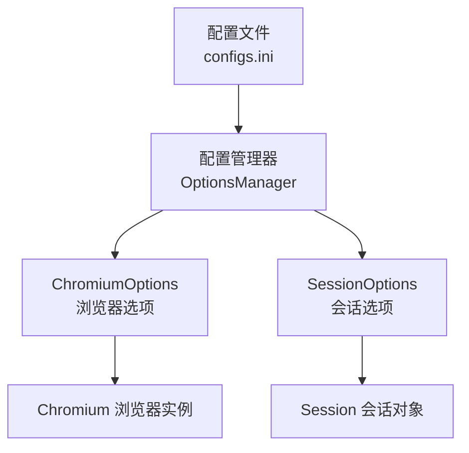
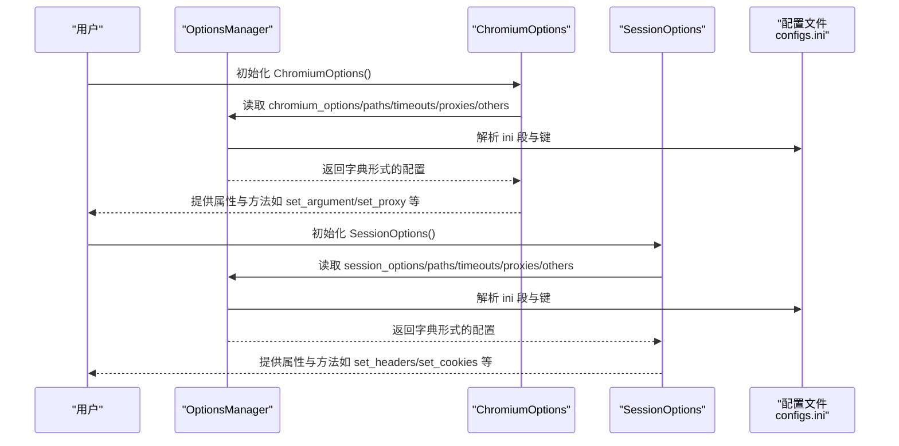
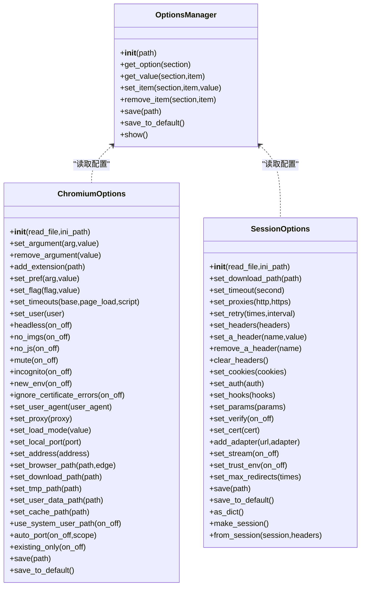
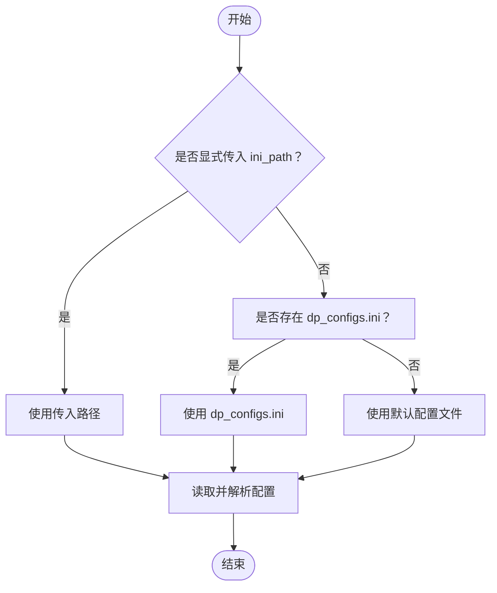

# 配置文件管理

<cite>
**本文引用的文件列表**
- [configs.ini](file://DrissionPage/_configs/configs.ini)
- [options_manage.py](file://DrissionPage/_configs/options_manage.py)
- [chromium_options.py](file://DrissionPage/_configs/chromium_options.py)
- [session_options.py](file://DrissionPage/_configs/session_options.py)
- [chromium.py](file://DrissionPage/_browsers/chromium.py)
- [settings.py](file://DrissionPage/_functions/settings.py)
</cite>

## 目录
1. [简介](#简介)
2. [项目结构](#项目结构)
3. [核心组件](#核心组件)
4. [架构总览](#架构总览)
5. [详细组件分析](#详细组件分析)
6. [依赖关系分析](#依赖关系分析)
7. [性能考量](#性能考量)
8. [故障排查指南](#故障排查指南)
9. [结论](#结论)
10. [附录](#附录)

## 简介
本章节系统性阐述 DrissionPage 的配置文件系统，重点围绕配置文件 configs.ini 的结构与各配置段的作用，解释配置的读取优先级、默认值处理与覆盖机制，并给出创建自定义配置文件的方法、格式规范与校验规则。同时提供开发、生产、测试等不同环境下的常用配置模板与示例，帮助用户在不同场景下快速落地。

## 项目结构
DrissionPage 的配置文件系统位于 _configs 目录，包含默认配置文件 configs.ini 以及配置管理与选项类：
- 默认配置文件：configs.ini
- 配置管理器：OptionsManager（负责读取、解析、保存配置）
- 浏览器选项：ChromiumOptions（读取 chromium_options、paths、timeouts、proxies、others）
- 会话选项：SessionOptions（读取 session_options、paths、timeouts、proxies、others）

图表来源
- [configs.ini:1-34](file://DrissionPage/_configs/configs.ini#L1-L34)
- [options_manage.py:15-143](file://DrissionPage/_configs/options_manage.py#L15-L143)
- [chromium_options.py:16-85](file://DrissionPage/_configs/chromium_options.py#L16-L85)
- [session_options.py:20-88](file://DrissionPage/_configs/session_options.py#L20-L88)
- [chromium.py:33-127](file://DrissionPage/_browsers/chromium.py#L33-L127)

章节来源
- [configs.ini:1-34](file://DrissionPage/_configs/configs.ini#L1-L34)
- [options_manage.py:15-143](file://DrissionPage/_configs/options_manage.py#L15-L143)

## 核心组件
- 配置文件结构与段落
  - [paths]：下载目录与临时目录
  - [chromium_options]：Chromium 启动参数、浏览器路径、扩展、偏好设置、标志位、加载模式、用户配置、端口策略、用户数据路径策略、仅连接现有实例、新环境启动等
  - [session_options]：HTTP 请求头、Cookie、认证、参数、证书校验、证书、流式传输、信任环境、最大重定向次数等
  - [timeouts]：基础超时、页面加载超时、脚本执行超时
  - [proxies]：HTTP 代理、HTTPS 代理
  - [others]：重试次数、重试间隔
- 配置读取与默认值
  - OptionsManager 负责解析 ini 文件，若文件不存在则创建默认配置段与默认值
  - ChromiumOptions 与 SessionOptions 从 OptionsManager 中读取对应段落的键值
- 配置保存与覆盖
  - 支持将当前运行时配置写回 ini 文件，覆盖原值或新增缺失项
  - 支持保存到默认路径或自定义路径

章节来源
- [configs.ini:1-34](file://DrissionPage/_configs/configs.ini#L1-L34)
- [options_manage.py:15-143](file://DrissionPage/_configs/options_manage.py#L15-L143)
- [chromium_options.py:16-85](file://DrissionPage/_configs/chromium_options.py#L16-L85)
- [session_options.py:20-88](file://DrissionPage/_configs/session_options.py#L20-L88)

## 架构总览
配置系统采用“配置文件 + 管理器 + 选项类”的分层设计：
- 配置文件提供静态默认值与用户自定义值
- OptionsManager 提供统一的读取、解析、保存能力
- ChromiumOptions/SessionOptions 将配置映射为运行时可用的属性与方法

图表来源
- [options_manage.py:15-143](file://DrissionPage/_configs/options_manage.py#L15-L143)
- [chromium_options.py:16-85](file://DrissionPage/_configs/chromium_options.py#L16-L85)
- [session_options.py:20-88](file://DrissionPage/_configs/session_options.py#L20-L88)
- [configs.ini:1-34](file://DrissionPage/_configs/configs.ini#L1-L34)

## 详细组件分析

### 配置文件结构与段落详解
- [paths]
  - download_path：下载目录，默认为空字符串（表示使用当前工作目录）
  - tmp_path：临时目录，默认为空字符串（表示使用系统默认）
- [chromium_options]
  - address：调试地址（如 127.0.0.1:9222），用于连接已存在的 Chromium 实例
  - browser_path：浏览器可执行文件路径或名称（默认 chrome）
  - arguments：启动参数列表（默认包含若干禁用项与 UI 优化项）
  - extensions：扩展插件路径列表（默认空）
  - prefs：浏览器偏好设置（默认包含弹窗与通知等设置）
  - flags：标志位集合（默认空）
  - load_mode：页面加载策略（normal/eager/none）
  - user：用户配置文件目录（默认 Default）
  - auto_port：是否自动选择端口（布尔）
  - system_user_path：是否使用系统用户路径（布尔）
  - existing_only：仅连接现有实例（布尔）
  - new_env：是否以新环境启动（布尔）
- [session_options]
  - headers：请求头字典（默认包含 UA、Accept、Connection、字符集等）
- [timeouts]
  - base：基础超时（秒）
  - page_load：页面加载超时（秒）
  - script：脚本执行超时（秒）
- [proxies]
  - http：HTTP 代理地址
  - https：HTTPS 代理地址
- [others]
  - retry_times：重试次数（默认 3）
  - retry_interval：重试间隔（秒，默认 2）

章节来源
- [configs.ini:1-34](file://DrissionPage/_configs/configs.ini#L1-L34)

### 配置读取优先级与默认值处理
- 读取顺序
  - 若显式传入 ini_path，则优先使用该路径
  - 若 ini_path 为 None 或未传入，则尝试查找当前工作目录下的 dp_configs.ini；若不存在则使用默认配置文件路径
  - 若 ini_path 为 False，则不读取配置文件，直接使用默认值
- 默认值处理
  - 当配置文件不存在时，OptionsManager 会创建所有配置段并填充默认值
  - 对于复杂类型（如列表、字典），默认值以字符串形式存储，读取时通过 eval 进行转换
- 配置覆盖机制
  - 读取时按段落逐项覆盖默认值
  - 写回时仅写入当前运行时的值，不会删除文件中其他未涉及的键

章节来源
- [options_manage.py:15-143](file://DrissionPage/_configs/options_manage.py#L15-L143)
- [chromium_options.py:16-85](file://DrissionPage/_configs/chromium_options.py#L16-L85)
- [session_options.py:20-88](file://DrissionPage/_configs/session_options.py#L20-L88)

### 配置项验证规则
- load_mode 仅允许值为 normal、eager、none，否则抛出错误
- 代理地址解析后会提取 URL、用户名、密码，确保参数正确传递给浏览器启动参数
- 路径类配置（download_path、tmp_path）在读取时进行规范化处理，避免 None 导致异常

章节来源
- [chromium_options.py:298-303](file://DrissionPage/_configs/chromium_options.py#L298-L303)
- [chromium_options.py:293-296](file://DrissionPage/_configs/chromium_options.py#L293-L296)

### 创建自定义配置文件与格式规范
- 自定义配置文件命名建议：dp_configs.ini（位于项目根目录）
- 配置文件格式：标准 ini 格式，支持分节与键值对
- 建议遵循的命名与分节：与默认配置一致（paths、chromium_options、session_options、timeouts、proxies、others）
- 复杂类型写法：列表与字典应使用 Python 字面量字符串形式（如 arguments、prefs、headers 等），以便 OptionsManager 正确解析
- 保存与覆盖：通过 OptionsManager 或选项类的 save 方法将当前运行时配置写回文件，实现持久化

章节来源
- [options_manage.py:111-133](file://DrissionPage/_configs/options_manage.py#L111-L133)
- [chromium_options.py:364-408](file://DrissionPage/_configs/chromium_options.py#L364-L408)
- [session_options.py:268-313](file://DrissionPage/_configs/session_options.py#L268-L313)

### 常用配置模板与示例
以下为不同环境的配置模板与要点说明（请根据实际需求调整具体值）：
- 开发环境
  - 使用本地浏览器路径与调试端口
  - 可启用无头模式或保留 UI 以便调试
  - 设置较短的超时时间，便于快速反馈
  - 可配置代理用于测试网络行为
- 生产环境
  - 使用稳定版本浏览器路径
  - 关闭不必要的 UI 与日志输出
  - 设置合理的超时与重试策略
  - 明确下载目录与临时目录，避免权限问题
- 测试环境
  - 可启用无头模式与最小化 UI
  - 配置稳定的代理与 Cookie，保证测试一致性
  - 设置较长的超时与重试，降低偶发失败影响

章节来源
- [configs.ini:1-34](file://DrissionPage/_configs/configs.ini#L1-L34)
- [chromium_options.py:261-281](file://DrissionPage/_configs/chromium_options.py#L261-L281)
- [session_options.py:105-107](file://DrissionPage/_configs/session_options.py#L105-L107)

## 依赖关系分析
- OptionsManager 依赖 configparser.RawConfigParser 读取 ini 文件，依赖 pathlib.Path 处理路径
- ChromiumOptions 与 SessionOptions 依赖 OptionsManager 获取配置，并将配置映射为运行时属性与方法
- Chromium 类在初始化时读取 ChromiumOptions 的 timeouts、load_mode、download_path、retry_times、retry_interval 等属性

图表来源
- [options_manage.py:15-143](file://DrissionPage/_configs/options_manage.py#L15-L143)
- [chromium_options.py:16-417](file://DrissionPage/_configs/chromium_options.py#L16-L417)
- [session_options.py:20-372](file://DrissionPage/_configs/session_options.py#L20-L372)

章节来源
- [options_manage.py:15-143](file://DrissionPage/_configs/options_manage.py#L15-L143)
- [chromium_options.py:16-417](file://DrissionPage/_configs/chromium_options.py#L16-L417)
- [session_options.py:20-372](file://DrissionPage/_configs/session_options.py#L20-L372)

## 性能考量
- 配置读取开销极小，通常在应用启动阶段一次性完成
- 无头模式与禁用图片/脚本可显著降低资源消耗，适合大规模任务
- 合理设置超时与重试策略，避免长时间阻塞
- 下载与临时目录尽量使用高性能磁盘，减少 IO 影响

## 故障排查指南
- 配置文件找不到
  - 症状：初始化 ChromiumOptions/SessionOptions 抛出文件不存在异常
  - 排查：确认 ini_path 是否正确；检查 dp_configs.ini 是否位于项目根目录
  - 处理：将配置文件放置到正确位置或显式传入 ini_path
- 配置项解析失败
  - 症状：复杂类型（如列表、字典）读取为字符串
  - 排查：确认 ini 中的值是否符合 Python 字面量语法
  - 处理：修正为正确的 Python 字面量字符串
- 代理设置无效
  - 症状：访问受限或无法通过代理
  - 排查：确认 proxies 段中的 http/https 是否填写完整
  - 处理：更新代理地址并重新保存配置
- 超时与重试导致任务卡死
  - 症状：长时间等待或频繁重试
  - 排查：检查 timeouts 与 others 段的数值
  - 处理：根据网络状况调整超时与重试策略

章节来源
- [chromium_options.py:32-35](file://DrissionPage/_configs/chromium_options.py#L32-L35)
- [options_manage.py:82-98](file://DrissionPage/_configs/options_manage.py#L82-L98)
- [session_options.py:115-117](file://DrissionPage/_configs/session_options.py#L115-L117)

## 结论
DrissionPage 的配置文件系统以简洁的 ini 文件为核心，配合 OptionsManager 与选项类实现了灵活的配置读取、默认值注入与持久化保存。通过明确的分节与键名约定、严格的类型解析与必要的校验规则，用户可以在不同环境下快速构建稳定可靠的自动化配置方案。建议在团队内统一配置模板与命名规范，结合 CI/CD 管道实现配置的版本化管理与安全分发。

## 附录
- 配置文件路径解析流程
  - 优先使用显式传入的 ini_path
  - 若为 None，则尝试当前工作目录下的 dp_configs.ini
  - 若仍不存在，则使用默认配置文件路径
  - 若 ini_path 为 False，则不读取配置文件，直接使用默认值

图表来源
- [options_manage.py:16-32](file://DrissionPage/_configs/options_manage.py#L16-L32)