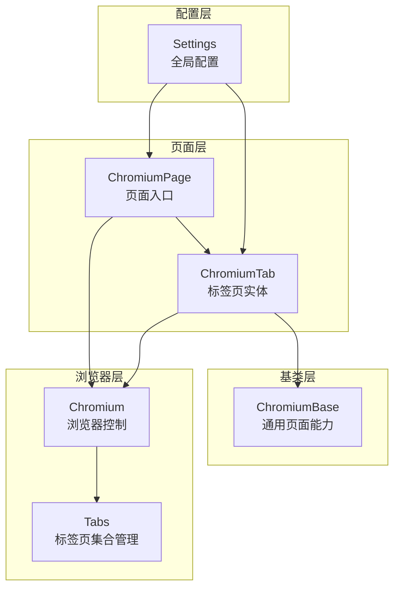
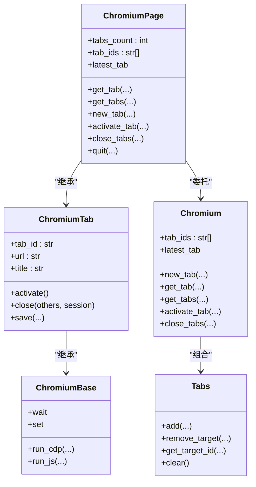
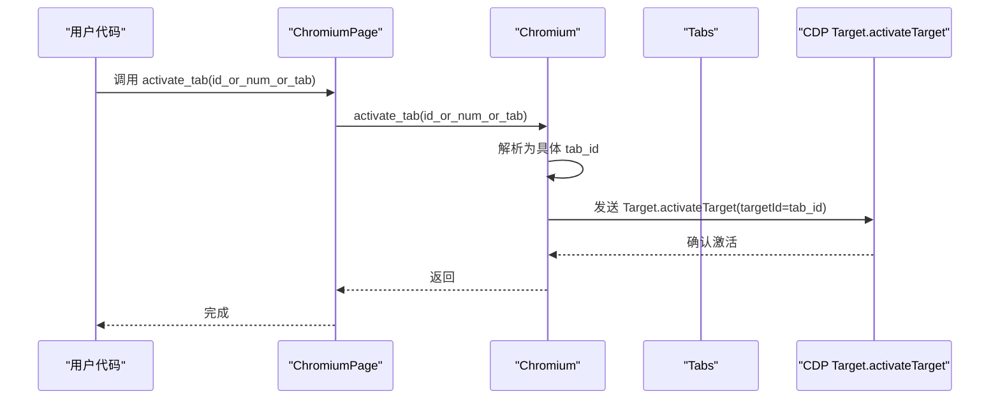
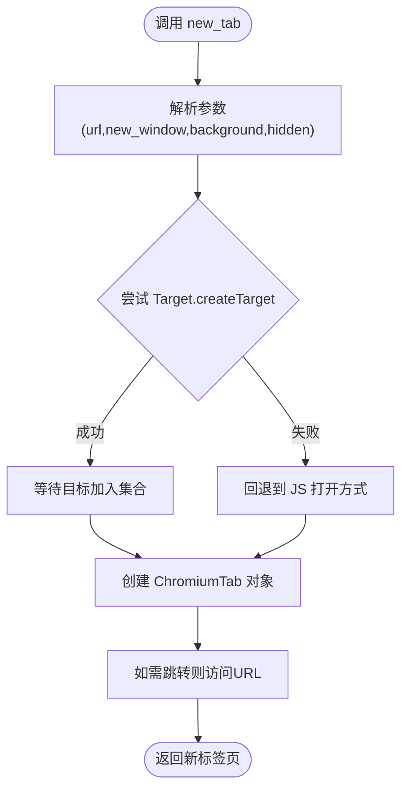
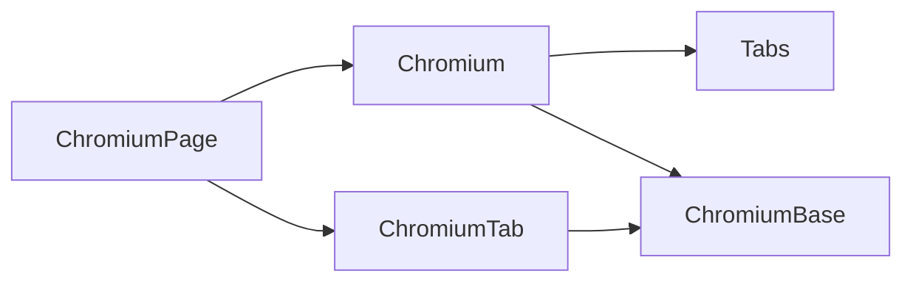

# 标签页管理

<cite>
**本文引用的文件**
- [chromium_page.py](file://DrissionPage/_pages/chromium_page.py)
- [chromium_tab.py](file://DrissionPage/_pages/chromium_tab.py)
- [chromium_base.py](file://DrissionPage/_pages/chromium_base.py)
- [chromium.py](file://DrissionPage/_browsers/chromium.py)
- [settings.py](file://DrissionPage/_functions/settings.py)
</cite>

## 目录
1. [简介](#简介)
2. [项目结构](#项目结构)
3. [核心组件](#核心组件)
4. [架构总览](#架构总览)
5. [详细组件分析](#详细组件分析)
6. [依赖分析](#依赖分析)
7. [性能考量](#性能考量)
8. [故障排查指南](#故障排查指南)
9. [结论](#结论)
10. [附录](#附录)

## 简介
本文件系统化梳理 DrissionPage 中 ChromiumPage 的标签页管理能力，覆盖以下主题：
- 标签页操作：新建、激活、关闭
- 标签页获取：按 ID、标题、URL、类型筛选；批量获取
- 统计与枚举：数量统计、ID 列表
- 切换与并发：切换机制、线程安全、单例对象策略
- 生命周期与资源清理：关闭、退出、会话与下载管理
- 实战场景与最佳实践：多标签页并发操作建议

## 项目结构
围绕标签页管理的关键文件组织如下：
- 页面层：ChromiumPage（页面入口）、ChromiumTab（标签页实体）
- 基类层：ChromiumBase（通用页面能力）
- 浏览器层：Chromium（浏览器控制、标签页集合管理）
- 配置层：Settings（单例标签页对象等行为开关）

图表来源
- [chromium_page.py:17-103](file://DrissionPage/_pages/chromium_page.py#L17-L103)
- [chromium_tab.py:22-47](file://DrissionPage/_pages/chromium_tab.py#L22-L47)
- [chromium_base.py:39-85](file://DrissionPage/_pages/chromium_base.py#L39-L85)
- [chromium.py:33-124](file://DrissionPage/_browsers/chromium.py#L33-L124)
- [settings.py:13-69](file://DrissionPage/_functions/settings.py#L13-L69)

章节来源
- [chromium_page.py:17-103](file://DrissionPage/_pages/chromium_page.py#L17-L103)
- [chromium_tab.py:22-47](file://DrissionPage/_pages/chromium_tab.py#L22-L47)
- [chromium_base.py:39-85](file://DrissionPage/_pages/chromium_base.py#L39-L85)
- [chromium.py:33-124](file://DrissionPage/_browsers/chromium.py#L33-L124)
- [settings.py:13-69](file://DrissionPage/_functions/settings.py#L13-L69)

## 核心组件
- ChromiumPage：页面入口，持有当前标签页实例，提供标签页统计、获取、新建、激活、关闭等便捷属性与方法。
- ChromiumTab：标签页实体，封装 CDP 操作、元素定位、等待、截图等能力，并支持单例对象缓存与线程安全。
- Chromium：浏览器控制中心，负责标签页集合管理、CDP Target 协议交互、上下文与会话维护。
- Tabs：浏览器内部标签页集合容器，维护 session/target 映射、上下文、帧、代理等信息。
- Settings：全局配置，其中 singleton_tab_obj 控制标签页对象是否复用单例。

章节来源
- [chromium_page.py:57-96](file://DrissionPage/_pages/chromium_page.py#L57-L96)
- [chromium_tab.py:22-47](file://DrissionPage/_pages/chromium_tab.py#L22-L47)
- [chromium.py:33-124](file://DrissionPage/_browsers/chromium.py#L33-L124)
- [chromium.py:565-684](file://DrissionPage/_browsers/chromium.py#L565-L684)
- [settings.py:13-69](file://DrissionPage/_functions/settings.py#L13-L69)

## 架构总览
ChromiumPage 通过继承 ChromiumTab，复用其标签页能力，并委托 Chromium 完成底层标签页集合管理与 CDP 交互。Chromium 内部使用 Tabs 维护会话与目标映射，确保多标签页并发场景下的稳定运行。

图表来源
- [chromium_page.py:17-103](file://DrissionPage/_pages/chromium_page.py#L17-L103)
- [chromium_tab.py:22-238](file://DrissionPage/_pages/chromium_tab.py#L22-L238)
- [chromium_base.py:39-85](file://DrissionPage/_pages/chromium_base.py#L39-L85)
- [chromium.py:33-124](file://DrissionPage/_browsers/chromium.py#L33-L124)
- [chromium.py:565-684](file://DrissionPage/_browsers/chromium.py#L565-L684)

## 详细组件分析

### 标签页操作 API
- 新建标签页 new_tab
  - 支持传入 URL、是否新窗口、后台激活、隐藏等参数。
  - 返回新的 ChromiumTab 对象；若未隐藏且成功创建，会等待目标加入集合。
- 激活标签页 activate_tab
  - 接受整数索引（从 1 开始）、字符串 ID 或 ChromiumTab 对象。
  - 将对应标签页设为活动状态。
- 关闭标签页 close_tabs
  - 支持传入单个 ID、ChromiumTab、或列表/元组。
  - 支持 others=True 表示关闭除给定集合外的所有标签页。
  - 若仅剩一个标签页且 others 为真，将直接退出浏览器。

章节来源
- [chromium_page.py:89-96](file://DrissionPage/_pages/chromium_page.py#L89-L96)
- [chromium.py:235-269](file://DrissionPage/_browsers/chromium.py#L235-L269)
- [chromium.py:306-313](file://DrissionPage/_browsers/chromium.py#L306-L313)
- [chromium.py:278-298](file://DrissionPage/_browsers/chromium.py#L278-L298)

### 标签页获取 API
- get_tab
  - 支持按 ID、序号（正负索引）、标题、URL、类型筛选。
  - as_id=True 可直接返回 ID 字符串。
- get_tabs
  - 批量获取，支持标题/URL 模糊匹配与类型过滤。
  - as_id=True 返回 ID 列表。

章节来源
- [chromium_page.py:82-87](file://DrissionPage/_pages/chromium_page.py#L82-L87)
- [chromium.py:271-277](file://DrissionPage/_browsers/chromium.py#L271-L277)
- [chromium.py:394-441](file://DrissionPage/_browsers/chromium.py#L394-L441)

### 统计与枚举
- tabs_count：返回当前上下文下标签页数量。
- tab_ids：返回当前上下文下所有标签页 ID 列表。
- latest_tab：返回最新创建或最近激活的标签页（根据 Settings.singleton_tab_obj 决定返回对象或 ID）。

章节来源
- [chromium_page.py:58-68](file://DrissionPage/_pages/chromium_page.py#L58-L68)
- [chromium.py:186-191](file://DrissionPage/_browsers/chromium.py#L186-L191)
- [chromium.py:394-417](file://DrissionPage/_browsers/chromium.py#L394-L417)

### 切换与并发机制
- 切换流程
  - activate_tab 通过 Target.activateTarget 将目标标签页设为活动。
  - Chromium 内部维护 Tabs，记录 target_id 与 session_id 的映射，确保后续 CDP 请求路由正确。
- 并发与线程安全
  - ChromiumTab.__new__ 使用锁与单例缓存，避免重复创建。
  - Settings.singleton_tab_obj 控制是否复用同一标签页对象，影响多线程共享与一致性。
  - ChromiumPage.__new__ 对浏览器实例进行缓存，避免重复连接。

图表来源
- [chromium_page.py:92-93](file://DrissionPage/_pages/chromium_page.py#L92-L93)
- [chromium.py:306-313](file://DrissionPage/_browsers/chromium.py#L306-L313)

章节来源
- [chromium_tab.py:26-35](file://DrissionPage/_pages/chromium_tab.py#L26-L35)
- [chromium.py:33-52](file://DrissionPage/_browsers/chromium.py#L33-L52)
- [settings.py:17](file://DrissionPage/_functions/settings.py#L17)

### 生命周期与资源清理
- 关闭标签页
  - ChromiumTab.close(others=False)：关闭自身；others=True 时委托浏览器关闭其他标签页。
  - Chromium.close_tabs(...)：批量关闭，支持 others=True。
- 退出浏览器
  - Chromium.quit(...)：停止所有标签页会话、清理 Tabs、关闭浏览器。
- 会话与下载
  - ChromiumPage/ChromiumTab 在断开时清理内部缓存与会话映射，避免资源泄漏。

章节来源
- [chromium_tab.py:213-222](file://DrissionPage/_pages/chromium_tab.py#L213-L222)
- [chromium.py:278-298](file://DrissionPage/_browsers/chromium.py#L278-L298)
- [chromium.py:328-372](file://DrissionPage/_browsers/chromium.py#L328-L372)
- [chromium.py:461-466](file://DrissionPage/_browsers/chromium.py#L461-L466)

### 数据流与处理逻辑
- 标签页创建流程
  - new_tab -> Chromium._new_tab -> Target.createTarget -> 创建 ChromiumTab -> 可选跳转 URL
- 标签页获取流程
  - get_tab/get_tabs -> 查询 Target.getTargets -> 过滤 -> 返回 ID 或对象

图表来源
- [chromium.py:235-269](file://DrissionPage/_browsers/chromium.py#L235-L269)
- [chromium.py:710-719](file://DrissionPage/_browsers/chromium.py#L710-L719)

## 依赖分析
- 组件耦合
  - ChromiumPage 依赖 Chromium 提供标签页集合与 CDP 能力。
  - ChromiumTab 依赖 ChromiumBase 提供 DOM/JS/等待等通用能力。
  - Chromium 内部依赖 Tabs 管理会话与目标映射。
- 外部依赖
  - CDP 协议：Target.*、Page.*、DOM.*、Runtime.* 等。
  - Requests/Session：用于浏览器连接与版本信息获取。
- 循环依赖
  - 无直接循环；ChromiumPage/ChromiumTab 通过组合/继承与 Chromium/Tabs 交互。

图表来源
- [chromium_page.py:17-103](file://DrissionPage/_pages/chromium_page.py#L17-L103)
- [chromium_tab.py:22-238](file://DrissionPage/_pages/chromium_tab.py#L22-L238)
- [chromium_base.py:39-85](file://DrissionPage/_pages/chromium_base.py#L39-L85)
- [chromium.py:33-124](file://DrissionPage/_browsers/chromium.py#L33-L124)
- [chromium.py:565-684](file://DrissionPage/_browsers/chromium.py#L565-L684)

章节来源
- [chromium_page.py:17-103](file://DrissionPage/_pages/chromium_page.py#L17-L103)
- [chromium_tab.py:22-238](file://DrissionPage/_pages/chromium_tab.py#L22-L238)
- [chromium_base.py:39-85](file://DrissionPage/_pages/chromium_base.py#L39-L85)
- [chromium.py:33-124](file://DrissionPage/_browsers/chromium.py#L33-L124)
- [chromium.py:565-684](file://DrissionPage/_browsers/chromium.py#L565-L684)

## 性能考量
- 单例对象策略
  - Settings.singleton_tab_obj=True 时，ChromiumTab 与 ChromiumPage 使用单例缓存，减少对象创建与 CDP 初始化成本。
- 等待与超时
  - ChromiumBase 内部对 CDP/JS 执行设置了超时与重试策略，避免长时间阻塞。
- 并发控制
  - ChromiumTab.__new__ 使用锁，防止多线程同时创建同一标签页对象。
- 资源回收
  - 标签页关闭与浏览器退出时清理会话映射与内部缓存，降低内存占用。

章节来源
- [chromium_tab.py:26-35](file://DrissionPage/_pages/chromium_tab.py#L26-L35)
- [chromium_base.py:100-160](file://DrissionPage/_pages/chromium_base.py#L100-L160)
- [chromium.py:461-466](file://DrissionPage/_browsers/chromium.py#L461-L466)

## 故障排查指南
- 无法找到标签页
  - get_tab/get_tabs 抛出“无此标签页”错误时，检查传入的 ID、序号、标题或 URL 是否正确。
- 激活失败
  - activate_tab 依赖 CDP Target.activateTarget，若浏览器断开或目标不存在，将抛出异常。
- 关闭后仍可见
  - close_tabs(others=True) 会关闭除给定集合外的所有标签页；若仅剩一个标签页，将退出浏览器。
- 并发冲突
  - 多线程同时创建同 ID 标签页对象时，可通过 Settings.singleton_tab_obj 控制是否复用单例。
- 会话泄漏
  - 确保在不再使用时调用 close()/quit()，以清理会话映射与内部缓存。

章节来源
- [chromium.py:394-417](file://DrissionPage/_browsers/chromium.py#L394-L417)
- [chromium.py:306-313](file://DrissionPage/_browsers/chromium.py#L306-L313)
- [chromium.py:278-298](file://DrissionPage/_browsers/chromium.py#L278-L298)
- [chromium_tab.py:213-222](file://DrissionPage/_pages/chromium_tab.py#L213-L222)

## 结论
ChromiumPage 提供了简洁而强大的标签页管理接口，结合 Chromium 的底层 CDP 能力与 Tabs 的集合管理，能够满足从简单到复杂的多标签页操作需求。通过 Settings.singleton_tab_obj 与单例缓存策略，可在保证线程安全的同时提升性能。遵循资源清理与并发控制的最佳实践，可有效避免泄漏与竞态问题。

## 附录

### 实战场景与最佳实践
- 多标签页并发抓取
  - 使用 get_tabs(title=..., url=...) 获取目标集合，遍历执行抓取任务。
  - 注意：每个标签页独立会话，避免跨标签页状态干扰。
- 批量关闭与保留
  - 使用 close_tabs([...], others=True) 保留指定集合，关闭其余标签页。
- 动态切换与等待
  - activate_tab 后使用 wait 或 run_cdp_loaded 等等待页面加载完成。
- 资源清理
  - 任务完成后调用 tab.close() 或 browser.quit()，确保会话与缓存释放。

[本节为概念性总结，无需列出具体文件来源]