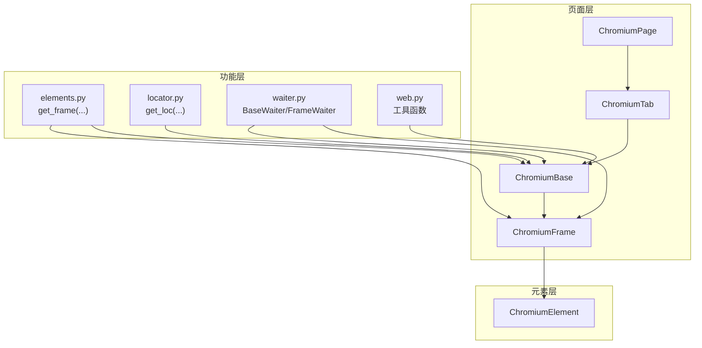
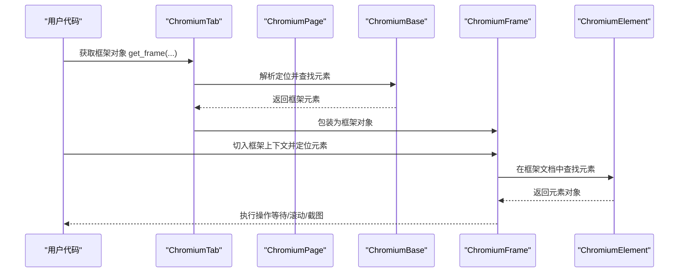
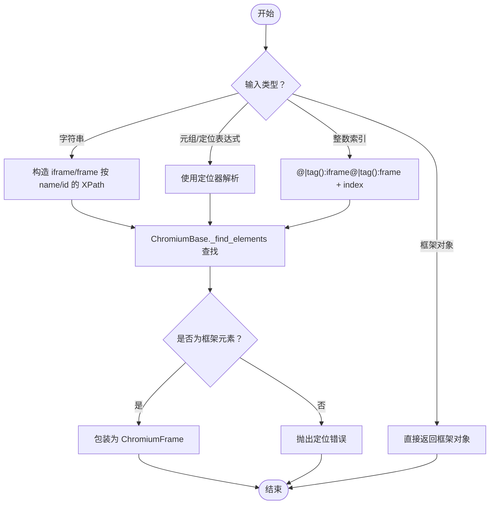
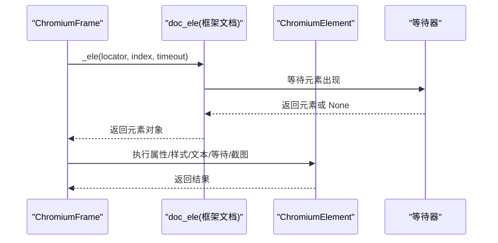
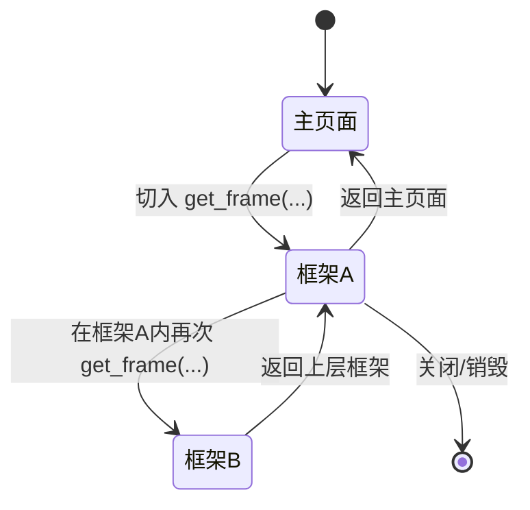
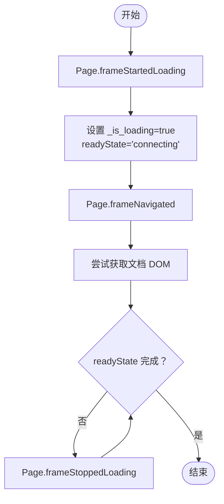
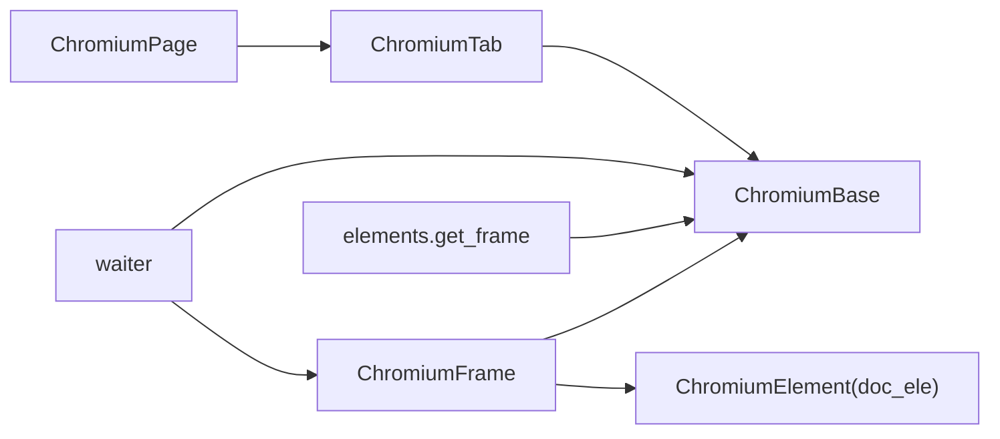

# 框架操作

<cite>
**本文引用的文件**
- [chromium_frame.py](file://DrissionPage/_pages/chromium_frame.py)
- [chromium_base.py](file://DrissionPage/_pages/chromium_base.py)
- [chromium_page.py](file://DrissionPage/_pages/chromium_page.py)
- [chromium_tab.py](file://DrissionPage/_pages/chromium_tab.py)
- [chromium_element.py](file://DrissionPage/_elements/chromium_element.py)
- [elements.py](file://DrissionPage/_functions/elements.py)
- [locator.py](file://DrissionPage/_functions/locator.py)
- [waiter.py](file://DrissionPage/_units/waiter.py)
- [web.py](file://DrissionPage/_functions/web.py)
</cite>

## 目录
1. [简介](#简介)
2. [项目结构](#项目结构)
3. [核心组件](#核心组件)
4. [架构总览](#架构总览)
5. [详细组件分析](#详细组件分析)
6. [依赖分析](#依赖分析)
7. [性能考虑](#性能考虑)
8. [故障排查指南](#故障排查指南)
9. [结论](#结论)
10. [附录](#附录)

## 简介
本篇文档系统化阐述 DrissionPage 在 Chromium 环境下的“框架（iframe/frame）”操作能力，覆盖以下主题：
- 跨框架切换机制：支持按索引、名称、ID、元素定位等多维方式进入目标框架。
- 框架内元素定位与操作：在框架上下文中执行元素查找、等待、交互与截图。
- 主页面与框架上下文切换流程：如何在主页面与框架之间安全切换，避免上下文错乱。
- 框架嵌套场景：多层框架的定位与切换策略及注意事项。
- 加载状态检查与超时处理：基于事件驱动的加载状态机与等待器。
- 实战案例与最佳实践：复杂页面多层框架的典型操作步骤与性能优化建议。

## 项目结构
围绕框架操作的相关模块主要分布在以下文件：
- 页面与框架类：chromium_page.py、chromium_tab.py、chromium_base.py、chromium_frame.py
- 元素与定位：chromium_element.py、elements.py、locator.py
- 等待与超时：waiter.py
- 工具函数：web.py

图表来源
- [chromium_page.py:17-103](file://DrissionPage/_pages/chromium_page.py#L17-L103)
- [chromium_tab.py:22-238](file://DrissionPage/_pages/chromium_tab.py#L22-L238)
- [chromium_base.py:39-921](file://DrissionPage/_pages/chromium_base.py#L39-L921)
- [chromium_frame.py:25-488](file://DrissionPage/_pages/chromium_frame.py#L25-L488)
- [chromium_element.py:38-800](file://DrissionPage/_elements/chromium_element.py#L38-L800)
- [elements.py:305-338](file://DrissionPage/_functions/elements.py#L305-L338)
- [locator.py:96-115](file://DrissionPage/_functions/locator.py#L96-L115)
- [waiter.py:85-433](file://DrissionPage/_units/waiter.py#L85-L433)
- [web.py:109-118](file://DrissionPage/_functions/web.py#L109-L118)

章节来源
- [chromium_page.py:17-103](file://DrissionPage/_pages/chromium_page.py#L17-L103)
- [chromium_tab.py:22-238](file://DrissionPage/_pages/chromium_tab.py#L22-L238)
- [chromium_base.py:39-921](file://DrissionPage/_pages/chromium_base.py#L39-L921)
- [chromium_frame.py:25-488](file://DrissionPage/_pages/chromium_frame.py#L25-L488)
- [chromium_element.py:38-800](file://DrissionPage/_elements/chromium_element.py#L38-L800)
- [elements.py:305-338](file://DrissionPage/_functions/elements.py#L305-L338)
- [locator.py:96-115](file://DrissionPage/_functions/locator.py#L96-L115)
- [waiter.py:85-433](file://DrissionPage/_units/waiter.py#L85-L433)
- [web.py:109-118](file://DrissionPage/_functions/web.py#L109-L118)

## 核心组件
- ChromiumPage：页面入口，继承自 ChromiumTab，提供标签页级操作与上下文管理。
- ChromiumTab：会话/驱动双模式切换（d/s），封装页面导航、Cookie同步、等待器等。
- ChromiumBase：页面/标签的基础能力，负责 CDP 连接、文档获取、事件回调、加载状态机。
- ChromiumFrame：框架对象，封装框架内文档、元素、等待、滚动、截图等能力，并处理框架生命周期事件。
- ChromiumElement：页面/框架内元素对象，提供属性、样式、文本、等待、滚动、截图、输入等能力。
- elements.get_frame：根据多种定位方式获取框架对象。
- waiter.BaseWaiter/FrameWaiter：统一的等待接口，支持文档加载、URL/标题变化、元素状态等。
- locator.get_loc：定位器解析，支持 XPath/CSS/AX 等多种表达式。
- web.location_in_viewport：辅助判断坐标是否在视口内，用于滚动与截图。

章节来源
- [chromium_page.py:17-103](file://DrissionPage/_pages/chromium_page.py#L17-L103)
- [chromium_tab.py:22-238](file://DrissionPage/_pages/chromium_tab.py#L22-L238)
- [chromium_base.py:39-921](file://DrissionPage/_pages/chromium_base.py#L39-L921)
- [chromium_frame.py:25-488](file://DrissionPage/_pages/chromium_frame.py#L25-L488)
- [chromium_element.py:38-800](file://DrissionPage/_elements/chromium_element.py#L38-L800)
- [elements.py:305-338](file://DrissionPage/_functions/elements.py#L305-L338)
- [waiter.py:85-433](file://DrissionPage/_units/waiter.py#L85-L433)
- [locator.py:96-115](file://DrissionPage/_functions/locator.py#L96-L115)
- [web.py:109-118](file://DrissionPage/_functions/web.py#L109-L118)

## 架构总览
DrissionPage 的框架操作建立在 Chromium DevTools Protocol（CDP）之上，通过事件驱动的状态机维护页面/框架的加载与上下文一致性。ChromiumBase 负责初始化 CDP、注册 Page.* 事件回调、维护 readyState 与加载标志；ChromiumFrame 在此基础上为框架提供独立的文档对象与等待器；ChromiumElement 提供元素级操作能力。

图表来源
- [chromium_tab.py:144-154](file://DrissionPage/_pages/chromium_tab.py#L144-L154)
- [chromium_base.py:427-512](file://DrissionPage/_pages/chromium_base.py#L427-L512)
- [chromium_frame.py:620-629](file://DrissionPage/_pages/chromium_frame.py#L620-L629)
- [chromium_element.py:419-435](file://DrissionPage/_elements/chromium_element.py#L419-L435)

## 详细组件分析

### 1) 框架切换机制
- 支持的定位方式
  - 名称/ID：当传入字符串时，若非显式定位表达式，将自动转换为按 name 或 id 查找 iframe/frame 的 XPath。
  - 索引：按 @|tag():iframe@|tag():frame 定位后取第 N 个。
  - 元素定位：传入任意定位表达式，要求定位到的元素类型为框架元素。
  - 直接传入框架对象：若已是框架对象则直接返回。
- 定位实现
  - elements.get_frame 将字符串或元组定位转换为框架元素，并校验类型。
  - ChromiumBase._find_elements 支持 DOM.performSearch 等底层查找，结合等待器确保元素出现。
- 上下文切换
  - 切换后，框架对象内部持有 doc_ele（框架文档根），后续所有元素操作均在该文档上下文中执行。
  - 对于跨域框架，框架对象会切换到对应 frameId 并等待加载完成。

图表来源
- [elements.py:305-338](file://DrissionPage/_functions/elements.py#L305-L338)
- [chromium_base.py:427-512](file://DrissionPage/_pages/chromium_base.py#L427-L512)
- [chromium_frame.py:620-629](file://DrissionPage/_pages/chromium_frame.py#L620-L629)

章节来源
- [elements.py:305-338](file://DrissionPage/_functions/elements.py#L305-L338)
- [chromium_base.py:427-512](file://DrissionPage/_pages/chromium_base.py#L427-L512)
- [chromium_frame.py:620-629](file://DrissionPage/_pages/chromium_frame.py#L620-L629)

### 2) 框架内元素定位与操作
- 定位
  - 在框架内定位时，ChromiumFrame 内部使用 doc_ele（框架文档根）作为起点，调用 _ele 执行 DOM.performSearch。
  - 若发生上下文丢失（ContextLostError），框架内部会重试并刷新上下文，保证稳定性。
- 操作
  - 元素属性/样式/文本：通过 ChromiumElement 的属性访问与 JS 访问。
  - 等待：使用 ElementWaiter/FrameWaiter 等待元素显示、隐藏、可点击、停止移动等。
  - 截图：ChromiumFrame 提供针对框架内元素的截图逻辑，结合视口与边框偏移计算精确区域。
- 注意事项
  - 跨域框架需等待加载完成，否则可能无法获取文档对象。
  - 框架内滚动需先将元素滚动至可视区域，再进行截图或交互。

图表来源
- [chromium_frame.py:473-484](file://DrissionPage/_pages/chromium_frame.py#L473-L484)
- [chromium_element.py:419-435](file://DrissionPage/_elements/chromium_element.py#L419-L435)
- [waiter.py:289-409](file://DrissionPage/_units/waiter.py#L289-L409)

章节来源
- [chromium_frame.py:473-484](file://DrissionPage/_pages/chromium_frame.py#L473-L484)
- [chromium_element.py:419-435](file://DrissionPage/_elements/chromium_element.py#L419-L435)
- [waiter.py:289-409](file://DrissionPage/_units/waiter.py#L289-L409)

### 3) 主页面与框架上下文切换
- 切换流程
  - 从主页面切换到框架：ChromiumFrame 初始化时根据是否同域决定使用 target_id 或 frameId，并建立 doc_ele。
  - 从框架回到主页面：直接使用主页面对象（ChromiumBase）即可，无需额外切换。
- 生命周期事件
  - Page.frameDetached：检测到框架移除或类型变更（同域/异域互换）时，触发重新加载或停止消息通道。
  - Page.frameNavigated/Page.loadEventFired：维护 readyState 与文档获取标志，确保后续操作在文档就绪后执行。

图表来源
- [chromium_frame.py:190-202](file://DrissionPage/_pages/chromium_frame.py#L190-L202)
- [chromium_base.py:162-206](file://DrissionPage/_pages/chromium_base.py#L162-L206)

章节来源
- [chromium_frame.py:190-202](file://DrissionPage/_pages/chromium_frame.py#L190-L202)
- [chromium_base.py:162-206](file://DrissionPage/_pages/chromium_base.py#L162-L206)

### 4) 框架嵌套场景与策略
- 多层嵌套定位
  - 逐层切入：先定位外层框架，再在其内部定位内层框架，直至达到目标。
  - 使用层级定位：结合 XPath 的 ancestor/descendant 轴，或在框架内使用相对定位。
- 注意事项
  - 跨域框架切换成本较高，尽量减少不必要的切换。
  - 每次切入框架后，优先调用 wait.doc_loaded() 等待文档就绪。
  - 截图前确保元素可见并滚动至视口中心，避免截取到空白区域。

章节来源
- [chromium_frame.py:375-389](file://DrissionPage/_pages/chromium_frame.py#L375-L389)
- [chromium_element.py:527-545](file://DrissionPage/_elements/chromium_element.py#L527-L545)

### 5) 加载状态检查与超时处理
- 加载状态机
  - ChromiumBase 维护 readyState（connecting/loading/interactive/complete）与 _is_loading 标志，通过 Page.* 事件更新。
  - _wait_loaded 根据 load_mode（none/eager/normal）与超时控制加载行为。
- 等待器
  - BaseWaiter/doc_loaded/load_start/url_change/title_change：统一等待接口。
  - FrameWaiter：在框架上下文中等待框架文档就绪。
- 超时策略
  - 使用 timeouts.page_load/script/base 控制等待时间。
  - 发生超时可选择抛出异常或返回 False，由调用方决定。

图表来源
- [chromium_base.py:168-206](file://DrissionPage/_pages/chromium_base.py#L168-L206)
- [chromium_base.py:745-761](file://DrissionPage/_pages/chromium_base.py#L745-L761)
- [waiter.py:164-234](file://DrissionPage/_units/waiter.py#L164-L234)

章节来源
- [chromium_base.py:168-206](file://DrissionPage/_pages/chromium_base.py#L168-L206)
- [chromium_base.py:745-761](file://DrissionPage/_pages/chromium_base.py#L745-L761)
- [waiter.py:164-234](file://DrissionPage/_units/waiter.py#L164-L234)

### 6) 实战案例与最佳实践
- 场景一：按名称/ID 切入 iframe 并填写表单
  - 步骤：get_frame("name=frm") 或 get_frame("id=myframe") → ele("id=username") → 输入文本 → ele("id=submit").click()
  - 最佳实践：切入前先 wait.doc_loaded()，输入前 focus()，提交后 wait.load_start()。
- 场景二：多层嵌套 iframe 中定位按钮
  - 步骤：外层 get_frame(...) → 内层 get_frame(...) → ele("css=button.login")
  - 最佳实践：每层都调用 wait.doc_loaded()，截图前先 scroll.to_see(center=True)。
- 场景三：跨域 iframe 截图
  - 步骤：frame.get_screenshot(..., ele=目标元素)，内部自动处理边框与视口偏移。
  - 最佳实践：确保元素可见，必要时先触发滚动与等待。

章节来源
- [chromium_frame.py:402-471](file://DrissionPage/_pages/chromium_frame.py#L402-L471)
- [chromium_element.py:527-545](file://DrissionPage/_elements/chromium_element.py#L527-L545)

## 依赖分析
- 组件耦合
  - ChromiumFrame 依赖 ChromiumBase 的 CDP 会话与事件回调，依赖 ChromiumElement 作为框架文档根。
  - ChromiumTab/ChromiumPage 通过 get_frame 调用 elements.get_frame，再委托 ChromiumBase 完成定位。
  - waiter 提供统一等待接口，贯穿页面、框架与元素三层。
- 外部依赖
  - 依赖 CDP 事件 Page.*、DOM.*、Runtime.* 等，确保加载状态与元素定位的准确性。
  - 依赖 settings/timeouts 控制等待与超时行为。

图表来源
- [chromium_frame.py:25-488](file://DrissionPage/_pages/chromium_frame.py#L25-L488)
- [chromium_base.py:39-921](file://DrissionPage/_pages/chromium_base.py#L39-L921)
- [chromium_tab.py:22-238](file://DrissionPage/_pages/chromium_tab.py#L22-L238)
- [chromium_page.py:17-103](file://DrissionPage/_pages/chromium_page.py#L17-L103)
- [elements.py:305-338](file://DrissionPage/_functions/elements.py#L305-L338)
- [waiter.py:85-433](file://DrissionPage/_units/waiter.py#L85-L433)

章节来源
- [chromium_frame.py:25-488](file://DrissionPage/_pages/chromium_frame.py#L25-L488)
- [chromium_base.py:39-921](file://DrissionPage/_pages/chromium_base.py#L39-L921)
- [chromium_tab.py:22-238](file://DrissionPage/_pages/chromium_tab.py#L22-L238)
- [chromium_page.py:17-103](file://DrissionPage/_pages/chromium_page.py#L17-L103)
- [elements.py:305-338](file://DrissionPage/_functions/elements.py#L305-L338)
- [waiter.py:85-433](file://DrissionPage/_units/waiter.py#L85-L433)

## 性能考虑
- 减少框架切换次数：在同层框架内尽可能批量定位与操作，避免频繁切入切出。
- 合理设置超时：根据页面复杂度调整 timeouts.page_load 与 timeouts.script，避免过长等待。
- 截图优化：仅对可见元素截图，提前 scroll.to_see(center=True)，减少大图生成开销。
- 跨域框架：尽量避免频繁跨域切换，必要时缓存已获取的 doc_ele。

## 故障排查指南
- 框架未找到
  - 检查定位表达式是否正确，确认元素类型为 iframe/frame。
  - 使用 eles("xpath://*[name()='iframe' or name()='frame']") 排查页面中框架数量与属性。
- 上下文丢失/元素失效
  - 框架内操作失败时，先调用 wait.doc_loaded()，再重试定位。
  - 对于跨域框架，关注 Page.frameDetached 事件，必要时重新切入。
- 加载超时
  - 检查 load_mode 与 timeouts.page_load 设置，适当延长等待时间。
  - 使用 wait.load_start()/doc_loaded() 明确加载阶段。
- 截图异常
  - 确保元素可见且滚动至视口中心，检查边框与视口偏移计算。
  - 对于跨域 iframe，使用框架专用截图逻辑。

章节来源
- [chromium_frame.py:190-202](file://DrissionPage/_pages/chromium_frame.py#L190-L202)
- [chromium_base.py:168-206](file://DrissionPage/_pages/chromium_base.py#L168-L206)
- [waiter.py:164-234](file://DrissionPage/_units/waiter.py#L164-L234)
- [chromium_frame.py:402-471](file://DrissionPage/_pages/chromium_frame.py#L402-L471)

## 结论
DrissionPage 的框架操作以 ChromiumBase 的事件驱动加载状态机为核心，结合 ChromiumFrame 的上下文隔离与 ChromiumElement 的元素能力，提供了稳定、灵活的跨框架定位与操作方案。通过合理的等待策略、超时配置与截图优化，可在复杂页面的多层框架场景中高效完成自动化任务。

## 附录
- 常用 API 路径参考
  - 切换框架：[chromium_tab.py:144-154](file://DrissionPage/_pages/chromium_tab.py#L144-L154)
  - 获取框架对象：[elements.py:305-338](file://DrissionPage/_functions/elements.py#L305-L338)
  - 页面/框架等待：[waiter.py:164-234](file://DrissionPage/_units/waiter.py#L164-L234)
  - 框架内元素定位：[chromium_frame.py:473-484](file://DrissionPage/_pages/chromium_frame.py#L473-L484)
  - 截图（框架内元素）：[chromium_frame.py:402-471](file://DrissionPage/_pages/chromium_frame.py#L402-L471)