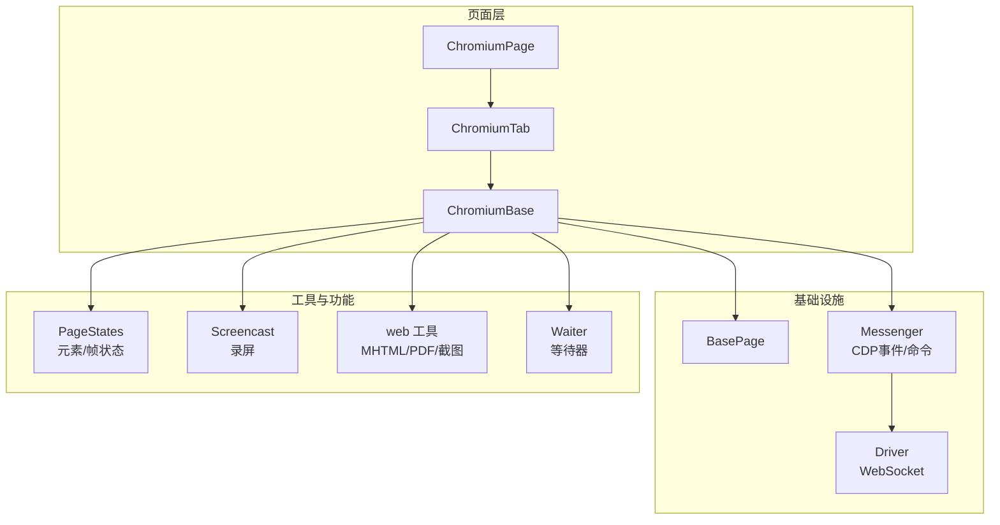
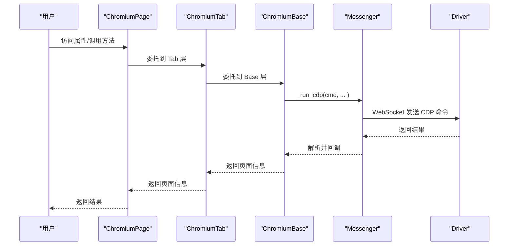
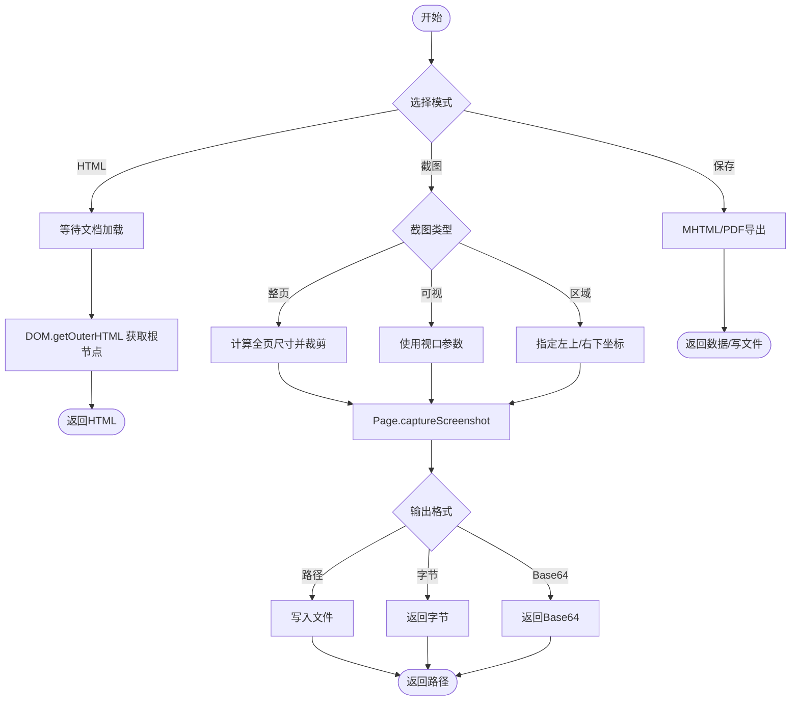
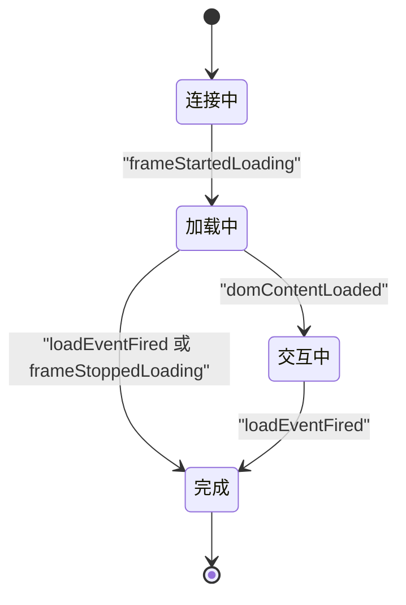
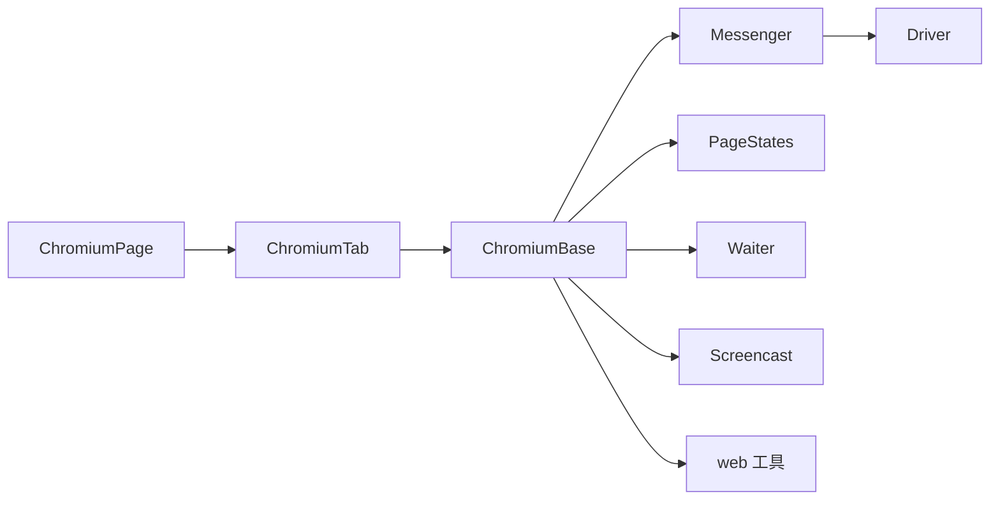

# 页面信息获取

<cite>
**本文引用的文件**
- [chromium_page.py](file://DrissionPage/_pages/chromium_page.py)
- [chromium_tab.py](file://DrissionPage/_pages/chromium_tab.py)
- [chromium_base.py](file://DrissionPage/_pages/chromium_base.py)
- [base.py](file://DrissionPage/_base/base.py)
- [driver.py](file://DrissionPage/_base/driver.py)
- [states.py](file://DrissionPage/_units/states.py)
- [screencast.py](file://DrissionPage/_units/screencast.py)
- [web.py](file://DrissionPage/_functions/web.py)
- [waiter.py](file://DrissionPage/_units/waiter.py)
</cite>

## 目录
1. [简介](#简介)
2. [项目结构](#项目结构)
3. [核心组件](#核心组件)
4. [架构总览](#架构总览)
5. [详细组件分析](#详细组件分析)
6. [依赖分析](#依赖分析)
7. [性能考虑](#性能考虑)
8. [故障排查指南](#故障排查指南)
9. [结论](#结论)
10. [附录：常见场景与示例路径](#附录常见场景与示例路径)

## 简介
本指南聚焦于 DrissionPage 中 ChromiumPage 的“页面信息获取”能力，系统讲解如何通过 ChromiumPage 获取页面内容（HTML 源码、页面文本、截图）、页面元数据（标题、URL、编码等）、浏览器信息（版本、进程 ID、连接地址）、页面状态（加载状态、网络状态、安全状态）以及性能监控与缓存更新机制。同时给出典型应用场景与代码示例的路径指引，帮助读者快速落地。

## 项目结构
围绕页面信息获取的关键模块如下：
- 页面层：ChromiumPage、ChromiumTab、ChromiumBase
- 基础设施：BasePage、Messenger（CDP 通信）、Driver（WebSocket）
- 工具与功能：web 工具（MHTML/PDF、截图）、states（页面/元素状态）、screencast（录屏）、waiter（等待器）

图示来源
- [chromium_page.py:17-103](file://DrissionPage/_pages/chromium_page.py#L17-L103)
- [chromium_tab.py:22-47](file://DrissionPage/_pages/chromium_tab.py#L22-L47)
- [chromium_base.py:39-85](file://DrissionPage/_pages/chromium_base.py#L39-L85)
- [base.py:270-371](file://DrissionPage/_base/base.py#L270-L371)
- [driver.py:24-152](file://DrissionPage/_base/driver.py#L24-L152)
- [states.py:113-150](file://DrissionPage/_units/states.py#L113-L150)
- [screencast.py:20-180](file://DrissionPage/_units/screencast.py#L20-L180)
- [web.py:198-254](file://DrissionPage/_functions/web.py#L198-L254)
- [waiter.py:85-235](file://DrissionPage/_units/waiter.py#L85-L235)

章节来源
- [chromium_page.py:17-103](file://DrissionPage/_pages/chromium_page.py#L17-L103)
- [chromium_tab.py:22-47](file://DrissionPage/_pages/chromium_tab.py#L22-L47)
- [chromium_base.py:39-85](file://DrissionPage/_pages/chromium_base.py#L39-L85)
- [base.py:270-371](file://DrissionPage/_base/base.py#L270-L371)
- [driver.py:24-152](file://DrissionPage/_base/driver.py#L24-L152)

## 核心组件
- ChromiumPage：Chromium 页面入口，封装标签管理、浏览器信息、页面等待器与设置器等。
- ChromiumTab：在 ChromiumPage 基础上提供“驱动态/会话态”双模式切换、会话 Cookie 同步、保存页面等。
- ChromiumBase：页面核心逻辑，负责 CDP 事件监听、文档获取、页面导航、截图、等待器、状态对象等。
- BasePage：抽象页面基类，定义通用属性与行为。
- Driver/Messenger：Driver 负责与浏览器 CDP 通道交互；Messenger 负责事件队列与回调。
- states：PageStates、ElementStates 等，提供页面/元素状态查询。
- web 工具：MHTML/PDF 导出、截图、视口判断等。
- waiter：统一的等待器，支持加载开始/完成、URL/标题变化、下载等。

章节来源
- [chromium_page.py:17-103](file://DrissionPage/_pages/chromium_page.py#L17-L103)
- [chromium_tab.py:22-47](file://DrissionPage/_pages/chromium_tab.py#L22-L47)
- [chromium_base.py:39-85](file://DrissionPage/_pages/chromium_base.py#L39-L85)
- [base.py:270-371](file://DrissionPage/_base/base.py#L270-L371)
- [driver.py:24-152](file://DrissionPage/_base/driver.py#L24-L152)
- [states.py:113-150](file://DrissionPage/_units/states.py#L113-L150)
- [web.py:198-254](file://DrissionPage/_functions/web.py#L198-L254)
- [waiter.py:85-235](file://DrissionPage/_units/waiter.py#L85-L235)

## 架构总览
ChromiumPage 通过 ChromiumTab 进入 ChromiumBase，后者建立与浏览器的 CDP 连接，启用 DOM/Page/Emulation 等域，注册事件处理器，实现页面生命周期与状态管理。页面信息获取主要通过 CDP 命令与运行时 JS 实现，等待器保障时机正确性。

图示来源
- [chromium_page.py:33-40](file://DrissionPage/_pages/chromium_page.py#L33-L40)
- [chromium_tab.py:49-50](file://DrissionPage/_pages/chromium_tab.py#L49-L50)
- [chromium_base.py:376-384](file://DrissionPage/_pages/chromium_base.py#L376-L384)
- [base.py:394-396](file://DrissionPage/_base/base.py#L394-L396)
- [driver.py:102-118](file://DrissionPage/_base/driver.py#L102-L118)

## 详细组件分析

### 页面内容获取
- HTML 源码
  - 使用 DOM.getOuterHTML 获取根节点 outerHTML。
  - 需确保文档已加载（等待器保证）。
  - 示例路径：[html 属性:330-332](file://DrissionPage/_pages/chromium_base.py#L330-L332)
- 页面文本
  - 可通过 DOM 结构与文本节点提取，web 工具提供文本格式化与换行处理。
  - 示例路径：[get_ele_txt 文本提取:20-103](file://DrissionPage/_functions/web.py#L20-L103)
- 页面截图
  - 支持整页截图、可视区域截图、指定区域截图，输出路径/字节/Base64。
  - 示例路径：[_get_screenshot 截图实现:816-893](file://DrissionPage/_pages/chromium_base.py#L816-L893)，[get_screenshot 对外接口:643-646](file://DrissionPage/_pages/chromium_base.py#L643-L646)
- 页面保存（MHTML/PDF）
  - MHTML：Page.captureSnapshot；PDF：Page.printToPDF。
  - 示例路径：[MHTML/PDF 导出:221-254](file://DrissionPage/_functions/web.py#L221-L254)

图示来源
- [chromium_base.py:330-332](file://DrissionPage/_pages/chromium_base.py#L330-L332)
- [chromium_base.py:816-893](file://DrissionPage/_pages/chromium_base.py#L816-L893)
- [web.py:221-254](file://DrissionPage/_functions/web.py#L221-L254)

章节来源
- [chromium_base.py:330-332](file://DrissionPage/_pages/chromium_base.py#L330-L332)
- [chromium_base.py:643-646](file://DrissionPage/_pages/chromium_base.py#L643-L646)
- [chromium_base.py:816-893](file://DrissionPage/_pages/chromium_base.py#L816-L893)
- [web.py:221-254](file://DrissionPage/_functions/web.py#L221-L254)

### 页面元数据获取
- 标题与 URL
  - 通过 Target.getTargetInfo 获取当前目标的 title/url。
  - 示例路径：[title/url 属性:317-323](file://DrissionPage/_pages/chromium_base.py#L317-L323)
- 用户代理
  - 通过 Runtime.evaluate 执行 navigator.userAgent。
  - 示例路径：[user_agent 属性:354-355](file://DrissionPage/_pages/chromium_base.py#L354-L355)
- 页面编码
  - 当前实现未直接暴露编码属性；可通过响应头或 meta 标签解析，或在会话态下通过 response 获取。
  - 示例路径：[response 属性:102-103](file://DrissionPage/_pages/chromium_tab.py#L102-L103)

章节来源
- [chromium_base.py:317-323](file://DrissionPage/_pages/chromium_base.py#L317-L323)
- [chromium_base.py:354-355](file://DrissionPage/_pages/chromium_base.py#L354-L355)
- [chromium_tab.py:102-103](file://DrissionPage/_pages/chromium_tab.py#L102-L103)

### 浏览器信息查询
- 浏览器版本
  - 通过浏览器对象的 version 属性。
  - 示例路径：[browser_version 属性:75-76](file://DrissionPage/_pages/chromium_page.py#L75-L76)
- 进程 ID
  - 通过浏览器对象的 process_id 属性。
  - 示例路径：[process_id 属性:71-72](file://DrissionPage/_pages/chromium_page.py#L71-L72)
- 连接地址
  - 通过浏览器对象的 address 属性。
  - 示例路径：[address 属性:79-80](file://DrissionPage/_pages/chromium_page.py#L79-L80)

章节来源
- [chromium_page.py:71-80](file://DrissionPage/_pages/chromium_page.py#L71-L80)

### 页面状态信息
- 加载状态
  - 内部维护 _is_loading 与 _ready_state，事件驱动更新（frameStartedLoading/frameStoppedLoading/domContentLoaded/loadEventFired）。
  - 等待器提供 load_start/doc_loaded/url_change/title_change 等。
  - 示例路径：[状态事件与等待器:168-206](file://DrissionPage/_pages/chromium_base.py#L168-L206)，[BaseWaiter 加载等待:164-235](file://DrissionPage/_units/waiter.py#L164-L235)
- 网络状态
  - 通过 Network.enable 与监听器收集请求/响应信息（如资源类型、方法、URL 等），可用于统计网络状态。
  - 示例路径：[监听器启动与捕获:78-245](file://DrissionPage/_units/listener.py#L78-L245)
- 安全状态
  - 通过 Target 相关命令与证书/HTTPS 状态判断，结合浏览器 states 判断是否 headless/incognito/existed。
  - 示例路径：[BrowserStates/PageStates:92-150](file://DrissionPage/_units/states.py#L92-L150)

图示来源
- [chromium_base.py:168-206](file://DrissionPage/_pages/chromium_base.py#L168-L206)

章节来源
- [chromium_base.py:168-206](file://DrissionPage/_pages/chromium_base.py#L168-L206)
- [waiter.py:164-235](file://DrissionPage/_units/waiter.py#L164-L235)
- [states.py:92-150](file://DrissionPage/_units/states.py#L92-L150)

### 页面性能指标与监控
- 截图录制（录屏）
  - 支持视频/图片两种模式，可配置质量与临时目录，最终合成 MP4 或返回图片目录。
  - 示例路径：[Screencast 录制:33-137](file://DrissionPage/_units/screencast.py#L33-L137)
- 页面等待与超时
  - 统一的等待器提供加载、元素、下载、弹窗等等待逻辑，避免忙等。
  - 示例路径：[ChromiumPageWaiter/ChromiumTabWaiter:278-286](file://DrissionPage/_units/waiter.py#L278-L286)

章节来源
- [screencast.py:33-137](file://DrissionPage/_units/screencast.py#L33-L137)
- [waiter.py:278-286](file://DrissionPage/_units/waiter.py#L278-L286)

### 页面信息缓存与更新机制
- 文档对象缓存
  - DOM.getDocument 获取根节点对象 ID 并缓存，避免重复获取。
  - 示例路径：[文档获取与缓存:126-160](file://DrissionPage/_pages/chromium_base.py#L126-L160)
- 等待器驱动的“就绪”状态
  - 通过 ready_state 与 _is_loading 管理页面就绪，等待器在关键点阻塞直至满足条件。
  - 示例路径：[状态更新与等待:168-206](file://DrissionPage/_pages/chromium_base.py#L168-L206)，[BaseWaiter:164-235](file://DrissionPage/_units/waiter.py#L164-L235)

章节来源
- [chromium_base.py:126-160](file://DrissionPage/_pages/chromium_base.py#L126-L160)
- [chromium_base.py:168-206](file://DrissionPage/_pages/chromium_base.py#L168-L206)
- [waiter.py:164-235](file://DrissionPage/_units/waiter.py#L164-L235)

## 依赖分析
- 组件耦合
  - ChromiumPage/ChromiumTab/ChromiumBase 逐层委托，职责清晰；ChromiumBase 与 Driver/Messenger 强耦合，承担 CDP 交互。
  - states 与 waiter 作为“横切关注”，被多处使用。
- 外部依赖
  - WebSocket 与浏览器 CDP；部分录屏功能依赖 OpenCV/Numpy。
- 循环依赖
  - 未见循环导入；各模块职责单一，通过属性/方法委派降低耦合。

图示来源
- [chromium_page.py:17-103](file://DrissionPage/_pages/chromium_page.py#L17-L103)
- [chromium_tab.py:22-47](file://DrissionPage/_pages/chromium_tab.py#L22-L47)
- [chromium_base.py:39-85](file://DrissionPage/_pages/chromium_base.py#L39-L85)
- [states.py:113-150](file://DrissionPage/_units/states.py#L113-L150)
- [waiter.py:85-235](file://DrissionPage/_units/waiter.py#L85-L235)
- [screencast.py:20-180](file://DrissionPage/_units/screencast.py#L20-L180)
- [web.py:198-254](file://DrissionPage/_functions/web.py#L198-L254)

章节来源
- [chromium_page.py:17-103](file://DrissionPage/_pages/chromium_page.py#L17-L103)
- [chromium_tab.py:22-47](file://DrissionPage/_pages/chromium_tab.py#L22-L47)
- [chromium_base.py:39-85](file://DrissionPage/_pages/chromium_base.py#L39-L85)
- [states.py:113-150](file://DrissionPage/_units/states.py#L113-L150)
- [waiter.py:85-235](file://DrissionPage/_units/waiter.py#L85-L235)
- [screencast.py:20-180](file://DrissionPage/_units/screencast.py#L20-L180)
- [web.py:198-254](file://DrissionPage/_functions/web.py#L198-L254)

## 性能考虑
- 截图策略
  - 整页截图需计算全尺寸并裁剪，建议仅在必要时使用；可视区域截图更高效。
  - 区域截图若跨越视口边界，内部会自动处理滚动与 captureBeyondViewport。
- 等待策略
  - 使用等待器而非固定 sleep，减少无效轮询；合理设置超时时间。
- 录屏
  - 视频模式依赖 OpenCV/Numpy，建议在有硬件加速或合适环境时使用；轻量模式可选图片序列。

## 故障排查指南
- 连接断开
  - Driver 在断开时会清理状态并触发断开回调；检查浏览器是否正常启动、端口是否开放。
  - 示例路径：[Driver 断开处理:140-152](file://DrissionPage/_base/driver.py#L140-L152)
- 页面未加载
  - 使用等待器等待 doc_loaded/load_start；确认网络与目标页面可达。
  - 示例路径：[等待器加载等待:164-235](file://DrissionPage/_units/waiter.py#L164-L235)
- 截图失败
  - 检查页面尺寸是否为零、输出路径是否有效、权限是否允许写入。
  - 示例路径：[_get_screenshot 参数校验与输出:816-893](file://DrissionPage/_pages/chromium_base.py#L816-L893)
- 录屏异常
  - 确认依赖库安装、临时目录权限、录屏模式配置。
  - 示例路径：[Screencast 模式与依赖:33-137](file://DrissionPage/_units/screencast.py#L33-L137)

章节来源
- [driver.py:140-152](file://DrissionPage/_base/driver.py#L140-L152)
- [waiter.py:164-235](file://DrissionPage/_units/waiter.py#L164-L235)
- [chromium_base.py:816-893](file://DrissionPage/_pages/chromium_base.py#L816-L893)
- [screencast.py:33-137](file://DrissionPage/_units/screencast.py#L33-L137)

## 结论
ChromiumPage 提供了完善的页面信息获取能力：从 HTML 源码、文本、截图到 MHTML/PDF 导出；从标题/URL/UA 到浏览器版本/进程 ID/连接地址；从加载/网络/安全状态到性能录屏与等待器保障。通过文档缓存与等待器机制，既保证了准确性也兼顾了效率。建议在实际应用中结合等待器与状态查询，按需选择截图与录屏模式，并注意依赖库与权限配置。

## 附录：常见场景与示例路径
- 获取页面 HTML 源码
  - 示例路径：[html 属性:330-332](file://DrissionPage/_pages/chromium_base.py#L330-L332)
- 获取页面文本
  - 示例路径：[get_ele_txt 文本提取:20-103](file://DrissionPage/_functions/web.py#L20-L103)
- 页面截图（整页/可视/区域）
  - 示例路径：[_get_screenshot:816-893](file://DrissionPage/_pages/chromium_base.py#L816-L893)，[对外接口:643-646](file://DrissionPage/_pages/chromium_base.py#L643-L646)
- 保存页面为 MHTML/PDF
  - 示例路径：[MHTML/PDF 导出:221-254](file://DrissionPage/_functions/web.py#L221-L254)
- 获取浏览器版本/进程 ID/连接地址
  - 示例路径：[browser_version/process_id/address:71-80](file://DrissionPage/_pages/chromium_page.py#L71-L80)
- 查询页面加载/网络/安全状态
  - 示例路径：[状态事件:168-206](file://DrissionPage/_pages/chromium_base.py#L168-L206)，[PageStates:113-150](file://DrissionPage/_units/states.py#L113-L150)，[监听器:78-245](file://DrissionPage/_units/listener.py#L78-L245)
- 页面性能录屏
  - 示例路径：[Screencast:33-137](file://DrissionPage/_units/screencast.py#L33-L137)
- 页面等待与超时控制
  - 示例路径：[BaseWaiter:164-235](file://DrissionPage/_units/waiter.py#L164-L235)，[ChromiumPageWaiter:278-286](file://DrissionPage/_units/waiter.py#L278-L286)