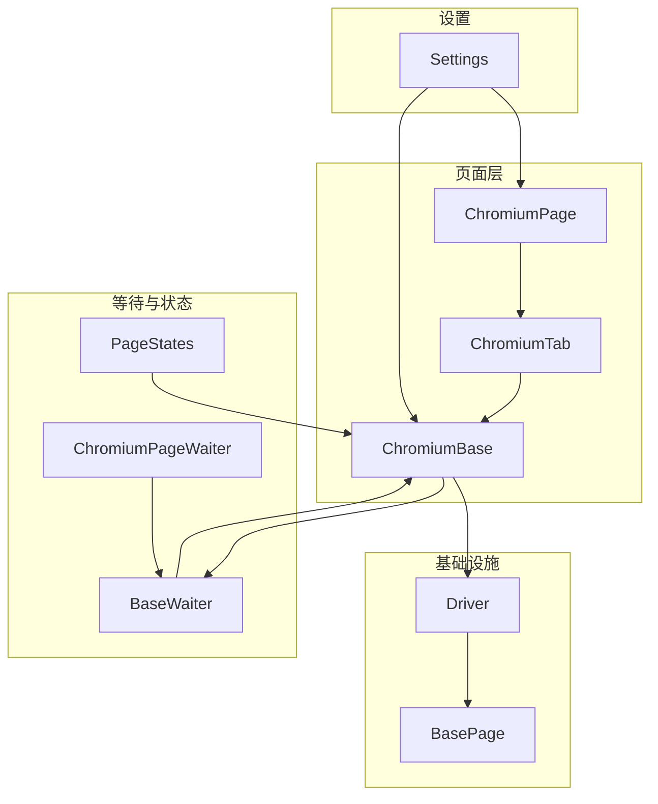
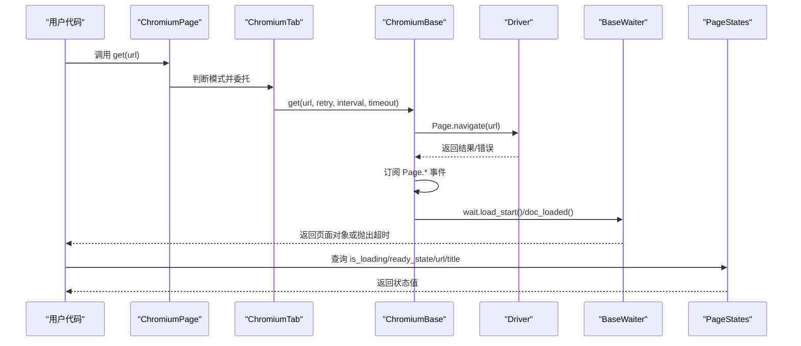
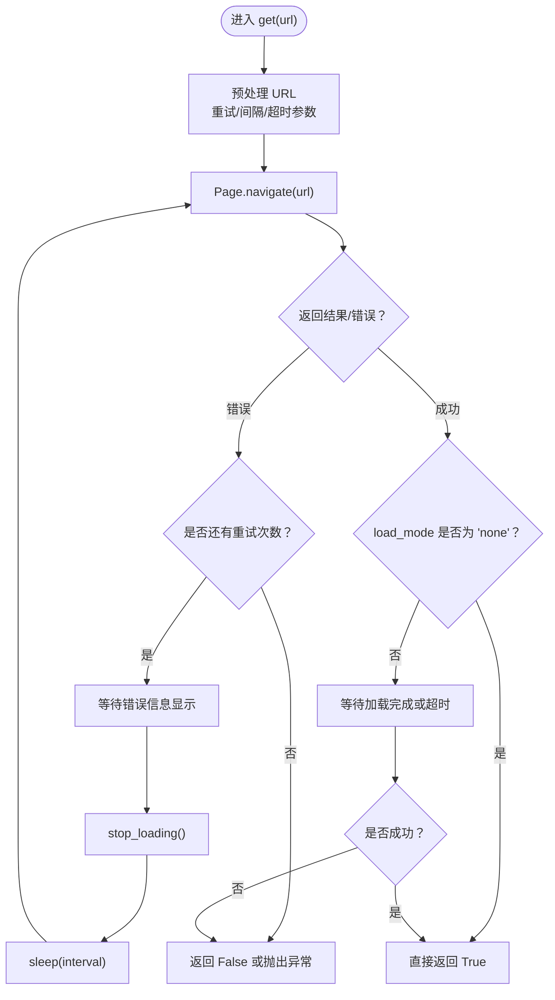
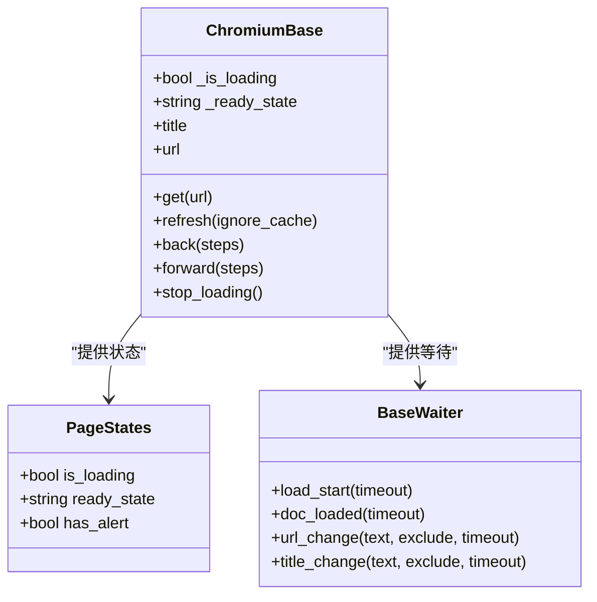
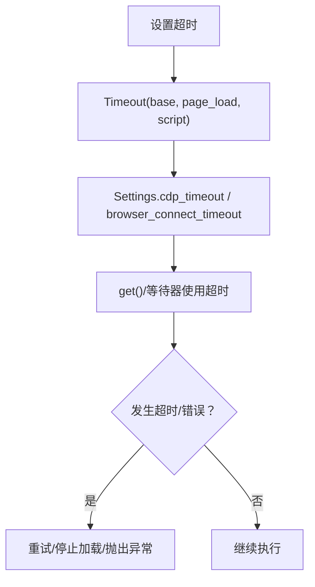
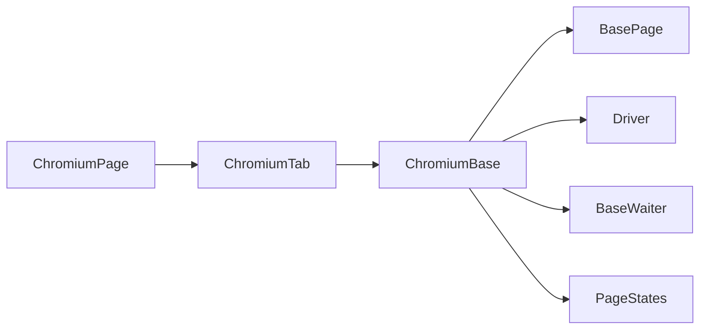

# 页面导航与控制

<cite>
**本文引用的文件列表**
- [chromium_page.py](file://DrissionPage/_pages/chromium_page.py)
- [chromium_base.py](file://DrissionPage/_pages/chromium_base.py)
- [chromium_tab.py](file://DrissionPage/_pages/chromium_tab.py)
- [base.py](file://DrissionPage/_base/base.py)
- [driver.py](file://DrissionPage/_base/driver.py)
- [waiter.py](file://DrissionPage/_units/waiter.py)
- [states.py](file://DrissionPage/_units/states.py)
- [settings.py](file://DrissionPage/_functions/settings.py)
</cite>

## 目录
1. [简介](#简介)
2. [项目结构](#项目结构)
3. [核心组件](#核心组件)
4. [架构总览](#架构总览)
5. [详细组件分析](#详细组件分析)
6. [依赖关系分析](#依赖关系分析)
7. [性能考量](#性能考量)
8. [故障排查指南](#故障排查指南)
9. [结论](#结论)
10. [附录：最佳实践与常见问题](#附录最佳实践与常见问题)

## 简介
本文件聚焦于 DrissionPage 中 ChromiumPage 的页面导航与控制能力，系统性讲解页面加载、前进后退、刷新、停止加载等导航方法；详解页面状态检查（是否加载完成、页面标题、当前 URL）；说明超时设置与错误处理机制，并提供最佳实践与常见问题解决方案。文档以代码级分析为基础，辅以可视化图示帮助理解。

## 项目结构
围绕页面导航与控制的关键模块如下：
- 页面层：ChromiumPage（页面对象）、ChromiumTab（标签页抽象）、ChromiumBase（页面基类）
- 等待与状态：BaseWaiter/ChromiumPageWaiter（等待器）、PageStates（页面状态）
- 基础设施：BasePage（通用页面接口）、Driver（CDP 驱动）
- 设置与语言：Settings（全局设置）

图表来源
- [chromium_page.py:17-103](file://DrissionPage/_pages/chromium_page.py#L17-L103)
- [chromium_tab.py:22-120](file://DrissionPage/_pages/chromium_tab.py#L22-L120)
- [chromium_base.py:39-125](file://DrissionPage/_pages/chromium_base.py#L39-L125)
- [base.py:270-371](file://DrissionPage/_base/base.py#L270-L371)
- [driver.py:24-153](file://DrissionPage/_base/driver.py#L24-L153)
- [waiter.py:85-235](file://DrissionPage/_units/waiter.py#L85-L235)
- [states.py:113-150](file://DrissionPage/_units/states.py#L113-L150)
- [settings.py:13-69](file://DrissionPage/_functions/settings.py#L13-L69)

章节来源
- [chromium_page.py:17-103](file://DrissionPage/_pages/chromium_page.py#L17-L103)
- [chromium_tab.py:22-120](file://DrissionPage/_pages/chromium_tab.py#L22-L120)
- [chromium_base.py:39-125](file://DrissionPage/_pages/chromium_base.py#L39-L125)
- [base.py:270-371](file://DrissionPage/_base/base.py#L270-L371)
- [driver.py:24-153](file://DrissionPage/_base/driver.py#L24-L153)
- [waiter.py:85-235](file://DrissionPage/_units/waiter.py#L85-L235)
- [states.py:113-150](file://DrissionPage/_units/states.py#L113-L150)
- [settings.py:13-69](file://DrissionPage/_functions/settings.py#L13-L69)

## 核心组件
- ChromiumPage：页面对象，继承自 ChromiumTab，提供页面级导航与状态访问入口
- ChromiumTab：标签页抽象，封装 d/s 模式切换、URL 获取、等待器等
- ChromiumBase：页面基类，负责 CDP 事件监听、页面生命周期管理、导航与加载控制
- BasePage：通用页面接口，定义 get() 等通用方法
- Driver：CDP 驱动，负责与浏览器 WebSocket 通信
- BaseWaiter/ChromiumPageWaiter：等待器，提供等待页面加载、URL/title 变化等能力
- PageStates：页面状态，提供 is_loading、ready_state、has_alert 等状态查询
- Settings：全局设置，影响超时、异常抛出策略等

章节来源
- [chromium_page.py:17-103](file://DrissionPage/_pages/chromium_page.py#L17-L103)
- [chromium_tab.py:22-120](file://DrissionPage/_pages/chromium_tab.py#L22-L120)
- [chromium_base.py:39-125](file://DrissionPage/_pages/chromium_base.py#L39-L125)
- [base.py:270-371](file://DrissionPage/_base/base.py#L270-L371)
- [driver.py:24-153](file://DrissionPage/_base/driver.py#L24-L153)
- [waiter.py:85-235](file://DrissionPage/_units/waiter.py#L85-L235)
- [states.py:113-150](file://DrissionPage/_units/states.py#L113-L150)
- [settings.py:13-69](file://DrissionPage/_functions/settings.py#L13-L69)

## 架构总览
ChromiumPage 通过 ChromiumTab 继承 ChromiumBase，后者基于 Driver 与浏览器建立 CDP 连接，注册 Page.* 事件回调，维护页面加载状态机（loading/interactive/complete）。等待器通过轮询或事件队列感知状态变化，状态对象提供统一的状态查询接口。

图表来源
- [chromium_page.py:33-40](file://DrissionPage/_pages/chromium_page.py#L33-L40)
- [chromium_tab.py:124-133](file://DrissionPage/_pages/chromium_tab.py#L124-L133)
- [chromium_base.py:403-407](file://DrissionPage/_pages/chromium_base.py#L403-L407)
- [chromium_base.py:768-814](file://DrissionPage/_pages/chromium_base.py#L768-L814)
- [chromium_base.py:168-206](file://DrissionPage/_pages/chromium_base.py#L168-L206)
- [waiter.py:164-169](file://DrissionPage/_units/waiter.py#L164-L169)
- [states.py:119-134](file://DrissionPage/_units/states.py#L119-L134)

## 详细组件分析

### 页面导航方法
- get(url, show_errmsg=False, retry=None, interval=None, timeout=None)
  - 功能：发起页面跳转，支持重试、间隔与超时控制
  - 行为：预处理 URL（本地路径/编码），调用 Page.navigate，等待加载完成或按 eager 模式提前停止
  - 错误：连接失败、超时、CDP 异常均会被捕获并可重试
  - 参考路径：[get:403-407](file://DrissionPage/_pages/chromium_base.py#L403-L407)，[_d_connect:768-814](file://DrissionPage/_pages/chromium_base.py#L768-L814)

- refresh(ignore_cache=False)
  - 功能：刷新页面，可选择忽略缓存
  - 行为：触发 Page.reload，设置加载标志，等待加载开始
  - 参考路径：[refresh:514-518](file://DrissionPage/_pages/chromium_base.py#L514-L518)

- back(steps=1) / forward(steps=1)
  - 功能：前进/后退历史记录
  - 行为：读取 Page.getNavigationHistory，遍历历史条目，过滤相同 URL，调用 Page.navigateToHistoryEntry
  - 参考路径：[back/forward:519-524](file://DrissionPage/_pages/chromium_base.py#L519-L524)，[_forward_or_back:525-546](file://DrissionPage/_pages/chromium_base.py#L525-L546)

- stop_loading()
  - 功能：强制停止页面加载
  - 行为：调用 Page.stopLoading，等待 ready_state 至 complete 或超时
  - 参考路径：[stop_loading:547-557](file://DrissionPage/_pages/chromium_base.py#L547-L557)

图表来源
- [chromium_base.py:768-814](file://DrissionPage/_pages/chromium_base.py#L768-L814)
- [chromium_base.py:547-557](file://DrissionPage/_pages/chromium_base.py#L547-L557)

章节来源
- [chromium_base.py:403-407](file://DrissionPage/_pages/chromium_base.py#L403-L407)
- [chromium_base.py:514-557](file://DrissionPage/_pages/chromium_base.py#L514-L557)
- [chromium_base.py:768-814](file://DrissionPage/_pages/chromium_base.py#L768-L814)

### 页面状态检查
- 标题与 URL
  - title：通过 Target.getTargetInfo 获取
  - url：同上
  - 参考路径：[title/url 属性:318-323](file://DrissionPage/_pages/chromium_base.py#L318-L323)

- 加载状态
  - is_loading：页面是否处于加载中
  - ready_state：页面 readyState（connecting/loading/interactive/complete）
  - 参考路径：[状态属性:44-66](file://DrissionPage/_pages/chromium_base.py#L44-L66)，[PageStates:119-134](file://DrissionPage/_units/states.py#L119-L134)

- 等待器
  - load_start/doc_loaded：等待加载开始/文档加载完成
  - url_change/title_change：等待 URL/title 变化
  - 参考路径：[BaseWaiter:164-235](file://DrissionPage/_units/waiter.py#L164-L235)

图表来源
- [chromium_base.py:318-323](file://DrissionPage/_pages/chromium_base.py#L318-L323)
- [chromium_base.py:44-66](file://DrissionPage/_pages/chromium_base.py#L44-L66)
- [states.py:119-134](file://DrissionPage/_units/states.py#L119-L134)
- [waiter.py:164-235](file://DrissionPage/_units/waiter.py#L164-L235)

章节来源
- [chromium_base.py:318-323](file://DrissionPage/_pages/chromium_base.py#L318-L323)
- [chromium_base.py:44-66](file://DrissionPage/_pages/chromium_base.py#L44-L66)
- [states.py:119-134](file://DrissionPage/_units/states.py#L119-L134)
- [waiter.py:164-235](file://DrissionPage/_units/waiter.py#L164-L235)

### 超时设置与错误处理
- 超时配置
  - Timeout：base/page_load/script 三档超时
  - Settings：cdp_timeout、browser_connect_timeout、singleton_tab_obj 等
  - 参考路径：[Timeout:896-908](file://DrissionPage/_pages/chromium_base.py#L896-L908)，[Settings:13-69](file://DrissionPage/_functions/settings.py#L13-L69)

- 错误处理
  - get() 内部捕获超时与连接错误，支持重试与间隔
  - stop_loading() 在异常情况下安全退出
  - 等待器在超时后可抛出 WaitTimeoutError 或返回 False（取决于 Settings.raise_when_wait_failed）
  - 参考路径：[get 重试逻辑:768-814](file://DrissionPage/_pages/chromium_base.py#L768-L814)，[stop_loading:547-557](file://DrissionPage/_pages/chromium_base.py#L547-L557)，[等待器超时行为:164-235](file://DrissionPage/_units/waiter.py#L164-L235)

图表来源
- [chromium_base.py:896-908](file://DrissionPage/_pages/chromium_base.py#L896-L908)
- [settings.py:13-69](file://DrissionPage/_functions/settings.py#L13-L69)
- [chromium_base.py:768-814](file://DrissionPage/_pages/chromium_base.py#L768-L814)
- [waiter.py:164-235](file://DrissionPage/_units/waiter.py#L164-L235)

章节来源
- [chromium_base.py:896-908](file://DrissionPage/_pages/chromium_base.py#L896-L908)
- [settings.py:13-69](file://DrissionPage/_functions/settings.py#L13-L69)
- [chromium_base.py:768-814](file://DrissionPage/_pages/chromium_base.py#L768-L814)
- [waiter.py:164-235](file://DrissionPage/_units/waiter.py#L164-L235)

### 实际使用场景与示例（路径指引）
- 打开网页并等待加载完成
  - 使用 get(url) 并配合 wait.doc_loaded()
  - 参考路径：[get:403-407](file://DrissionPage/_pages/chromium_base.py#L403-L407)，[doc_loaded:167-169](file://DrissionPage/_units/waiter.py#L167-L169)

- 强制刷新并忽略缓存
  - 使用 refresh(ignore_cache=True)
  - 参考路径：[refresh:514-518](file://DrissionPage/_pages/chromium_base.py#L514-L518)

- 后退/前进到历史记录
  - 使用 back(steps)/forward(steps)
  - 参考路径：[back/forward:519-524](file://DrissionPage/_pages/chromium_base.py#L519-L524)，[_forward_or_back:525-546](file://DrissionPage/_pages/chromium_base.py#L525-L546)

- 停止长时间加载
  - 使用 stop_loading()
  - 参考路径：[stop_loading:547-557](file://DrissionPage/_pages/chromium_base.py#L547-L557)

- 检查页面标题与 URL
  - 使用 title/url 属性
  - 参考路径：[title/url:318-323](file://DrissionPage/_pages/chromium_base.py#L318-L323)

- 等待 URL/title 变化
  - 使用 wait.url_change()/wait.title_change()
  - 参考路径：[url_change/title_change:186-191](file://DrissionPage/_units/waiter.py#L186-L191)

## 依赖关系分析
- 继承关系
  - ChromiumPage -> ChromiumTab -> ChromiumBase -> BasePage
  - 等待器与状态类分别依赖页面对象
- 事件驱动
  - ChromiumBase 注册 Page.* 事件回调，更新内部状态（_ready_state、_is_loading）
- CDP 交互
  - Driver 负责 WebSocket 通信，ChromiumBase 通过 _run_cdp 封装调用

图表来源
- [chromium_page.py:17-40](file://DrissionPage/_pages/chromium_page.py#L17-L40)
- [chromium_tab.py:22-47](file://DrissionPage/_pages/chromium_tab.py#L22-L47)
- [chromium_base.py:39-67](file://DrissionPage/_pages/chromium_base.py#L39-L67)
- [base.py:270-371](file://DrissionPage/_base/base.py#L270-L371)
- [driver.py:24-153](file://DrissionPage/_base/driver.py#L24-L153)
- [waiter.py:85-235](file://DrissionPage/_units/waiter.py#L85-L235)
- [states.py:113-150](file://DrissionPage/_units/states.py#L113-L150)

章节来源
- [chromium_page.py:17-40](file://DrissionPage/_pages/chromium_page.py#L17-L40)
- [chromium_tab.py:22-47](file://DrissionPage/_pages/chromium_tab.py#L22-L47)
- [chromium_base.py:39-67](file://DrissionPage/_pages/chromium_base.py#L39-L67)
- [base.py:270-371](file://DrissionPage/_base/base.py#L270-L371)
- [driver.py:24-153](file://DrissionPage/_base/driver.py#L24-L153)
- [waiter.py:85-235](file://DrissionPage/_units/waiter.py#L85-L235)
- [states.py:113-150](file://DrissionPage/_units/states.py#L113-L150)

## 性能考量
- 加载模式
  - eager 模式下，页面在 DOMContentLoaded 后可能提前停止，减少等待时间
  - 参考路径：[eager 模式处理:189-191](file://DrissionPage/_pages/chromium_base.py#L189-L191)，[_wait_to_stop:232-238](file://DrissionPage/_pages/chromium_base.py#L232-L238)
- 轮询与事件
  - 等待器采用短周期轮询，避免阻塞主线程
  - Page.* 事件驱动状态更新，降低轮询成本
  - 参考路径：[事件注册:71-82](file://DrissionPage/_pages/chromium_base.py#L71-L82)，[等待器轮询:164-235](file://DrissionPage/_units/waiter.py#L164-L235)
- 超时与重试
  - 合理设置 page_load/script/base 超时，避免长时间阻塞
  - 参考路径：[Timeout:896-908](file://DrissionPage/_pages/chromium_base.py#L896-L908)，[Settings:13-69](file://DrissionPage/_functions/settings.py#L13-L69)

## 故障排查指南
- 页面无法加载或超时
  - 检查网络与代理设置，确认 get() 的 retry/interval/timeout 参数
  - 使用 stop_loading() 强制停止并重试
  - 参考路径：[get 重试与超时:768-814](file://DrissionPage/_pages/chromium_base.py#L768-L814)，[stop_loading:547-557](file://DrissionPage/_pages/chromium_base.py#L547-L557)

- 等待超时
  - 提升超时阈值或调整等待条件（如使用 url_change/title_change）
  - 参考路径：[等待器超时行为:164-235](file://DrissionPage/_units/waiter.py#L164-L235)

- 页面状态异常
  - 通过 PageStates 检查 is_loading/ready_state/has_alert
  - 参考路径：[PageStates:119-134](file://DrissionPage/_units/states.py#L119-L134)

- CDP 连接断开
  - Driver 层会捕获断开并触发清理流程，页面需重新初始化
  - 参考路径：[Driver 断开处理:140-153](file://DrissionPage/_base/driver.py#L140-L153)

章节来源
- [chromium_base.py:768-814](file://DrissionPage/_pages/chromium_base.py#L768-L814)
- [chromium_base.py:547-557](file://DrissionPage/_pages/chromium_base.py#L547-L557)
- [waiter.py:164-235](file://DrissionPage/_units/waiter.py#L164-L235)
- [states.py:119-134](file://DrissionPage/_units/states.py#L119-L134)
- [driver.py:140-153](file://DrissionPage/_base/driver.py#L140-L153)

## 结论
ChromiumPage 通过 ChromiumTab/ChromiumBase 提供了完善的页面导航与控制能力：get() 支持重试与超时；refresh/back/forward 提供历史导航；stop_loading 提供中断能力；waiter 与 PageStates 提供丰富的状态检查与等待机制。结合合理的超时与错误处理策略，可在复杂场景下稳定地完成页面控制任务。

## 附录：最佳实践与常见问题
- 最佳实践
  - 明确加载模式：需要尽快可用选 eager，需要完整资源选 normal
  - 合理设置超时：根据页面大小与网络状况调整 page_load/script/base
  - 使用等待器：优先使用 wait.doc_loaded()/url_change()/title_change() 替代固定 sleep
  - 错误处理：在关键步骤捕获超时并进行降级或重试
- 常见问题
  - 页面长时间不加载：先 stop_loading()，再检查网络与代理
  - 历史记录无效：确认历史条目 URL 已变化，避免重复跳转同一 URL
  - 状态查询不准：使用 PageStates 的 ready_state 辅助判断加载阶段