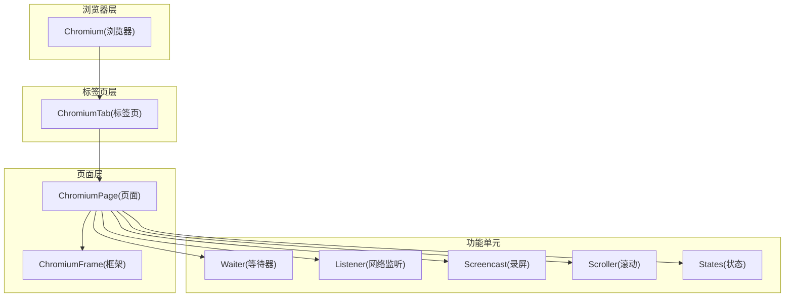
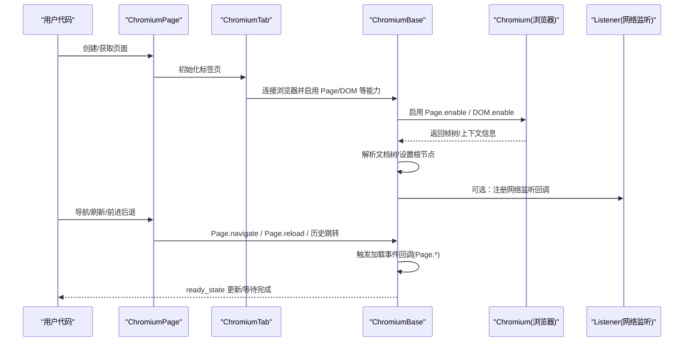
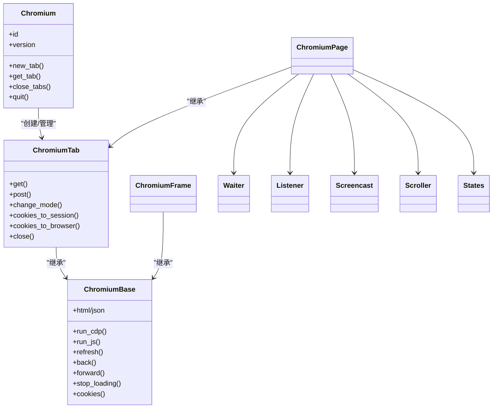

# 页面操作模块

<cite>
**本文引用的文件**
- [chromium_page.py](file://DrissionPage/_pages/chromium_page.py)
- [chromium_base.py](file://DrissionPage/_pages/chromium_base.py)
- [chromium_tab.py](file://DrissionPage/_pages/chromium_tab.py)
- [chromium_frame.py](file://DrissionPage/_pages/chromium_frame.py)
- [chromium.py](file://DrissionPage/_browsers/chromium.py)
- [waiter.py](file://DrissionPage/_units/waiter.py)
- [screencast.py](file://DrissionPage/_units/screencast.py)
- [scroller.py](file://DrissionPage/_units/scroller.py)
- [web.py](file://DrissionPage/_functions/web.py)
- [chromium_element.py](file://DrissionPage/_elements/chromium_element.py)
- [elements.py](file://DrissionPage/_functions/elements.py)
- [listener.py](file://DrissionPage/_units/listener.py)
- [states.py](file://DrissionPage/_units/states.py)
- [session_page.py](file://DrissionPage/_pages/session_page.py)
- [session_element.py](file://DrissionPage/_elements/session_element.py)
</cite>

## 目录
1. [简介](#简介)
2. [项目结构](#项目结构)
3. [核心组件](#核心组件)
4. [架构总览](#架构总览)
5. [详细组件分析](#详细组件分析)
6. [依赖分析](#依赖分析)
7. [性能考量](#性能考量)
8. [故障排查指南](#故障排查指南)
9. [结论](#结论)
10. [附录：使用场景与最佳实践](#附录使用场景与最佳实践)

## 简介
本章节系统性讲解 DrissionPage 的页面操作能力，重点围绕 ChromiumPage 类展开，覆盖页面导航、加载控制与状态管理、标签页操作、内容获取与 URL 处理、页面信息查询、框架切换与跨框架操作、截图与滚动控制、窗口大小调整、事件监听与异步操作处理等主题，并提供可落地的使用场景与最佳实践建议。

## 项目结构
DrissionPage 将页面操作按“浏览器-标签页-页面/框架”三层抽象组织，ChromiumPage 作为页面入口，ChromiumTab 提供标签页能力，ChromiumFrame 支持框架切换，ChromiumBase 提供通用的页面生命周期与事件处理逻辑；配套的等待器、监听器、滚动器、截图器等单元模块提供丰富的页面控制与观测能力。

图示来源
- [chromium.py:33-120](file://DrissionPage/_browsers/chromium.py#L33-L120)
- [chromium_tab.py:22-75](file://DrissionPage/_pages/chromium_tab.py#L22-L75)
- [chromium_page.py:17-55](file://DrissionPage/_pages/chromium_page.py#L17-L55)
- [chromium_frame.py:25-90](file://DrissionPage/_pages/chromium_frame.py#L25-L90)
- [waiter.py:85-168](file://DrissionPage/_units/waiter.py#L85-L168)
- [listener.py:20-86](file://DrissionPage/_units/listener.py#L20-L86)
- [screencast.py:20-54](file://DrissionPage/_units/screencast.py#L20-L54)
- [scroller.py:11-26](file://DrissionPage/_units/scroller.py#L11-L26)
- [states.py:113-150](file://DrissionPage/_units/states.py#L113-L150)

章节来源
- [chromium.py:33-120](file://DrissionPage/_browsers/chromium.py#L33-L120)
- [chromium_tab.py:22-75](file://DrissionPage/_pages/chromium_tab.py#L22-L75)
- [chromium_page.py:17-55](file://DrissionPage/_pages/chromium_page.py#L17-L55)
- [chromium_frame.py:25-90](file://DrissionPage/_pages/chromium_frame.py#L25-L90)

## 核心组件
- ChromiumPage：页面入口与高层封装，聚合页面级等待器、设置器、截图器、滚动器、状态机、监听器等。
- ChromiumTab：标签页抽象，支持 d 模式（Chromium）与 s 模式（Session）切换，提供 get/post、激活、关闭、模式切换等能力。
- ChromiumBase：页面基类，负责与浏览器 DevTools 协议交互，维护加载状态、事件回调、文档树、JS 执行、CDP 调用等。
- ChromiumFrame：框架抽象，支持同域/异域两种框架模型，提供框架内元素定位、滚动、截图、刷新等。
- 功能单元：Waiter 提供统一等待接口；Listener 提供网络请求/响应监听；Screencast 提供录屏与截图；Scroller 提供滚动控制；States 提供状态查询。

章节来源
- [chromium_page.py:17-103](file://DrissionPage/_pages/chromium_page.py#L17-L103)
- [chromium_tab.py:22-238](file://DrissionPage/_pages/chromium_tab.py#L22-L238)
- [chromium_base.py:39-125](file://DrissionPage/_pages/chromium_base.py#L39-L125)
- [chromium_frame.py:25-148](file://DrissionPage/_pages/chromium_frame.py#L25-L148)
- [waiter.py:85-235](file://DrissionPage/_units/waiter.py#L85-L235)
- [listener.py:20-167](file://DrissionPage/_units/listener.py#L20-L167)
- [screencast.py:20-138](file://DrissionPage/_units/screencast.py#L20-L138)
- [scroller.py:11-142](file://DrissionPage/_units/scroller.py#L11-L142)
- [states.py:113-182](file://DrissionPage/_units/states.py#L113-L182)

## 架构总览
下图展示 ChromiumPage 与底层浏览器、标签页、框架及功能单元的交互关系，以及页面生命周期中的关键事件流转。

图示来源
- [chromium_page.py:33-40](file://DrissionPage/_pages/chromium_page.py#L33-L40)
- [chromium_tab.py:37-47](file://DrissionPage/_pages/chromium_tab.py#L37-L47)
- [chromium_base.py:103-125](file://DrissionPage/_pages/chromium_base.py#L103-L125)
- [chromium.py:118-120](file://DrissionPage/_browsers/chromium.py#L118-L120)
- [listener.py:200-207](file://DrissionPage/_units/listener.py#L200-L207)

## 详细组件分析

### ChromiumPage：页面入口与高层封装
- 单例化与浏览器关联：通过 Chromium 单例持有浏览器实例，ChromiumPage 对同一浏览器 ID 复用页面对象，避免重复连接。
- 属性与快捷访问：提供 set/wait/screencast/actions/listen/states/scroll/rect/console 等挂件属性，延迟初始化。
- 标签页管理：继承自 ChromiumTab，提供 get_tab/get_tabs/new_tab/activate_tab/close_tabs 等标签页操作。
- 浏览器信息：暴露 process_id、browser_version、address 等浏览器元信息。
- 生命周期：quit 时清理页面缓存、断开连接、释放资源。

章节来源
- [chromium_page.py:17-103](file://DrissionPage/_pages/chromium_page.py#L17-L103)

### ChromiumTab：标签页与模式切换
- 模式切换：d 模式（Chromium）与 s 模式（Session）互转，自动同步 Cookie、UA、URL 等；支持显式切换与自动复制策略。
- 导航与请求：get/post 方法在不同模式下走不同路径，d 模式直接调用 ChromiumBase，s 模式通过 Session 发起 HTTP 请求。
- 关闭与激活：支持关闭单个/其他标签页，激活指定标签页。
- 会话与 Cookie：提供 cookies_to_session/cookies_to_browser 辅助方法，实现浏览器与 Session 的双向同步。

章节来源
- [chromium_tab.py:22-238](file://DrissionPage/_pages/chromium_tab.py#L22-L238)

### ChromiumBase：页面生命周期与事件处理
- 连接与初始化：启用 DOM/Page 能力，拉取 FrameTree，解析根节点，建立消息通道。
- 加载状态：通过 Page.frameStartedLoading/Page.frameNavigated/Page.domContentEventFired/Page.loadEventFired/Page.frameStoppedLoading 等事件维护 ready_state 与 _is_loading。
- JS/CSS/JSON 获取：提供 run_js/run_cdp、html/json、active_ele、user_agent 等常用属性。
- 元素查找：基于 DOM.performSearch 实现定位，支持索引、负索引、超时与重试。
- 刷新/前进后退/停止：封装 Page.reload、getNavigationHistory、navigateToHistoryEntry、Page.stopLoading。
- 截图与初始化脚本：提供 get_screenshot、add_init_js/remove_init_js。
- 缓存与存储清理：支持清除缓存、Cookie、Storage 等。
- 警告框处理：自动/手动处理弹窗，支持 next_one 预设。

章节来源
- [chromium_base.py:39-125](file://DrissionPage/_pages/chromium_base.py#L39-L125)
- [chromium_base.py:168-206](file://DrissionPage/_pages/chromium_base.py#L168-L206)
- [chromium_base.py:376-398](file://DrissionPage/_pages/chromium_base.py#L376-L398)
- [chromium_base.py:427-512](file://DrissionPage/_pages/chromium_base.py#L427-L512)
- [chromium_base.py:514-547](file://DrissionPage/_pages/chromium_base.py#L514-L547)
- [chromium_base.py:643-663](file://DrissionPage/_pages/chromium_base.py#L643-L663)
- [chromium_base.py:664-682](file://DrissionPage/_pages/chromium_base.py#L664-L682)
- [chromium_base.py:687-717](file://DrissionPage/_pages/chromium_base.py#L687-L717)

### ChromiumFrame：框架切换与跨框架操作
- 框架模型：区分同域与异域两种模型，分别采用不同的文档对象与事件处理策略。
- 重新加载：框架内容变化时触发 reload，重建会话与文档对象。
- 文档获取：异域框架通过 Page.getFrameTree 与 DOM.getDocument 获取根节点。
- 滚动与截图：提供 to_see、get_screenshot 等方法，结合父页面滚动策略。
- 元素定位：在框架内进行元素查找，支持相对定位与上下文切换。

章节来源
- [chromium_frame.py:25-148](file://DrissionPage/_pages/chromium_frame.py#L25-L148)
- [chromium_frame.py:149-178](file://DrissionPage/_pages/chromium_frame.py#L149-L178)
- [chromium_frame.py:205-242](file://DrissionPage/_pages/chromium_frame.py#L205-L242)
- [chromium_frame.py:351-353](file://DrissionPage/_pages/chromium_frame.py#L351-L353)

### 等待器（Waiter）：加载与元素等待
- 页面等待：load_start/doc_loaded/url_change/title_change 等，支持超时与抛错策略。
- 元素等待：displayed/hidden/clickable/stop_moving 等，结合状态机判断。
- 下载等待：浏览器级与标签级下载等待，支持取消与超时处理。
- 标签页等待：等待新标签页创建、下载开始/完成等。

章节来源
- [waiter.py:85-235](file://DrissionPage/_units/waiter.py#L85-L235)
- [waiter.py:237-287](file://DrissionPage/_units/waiter.py#L237-L287)

### 监听器（Listener）：网络事件监听
- 目标配置：支持正则/精确匹配、HTTP 方法过滤、资源类型过滤。
- 回调注册：Network.requestWillBeSent/responseReceived/loadingFinished/loadingFailed 等。
- 数据包封装：Request/Response/FailInfo/DataPacket 提供统一访问接口。
- 帧级过滤：FrameListener 可按 frameId 过滤仅属于当前框架的请求。

章节来源
- [listener.py:20-167](file://DrissionPage/_units/listener.py#L20-L167)
- [listener.py:200-321](file://DrissionPage/_units/listener.py#L200-L321)

### 截图与录屏（Screencast）
- 截图：支持全页/区域截图，支持路径、名称、返回字节或 base64。
- 录屏：支持视频/图片两种模式，支持 frugal（逐帧）与 js 模式，自动保存至指定目录。
- 临时目录：支持自定义临时目录，避免非 ASCII 路径问题。

章节来源
- [screencast.py:20-138](file://DrissionPage/_units/screencast.py#L20-L138)

### 滚动控制（Scroller）
- 页面滚动：to_top/to_bottom/to_half/to_location/up/down/left/right 等。
- 元素可见：to_see/to_center，自动处理遮挡与居中。
- 帧内滚动：FrameScroller 适配框架内滚动。

章节来源
- [scroller.py:11-142](file://DrissionPage/_units/scroller.py#L11-L142)

### 状态机（States）
- 元素状态：is_selected/is_checked/is_displayed/is_enabled/is_alive/is_in_viewport/is_covered/is_clickable/has_rect 等。
- 页面状态：is_loading/is_alive/ready_state/has_alert/is_headless/is_existed/is_incognito。
- 框架状态：is_loading/is_alive/ready_state/is_displayed/has_alert。

章节来源
- [states.py:12-73](file://DrissionPage/_units/states.py#L12-L73)
- [states.py:113-150](file://DrissionPage/_units/states.py#L113-L150)
- [states.py:152-182](file://DrissionPage/_units/states.py#L152-L182)

### URL 处理与页面信息查询
- URL/标题/UA：通过 Target.getTargetInfo 获取；html/json/active_ele 等提供页面内容与焦点信息。
- 绝对链接：提供 make_absolute_link，支持相对路径与缺省协议修复。
- PDF/MHTML 保存：get_pdf/get_mhtml/save_page 支持导出页面快照与 PDF。

章节来源
- [chromium_base.py:318-323](file://DrissionPage/_pages/chromium_base.py#L318-L323)
- [chromium_base.py:330-340](file://DrissionPage/_pages/chromium_base.py#L330-L340)
- [web.py:137-158](file://DrissionPage/_functions/web.py#L137-L158)
- [web.py:198-254](file://DrissionPage/_functions/web.py#L198-L254)

### 元素与框架定位
- 定位策略：支持 xpath/css/ax 等定位符，基于 DOM.performSearch 与 lxml 实现。
- 框架定位：get_frame/get_frames 支持 iframe/frame 定位与跨框架查找。
- 相对元素：前后兄弟、父子、偏移点等相对定位方法。

章节来源
- [chromium_base.py:444-512](file://DrissionPage/_pages/chromium_base.py#L444-L512)
- [elements.py:305-338](file://DrissionPage/_functions/elements.py#L305-L338)
- [chromium_element.py:419-435](file://DrissionPage/_elements/chromium_element.py#L419-L435)

## 依赖分析
- 组件耦合：ChromiumPage 依赖 ChromiumTab/ChromiumBase；ChromiumTab 依赖 ChromiumBase 与 SessionPage；ChromiumFrame 依赖 ChromiumBase；各功能单元通过属性注入的方式弱耦合。
- 外部依赖：DevTools CDP、requests、lxml、numpy/cv2（录屏）、psutil（进程清理）等。
- 事件链路：ChromiumBase 注册 Page.* 与 DOM.* 事件回调，驱动 ready_state 与文档树更新；Listener 注册 Network.* 事件，收集网络数据包。

图示来源
- [chromium.py:235-327](file://DrissionPage/_browsers/chromium.py#L235-L327)
- [chromium_tab.py:124-224](file://DrissionPage/_pages/chromium_tab.py#L124-L224)
- [chromium_base.py:376-398](file://DrissionPage/_pages/chromium_base.py#L376-L398)
- [chromium_page.py:17-55](file://DrissionPage/_pages/chromium_page.py#L17-L55)
- [chromium_frame.py:25-90](file://DrissionPage/_pages/chromium_frame.py#L25-L90)
- [waiter.py:85-168](file://DrissionPage/_units/waiter.py#L85-L168)
- [listener.py:20-86](file://DrissionPage/_units/listener.py#L20-L86)
- [screencast.py:20-54](file://DrissionPage/_units/screencast.py#L20-L54)
- [scroller.py:11-26](file://DrissionPage/_units/scroller.py#L11-L26)
- [states.py:113-150](file://DrissionPage/_units/states.py#L113-L150)

## 性能考量
- 加载模式：eager/none/normal 模式影响等待策略与 stopLoading 行为，合理设置可减少等待时间。
- 等待策略：优先使用 wait.doc_loaded/load_start/url_change/title_change 等精准等待，避免盲目 sleep。
- 截图与录屏：录屏模式选择 frugal_imgs 或 frugal_video 降低 IO 压力；截图尽量限定区域。
- 滚动优化：to_see 自动居中，减少多次滚动；必要时禁用滚动等待以提升速度。
- 监听器：仅在需要时启用 Network.* 监听，避免过多回调带来的性能损耗。

## 故障排查指南
- 页面未加载完成：检查 ready_state 与 _is_loading，使用 wait.doc_loaded/load_start；必要时调用 stop_loading。
- 元素定位失败：确认定位符格式正确，使用 wait.eles_loaded 等待元素出现；对动态内容使用超时与重试。
- 框架切换异常：异域框架需等待加载完成后再获取文档；必要时触发 _reload。
- 网络监听无数据：确认 set_targets 参数与 is_regex/method/res_type 配置；检查 loadingFinished 是否触发。
- 截图为空：确保页面已渲染完成，或使用 full_page 模式；检查权限与路径字符集。
- 警告框阻塞：配置自动处理或手动 handle_alert；注意 next_one 预设。

章节来源
- [chromium_base.py:168-206](file://DrissionPage/_pages/chromium_base.py#L168-L206)
- [waiter.py:85-235](file://DrissionPage/_units/waiter.py#L85-L235)
- [chromium_frame.py:149-178](file://DrissionPage/_pages/chromium_frame.py#L149-L178)
- [listener.py:78-167](file://DrissionPage/_units/listener.py#L78-L167)
- [screencast.py:139-138](file://DrissionPage/_units/screencast.py#L139-L138)

## 结论
ChromiumPage 将浏览器控制、页面生命周期、元素定位、网络监听、截图录屏、滚动控制等功能有机整合，既适合初学者快速上手，也能满足复杂场景下的精细化控制需求。通过合理运用等待器、状态机与监听器，可显著提升自动化流程的稳定性与效率。

## 附录：使用场景与最佳实践
- 页面导航与等待
  - 使用 get(url) 导航，配合 wait.doc_loaded() 等待页面完成；对慢速资源使用 eager 模式加速。
  - 使用 refresh()/back()/forward() 控制历史栈；stop_loading() 强制中断长时间加载。
- 标签页管理
  - new_tab()/get_tab()/get_tabs() 管理多标签；activate_tab() 切换；close_tabs(others=True) 清理。
  - 模式切换：d 模式适合真实渲染，s 模式适合轻量请求；通过 change_mode() 平滑切换。
- 内容获取与信息查询
  - 使用 html/json/title/url/active_ele 获取页面信息；make_absolute_link 修复相对链接。
  - 使用 cookies()/session_storage()/local_storage() 查询与清理存储。
- 框架切换与跨框架操作
  - get_frame()/get_frames() 获取框架；在框架内使用 ele()/eles() 定位；必要时使用 _reload()。
- 截图与滚动控制
  - get_screenshot() 截图；to_see()/to_top()/to_bottom() 滚动；录屏使用 Screencast。
- 事件监听与异步处理
  - start()/wait()/pause()/resume() 管理监听；DataPacket 提供统一访问；steps() 流式消费。
- 最佳实践
  - 明确加载模式与等待策略，避免盲目 sleep；
  - 对动态内容使用 wait.eles_loaded/doc_loaded；
  - 仅在需要时启用监听器，减少性能开销；
  - 对截图/录屏设定合理保存路径与格式；
  - 使用状态机（states）辅助判断元素/页面状态，提高健壮性。

章节来源
- [chromium_page.py:89-96](file://DrissionPage/_pages/chromium_page.py#L89-L96)
- [chromium_tab.py:124-154](file://DrissionPage/_pages/chromium_tab.py#L124-L154)
- [chromium_base.py:403-407](file://DrissionPage/_pages/chromium_base.py#L403-L407)
- [chromium_base.py:514-547](file://DrissionPage/_pages/chromium_base.py#L514-L547)
- [chromium_frame.py:620-633](file://DrissionPage/_pages/chromium_frame.py#L620-L633)
- [web.py:137-158](file://DrissionPage/_functions/web.py#L137-L158)
- [screencast.py:139-138](file://DrissionPage/_units/screencast.py#L139-L138)
- [listener.py:78-167](file://DrissionPage/_units/listener.py#L78-L167)
- [states.py:113-150](file://DrissionPage/_units/states.py#L113-L150)