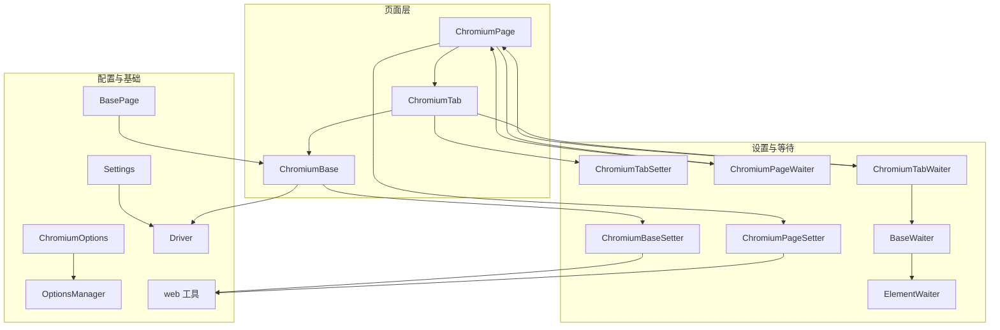
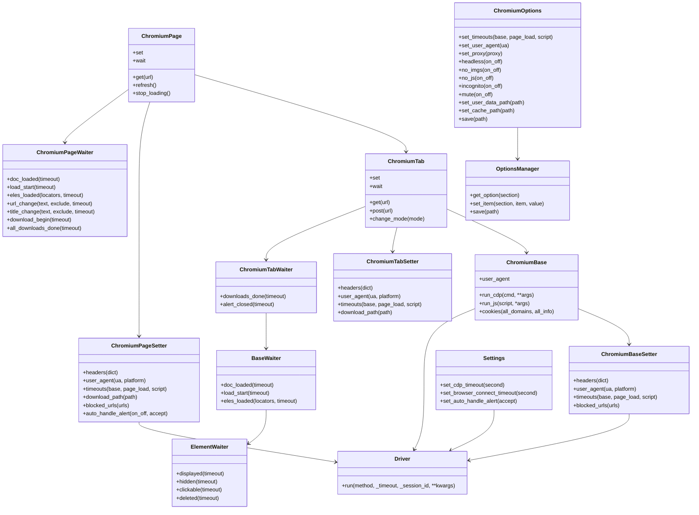
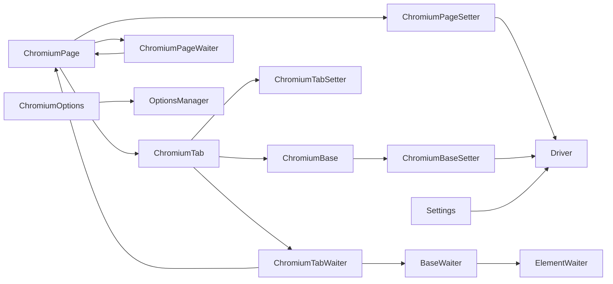

# 页面设置与配置

<cite>
**本文引用的文件列表**
- [chromium_page.py](file://DrissionPage/_pages/chromium_page.py)
- [chromium_base.py](file://DrissionPage/_pages/chromium_base.py)
- [chromium_tab.py](file://DrissionPage/_pages/chromium_tab.py)
- [setter.py](file://DrissionPage/_units/setter.py)
- [waiter.py](file://DrissionPage/_units/waiter.py)
- [chromium_options.py](file://DrissionPage/_configs/chromium_options.py)
- [options_manage.py](file://DrissionPage/_configs/options_manage.py)
- [settings.py](file://DrissionPage/_functions/settings.py)
- [base.py](file://DrissionPage/_base/base.py)
- [driver.py](file://DrissionPage/_base/driver.py)
- [web.py](file://DrissionPage/_functions/web.py)
</cite>

## 目录
1. [简介](#简介)
2. [项目结构](#项目结构)
3. [核心组件](#核心组件)
4. [架构总览](#架构总览)
5. [详细组件分析](#详细组件分析)
6. [依赖关系分析](#依赖关系分析)
7. [性能考量](#性能考量)
8. [故障排除指南](#故障排除指南)
9. [结论](#结论)
10. [附录：配置示例与最佳实践](#附录配置示例与最佳实践)

## 简介
本文件系统性梳理 DrissionPage 中 ChromiumPage 的页面设置与配置能力，覆盖以下主题：
- 页面加载设置（加载模式、超时设置）
- 请求头与用户代理设置
- 等待机制（元素等待、页面加载等待、网络请求等待、下载等待等）
- 页面行为配置（JavaScript 启用/禁用、Cookie 设置、用户代理、图片/音频静音、隐身模式等）
- 页面渲染与性能优化（图片禁用、缓存目录、无头模式等）
- 最佳实践与性能调优建议
- 常见问题与限制说明

## 项目结构
围绕 ChromiumPage 的页面设置与等待，涉及以下关键模块：
- 页面类族：ChromiumPage、ChromiumTab、ChromiumBase
- 设置器：ChromiumPageSetter、ChromiumTabSetter、ChromiumBaseSetter
- 等待器：ChromiumPageWaiter、ChromiumTabWaiter、BaseWaiter、ElementWaiter
- 配置项：ChromiumOptions、OptionsManager
- 基础设施：BasePage、Messenger、Driver、Settings、web 工具

图表来源
- [chromium_page.py:17-103](file://DrissionPage/_pages/chromium_page.py#L17-L103)
- [chromium_tab.py:22-238](file://DrissionPage/_pages/chromium_tab.py#L22-L238)
- [chromium_base.py:39-921](file://DrissionPage/_pages/chromium_base.py#L39-L921)
- [setter.py:167-619](file://DrissionPage/_units/setter.py#L167-L619)
- [waiter.py:85-433](file://DrissionPage/_units/waiter.py#L85-L433)
- [chromium_options.py:16-417](file://DrissionPage/_configs/chromium_options.py#L16-L417)
- [options_manage.py:15-143](file://DrissionPage/_configs/options_manage.py#L15-L143)
- [base.py:270-434](file://DrissionPage/_base/base.py#L270-L434)
- [driver.py:24-227](file://DrissionPage/_base/driver.py#L24-L227)
- [web.py:304-349](file://DrissionPage/_functions/web.py#L304-L349)

章节来源
- [chromium_page.py:17-103](file://DrissionPage/_pages/chromium_page.py#L17-L103)
- [chromium_tab.py:22-238](file://DrissionPage/_pages/chromium_tab.py#L22-L238)
- [chromium_base.py:39-921](file://DrissionPage/_pages/chromium_base.py#L39-L921)
- [setter.py:167-619](file://DrissionPage/_units/setter.py#L167-L619)
- [waiter.py:85-433](file://DrissionPage/_units/waiter.py#L85-L433)
- [chromium_options.py:16-417](file://DrissionPage/_configs/chromium_options.py#L16-L417)
- [options_manage.py:15-143](file://DrissionPage/_configs/options_manage.py#L15-L143)
- [base.py:270-434](file://DrissionPage/_base/base.py#L270-L434)
- [driver.py:24-227](file://DrissionPage/_base/driver.py#L24-L227)
- [web.py:304-349](file://DrissionPage/_functions/web.py#L304-L349)

## 核心组件
- ChromiumPage：页面入口，提供 set 与 wait 属性，封装 ChromiumTab 的能力，并管理浏览器实例。
- ChromiumTab：会话与驱动桥接，支持 d/s 模式切换、超时与重试策略继承自浏览器。
- ChromiumBase：页面事件监听、CDP 连接、文档获取、加载状态机等。
- ChromiumPageSetter/ChromiumTabSetter/ChromiumBaseSetter：统一的设置入口，涵盖请求头、UA、Cookie、超时、下载路径、窗口控制、滚动行为等。
- ChromiumPageWaiter/ChromiumTabWaiter/BaseWaiter/ElementWaiter：等待体系，覆盖元素状态、页面加载、URL/标题变化、下载完成、弹窗处理等。
- ChromiumOptions/OptionsManager：浏览器启动参数、偏好、超时、代理、下载路径等配置持久化与读取。
- Settings/Driver/web 工具：全局设置、CDP 超时、连接错误处理、请求头格式化、代理解析等。

章节来源
- [chromium_page.py:17-103](file://DrissionPage/_pages/chromium_page.py#L17-L103)
- [chromium_tab.py:22-238](file://DrissionPage/_pages/chromium_tab.py#L22-L238)
- [chromium_base.py:39-921](file://DrissionPage/_pages/chromium_base.py#L39-L921)
- [setter.py:167-619](file://DrissionPage/_units/setter.py#L167-L619)
- [waiter.py:85-433](file://DrissionPage/_units/waiter.py#L85-L433)
- [chromium_options.py:16-417](file://DrissionPage/_configs/chromium_options.py#L16-L417)
- [options_manage.py:15-143](file://DrissionPage/_configs/options_manage.py#L15-L143)
- [settings.py:13-69](file://DrissionPage/_functions/settings.py#L13-L69)
- [driver.py:24-227](file://DrissionPage/_base/driver.py#L24-L227)
- [web.py:304-349](file://DrissionPage/_functions/web.py#L304-L349)

## 架构总览
ChromiumPage 通过组合模式提供 set/wait 访问器，内部委托给对应 Setter/Waiter；Setter 将高层配置映射到 CDP 或 Session 层；Waiter 则基于事件与轮询实现等待逻辑；ChromiumOptions 提供默认配置并通过 OptionsManager 读写 ini 文件；Settings 控制全局行为；Driver 负责与浏览器 CDP 通信。

图表来源
- [chromium_page.py:17-103](file://DrissionPage/_pages/chromium_page.py#L17-L103)
- [chromium_tab.py:22-238](file://DrissionPage/_pages/chromium_tab.py#L22-L238)
- [chromium_base.py:39-921](file://DrissionPage/_pages/chromium_base.py#L39-L921)
- [setter.py:167-619](file://DrissionPage/_units/setter.py#L167-L619)
- [waiter.py:85-433](file://DrissionPage/_units/waiter.py#L85-L433)
- [chromium_options.py:16-417](file://DrissionPage/_configs/chromium_options.py#L16-L417)
- [options_manage.py:15-143](file://DrissionPage/_configs/options_manage.py#L15-L143)
- [settings.py:13-69](file://DrissionPage/_functions/settings.py#L13-L69)
- [driver.py:24-227](file://DrissionPage/_base/driver.py#L24-L227)

章节来源
- [chromium_page.py:17-103](file://DrissionPage/_pages/chromium_page.py#L17-L103)
- [chromium_tab.py:22-238](file://DrissionPage/_pages/chromium_tab.py#L22-L238)
- [chromium_base.py:39-921](file://DrissionPage/_pages/chromium_base.py#L39-L921)
- [setter.py:167-619](file://DrissionPage/_units/setter.py#L167-L619)
- [waiter.py:85-433](file://DrissionPage/_units/waiter.py#L85-L433)
- [chromium_options.py:16-417](file://DrissionPage/_configs/chromium_options.py#L16-L417)
- [options_manage.py:15-143](file://DrissionPage/_configs/options_manage.py#L15-L143)
- [settings.py:13-69](file://DrissionPage/_functions/settings.py#L13-L69)
- [driver.py:24-227](file://DrissionPage/_base/driver.py#L24-L227)

## 详细组件分析

### 页面设置属性（set）详解
- 请求头设置
  - 作用：通过 Network.setExtraHTTPHeaders 设置请求头，适用于 Chromium 模式。
  - 使用位置：ChromiumBaseSetter.headers、ChromiumTabSetter.headers、ChromiumPageSetter.headers。
  - 注意：需要先启用 Network.enable。
- 用户代理设置
  - 作用：通过 Emulation.setUserAgentOverride 设置 UA，可选平台参数。
  - 使用位置：ChromiumBaseSetter.user_agent、ChromiumTabSetter.user_agent、ChromiumPageSetter.user_agent。
- 超时设置
  - 作用：统一设置 base/page_load/script 三类超时，影响等待器与脚本执行。
  - 使用位置：ChromiumBaseSetter.timeouts、ChromiumTabSetter.timeouts、ChromiumPageSetter.timeouts。
- Cookie 设置
  - 作用：通过 DOMStorage 或浏览器级 Cookie 接口设置 sessionStorage/localStorage 或 Cookie。
  - 使用位置：ChromiumBaseSetter.session_storage、ChromiumBaseSetter.local_storage、ChromiumBaseSetter.cookies。
- 下载路径与命名
  - 作用：设置下载保存路径、文件名重命名策略、文件冲突处理。
  - 使用位置：ChromiumTabSetter.download_path、ChromiumTabSetter.download_file_name、ChromiumTabSetter.when_download_file_exists。
- 弹窗自动处理
  - 作用：设置自动接受/拒绝弹窗或关闭。
  - 使用位置：ChromiumBaseSetter.auto_handle_alert、ChromiumTabSetter.auto_handle_alert。
- 阻止 URL
  - 作用：通过 Network.setBlockedURLs 阻断特定资源请求。
  - 使用位置：ChromiumBaseSetter.blocked_urls。
- 窗口控制
  - 作用：最大化、最小化、全屏、尺寸调整、位置移动、显示/隐藏。
  - 使用位置：setter.py 中 WindowSetter。
- 滚动行为
  - 作用：平滑滚动、等待滚动完成。
  - 使用位置：setter.py 中 PageScrollSetter。

章节来源
- [setter.py:167-619](file://DrissionPage/_units/setter.py#L167-L619)
- [chromium_base.py:376-398](file://DrissionPage/_pages/chromium_base.py#L376-L398)
- [chromium_tab.py:124-142](file://DrissionPage/_pages/chromium_tab.py#L124-L142)

### 等待机制（wait）详解
- 页面加载等待
  - doc_loaded：等待文档加载完成（readyState 完成）。
  - load_start：等待页面开始加载。
- 元素等待
  - eles_loaded：等待一组定位器匹配到元素集合。
  - ElementWaiter：元素显示/隐藏、可点击、删除、停止移动等。
- URL/标题变化等待
  - url_change、title_change：等待 URL/标题包含/排除指定文本。
- 下载等待
  - download_begin：等待下载开始。
  - downloads_done：等待当前标签页下载完成。
  - all_downloads_done：等待浏览器所有下载完成。
- 弹窗等待
  - alert_closed：等待弹窗关闭。

章节来源
- [waiter.py:85-433](file://DrissionPage/_units/waiter.py#L85-L433)
- [chromium_base.py:164-234](file://DrissionPage/_pages/chromium_base.py#L164-L234)

### 页面行为配置
- JavaScript 启用/禁用
  - 通过 set.no_js/on/off 控制。
- 图片禁用
  - 通过 set.no_imgs 控制。
- 音频静音
  - 通过 set.mute 控制。
- 隐身模式
  - 通过 set.incognito 控制。
- 证书错误忽略
  - 通过 set.ignore_certificate_errors 控制。
- 用户数据目录与缓存目录
  - 通过 set_user_data_path、set_cache_path 控制。
- 无头模式
  - 通过 set.headless 控制。
- 代理
  - 通过 set.set_proxy 控制。

章节来源
- [chromium_options.py:261-358](file://DrissionPage/_configs/chromium_options.py#L261-L358)
- [chromium_options.py:293-296](file://DrissionPage/_configs/chromium_options.py#L293-L296)

### 页面渲染设置与性能优化
- 图片禁用：减少带宽与渲染开销。
- 静音：避免音频干扰。
- 无头模式：提升稳定性与吞吐量。
- 缓存目录：控制磁盘占用与缓存命中。
- 加载模式：normal/eager/none 影响等待策略与性能。
- 重试策略：重试次数与间隔可配置。

章节来源
- [chromium_options.py:265-288](file://DrissionPage/_configs/chromium_options.py#L265-L288)
- [chromium_options.py:298-303](file://DrissionPage/_configs/chromium_options.py#L298-L303)
- [chromium_options.py:166-171](file://DrissionPage/_configs/chromium_options.py#L166-L171)
- [chromium_options.py:74-84](file://DrissionPage/_configs/chromium_options.py#L74-L84)

### 配置持久化与读取
- ChromiumOptions：集中管理启动参数、偏好、超时、代理、下载路径等。
- OptionsManager：INI 文件读写、默认值生成、节与键管理。
- 默认配置：包含 arguments、extensions、prefs、flags、load_mode、timeouts、proxies、others 等。

章节来源
- [chromium_options.py:16-417](file://DrissionPage/_configs/chromium_options.py#L16-L417)
- [options_manage.py:15-143](file://DrissionPage/_configs/options_manage.py#L15-L143)

### CDP 与连接细节
- Driver：负责 WebSocket 连接、消息发送/接收、超时与异常处理。
- Settings：全局 CDP 超时、连接超时、语言、调试开关等。
- Messenger：事件队列、回调注册、事件分发。

章节来源
- [driver.py:24-227](file://DrissionPage/_base/driver.py#L24-L227)
- [settings.py:13-69](file://DrissionPage/_functions/settings.py#L13-L69)
- [chromium_base.py:376-434](file://DrissionPage/_pages/chromium_base.py#L376-L434)

## 依赖关系分析
- 页面类族：ChromiumPage 组合 ChromiumTab，ChromiumTab 继承 ChromiumBase 与 SessionPage。
- 设置器：ChromiumPageSetter/ChromiumTabSetter/ChromiumBaseSetter 分别面向页面、标签、基础能力，均依赖 CDP 与 Session。
- 等待器：ChromiumPageWaiter/ChromiumTabWaiter 基于 BaseWaiter，ElementWaiter 依赖元素状态查询。
- 配置：ChromiumOptions 通过 OptionsManager 读写 ini；Settings 控制全局行为。
- 基础设施：BasePage 提供通用接口；Driver/Messenger 提供 CDP 通道。

图表来源
- [chromium_page.py:17-103](file://DrissionPage/_pages/chromium_page.py#L17-L103)
- [chromium_tab.py:22-238](file://DrissionPage/_pages/chromium_tab.py#L22-L238)
- [chromium_base.py:39-921](file://DrissionPage/_pages/chromium_base.py#L39-L921)
- [setter.py:167-619](file://DrissionPage/_units/setter.py#L167-L619)
- [waiter.py:85-433](file://DrissionPage/_units/waiter.py#L85-L433)
- [chromium_options.py:16-417](file://DrissionPage/_configs/chromium_options.py#L16-L417)
- [options_manage.py:15-143](file://DrissionPage/_configs/options_manage.py#L15-L143)
- [settings.py:13-69](file://DrissionPage/_functions/settings.py#L13-L69)
- [driver.py:24-227](file://DrissionPage/_base/driver.py#L24-L227)

章节来源
- [chromium_page.py:17-103](file://DrissionPage/_pages/chromium_page.py#L17-L103)
- [chromium_tab.py:22-238](file://DrissionPage/_pages/chromium_tab.py#L22-L238)
- [chromium_base.py:39-921](file://DrissionPage/_pages/chromium_base.py#L39-L921)
- [setter.py:167-619](file://DrissionPage/_units/setter.py#L167-L619)
- [waiter.py:85-433](file://DrissionPage/_units/waiter.py#L85-L433)
- [chromium_options.py:16-417](file://DrissionPage/_configs/chromium_options.py#L16-L417)
- [options_manage.py:15-143](file://DrissionPage/_configs/options_manage.py#L15-L143)
- [settings.py:13-69](file://DrissionPage/_functions/settings.py#L13-L69)
- [driver.py:24-227](file://DrissionPage/_base/driver.py#L24-L227)

## 性能考量
- 减少资源加载：禁用图片、静音、禁用 JS（按需）。
- 控制缓存：合理设置缓存目录与清理策略。
- 无头模式：提升吞吐与稳定性。
- 等待策略：根据场景选择 eager/none，避免过度等待。
- 超时与重试：平衡稳定性与响应速度。
- 下载并发：合理设置下载路径与命名，避免磁盘争用。

[本节为通用指导，无需具体文件引用]

## 故障排除指南
- 连接失败
  - 现象：无法连接浏览器或握手失败。
  - 排查：检查地址、端口、权限；确认浏览器版本兼容；查看 Settings 中连接超时。
  - 参考：Driver 启动与异常处理。
- 等待超时
  - 现象：doc_loaded/eles_loaded/url_change/title_change 等等待失败。
  - 排查：增大超时、检查加载模式、确认网络与资源可用性。
  - 参考：BaseWaiter._loading、wait_mission。
- 弹窗阻塞
  - 现象：操作被弹窗阻塞。
  - 排查：设置 auto_handle_alert 或手动处理。
  - 参考：ChromiumBaseSetter.auto_handle_alert、ChromiumTabWaiter.alert_closed。
- 请求头未生效
  - 现象：请求头未被服务端识别。
  - 排查：确认已启用 Network.enable 并正确格式化；注意大小写与冒号前缀过滤。
  - 参考：web.format_headers。
- 下载未触发
  - 现象：download_begin 一直等待。
  - 排查：确认已设置下载路径；检查下载管理器状态。
  - 参考：ChromiumTabWaiter.download_begin、ChromiumPageWaiter.all_downloads_done。

章节来源
- [driver.py:120-153](file://DrissionPage/_base/driver.py#L120-L153)
- [waiter.py:164-234](file://DrissionPage/_units/waiter.py#L164-L234)
- [waiter.py:237-276](file://DrissionPage/_units/waiter.py#L237-L276)
- [web.py:304-318](file://DrissionPage/_functions/web.py#L304-L318)
- [chromium_base.py:164-234](file://DrissionPage/_pages/chromium_base.py#L164-L234)

## 结论
ChromiumPage 的设置与等待体系以“设置器 + 等待器 + 配置 + 基础设施”为核心，既保证了灵活性（可按页面/标签/基础能力分别设置），又提供了统一的等待语义与稳定的 CDP 通道。通过合理配置加载模式、超时、资源策略与等待策略，可在稳定性与性能之间取得良好平衡。

[本节为总结，无需具体文件引用]

## 附录：配置示例与最佳实践

### 页面加载设置
- 正常模式（normal）：等待 DOMContentLoaded 与 load 事件，适合大多数场景。
- 激进模式（eager）：在 DOMContentLoaded 后即认为完成，适合快速响应。
- 无等待（none）：不等待任何事件，适合异步加载或自定义等待。

章节来源
- [chromium_options.py:298-303](file://DrissionPage/_configs/chromium_options.py#L298-L303)
- [chromium_base.py:188-198](file://DrissionPage/_pages/chromium_base.py#L188-L198)

### 超时设置
- 基础超时：影响等待器默认等待时间。
- 页面加载超时：影响页面导航与加载等待。
- 脚本执行超时：影响 JS 执行等待。

章节来源
- [chromium_options.py:246-254](file://DrissionPage/_configs/chromium_options.py#L246-L254)
- [chromium_tab.py:118-120](file://DrissionPage/_pages/chromium_tab.py#L118-L120)

### 请求头与用户代理
- 请求头：通过 set.headers 设置，注意大小写与冒号前缀过滤。
- 用户代理：通过 set.user_agent 设置，可选平台参数。

章节来源
- [setter.py:182-190](file://DrissionPage/_units/setter.py#L182-L190)
- [web.py:304-318](file://DrissionPage/_functions/web.py#L304-L318)

### 等待机制使用
- 页面加载：wait.doc_loaded()/wait.load_start()
- 元素：wait.eles_loaded()/ElementWaiter.displayed()/clickable()
- URL/标题：wait.url_change()/wait.title_change()
- 下载：wait.download_begin()/wait.downloads_done()/wait.all_downloads_done()

章节来源
- [waiter.py:85-433](file://DrissionPage/_units/waiter.py#L85-L433)

### 页面行为配置
- 禁用图片：set.no_imgs(True)
- 禁用 JS：set.no_js(True)
- 静音：set.mute(True)
- 隐身：set.incognito(True)
- 证书错误忽略：set.ignore_certificate_errors(True)
- 无头：set.headless(True)
- 代理：set.set_proxy("http://host:port[/user:pwd]")

章节来源
- [chromium_options.py:265-288](file://DrissionPage/_configs/chromium_options.py#L265-L288)
- [chromium_options.py:293-296](file://DrissionPage/_configs/chromium_options.py#L293-L296)

### 渲染与性能优化
- 禁用图片：set.no_imgs(True)
- 设置缓存目录：set.set_cache_path(path)
- 设置用户数据目录：set.set_user_data_path(path)
- 无头模式：set.headless(True)

章节来源
- [chromium_options.py:265-288](file://DrissionPage/_configs/chromium_options.py#L265-L288)
- [chromium_options.py:340-348](file://DrissionPage/_configs/chromium_options.py#L340-L348)
- [chromium_options.py:340-344](file://DrissionPage/_configs/chromium_options.py#L340-L344)

### 最佳实践
- 明确等待策略：根据页面类型选择 normal/eager/none。
- 合理设置超时：基础超时与页面加载超时分开配置。
- 资源控制：在测试环境禁用图片与静音，减少干扰。
- 下载管理：提前设置下载路径与命名规则，避免冲突。
- 弹窗处理：统一设置自动处理策略，避免阻塞。

[本节为通用指导，无需具体文件引用]