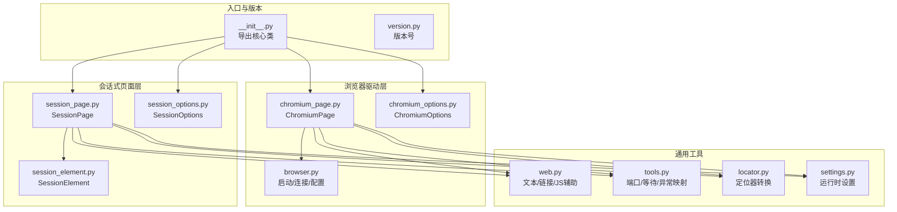
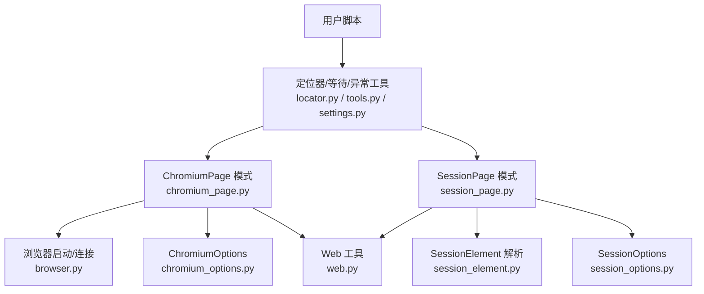
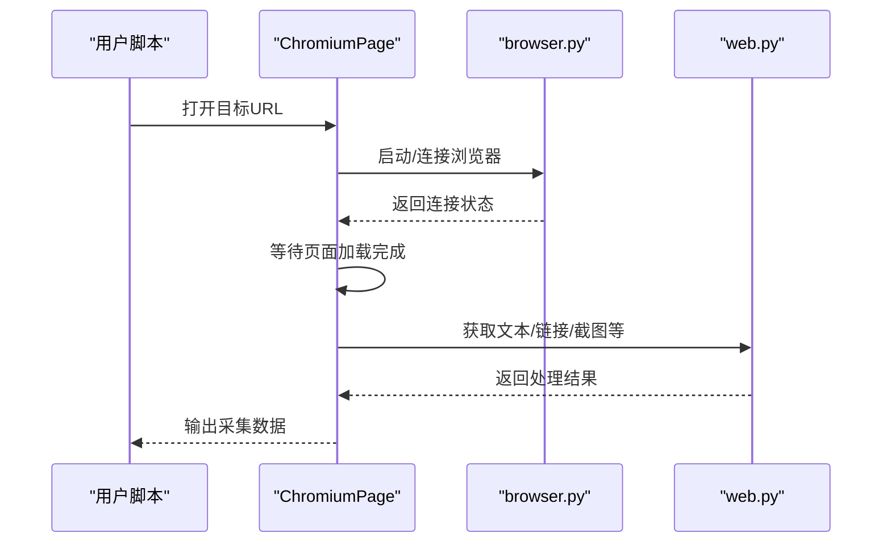
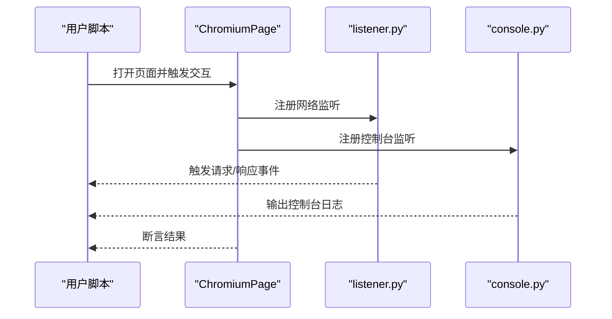
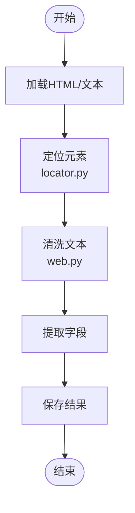
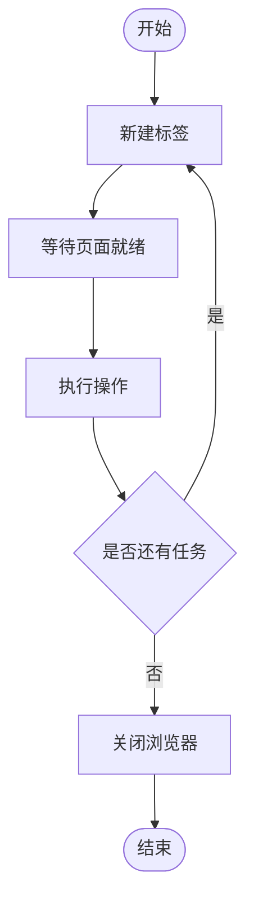
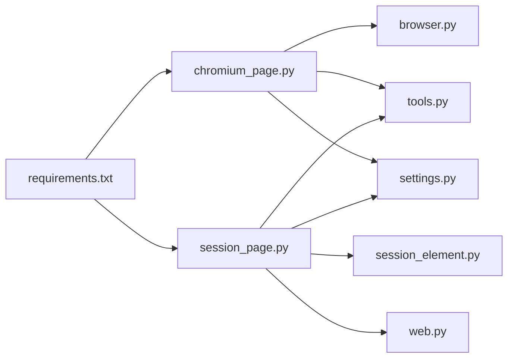

# 应用场景

<cite>
**本文引用的文件**
- [__init__.py](file://DrissionPage/__init__.py)
- [version.py](file://DrissionPage/version.py)
- [common.py](file://DrissionPage/common.py)
- [requirements.txt](file://requirements.txt)
- [browser.py](file://DrissionPage/_functions/browser.py)
- [chromium_page.py](file://DrissionPage/_pages/chromium_page.py)
- [session_page.py](file://DrissionPage/_pages/session_page.py)
- [session_element.py](file://DrissionPage/_elements/session_element.py)
- [web.py](file://DrissionPage/_functions/web.py)
- [tools.py](file://DrissionPage/_functions/tools.py)
- [chromium_options.py](file://DrissionPage/_configs/chromium_options.py)
- [session_options.py](file://DrissionPage/_configs/session_options.py)
- [chromium_element.py](file://DrissionPage/_elements/chromium_element.py)
- [chromium_base.py](file://DrissionPage/_pages/chromium_base.py)
- [listener.py](file://DrissionPage/_units/listener.py)
- [console.py](file://DrissionPage/_units/console.py)
- [driver.py](file://DrissionPage/_base/driver.py)
- [settings.py](file://DrissionPage/_functions/settings.py)
- [settings.pyi](file://DrissionPage/_functions/settings.pyi)
- [locator.py](file://DrissionPage/_functions/locator.py)
</cite>

## 目录
1. [简介](#简介)
2. [项目结构](#项目结构)
3. [核心组件](#核心组件)
4. [架构总览](#架构总览)
5. [详细组件分析](#详细组件分析)
6. [依赖分析](#依赖分析)
7. [性能考虑](#性能考虑)
8. [故障排查指南](#故障排查指南)
9. [结论](#结论)
10. [附录](#附录)

## 简介
本文件面向希望在不同行业与技术层次下使用 DrissionPage 的用户，系统化梳理其在网页爬虫、自动化测试、数据采集、批量操作等典型场景中的适用性，并结合代码实现给出可落地的实践建议。文档同时覆盖跨平台兼容性、资源占用、错误处理与性能调优要点，帮助用户快速判断是否适合自身需求。

## 项目结构
DrissionPage 提供两类主要能力：
- Chromium 浏览器驱动：通过远程调试接口控制真实浏览器，适合需要渲染、交互、下载、监听网络与控制台等场景。
- 会话式页面（SessionPage）：基于 HTTP 会话与解析库，适合纯数据抓取、轻量解析与低资源占用场景。

图表来源
- [__init__.py:1-29](file://DrissionPage/__init__.py#L1-L29)
- [chromium_page.py:1-103](file://DrissionPage/_pages/chromium_page.py#L1-L103)
- [session_page.py:1-200](file://DrissionPage/_pages/session_page.py#L1-L200)
- [browser.py:24-87](file://DrissionPage/_functions/browser.py#L24-L87)
- [chromium_options.py:16-85](file://DrissionPage/_configs/chromium_options.py#L16-L85)
- [session_options.py:20-90](file://DrissionPage/_configs/session_options.py#L20-L90)
- [web.py:1-200](file://DrissionPage/_functions/web.py#L1-L200)
- [tools.py:21-77](file://DrissionPage/_functions/tools.py#L21-L77)
- [locator.py:99-148](file://DrissionPage/_functions/locator.py#L99-L148)
- [settings.py:43-68](file://DrissionPage/_functions/settings.py#L43-L68)

章节来源
- [__init__.py:1-29](file://DrissionPage/__init__.py#L1-L29)
- [version.py:1-9](file://DrissionPage/version.py#L1-L9)
- [requirements.txt:1-9](file://requirements.txt#L1-L9)

## 核心组件
- ChromiumPage：封装浏览器标签页操作、多标签管理、等待策略、下载管理等，适合复杂交互与真实渲染场景。
- SessionPage：基于 HTTP 会话与 HTML 解析，适合快速抓取与解析，资源占用更低。
- ChromiumOptions/SessionOptions：统一配置浏览器参数、超时、代理、重试、下载路径等。
- 工具函数：端口发现与占用检测、等待直到条件满足、异常映射、链接与文本处理等。

章节来源
- [chromium_page.py:17-103](file://DrissionPage/_pages/chromium_page.py#L17-L103)
- [session_page.py:25-200](file://DrissionPage/_pages/session_page.py#L25-L200)
- [chromium_options.py:16-200](file://DrissionPage/_configs/chromium_options.py#L16-L200)
- [session_options.py:20-200](file://DrissionPage/_configs/session_options.py#L20-L200)
- [tools.py:21-77](file://DrissionPage/_functions/tools.py#L21-L77)

## 架构总览
DrissionPage 的两种模式分别对应“真实浏览器驱动”和“HTTP 会话解析”，二者共享统一的定位器、等待与异常处理机制，便于在不同场景间切换。

图表来源
- [chromium_page.py:17-103](file://DrissionPage/_pages/chromium_page.py#L17-L103)
- [session_page.py:25-200](file://DrissionPage/_pages/session_page.py#L25-L200)
- [browser.py:24-87](file://DrissionPage/_functions/browser.py#L24-L87)
- [chromium_options.py:16-85](file://DrissionPage/_configs/chromium_options.py#L16-L85)
- [session_options.py:20-90](file://DrissionPage/_configs/session_options.py#L20-L90)
- [session_element.py:23-200](file://DrissionPage/_elements/session_element.py#L23-L200)
- [web.py:1-200](file://DrissionPage/_functions/web.py#L1-L200)
- [locator.py:99-148](file://DrissionPage/_functions/locator.py#L99-L148)
- [settings.py:43-68](file://DrissionPage/_functions/settings.py#L43-L68)

## 详细组件分析

### 场景一：网页爬虫（数据采集）
- 适用模式：ChromiumPage 或 SessionPage 均可；若涉及动态渲染、登录态、反爬对抗，优先 ChromiumPage。
- 关键点：
  - 使用定位器与等待策略，确保 DOM/资源就绪后再提取。
  - 利用 SessionPage 的 HTML 解析与文本清洗，提升解析效率。
  - 通过 ChromiumOptions/SessionOptions 设置代理、超时、重试与下载路径。
- 典型流程（ChromiumPage）：

图表来源
- [chromium_page.py:33-103](file://DrissionPage/_pages/chromium_page.py#L33-L103)
- [browser.py:24-87](file://DrissionPage/_functions/browser.py#L24-L87)
- [web.py:106-158](file://DrissionPage/_functions/web.py#L106-L158)

章节来源
- [chromium_page.py:33-103](file://DrissionPage/_pages/chromium_page.py#L33-L103)
- [session_page.py:104-196](file://DrissionPage/_pages/session_page.py#L104-L196)
- [chromium_options.py:166-200](file://DrissionPage/_configs/chromium_options.py#L166-L200)
- [session_options.py:127-133](file://DrissionPage/_configs/session_options.py#L127-L133)

### 场景二：自动化测试（前端/集成测试）
- 适用模式：ChromiumPage 更合适，可模拟真实用户交互、监听控制台与网络事件。
- 关键点：
  - 使用等待器与断言策略，保证测试稳定性。
  - 通过监听器捕获网络请求与响应，验证接口行为。
  - 控制台日志捕获有助于定位前端问题。
- 典型流程（监听与断言）：

图表来源
- [chromium_page.py:17-103](file://DrissionPage/_pages/chromium_page.py#L17-L103)
- [listener.py:383-427](file://DrissionPage/_units/listener.py#L383-L427)
- [console.py:76-98](file://DrissionPage/_units/console.py#L76-L98)

章节来源
- [listener.py:383-427](file://DrissionPage/_units/listener.py#L383-L427)
- [console.py:76-98](file://DrissionPage/_units/console.py#L76-L98)

### 场景三：数据采集（结构化提取）
- 适用模式：SessionPage + SessionElement，适合静态/半静态页面的结构化提取。
- 关键点：
  - 使用定位器与文本清洗工具，减少噪声。
  - 支持从字符串/HTML 片段生成元素，便于批处理。
- 典型流程（解析与提取）：

图表来源
- [session_element.py:169-200](file://DrissionPage/_elements/session_element.py#L169-L200)
- [web.py:20-104](file://DrissionPage/_functions/web.py#L20-L104)
- [locator.py:99-148](file://DrissionPage/_functions/locator.py#L99-L148)

章节来源
- [session_element.py:23-200](file://DrissionPage/_elements/session_element.py#L23-L200)
- [web.py:106-158](file://DrissionPage/_functions/web.py#L106-L158)

### 场景四：批量操作（多标签/多任务）
- 适用模式：ChromiumPage 的多标签管理与等待器组合，适合并发/流水线式任务。
- 关键点：
  - 使用等待直到工具，避免竞态。
  - 通过选项设置超时与重试，提升鲁棒性。
- 典型流程（多标签与等待）：

图表来源
- [chromium_page.py:82-103](file://DrissionPage/_pages/chromium_page.py#L82-L103)
- [tools.py:139-149](file://DrissionPage/_functions/tools.py#L139-L149)
- [chromium_base.py:896-920](file://DrissionPage/_pages/chromium_base.py#L896-L920)

章节来源
- [chromium_page.py:82-103](file://DrissionPage/_pages/chromium_page.py#L82-L103)
- [tools.py:139-149](file://DrissionPage/_functions/tools.py#L139-L149)

### 行业应用案例（概念性说明）
- 电商：商品详情页结构化采集、价格历史对比、评论情感分析。
- 金融：行情数据抓取、公告与研报下载、反爬策略适配。
- 媒体：新闻聚合、专题页面批量抓取、图片与视频资源下载。
- 教育：课程目录与课件抓取、作业与公告同步。

说明：以上为通用实践建议，具体实现需结合目标站点的反爬策略与数据格式定制。

## 依赖分析
- 外部依赖：requests、lxml、cssselect、DrissionGet、DrissionRecord、websocket-client、click、tldextract、psutil。
- 内部模块耦合：
  - ChromiumPage 依赖 browser.py 进行浏览器启动/连接。
  - SessionPage 依赖 session_element.py 与 web.py 进行解析与文本处理。
  - 两者共享 tools.py 的等待与异常映射、settings.py 的运行时配置。

图表来源
- [requirements.txt:1-9](file://requirements.txt#L1-L9)
- [chromium_page.py:17-103](file://DrissionPage/_pages/chromium_page.py#L17-L103)
- [session_page.py:25-200](file://DrissionPage/_pages/session_page.py#L25-L200)
- [browser.py:24-87](file://DrissionPage/_functions/browser.py#L24-L87)
- [session_element.py:23-200](file://DrissionPage/_elements/session_element.py#L23-L200)
- [web.py:1-200](file://DrissionPage/_functions/web.py#L1-L200)
- [tools.py:21-77](file://DrissionPage/_functions/tools.py#L21-L77)
- [settings.py:43-68](file://DrissionPage/_functions/settings.py#L43-L68)

章节来源
- [requirements.txt:1-9](file://requirements.txt#L1-L9)

## 性能考虑
- 资源占用
  - ChromiumPage：需要启动真实浏览器实例，内存与 CPU 占用较高，适合复杂交互与真实渲染。
  - SessionPage：纯 HTTP 会话与解析，资源占用低，适合大批量、轻量抓取。
- 启动与连接
  - 自动端口分配与占用检测，避免冲突；连接超时可配置。
- 等待与重试
  - 提供等待直到工具与重试配置，降低不稳定环境下的失败率。
- 超时与重试配置
  - ChromiumOptions/SessionOptions 提供统一的超时与重试参数，便于全局调优。

章节来源
- [browser.py:24-87](file://DrissionPage/_functions/browser.py#L24-L87)
- [tools.py:21-77](file://DrissionPage/_functions/tools.py#L21-L77)
- [chromium_options.py:166-200](file://DrissionPage/_configs/chromium_options.py#L166-L200)
- [session_options.py:127-133](file://DrissionPage/_configs/session_options.py#L127-L133)

## 故障排查指南
- 连接与端口
  - 端口被占用或浏览器无法连接：检查端口占用与连接超时设置。
- 异常映射
  - 将底层错误映射为语义化异常，便于定位问题。
- 控制台与网络
  - 使用监听器与控制台捕获，辅助定位前端与接口问题。
- 常见问题
  - 无效 URL、超时、方法不存在、JavaScript 错误等均有明确提示与指引。

章节来源
- [tools.py:157-197](file://DrissionPage/_functions/tools.py#L157-L197)
- [browser.py:192-210](file://DrissionPage/_functions/browser.py#L192-L210)
- [listener.py:383-427](file://DrissionPage/_units/listener.py#L383-L427)
- [console.py:76-98](file://DrissionPage/_units/console.py#L76-L98)

## 结论
- 若需要真实渲染、复杂交互与稳定监听，优先选择 ChromiumPage。
- 若追求低资源占用与高吞吐的结构化数据采集，优先选择 SessionPage。
- 通过统一的定位器、等待与异常处理机制，可在两种模式间灵活切换，满足多样化的业务场景。

## 附录
- 适用条件与限制
  - 需要安装并可访问目标平台的浏览器可执行文件。
  - 在非 Windows 平台隐藏/显示浏览器窗口等功能受限。
- 选择指导
  - 新手：从 SessionPage 开始，熟悉定位器与等待策略后，再迁移至 ChromiumPage。
  - 中级用户：按场景选择模式，结合选项与工具进行性能优化。
  - 高级用户：利用监听器、控制台与 CDP 接口，构建复杂自动化流水线。