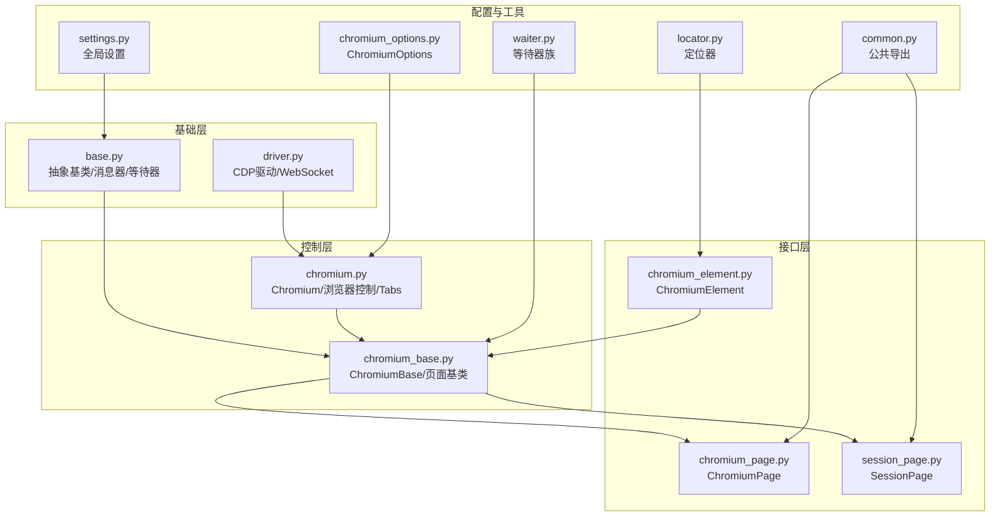
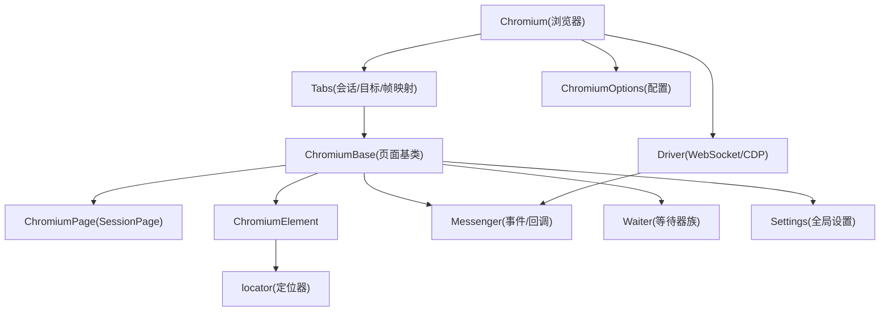
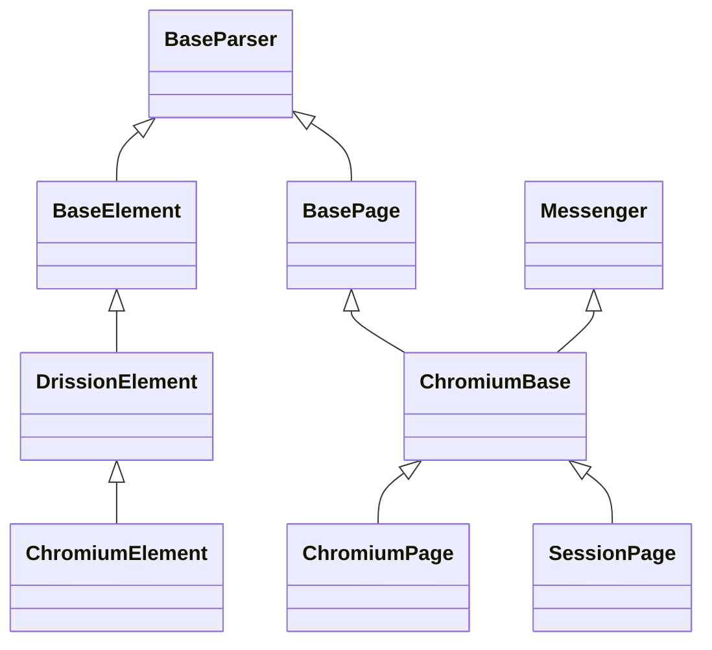
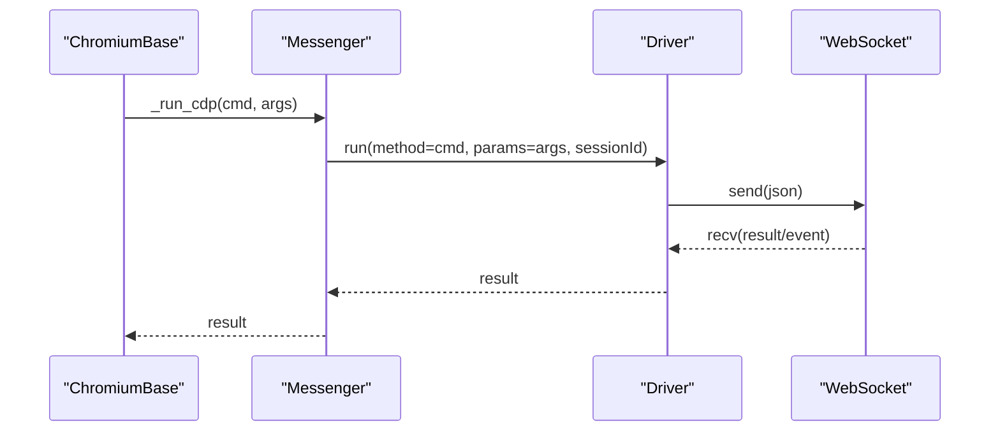
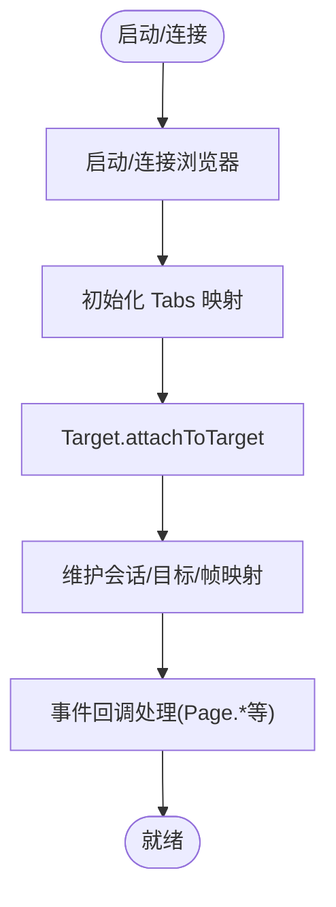
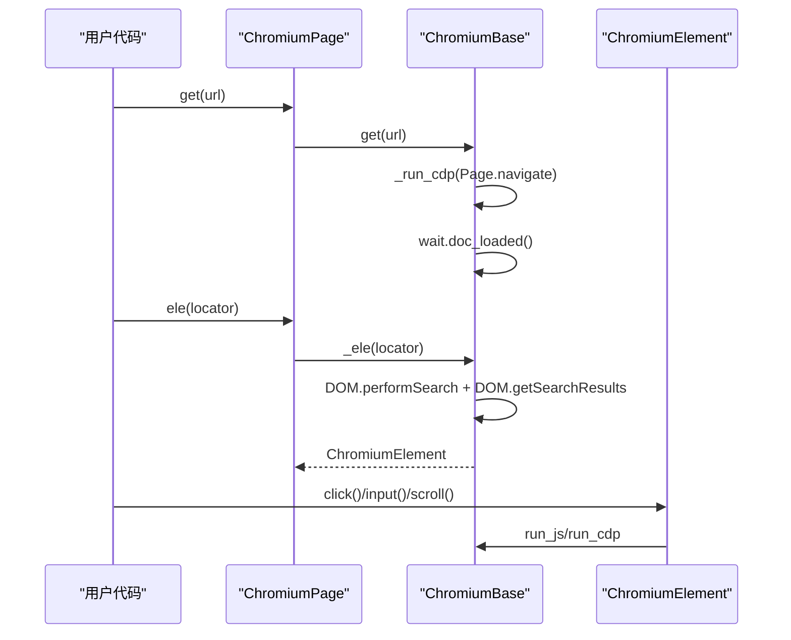
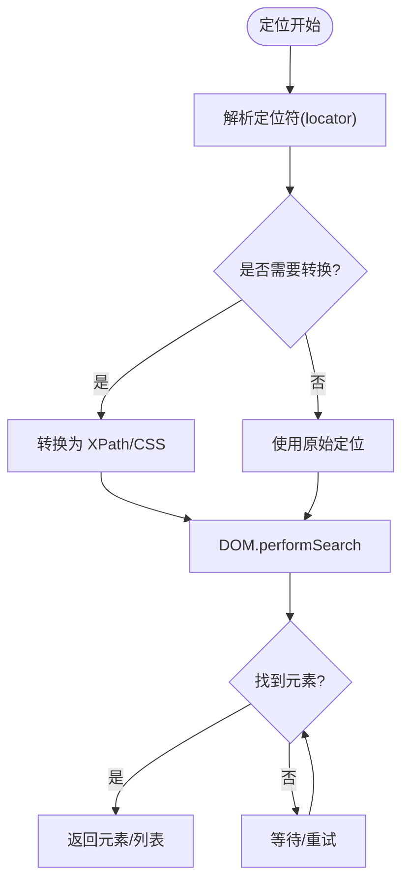
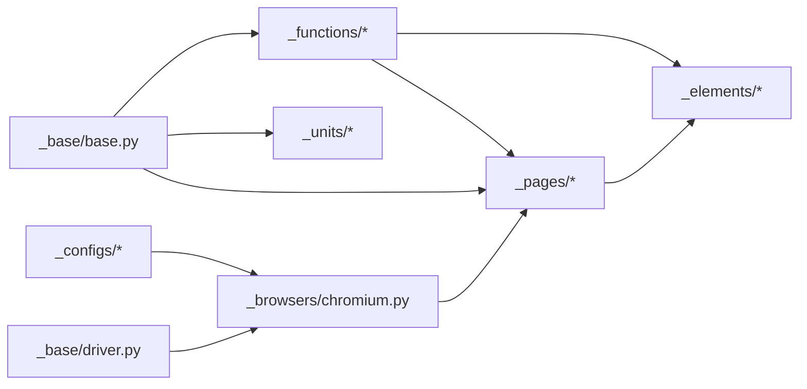

# 技术架构

<cite>
**本文引用的文件列表**
- [__init__.py](file://DrissionPage/__init__.py)
- [base.py](file://DrissionPage/_base/base.py)
- [driver.py](file://DrissionPage/_base/driver.py)
- [chromium_base.py](file://DrissionPage/_pages/chromium_base.py)
- [chromium.py](file://DrissionPage/_browsers/chromium.py)
- [chromium_page.py](file://DrissionPage/_pages/chromium_page.py)
- [session_page.py](file://DrissionPage/_pages/session_page.py)
- [chromium_options.py](file://DrissionPage/_configs/chromium_options.py)
- [chromium_element.py](file://DrissionPage/_elements/chromium_element.py)
- [locator.py](file://DrissionPage/_functions/locator.py)
- [settings.py](file://DrissionPage/_functions/settings.py)
- [waiter.py](file://DrissionPage/_units/waiter.py)
- [common.py](file://DrissionPage/common.py)
</cite>

## 目录
1. [引言](#引言)
2. [项目结构](#项目结构)
3. [核心组件](#核心组件)
4. [架构总览](#架构总览)
5. [详细组件分析](#详细组件分析)
6. [依赖关系分析](#依赖关系分析)
7. [性能考量](#性能考量)
8. [故障排查指南](#故障排查指南)
9. [结论](#结论)
10. [附录](#附录)

## 引言
本文件面向架构师与高级开发者，系统性阐述 DrissionPage 的技术架构与设计思想。重点覆盖分层架构（基础层、控制层、接口层）的职责划分，模块化设计理念与模块间依赖关系，抽象基类与继承体系，以及关键决策（如 CDP 协议选择、内存与连接管理策略）。文中通过多种图示展示数据流与控制流，并提供深度技术洞察与实践建议。

## 项目结构
DrissionPage 采用“按功能域分层 + 模块化”的组织方式：
- 基础层：通用抽象与基础设施（驱动、消息器、等待器等）
- 控制层：浏览器与标签页控制逻辑（Chromium、Tabs 管理、事件回调）
- 接口层：页面与元素 API（ChromiumPage、SessionPage、ChromiumElement 等）
- 配置与工具：选项配置、定位器、设置、公共导出

图表来源
- [base.py:29-434](file://DrissionPage/_base/base.py#L29-L434)
- [driver.py:24-227](file://DrissionPage/_base/driver.py#L24-L227)
- [chromium.py:33-730](file://DrissionPage/_browsers/chromium.py#L33-L730)
- [chromium_base.py:39-921](file://DrissionPage/_pages/chromium_base.py#L39-L921)
- [chromium_page.py:17-103](file://DrissionPage/_pages/chromium_page.py#L17-L103)
- [session_page.py:25-294](file://DrissionPage/_pages/session_page.py#L25-L294)
- [chromium_options.py:16-417](file://DrissionPage/_configs/chromium_options.py#L16-L417)
- [chromium_element.py:38-1439](file://DrissionPage/_elements/chromium_element.py#L38-L1439)
- [locator.py:96-579](file://DrissionPage/_functions/locator.py#L96-L579)
- [settings.py:13-69](file://DrissionPage/_functions/settings.py#L13-L69)
- [waiter.py:15-433](file://DrissionPage/_units/waiter.py#L15-L433)
- [common.py:8-57](file://DrissionPage/common.py#L8-L57)

章节来源
- [__init__.py:22-28](file://DrissionPage/__init__.py#L22-L28)
- [chromium.py:33-120](file://DrissionPage/_browsers/chromium.py#L33-L120)
- [chromium_base.py:39-120](file://DrissionPage/_pages/chromium_base.py#L39-L120)
- [chromium_page.py:17-40](file://DrissionPage/_pages/chromium_page.py#L17-L40)
- [session_page.py:25-45](file://DrissionPage/_pages/session_page.py#L25-L45)
- [chromium_options.py:16-85](file://DrissionPage/_configs/chromium_options.py#L16-L85)
- [chromium_element.py:38-70](file://DrissionPage/_elements/chromium_element.py#L38-L70)
- [locator.py:96-115](file://DrissionPage/_functions/locator.py#L96-L115)
- [settings.py:13-24](file://DrissionPage/_functions/settings.py#L13-L24)
- [waiter.py:85-170](file://DrissionPage/_units/waiter.py#L85-L170)
- [common.py:8-19](file://DrissionPage/common.py#L8-L19)

## 核心组件
- 抽象基类与消息器
  - BaseParser、BaseElement、DrissionElement、BasePage：定义统一的元素与页面抽象，提供定位、等待、错误处理等通用能力。
  - Messenger：封装 CDP 会话、事件队列、回调注册、调试开关，统一事件接收与分发。
- CDP 驱动
  - Driver/DebugDriver：基于 WebSocket 与 CDP 协议，负责命令发送、结果等待、事件分发、断线处理。
- 浏览器与标签页控制
  - Chromium：浏览器生命周期、上下文管理、Target 管理、下载管理、事件回调。
  - Tabs：会话/目标/帧映射、代理、上下文关联、对象持有。
- 页面与元素 API
  - ChromiumBase：Chromium 页面的统一能力（CDP 调用、文档树、事件、等待、动作、截图等）。
  - ChromiumPage、SessionPage：对外暴露的页面入口，前者基于浏览器，后者基于 HTTP 会话。
  - ChromiumElement：DOM 元素能力（属性、文本、样式、滚动、点击、上传等）。
- 配置与工具
  - ChromiumOptions：启动参数、超时、代理、用户数据目录等配置。
  - locator：定位器解析与转换（支持自定义语法、CSS/XPath 转换）。
  - Settings：全局运行参数（超时、语言、单例对象、自动弹窗处理等）。
  - Waiter：统一的等待器族，覆盖浏览器、标签页、元素、下载等场景。

章节来源
- [base.py:29-434](file://DrissionPage/_base/base.py#L29-L434)
- [driver.py:24-227](file://DrissionPage/_base/driver.py#L24-L227)
- [chromium.py:33-120](file://DrissionPage/_browsers/chromium.py#L33-L120)
- [chromium_base.py:39-120](file://DrissionPage/_pages/chromium_base.py#L39-L120)
- [chromium_page.py:17-40](file://DrissionPage/_pages/chromium_page.py#L17-L40)
- [session_page.py:25-45](file://DrissionPage/_pages/session_page.py#L25-L45)
- [chromium_element.py:38-70](file://DrissionPage/_elements/chromium_element.py#L38-L70)
- [chromium_options.py:16-85](file://DrissionPage/_configs/chromium_options.py#L16-L85)
- [locator.py:96-115](file://DrissionPage/_functions/locator.py#L96-L115)
- [settings.py:13-24](file://DrissionPage/_functions/settings.py#L13-L24)
- [waiter.py:85-170](file://DrissionPage/_units/waiter.py#L85-L170)

## 架构总览
DrissionPage 的整体架构遵循“分层解耦 + 组合扩展”的设计原则：
- 分层架构
  - 基础层：提供跨页面/元素的通用抽象与基础设施（Driver/Messenger/Waiter/Settings）。
  - 控制层：浏览器与标签页控制（Chromium/Tabs），负责与浏览器进程建立连接并维护会话。
  - 接口层：页面与元素 API（ChromiumPage/SessionPage/ChromiumElement），对外提供一致的编程模型。
- 模块化设计
  - 各模块职责清晰，通过组合而非继承实现扩展；例如 ChromiumBase 组合了 Messenger、Waiter、Setter 等“挂件”。
- 关键技术决策
  - CDP 协议：直接使用 Chrome DevTools Protocol，确保与 Chromium 内核的强一致性与高可控性。
  - 事件驱动：通过 WebSocket 接收浏览器事件，结合队列与回调机制实现异步处理。
  - 等待器体系：统一的等待器族，覆盖页面加载、元素状态、下载、弹窗等场景，提升稳定性与可测试性。

图表来源
- [chromium.py:33-120](file://DrissionPage/_browsers/chromium.py#L33-L120)
- [chromium_base.py:39-120](file://DrissionPage/_pages/chromium_base.py#L39-L120)
- [chromium_page.py:17-40](file://DrissionPage/_pages/chromium_page.py#L17-L40)
- [session_page.py:25-45](file://DrissionPage/_pages/session_page.py#L25-L45)
- [chromium_element.py:38-70](file://DrissionPage/_elements/chromium_element.py#L38-L70)
- [driver.py:24-139](file://DrissionPage/_base/driver.py#L24-L139)
- [chromium_options.py:16-85](file://DrissionPage/_configs/chromium_options.py#L16-L85)
- [locator.py:96-115](file://DrissionPage/_functions/locator.py#L96-L115)
- [settings.py:13-24](file://DrissionPage/_functions/settings.py#L13-L24)
- [waiter.py:85-170](file://DrissionPage/_units/waiter.py#L85-L170)

## 详细组件分析

### 抽象基类与继承体系
- 继承层次
  - BaseParser：统一定位入口（ele/eles/find），屏蔽具体实现差异。
  - BaseElement/DrissionElement：元素抽象，提供相对定位、文本提取、属性访问等通用能力。
  - BasePage：页面抽象，提供 get/url/title/json 等通用能力。
  - ChromiumBase：在 BasePage/Messenger 基础上，接入 CDP 事件与 DOM 能力。
  - ChromiumPage/SessionPage：对外页面入口，分别基于浏览器与 HTTP 会话。
  - ChromiumElement：DOM 元素能力，提供属性、样式、滚动、点击、上传等。
- 设计要点
  - 通过抽象方法与属性约束子类实现，保证不同页面/元素类型的一致行为。
  - 使用“挂件”模式（setter、waiter、rect、scroll 等）延迟初始化，降低内存占用与启动成本。

图表来源
- [base.py:29-434](file://DrissionPage/_base/base.py#L29-L434)
- [chromium_base.py:39-120](file://DrissionPage/_pages/chromium_base.py#L39-L120)
- [chromium_page.py:17-40](file://DrissionPage/_pages/chromium_page.py#L17-L40)
- [session_page.py:25-45](file://DrissionPage/_pages/session_page.py#L25-L45)
- [chromium_element.py:38-70](file://DrissionPage/_elements/chromium_element.py#L38-L70)

章节来源
- [base.py:29-118](file://DrissionPage/_base/base.py#L29-L118)
- [chromium_base.py:39-120](file://DrissionPage/_pages/chromium_base.py#L39-L120)
- [chromium_page.py:17-40](file://DrissionPage/_pages/chromium_page.py#L17-L40)
- [session_page.py:25-45](file://DrissionPage/_pages/session_page.py#L25-L45)
- [chromium_element.py:38-70](file://DrissionPage/_elements/chromium_element.py#L38-L70)

### CDP 驱动与消息器
- Driver/DebugDriver
  - 负责 WebSocket 连接、命令发送、结果等待、事件分发、断线处理。
  - DebugDriver 支持调试输出，便于问题定位。
- Messenger
  - 维护会话 ID、事件队列、回调注册、调试开关。
  - 提供 run_cdp/_run_cdp/_run_cdp_loaded 等统一方法，屏蔽底层细节。

图表来源
- [chromium_base.py:382-384](file://DrissionPage/_pages/chromium_base.py#L382-L384)
- [base.py:394-397](file://DrissionPage/_base/base.py#L394-L397)
- [driver.py:102-118](file://DrissionPage/_base/driver.py#L102-L118)

章节来源
- [driver.py:24-139](file://DrissionPage/_base/driver.py#L24-L139)
- [base.py:373-434](file://DrissionPage/_base/base.py#L373-L434)

### 浏览器与标签页控制
- Chromium
  - 管理浏览器生命周期、上下文创建、Target 管理、事件回调、下载管理。
  - 提供 new_tab/get_tab/close_tabs 等标签页操作。
- Tabs
  - 维护会话/目标/帧映射，代理设置，上下文关联，对象持有。

图表来源
- [chromium.py:33-120](file://DrissionPage/_browsers/chromium.py#L33-L120)
- [chromium.py:442-460](file://DrissionPage/_browsers/chromium.py#L442-L460)
- [chromium.py:565-684](file://DrissionPage/_browsers/chromium.py#L565-L684)

章节来源
- [chromium.py:33-120](file://DrissionPage/_browsers/chromium.py#L33-L120)
- [chromium.py:442-460](file://DrissionPage/_browsers/chromium.py#L442-L460)
- [chromium.py:565-684](file://DrissionPage/_browsers/chromium.py#L565-L684)

### 页面与元素 API
- ChromiumBase
  - 提供 get/refresh/forward/back/stop_loading 等导航能力。
  - 提供 DOM 搜索、元素定位、JS 执行、截图、Cookie、Storage 等能力。
  - 通过 wait/doc_loaded 等等待器保障操作时机。
- ChromiumPage/SessionPage
  - ChromiumPage：基于浏览器，提供标签页级能力与浏览器级能力。
  - SessionPage：基于 HTTP 会话，提供纯 HTTP 场景下的页面能力。
- ChromiumElement
  - 提供属性、文本、样式、滚动、点击、上传、偏移点检测等能力。
  - 支持 ShadowRoot、伪元素等现代 Web 特性。

图表来源
- [chromium_page.py:33-40](file://DrissionPage/_pages/chromium_page.py#L33-L40)
- [chromium_base.py:403-407](file://DrissionPage/_pages/chromium_base.py#L403-L407)
- [chromium_base.py:444-512](file://DrissionPage/_pages/chromium_base.py#L444-L512)
- [chromium_element.py:410-417](file://DrissionPage/_elements/chromium_element.py#L410-L417)

章节来源
- [chromium_base.py:403-512](file://DrissionPage/_pages/chromium_base.py#L403-L512)
- [chromium_page.py:33-40](file://DrissionPage/_pages/chromium_page.py#L33-L40)
- [session_page.py:104-196](file://DrissionPage/_pages/session_page.py#L104-L196)
- [chromium_element.py:410-417](file://DrissionPage/_elements/chromium_element.py#L410-L417)

### 定位器与等待器
- 定位器
  - 支持自定义语法（如 @@/@|/@!、@、text=、tag= 等），并可转换为 XPath/CSS。
  - 提供字符串与 Selenium 样式定位的互转。
- 等待器
  - BrowserWaiter/ChromiumTabWaiter/ChromiumPageWaiter/BaseWaiter/ElementWaiter：覆盖浏览器、标签页、页面、元素、下载、弹窗等等待场景。
  - 统一超时与错误处理策略，支持 raise_when_wait_failed 控制。

图表来源
- [locator.py:96-115](file://DrissionPage/_functions/locator.py#L96-L115)
- [locator.py:147-195](file://DrissionPage/_functions/locator.py#L147-L195)
- [chromium_base.py:444-512](file://DrissionPage/_pages/chromium_base.py#L444-L512)
- [waiter.py:115-162](file://DrissionPage/_units/waiter.py#L115-L162)

章节来源
- [locator.py:96-115](file://DrissionPage/_functions/locator.py#L96-L115)
- [locator.py:147-195](file://DrissionPage/_functions/locator.py#L147-L195)
- [waiter.py:115-162](file://DrissionPage/_units/waiter.py#L115-L162)

## 依赖关系分析
- 模块内聚与耦合
  - 基础层与控制层通过 Driver/Messenger 解耦，页面层通过组合“挂件”实现低耦合扩展。
  - ChromiumBase 作为桥梁，既依赖基础层（Driver/Messenger/Waiter），又向上提供页面能力。
- 外部依赖
  - WebSocket 通信（requests/websocket）、HTTP 会话（requests）、JSON 解析、正则表达式、线程与队列。
- 潜在循环依赖
  - 当前结构通过“组合+接口”避免循环导入；ChromiumBase 与 Tabs 通过弱引用/延迟初始化降低耦合。

图表来源
- [base.py:19-26](file://DrissionPage/_base/base.py#L19-L26)
- [chromium.py:15-29](file://DrissionPage/_browsers/chromium.py#L15-L29)
- [chromium_base.py:17-34](file://DrissionPage/_pages/chromium_base.py#L17-L34)
- [chromium_element.py:17-31](file://DrissionPage/_elements/chromium_element.py#L17-L31)
- [chromium_options.py:11-13](file://DrissionPage/_configs/chromium_options.py#L11-L13)

章节来源
- [base.py:19-26](file://DrissionPage/_base/base.py#L19-L26)
- [chromium.py:15-29](file://DrissionPage/_browsers/chromium.py#L15-L29)
- [chromium_base.py:17-34](file://DrissionPage/_pages/chromium_base.py#L17-L34)
- [chromium_element.py:17-31](file://DrissionPage/_elements/chromium_element.py#L17-L31)
- [chromium_options.py:11-13](file://DrissionPage/_configs/chromium_options.py#L11-L13)

## 性能考量
- CDP 调用与等待
  - 使用 wait.doc_loaded 等等待器减少不必要的轮询，提高稳定性与性能。
  - 对 DOM.performSearch 结果及时清理（discardSearchResults），避免资源泄漏。
- 事件处理
  - 事件队列与回调分离，避免阻塞主线程；调试模式下可按需打印日志。
- 内存与连接
  - “挂件”延迟初始化，按需创建；退出时主动释放会话与连接。
  - 下载管理器按标签页隔离任务，避免全局锁竞争。
- I/O 与网络
  - SessionPage 的 HTTP 请求使用 requests，合理设置超时与重试；自动推断字符集，减少二次解析。

章节来源
- [chromium_base.py:510-512](file://DrissionPage/_pages/chromium_base.py#L510-L512)
- [chromium_base.py:683-686](file://DrissionPage/_pages/chromium_base.py#L683-L686)
- [session_page.py:180-266](file://DrissionPage/_pages/session_page.py#L180-L266)
- [waiter.py:115-162](file://DrissionPage/_units/waiter.py#L115-L162)

## 故障排查指南
- 连接与断线
  - 检查浏览器地址与端口配置，确认 WebSocket 可达；断线时触发 _on_disconnect，应重新连接或重建对象。
- 元素定位失败
  - 使用 wait.eles_loaded 或 wait.doc_loaded 确保文档就绪；检查定位符是否正确，必要时启用调试模式查看 CDP 日志。
- 等待超时
  - 调整 Settings.cdp_timeout 或页面 timeout；根据场景选择 raise_when_wait_failed 控制异常抛出。
- 弹窗处理
  - 通过 Settings.auto_handle_alert 或 handle_alert 自动处理；注意 prompt 的文本输入。
- 下载与存储
  - 确认 download_path 设置；下载完成后通过 downloads_done 或 download_begin 等等待器确认。

章节来源
- [chromium.py:461-467](file://DrissionPage/_browsers/chromium.py#L461-L467)
- [chromium_base.py:687-717](file://DrissionPage/_pages/chromium_base.py#L687-L717)
- [settings.py:13-24](file://DrissionPage/_functions/settings.py#L13-L24)
- [waiter.py:164-177](file://DrissionPage/_units/waiter.py#L164-L177)
- [session_page.py:151-173](file://DrissionPage/_pages/session_page.py#L151-L173)

## 结论
DrissionPage 通过清晰的分层架构与模块化设计，在保证易用性的同时兼顾了高性能与高可靠性。以 CDP 为核心的技术选型确保了与 Chromium 的深度集成，而抽象基类与“挂件”模式则提供了良好的扩展性与可维护性。面向未来，可在以下方向持续演进：进一步细化等待器粒度、增强错误恢复与重试策略、引入更细粒度的资源池与缓存机制。

## 附录
- 公共导出
  - common.py 提供 from_selenium/from_playwright 等桥接函数，便于从其他生态迁移。
- 配置与默认值
  - Settings 提供统一的全局参数；ChromiumOptions 提供丰富的启动参数与偏好设置。

章节来源
- [common.py:22-57](file://DrissionPage/common.py#L22-L57)
- [settings.py:13-69](file://DrissionPage/_functions/settings.py#L13-L69)
- [chromium_options.py:16-85](file://DrissionPage/_configs/chromium_options.py#L16-L85)