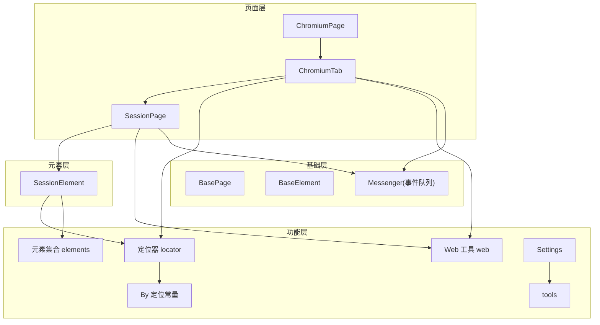
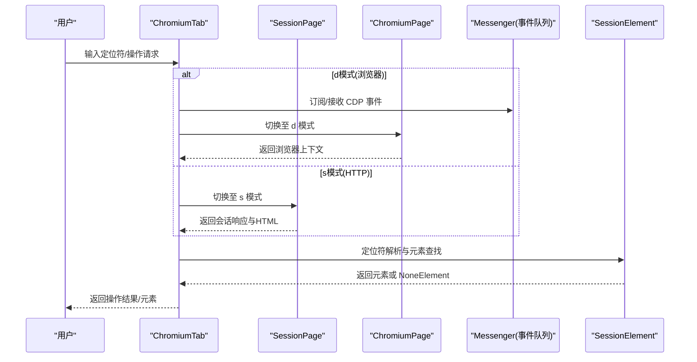
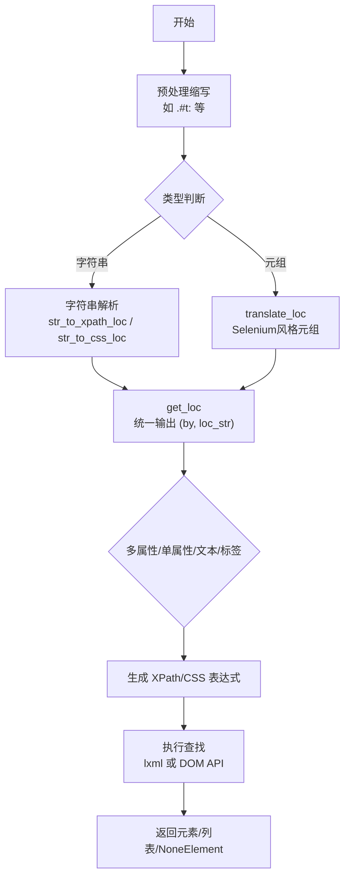
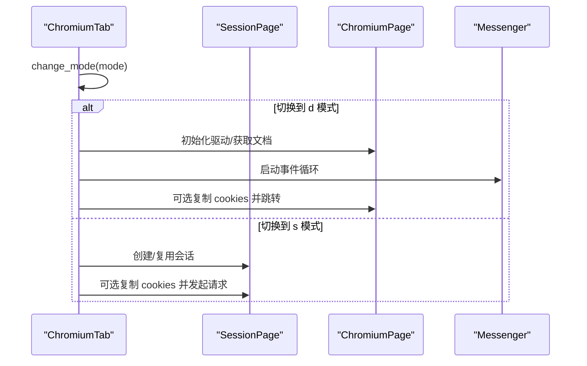
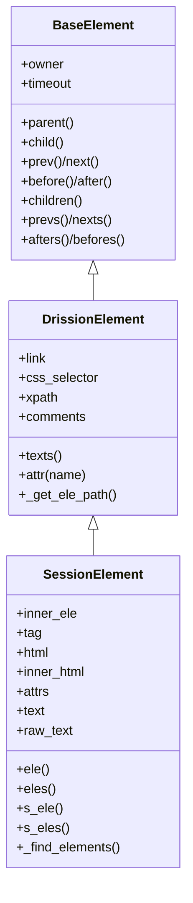
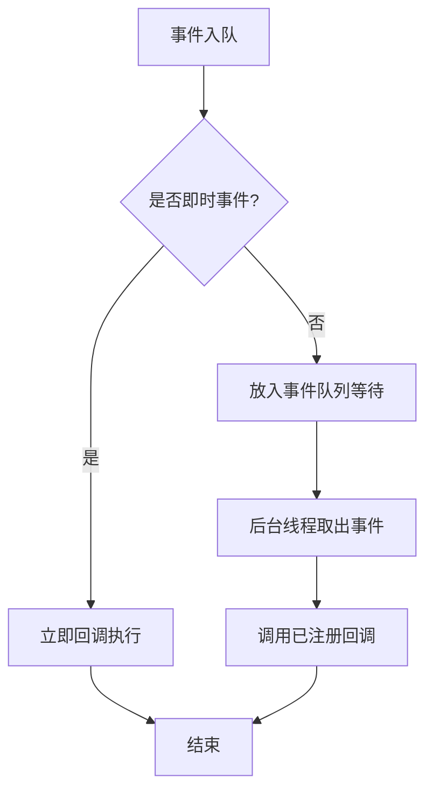
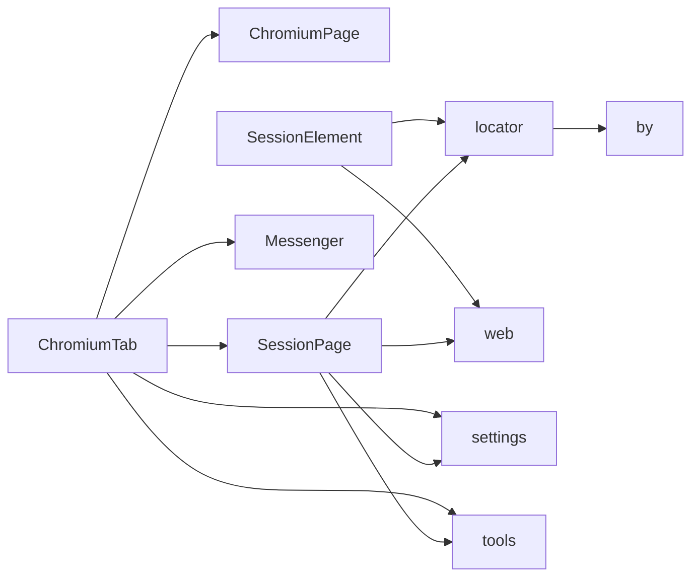

# 数据流设计

<cite>
**本文引用的文件**   
- [DrissionPage\__init__.py](file://DrissionPage/__init__.py)
- [DrissionPage\_functions\locator.py](file://DrissionPage/_functions/locator.py)
- [DrissionPage\_functions\web.py](file://DrissionPage/_functions/web.py)
- [DrissionPage\_pages\chromium_page.py](file://DrissionPage/_pages/chromium_page.py)
- [DrissionPage\_pages\chromium_tab.py](file://DrissionPage/_pages/chromium_tab.py)
- [DrissionPage\_pages\session_page.py](file://DrissionPage/_pages/session_page.py)
- [DrissionPage\_elements\session_element.py](file://DrissionPage/_elements/session_element.py)
- [DrissionPage\_base\base.py](file://DrissionPage/_base/base.py)
- [DrissionPage\_functions\elements.py](file://DrissionPage/_functions/elements.py)
- [DrissionPage\_functions\by.py](file://DrissionPage/_functions/by.py)
- [DrissionPage\_functions\settings.py](file://DrissionPage/_functions/settings.py)
- [DrissionPage\_functions\tools.py](file://DrissionPage/_functions/tools.py)
</cite>

## 目录
1. [引言](#引言)
2. [项目结构](#项目结构)
3. [核心组件](#核心组件)
4. [架构总览](#架构总览)
5. [详细组件分析](#详细组件分析)
6. [依赖分析](#依赖分析)
7. [性能考量](#性能考量)
8. [故障排查指南](#故障排查指南)
9. [结论](#结论)
10. [附录](#附录)

## 引言
本文件面向 DrissionPage 的数据流设计，系统性梳理从“用户输入”到“系统响应”的完整数据流转过程，覆盖元素定位、页面加载、操作执行、结果返回等关键环节。重点包括：
- 定位器解析流程：从用户提供的定位字符串到最终的元素查找过程
- 模式差异：浏览器模式(d 模式)与 HTTP 模式(s 模式)下的数据流差异
- 异步数据处理：事件队列、回调处理、错误传播
- 缓存与一致性：会话级缓存、跨模式切换时的缓存与状态同步
- 性能优化：延迟加载、批量处理、等待与重试策略

## 项目结构
DrissionPage 采用模块化分层设计：
- 页面层：ChromiumPage、ChromiumTab、SessionPage
- 元素层：SessionElement、ChromiumElement（未在本节展开）
- 功能层：定位器、Web 工具、元素集合过滤、设置与工具
- 基础层：BasePage、BaseElement、Messeger（CDP 事件队列）

图表来源
- [DrissionPage\_pages\chromium_page.py:17-103](file://DrissionPage/_pages/chromium_page.py#L17-L103)
- [DrissionPage\_pages\chromium_tab.py:22-238](file://DrissionPage/_pages/chromium_tab.py#L22-L238)
- [DrissionPage\_pages\session_page.py:25-294](file://DrissionPage/_pages/session_page.py#L25-L294)
- [DrissionPage\_elements\session_element.py:23-301](file://DrissionPage/_elements/session_element.py#L23-L301)
- [DrissionPage\_functions\locator.py:15-579](file://DrissionPage/_functions/locator.py#L15-L579)
- [DrissionPage\_functions\web.py:1-349](file://DrissionPage/_functions/web.py#L1-L349)
- [DrissionPage\_functions\elements.py:1-461](file://DrissionPage/_functions/elements.py#L1-L461)
- [DrissionPage\_functions\by.py:10-19](file://DrissionPage/_functions/by.py#L10-L19)
- [DrissionPage\_functions\settings.py:13-69](file://DrissionPage/_functions/settings.py#L13-L69)
- [DrissionPage\_functions\tools.py:1-213](file://DrissionPage/_functions/tools.py#L1-L213)
- [DrissionPage\_base\base.py:270-434](file://DrissionPage/_base/base.py#L270-L434)

章节来源
- [DrissionPage\__init__.py:22-28](file://DrissionPage/__init__.py#L22-L28)

## 核心组件
- 页面对象
  - ChromiumPage：浏览器标签页入口，持有 ChromiumTab 实例，提供标签管理与浏览器进程信息
  - ChromiumTab：统一 d/s 模式的切换入口，封装浏览器与会话两种数据流
  - SessionPage：HTTP 模式页面，基于 requests 会话抓取与解析 HTML
- 元素对象
  - SessionElement：基于 lxml 解析的元素，支持 xpath/css 定位与文本提取
- 定位器与工具
  - 定位器：字符串/元组定位符解析、多属性/文本/标签组合、CSS/XPath 转换
  - Web 工具：文本格式化、链接补全、PDF/MHTML 导出、Blob 读取
  - 元素集合：过滤、搜索、批量属性/文本提取
  - 设置与工具：全局设置、端口分配、错误映射、等待与重试

章节来源
- [DrissionPage\_pages\chromium_page.py:17-103](file://DrissionPage/_pages/chromium_page.py#L17-L103)
- [DrissionPage\_pages\chromium_tab.py:22-238](file://DrissionPage/_pages/chromium_tab.py#L22-L238)
- [DrissionPage\_pages\session_page.py:25-294](file://DrissionPage/_pages/session_page.py#L25-L294)
- [DrissionPage\_elements\session_element.py:23-301](file://DrissionPage/_elements/session_element.py#L23-L301)
- [DrissionPage\_functions\locator.py:15-579](file://DrissionPage/_functions/locator.py#L15-L579)
- [DrissionPage\_functions\web.py:1-349](file://DrissionPage/_functions/web.py#L1-L349)
- [DrissionPage\_functions\elements.py:16-461](file://DrissionPage/_functions/elements.py#L16-L461)
- [DrissionPage\_functions\by.py:10-19](file://DrissionPage/_functions/by.py#L10-L19)
- [DrissionPage\_functions\settings.py:13-69](file://DrissionPage/_functions/settings.py#L13-L69)
- [DrissionPage\_functions\tools.py:1-213](file://DrissionPage/_functions/tools.py#L1-L213)
- [DrissionPage\_base\base.py:270-434](file://DrissionPage/_base/base.py#L270-L434)

## 架构总览
下图展示数据流在不同模式下的关键节点与交互：

图表来源
- [DrissionPage\_pages\chromium_tab.py:156-194](file://DrissionPage/_pages/chromium_tab.py#L156-L194)
- [DrissionPage\_pages\chromium_page.py:17-103](file://DrissionPage/_pages/chromium_page.py#L17-L103)
- [DrissionPage\_pages\session_page.py:104-196](file://DrissionPage/_pages/session_page.py#L104-L196)
- [DrissionPage\_elements\session_element.py:169-301](file://DrissionPage/_elements/session_element.py#L169-L301)
- [DrissionPage\_base\base.py:373-434](file://DrissionPage/_base/base.py#L373-L434)

## 详细组件分析

### 定位器解析流程（从字符串到元素）
定位器解析是数据流的关键前置步骤，贯穿 d/s 模式。其流程如下：

图表来源
- [DrissionPage\_functions\locator.py:15-579](file://DrissionPage/_functions/locator.py#L15-L579)
- [DrissionPage\_functions\by.py:10-19](file://DrissionPage/_functions/by.py#L10-L19)
- [DrissionPage\_elements\session_element.py:169-301](file://DrissionPage/_elements/session_element.py#L169-L301)

章节来源
- [DrissionPage\_functions\locator.py:15-579](file://DrissionPage/_functions/locator.py#L15-L579)
- [DrissionPage\_elements\session_element.py:169-301](file://DrissionPage/_elements/session_element.py#L169-L301)

### 页面加载与模式切换（d 模式 vs s 模式）
- d 模式（浏览器）：通过 CDP 与浏览器交互，支持 DOM、事件、截图、PDF 等；适合真实渲染场景
- s 模式（HTTP）：基于 requests 会话抓取 HTML，解析 lxml，适合轻量与离线场景

图表来源
- [DrissionPage\_pages\chromium_tab.py:156-194](file://DrissionPage/_pages/chromium_tab.py#L156-L194)
- [DrissionPage\_pages\session_page.py:180-196](file://DrissionPage/_pages/session_page.py#L180-L196)
- [DrissionPage\_pages\chromium_page.py:33-40](file://DrissionPage/_pages/chromium_page.py#L33-L40)
- [DrissionPage\_base\base.py:373-434](file://DrissionPage/_base/base.py#L373-L434)

章节来源
- [DrissionPage\_pages\chromium_tab.py:156-194](file://DrissionPage/_pages/chromium_tab.py#L156-L194)
- [DrissionPage\_pages\session_page.py:180-196](file://DrissionPage/_pages/session_page.py#L180-L196)

### 元素查找与返回（SessionElement）
SessionElement 将定位结果包装为元素对象，支持父子兄弟关系遍历与属性访问，并在未命中时返回 NoneElement。

图表来源
- [DrissionPage\_base\base.py:70-268](file://DrissionPage/_base/base.py#L70-L268)
- [DrissionPage\_elements\session_element.py:23-301](file://DrissionPage/_elements/session_element.py#L23-L301)

章节来源
- [DrissionPage\_elements\session_element.py:23-301](file://DrissionPage/_elements/session_element.py#L23-L301)
- [DrissionPage\_base\base.py:70-268](file://DrissionPage/_base/base.py#L70-L268)

### 异步数据处理（事件队列、回调、错误传播）
- 事件队列：Messenger 使用队列与后台线程处理 CDP 事件，支持即时事件与普通事件分离
- 回调注册：通过 _set_callback 注册事件处理器，支持立即执行事件
- 错误传播：_run_cdp 对错误进行统一映射，raise_error 将 CDP 错误转换为具体异常

图表来源
- [DrissionPage\_base\base.py:373-434](file://DrissionPage/_base/base.py#L373-L434)
- [DrissionPage\_functions\tools.py:157-197](file://DrissionPage/_functions/tools.py#L157-L197)

章节来源
- [DrissionPage\_base\base.py:373-434](file://DrissionPage/_base/base.py#L373-L434)
- [DrissionPage\_functions\tools.py:157-197](file://DrissionPage/_functions/tools.py#L157-L197)

### 数据一致性与缓存策略
- 会话级缓存：SessionPage 使用 requests 会话保存 cookies、headers、编码等，减少重复请求
- 模式切换一致性：cookies_to_session / cookies_to_browser 在模式切换时双向同步
- 文本与链接一致性：Web 工具对 HTML 实体解码、空白折叠、链接补全，确保输出稳定

章节来源
- [DrissionPage\_pages\session_page.py:198-293](file://DrissionPage/_pages/session_page.py#L198-L293)
- [DrissionPage\_pages\chromium_tab.py:195-209](file://DrissionPage/_pages/chromium_tab.py#L195-L209)
- [DrissionPage\_functions\web.py:106-107](file://DrissionPage/_functions/web.py#L106-L107)

### 性能优化的数据流设计
- 延迟加载：SessionPage 在首次访问时才创建会话，避免不必要的资源占用
- 批量处理：元素集合过滤与搜索支持批量筛选，减少多次遍历
- 等待与重试：统一的等待与重试逻辑，降低网络波动影响
- 超时控制：Settings 提供全局超时配置，Messenger 与各模块共享

章节来源
- [DrissionPage\_pages\session_page.py:320-337](file://DrissionPage/_pages/session_page.py#L320-L337)
- [DrissionPage\_functions\elements.py:276-302](file://DrissionPage/_functions/elements.py#L276-L302)
- [DrissionPage\_functions\tools.py:139-148](file://DrissionPage/_functions/tools.py#L139-L148)
- [DrissionPage\_functions\settings.py:13-69](file://DrissionPage/_functions/settings.py#L13-L69)

## 依赖分析
- 组件耦合
  - ChromiumTab 同时继承自 ChromiumBase 与 SessionPage，形成 d/s 模式桥接
  - SessionElement 依赖定位器与 Web 工具，实现跨多种输入类型的统一查找
  - Messenger 作为 CDP 事件中枢，被页面与元素广泛使用
- 外部依赖
  - requests/lxml 用于 HTTP 与 HTML 解析
  - DrissionGet 用于下载管理
  - tldextract 用于域名提取

图表来源
- [DrissionPage\_pages\chromium_tab.py:22-238](file://DrissionPage/_pages/chromium_tab.py#L22-L238)
- [DrissionPage\_pages\session_page.py:25-294](file://DrissionPage/_pages/session_page.py#L25-L294)
- [DrissionPage\_elements\session_element.py:23-301](file://DrissionPage/_elements/session_element.py#L23-L301)
- [DrissionPage\_functions\locator.py:15-579](file://DrissionPage/_functions/locator.py#L15-L579)
- [DrissionPage\_functions\web.py:1-349](file://DrissionPage/_functions/web.py#L1-L349)
- [DrissionPage\_functions\by.py:10-19](file://DrissionPage/_functions/by.py#L10-L19)
- [DrissionPage\_functions\settings.py:13-69](file://DrissionPage/_functions/settings.py#L13-L69)
- [DrissionPage\_functions\tools.py:1-213](file://DrissionPage/_functions/tools.py#L1-L213)

章节来源
- [DrissionPage\_pages\chromium_tab.py:22-238](file://DrissionPage/_pages/chromium_tab.py#L22-L238)
- [DrissionPage\_pages\session_page.py:25-294](file://DrissionPage/_pages/session_page.py#L25-L294)
- [DrissionPage\_elements\session_element.py:23-301](file://DrissionPage/_elements/session_element.py#L23-L301)

## 性能考量
- 定位效率
  - 优先使用 CSS 定位（若可转换）以提升性能
  - 避免过深的 XPath 表达式，尽量结合属性与标签限定
- 请求与解析
  - 合理设置超时与重试，避免长时间阻塞
  - 使用 SessionPage 的编码推断与字符集设置，减少二次解析
- 事件处理
  - 将高频事件标记为即时事件，降低延迟
  - 控制事件队列长度，避免积压

## 故障排查指南
- 定位失败
  - 检查定位符格式与符号冲突，定位器会抛出定位错误
  - 使用 find() 批量探测多个定位符，快速定位问题
- 模式切换异常
  - 确认 cookies 同步是否成功，必要时手动复制
  - 检查浏览器连接状态与 CDP 会话有效性
- 事件未触发
  - 确认回调已注册且事件名正确
  - 查看调试开关与日志输出
- 下载与导出
  - 确保下载路径有效，权限充足
  - PDF 导出失败时检查打印参数与浏览器版本

章节来源
- [DrissionPage\_functions\locator.py:54-71](file://DrissionPage/_functions/locator.py#L54-L71)
- [DrissionPage\_functions\elements.py:276-302](file://DrissionPage/_functions/elements.py#L276-L302)
- [DrissionPage\_functions\tools.py:157-197](file://DrissionPage/_functions/tools.py#L157-L197)
- [DrissionPage\_pages\chromium_tab.py:232-233](file://DrissionPage/_pages/chromium_tab.py#L232-L233)

## 结论
DrissionPage 的数据流设计以“定位器解析—页面模式—元素封装—异步事件—结果返回”为主线，实现了 d/s 模式的统一与高效。通过会话缓存、事件队列与统一错误映射，系统在复杂场景下仍保持稳定性与可观测性。建议在实际使用中：
- 明确业务场景选择合适模式
- 合理配置超时与重试策略
- 使用过滤与批量处理提升性能
- 关注事件回调与错误映射，便于排障

## 附录
- 常用 API 路径参考
  - 定位器解析：[locator.py:96-115](file://DrissionPage/_functions/locator.py#L96-L115)
  - 元素查找：[session_element.py:169-301](file://DrissionPage/_elements/session_element.py#L169-L301)
  - 模式切换：[chromium_tab.py:156-194](file://DrissionPage/_pages/chromium_tab.py#L156-L194)
  - 事件队列：[base.py:373-434](file://DrissionPage/_base/base.py#L373-L434)
  - HTTP 请求与重试：[session_page.py:180-266](file://DrissionPage/_pages/session_page.py#L180-L266)
  - 设置与工具：[settings.py:13-69](file://DrissionPage/_functions/settings.py#L13-L69), [tools.py:1-213](file://DrissionPage/_functions/tools.py#L1-L213)