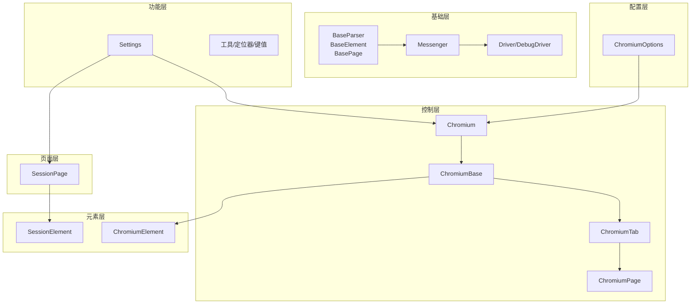
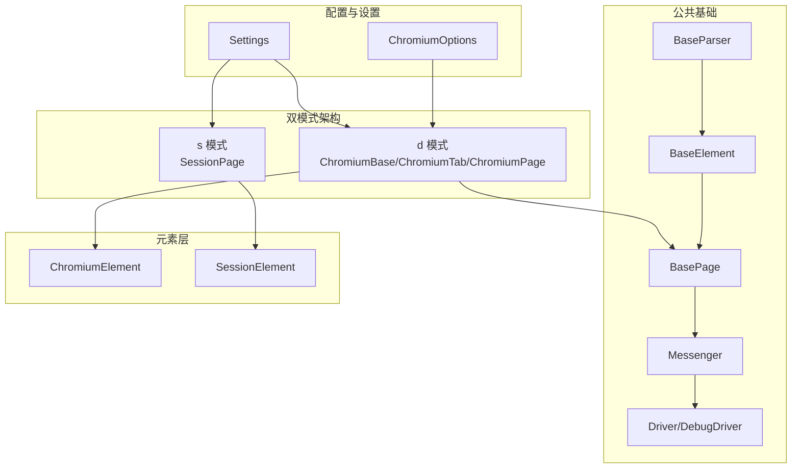
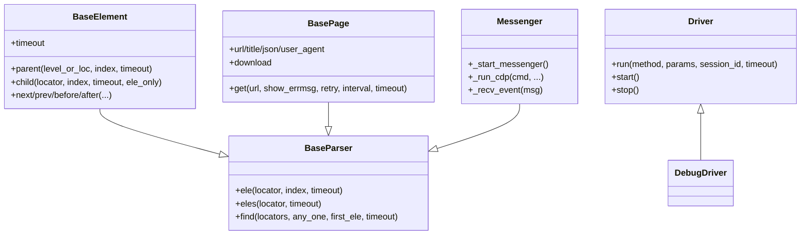
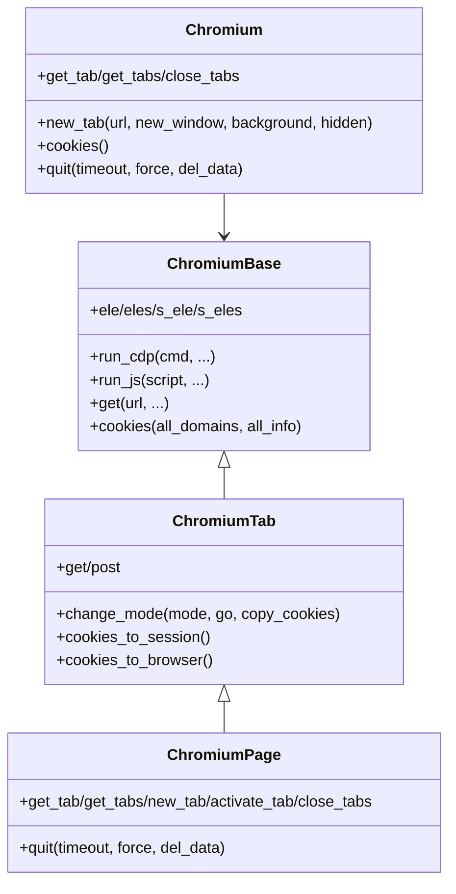
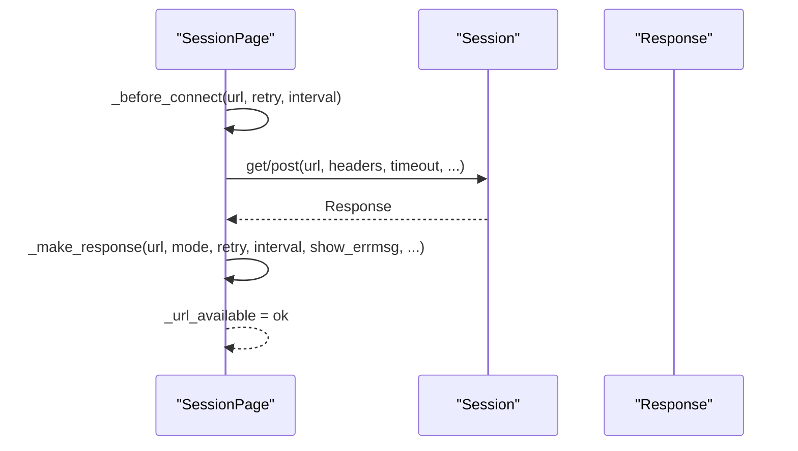
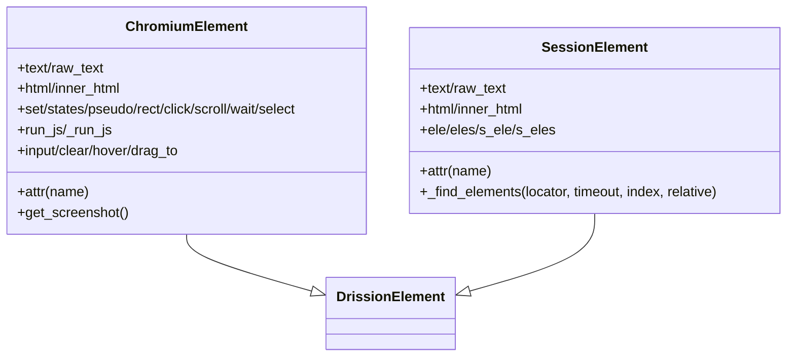
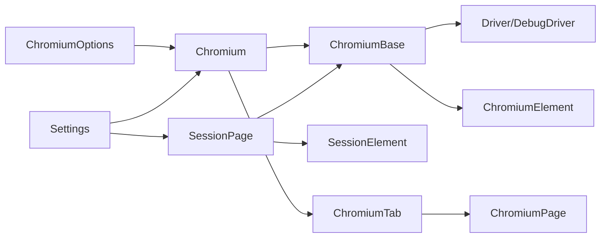

# 整体架构设计

<cite>
**本文引用的文件**
- [DrissionPage/__init__.py](file://DrissionPage/__init__.py)
- [DrissionPage/_base/base.py](file://DrissionPage/_base/base.py)
- [DrissionPage/_base/driver.py](file://DrissionPage/_base/driver.py)
- [DrissionPage/_browsers/chromium.py](file://DrissionPage/_browsers/chromium.py)
- [DrissionPage/_pages/chromium_base.py](file://DrissionPage/_pages/chromium_base.py)
- [DrissionPage/_pages/chromium_tab.py](file://DrissionPage/_pages/chromium_tab.py)
- [DrissionPage/_pages/chromium_page.py](file://DrissionPage/_pages/chromium_page.py)
- [DrissionPage/_pages/session_page.py](file://DrissionPage/_pages/session_page.py)
- [DrissionPage/_elements/chromium_element.py](file://DrissionPage/_elements/chromium_element.py)
- [DrissionPage/_elements/session_element.py](file://DrissionPage/_elements/session_element.py)
- [DrissionPage/_configs/chromium_options.py](file://DrissionPage/_configs/chromium_options.py)
- [DrissionPage/_functions/settings.py](file://DrissionPage/_functions/settings.py)
- [DrissionPage/common.py](file://DrissionPage/common.py)
</cite>

## 目录
1. [引言](#引言)
2. [项目结构](#项目结构)
3. [核心组件](#核心组件)
4. [架构总览](#架构总览)
5. [详细组件分析](#详细组件分析)
6. [依赖关系分析](#依赖关系分析)
7. [性能考量](#性能考量)
8. [故障排查指南](#故障排查指南)
9. [结论](#结论)
10. [附录](#附录)

## 引言
本文件面向架构师与高级开发者，系统性阐述 DrissionPage 的整体架构设计。重点解析分层架构理念：基础层（BaseParser、BaseElement、BasePage）、控制层（Chromium 浏览器控制）、接口层（页面操作接口）的职责分工与协作关系；阐明模块化设计原则与依赖关系图；深入说明抽象基类的设计思路与继承体系如何支撑“浏览器控制 + HTTP 会话”双模式架构；最后给出系统架构图与关键组件交互模式，帮助读者快速把握设计决策的技术考量与性能影响。

## 项目结构
DrissionPage 采用清晰的分层与模块化组织：
- 基础层：定义通用抽象与通用能力（BaseParser、BaseElement、BasePage、Messenger、Driver）
- 控制层：Chromium 浏览器控制与会话管理（Chromium、ChromiumBase、ChromiumTab、ChromiumPage）
- 页面层：会话页面（SessionPage）
- 元素层：Chromium 元素与会话元素（ChromiumElement、SessionElement）
- 配置层：ChromiumOptions、SessionOptions、配置管理
- 功能层：工具函数、设置、键值、定位器等
- 导出层：对外统一入口与便捷转换工具

图表来源
- [DrissionPage/_base/base.py:29-434](file://DrissionPage/_base/base.py#L29-L434)
- [DrissionPage/_base/driver.py:24-227](file://DrissionPage/_base/driver.py#L24-L227)
- [DrissionPage/_browsers/chromium.py:33-730](file://DrissionPage/_browsers/chromium.py#L33-L730)
- [DrissionPage/_pages/chromium_base.py:39-921](file://DrissionPage/_pages/chromium_base.py#L39-L921)
- [DrissionPage/_pages/chromium_tab.py:22-238](file://DrissionPage/_pages/chromium_tab.py#L22-L238)
- [DrissionPage/_pages/chromium_page.py:17-103](file://DrissionPage/_pages/chromium_page.py#L17-L103)
- [DrissionPage/_pages/session_page.py:25-294](file://DrissionPage/_pages/session_page.py#L25-L294)
- [DrissionPage/_elements/chromium_element.py:38-1439](file://DrissionPage/_elements/chromium_element.py#L38-L1439)
- [DrissionPage/_elements/session_element.py:23-301](file://DrissionPage/_elements/session_element.py#L23-L301)
- [DrissionPage/_configs/chromium_options.py:16-417](file://DrissionPage/_configs/chromium_options.py#L16-L417)
- [DrissionPage/_functions/settings.py:13-69](file://DrissionPage/_functions/settings.py#L13-L69)

章节来源
- [DrissionPage/__init__.py:22-28](file://DrissionPage/__init__.py#L22-L28)

## 核心组件
- 基础层抽象
  - BaseParser：统一元素查找入口，支持单个/多个定位与超时控制
  - BaseElement：元素层级关系与相对定位能力，提供父/子/前后兄弟等导航
  - BasePage：页面级抽象，统一 get/post、超时与会话管理
  - Messenger：CDP 消息通道与事件队列，支持回调注册与异步事件处理
  - Driver/DebugDriver：WebSocket 连接与 CDP 请求封装，支持调试输出
- 控制层
  - Chromium：浏览器实例管理、标签页集合、上下文、下载、代理、事件路由
  - ChromiumBase：页面级 CDP 能力，文档树、事件监听、JS 执行、等待策略
  - ChromiumTab：双模式切换（d/s 模式），会话与浏览器状态互导
  - ChromiumPage：单例页面封装，暴露浏览器级能力
- 页面层
  - SessionPage：基于 HTTP 会话的页面操作，支持 GET/POST、响应与编码处理
- 元素层
  - ChromiumElement：Chromium 模式下的元素能力，属性、文本、样式、滚动、截图、选择框等
  - SessionElement：会话模式下的元素能力，基于 lxml 解析与定位
- 配置层
  - ChromiumOptions：浏览器启动参数、用户数据目录、代理、超时、重试等
- 功能层
  - Settings：全局运行参数（超时、单例、语言、自动处理弹窗等）

章节来源
- [DrissionPage/_base/base.py:29-434](file://DrissionPage/_base/base.py#L29-L434)
- [DrissionPage/_base/driver.py:24-227](file://DrissionPage/_base/driver.py#L24-L227)
- [DrissionPage/_browsers/chromium.py:33-730](file://DrissionPage/_browsers/chromium.py#L33-L730)
- [DrissionPage/_pages/chromium_base.py:39-921](file://DrissionPage/_pages/chromium_base.py#L39-L921)
- [DrissionPage/_pages/chromium_tab.py:22-238](file://DrissionPage/_pages/chromium_tab.py#L22-L238)
- [DrissionPage/_pages/chromium_page.py:17-103](file://DrissionPage/_pages/chromium_page.py#L17-L103)
- [DrissionPage/_pages/session_page.py:25-294](file://DrissionPage/_pages/session_page.py#L25-L294)
- [DrissionPage/_elements/chromium_element.py:38-1439](file://DrissionPage/_elements/chromium_element.py#L38-L1439)
- [DrissionPage/_elements/session_element.py:23-301](file://DrissionPage/_elements/session_element.py#L23-L301)
- [DrissionPage/_configs/chromium_options.py:16-417](file://DrissionPage/_configs/chromium_options.py#L16-L417)
- [DrissionPage/_functions/settings.py:13-69](file://DrissionPage/_functions/settings.py#L13-L69)

## 架构总览
DrissionPage 采用“双模式”架构：
- 浏览器控制模式（d 模式）：通过 CDP 与浏览器交互，具备 DOM、事件、网络、存储等全量能力
- HTTP 会话模式（s 模式）：通过 requests 会话访问页面，适合静态内容与 API 场景

图表来源
- [DrissionPage/_base/base.py:29-434](file://DrissionPage/_base/base.py#L29-L434)
- [DrissionPage/_base/driver.py:24-227](file://DrissionPage/_base/driver.py#L24-L227)
- [DrissionPage/_browsers/chromium.py:33-730](file://DrissionPage/_browsers/chromium.py#L33-L730)
- [DrissionPage/_pages/chromium_base.py:39-921](file://DrissionPage/_pages/chromium_base.py#L39-L921)
- [DrissionPage/_pages/session_page.py:25-294](file://DrissionPage/_pages/session_page.py#L25-L294)
- [DrissionPage/_elements/chromium_element.py:38-1439](file://DrissionPage/_elements/chromium_element.py#L38-L1439)
- [DrissionPage/_elements/session_element.py:23-301](file://DrissionPage/_elements/session_element.py#L23-L301)
- [DrissionPage/_configs/chromium_options.py:16-417](file://DrissionPage/_configs/chromium_options.py#L16-L417)
- [DrissionPage/_functions/settings.py:13-69](file://DrissionPage/_functions/settings.py#L13-L69)

## 详细组件分析

### 基础层：抽象与通用能力
- BaseParser
  - 统一 ele()/eles() 查找入口，支持超时与索引控制
  - 提供 find() 多定位器并行查找与首个匹配返回
- BaseElement
  - 提供父子兄弟导航、相对定位等能力，统一错误处理与空元素返回
- BasePage
  - 统一 get/post、URL 处理、会话创建与选项管理
  - 下载器、超时、重试、编码等通用能力
- Messenger
  - CDP 事件队列、回调注册、异步事件处理、连接断开回调
- Driver/DebugDriver
  - WebSocket 连接、消息发送与结果等待、超时与断开处理
  - DebugDriver 支持调试输出

图表来源
- [DrissionPage/_base/base.py:29-434](file://DrissionPage/_base/base.py#L29-L434)
- [DrissionPage/_base/driver.py:24-227](file://DrissionPage/_base/driver.py#L24-L227)

章节来源
- [DrissionPage/_base/base.py:29-434](file://DrissionPage/_base/base.py#L29-L434)
- [DrissionPage/_base/driver.py:24-227](file://DrissionPage/_base/driver.py#L24-L227)

### 控制层：Chromium 浏览器控制
- Chromium
  - 浏览器实例管理、标签页集合、上下文、下载、代理、事件路由
  - 提供 new_tab/get_tab/close_tabs 等标签页管理
  - 通过 Driver/DebugDriver 与浏览器建立 CDP 连接
- ChromiumBase
  - 页面级 CDP 能力：启用 DOM/Page/Fetch 等域，监听页面生命周期事件
  - 文档树获取、JS 执行、等待策略、截图、存储清理、历史前进后退
- ChromiumTab
  - 双模式切换（d/s 模式）：cookies 互导、URL 同步、get/post 行为差异
  - 提供 wait/set/screencast/actions/states 等挂件
- ChromiumPage
  - 单例页面封装，聚合浏览器能力，暴露 tab 管理与退出

图表来源
- [DrissionPage/_browsers/chromium.py:33-730](file://DrissionPage/_browsers/chromium.py#L33-L730)
- [DrissionPage/_pages/chromium_base.py:39-921](file://DrissionPage/_pages/chromium_base.py#L39-L921)
- [DrissionPage/_pages/chromium_tab.py:22-238](file://DrissionPage/_pages/chromium_tab.py#L22-L238)
- [DrissionPage/_pages/chromium_page.py:17-103](file://DrissionPage/_pages/chromium_page.py#L17-L103)

章节来源
- [DrissionPage/_browsers/chromium.py:33-730](file://DrissionPage/_browsers/chromium.py#L33-L730)
- [DrissionPage/_pages/chromium_base.py:39-921](file://DrissionPage/_pages/chromium_base.py#L39-L921)
- [DrissionPage/_pages/chromium_tab.py:22-238](file://DrissionPage/_pages/chromium_tab.py#L22-L238)
- [DrissionPage/_pages/chromium_page.py:17-103](file://DrissionPage/_pages/chromium_page.py#L17-L103)

### 页面层：会话页面
- SessionPage
  - 基于 requests 会话的页面操作，支持 GET/POST、响应与编码处理
  - 统一 ele()/eles()/s_ele()/s_eles() 定位接口，内部通过 make_session_ele 实现
  - cookies 管理、超时与重试、文件直连访问

图表来源
- [DrissionPage/_pages/session_page.py:104-266](file://DrissionPage/_pages/session_page.py#L104-L266)

章节来源
- [DrissionPage/_pages/session_page.py:25-294](file://DrissionPage/_pages/session_page.py#L25-L294)

### 元素层：Chromium 与会话元素
- ChromiumElement
  - 提供属性、文本、样式、滚动、截图、文件上传、拖拽、偏移点查询等能力
  - 支持 ShadowRoot、SelectElement、Rect、Clicker、Waiter 等挂件
- SessionElement
  - 基于 lxml 的元素包装，支持 xpath/css 定位与相对路径生成
  - 提供 attr/text/inner_html 等属性访问

图表来源
- [DrissionPage/_elements/chromium_element.py:38-1439](file://DrissionPage/_elements/chromium_element.py#L38-L1439)
- [DrissionPage/_elements/session_element.py:23-301](file://DrissionPage/_elements/session_element.py#L23-L301)

章节来源
- [DrissionPage/_elements/chromium_element.py:38-1439](file://DrissionPage/_elements/chromium_element.py#L38-L1439)
- [DrissionPage/_elements/session_element.py:23-301](file://DrissionPage/_elements/session_element.py#L23-L301)

### 配置与设置
- ChromiumOptions
  - 浏览器启动参数、用户数据目录、扩展、偏好、代理、超时、重试、端口等
- Settings
  - 全局运行参数：超时、单例、语言、自动处理弹窗、调试开关等

章节来源
- [DrissionPage/_configs/chromium_options.py:16-417](file://DrissionPage/_configs/chromium_options.py#L16-L417)
- [DrissionPage/_functions/settings.py:13-69](file://DrissionPage/_functions/settings.py#L13-L69)

## 依赖关系分析
- 继承与组合
  - BaseParser/BaseElement/BasePage 为所有页面与元素提供统一抽象
  - ChromiumBase 组合 BasePage 与 Messenger，并通过 Driver 与浏览器通信
  - ChromiumTab 组合 ChromiumBase 与 SessionPage，实现双模式切换
  - ChromiumElement/SessionElement 分别继承 DrissionElement，提供不同模式下的元素能力
- 关键依赖链
  - Chromium -> Driver/DebugDriver -> CDP
  - ChromiumBase -> Driver -> CDP
  - ChromiumTab -> ChromiumBase/SessionPage
  - SessionPage -> Session -> HTTP
  - ChromiumOptions -> Chromium

图表来源
- [DrissionPage/_configs/chromium_options.py:16-417](file://DrissionPage/_configs/chromium_options.py#L16-L417)
- [DrissionPage/_functions/settings.py:13-69](file://DrissionPage/_functions/settings.py#L13-L69)
- [DrissionPage/_browsers/chromium.py:33-730](file://DrissionPage/_browsers/chromium.py#L33-L730)
- [DrissionPage/_pages/chromium_base.py:39-921](file://DrissionPage/_pages/chromium_base.py#L39-L921)
- [DrissionPage/_pages/chromium_tab.py:22-238](file://DrissionPage/_pages/chromium_tab.py#L22-L238)
- [DrissionPage/_pages/chromium_page.py:17-103](file://DrissionPage/_pages/chromium_page.py#L17-L103)
- [DrissionPage/_pages/session_page.py:25-294](file://DrissionPage/_pages/session_page.py#L25-L294)
- [DrissionPage/_elements/chromium_element.py:38-1439](file://DrissionPage/_elements/chromium_element.py#L38-L1439)
- [DrissionPage/_elements/session_element.py:23-301](file://DrissionPage/_elements/session_element.py#L23-L301)

章节来源
- [DrissionPage/_browsers/chromium.py:33-730](file://DrissionPage/_browsers/chromium.py#L33-L730)
- [DrissionPage/_pages/chromium_base.py:39-921](file://DrissionPage/_pages/chromium_base.py#L39-L921)
- [DrissionPage/_pages/chromium_tab.py:22-238](file://DrissionPage/_pages/chromium_tab.py#L22-L238)
- [DrissionPage/_pages/chromium_page.py:17-103](file://DrissionPage/_pages/chromium_page.py#L17-L103)
- [DrissionPage/_pages/session_page.py:25-294](file://DrissionPage/_pages/session_page.py#L25-L294)
- [DrissionPage/_elements/chromium_element.py:38-1439](file://DrissionPage/_elements/chromium_element.py#L38-L1439)
- [DrissionPage/_elements/session_element.py:23-301](file://DrissionPage/_elements/session_element.py#L23-L301)
- [DrissionPage/_configs/chromium_options.py:16-417](file://DrissionPage/_configs/chromium_options.py#L16-L417)
- [DrissionPage/_functions/settings.py:13-69](file://DrissionPage/_functions/settings.py#L13-L69)

## 性能考量
- 双模式切换成本
  - d 模式到 s 模式：cookies 互导、URL 同步、必要时重新 get
  - s 模式到 d 模式：需要重新建立 CDP 会话、获取文档树
- CDP 与 HTTP 的权衡
  - d 模式：DOM/事件/网络全量能力，适合复杂交互场景
  - s 模式：轻量、快速，适合静态内容与 API 场景
- 超时与重试
  - Settings 提供全局超时与重试配置，ChromiumOptions 提供浏览器级超时
  - ChromiumPage/SessionPage 层面可覆盖默认超时
- 事件与线程
  - Messenger 使用队列与守护线程处理事件，避免阻塞主线程
  - Driver/DebugDriver 使用独立线程接收消息，支持调试输出

## 故障排查指南
- 连接问题
  - BrowserConnectError：浏览器不可达、端口错误、握手失败
  - PageDisconnectedError：CDP 连接断开，检查浏览器进程与会话有效性
- 元素定位问题
  - ElementNotFoundError：定位器无效或超时，检查定位器格式与页面状态
  - LocatorError：不支持的定位器语法或表达式
- 弹窗与认证
  - 自动处理弹窗：Settings.auto_handle_alert 或 ChromiumBase._alert
  - Fetch.authRequired：代理认证失败，检查 ChromiumOptions 代理配置
- 截图与资源
  - 图片未加载完成：ChromiumElement.src/get_screenshot 前等待加载
  - blob 资源：get_blob 需要等待资源就绪

章节来源
- [DrissionPage/_base/driver.py:102-153](file://DrissionPage/_base/driver.py#L102-L153)
- [DrissionPage/_pages/chromium_base.py:718-744](file://DrissionPage/_pages/chromium_base.py#L718-L744)
- [DrissionPage/_pages/session_page.py:225-265](file://DrissionPage/_pages/session_page.py#L225-L265)
- [DrissionPage/_elements/chromium_element.py:442-500](file://DrissionPage/_elements/chromium_element.py#L442-L500)

## 结论
DrissionPage 的整体架构以“双模式”为核心，通过基础层抽象统一接口，控制层实现浏览器 CDP 能力，页面层与元素层分别提供 d/s 模式的完整能力集。模块化设计使各层职责清晰、耦合度低、扩展性强。设计决策充分考虑了性能与易用性：d 模式提供全面能力，s 模式提供高效访问；Messenger 与 Driver 的事件驱动模型保证了异步处理的稳定性；ChromiumOptions 与 Settings 提供灵活的配置与运行参数。该架构既满足复杂自动化需求，又兼顾简单场景的易用性。

## 附录
- 对外入口
  - DrissionPage/__init__.py 暴露 Chromium、ChromiumPage、SessionPage、ChromiumOptions、SessionOptions
- 工具与转换
  - common.py 提供 from_selenium/from_playwright 将外部驱动转换为 Chromium

章节来源
- [DrissionPage/__init__.py:22-28](file://DrissionPage/__init__.py#L22-L28)
- [DrissionPage/common.py:18-57](file://DrissionPage/common.py#L18-L57)