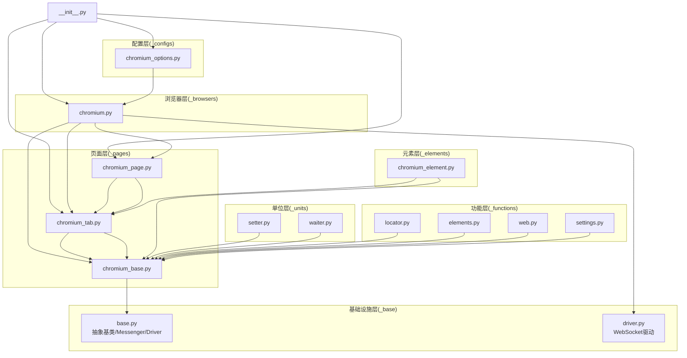
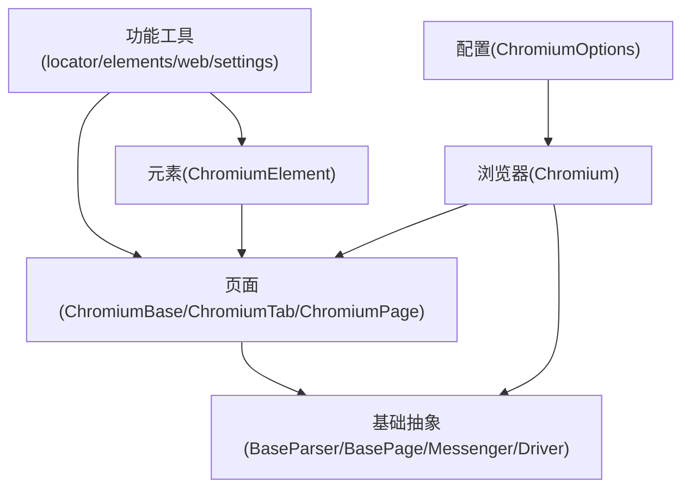
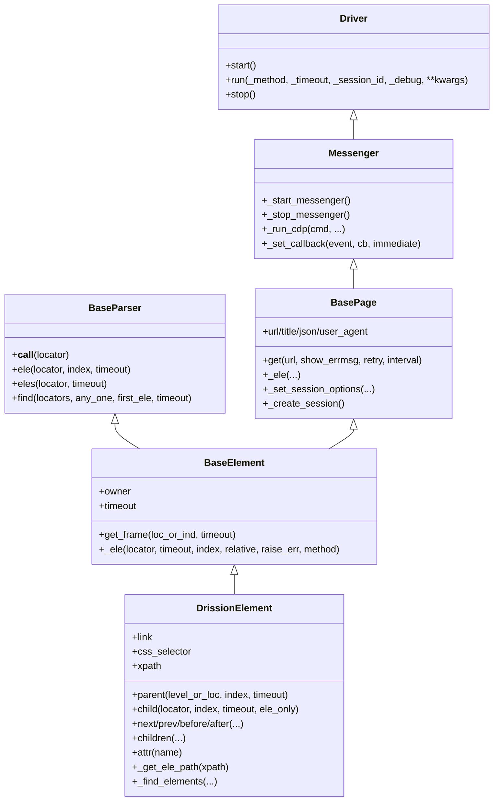
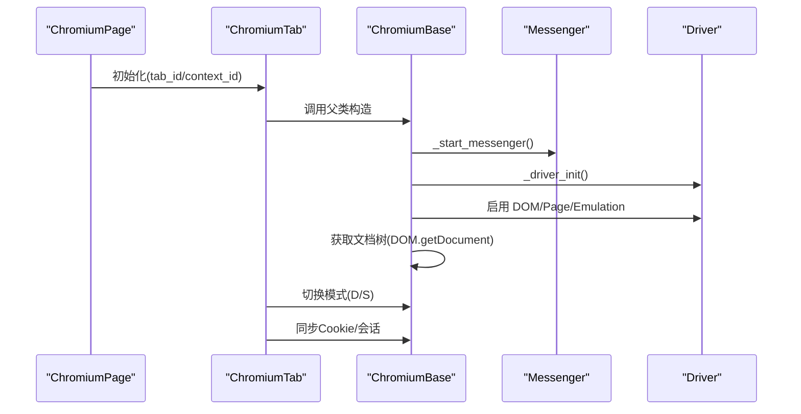
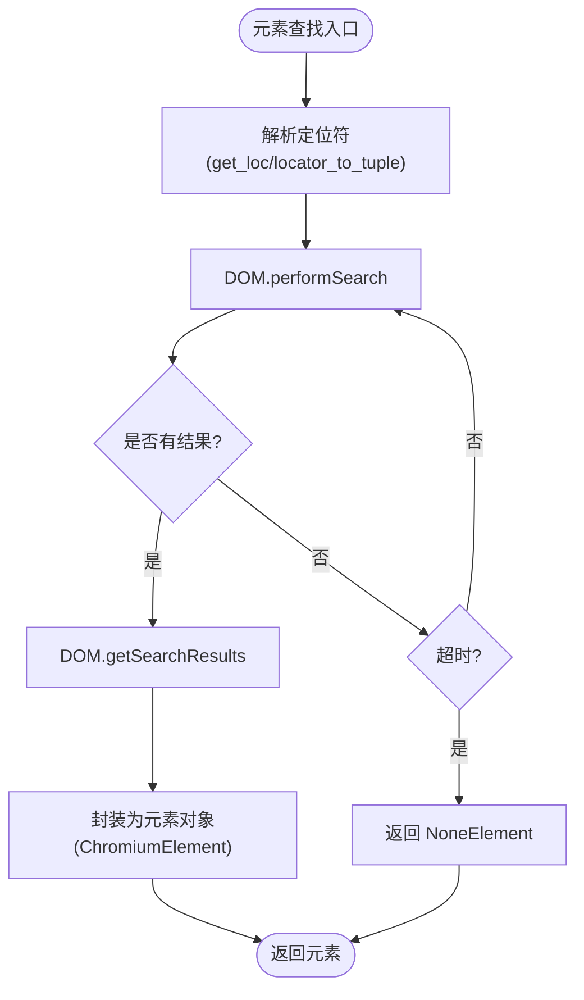
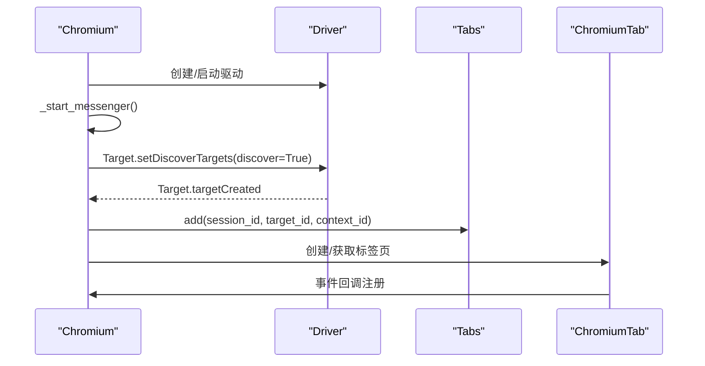
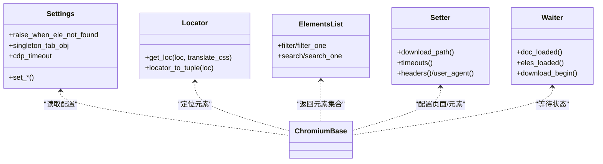
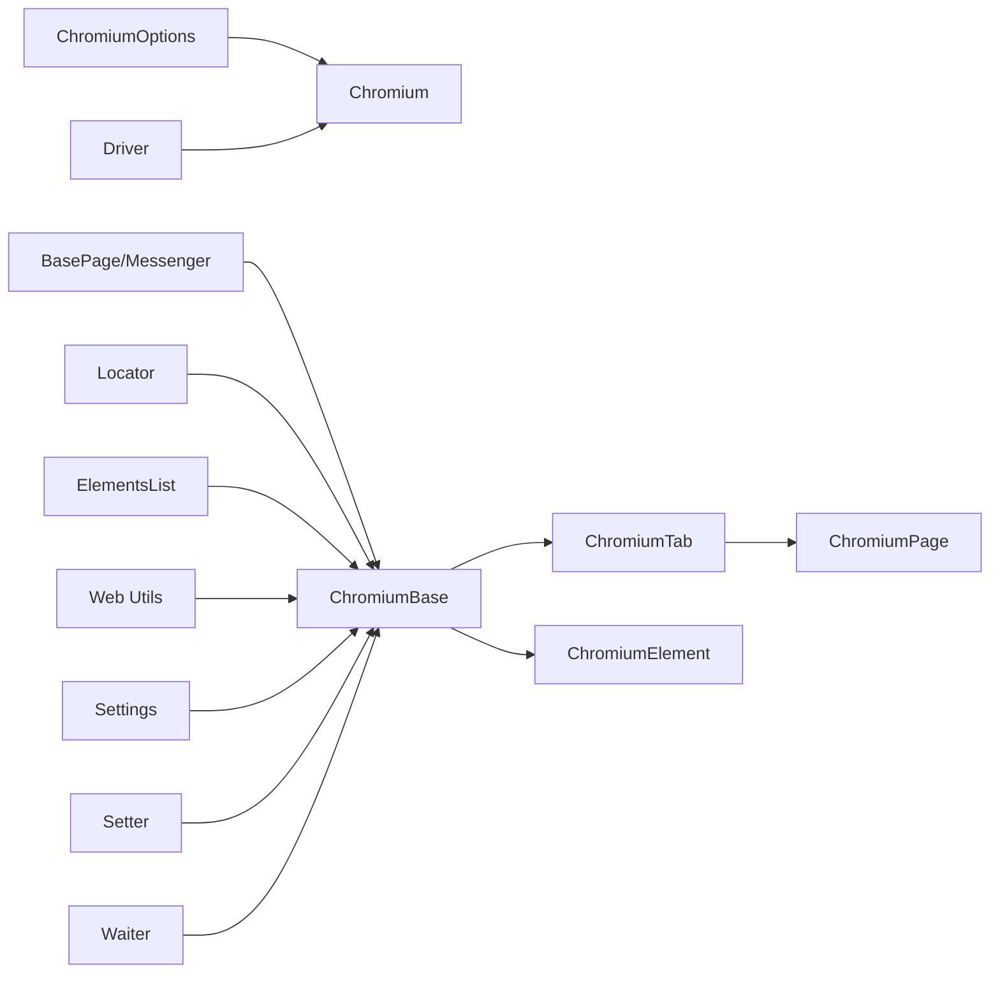

# 模块依赖关系

<cite>
**本文档引用的文件**
- [__init__.py](file://DrissionPage/__init__.py)
- [base.py](file://DrissionPage/_base/base.py)
- [driver.py](file://DrissionPage/_base/driver.py)
- [chromium.py](file://DrissionPage/_browsers/chromium.py)
- [chromium_page.py](file://DrissionPage/_pages/chromium_page.py)
- [chromium_tab.py](file://DrissionPage/_pages/chromium_tab.py)
- [chromium_base.py](file://DrissionPage/_pages/chromium_base.py)
- [chromium_element.py](file://DrissionPage/_elements/chromium_element.py)
- [settings.py](file://DrissionPage/_functions/settings.py)
- [locator.py](file://DrissionPage/_functions/locator.py)
- [elements.py](file://DrissionPage/_functions/elements.py)
- [web.py](file://DrissionPage/_functions/web.py)
- [setter.py](file://DrissionPage/_units/setter.py)
- [waiter.py](file://DrissionPage/_units/waiter.py)
- [chromium_options.py](file://DrissionPage/_configs/chromium_options.py)
</cite>

## 目录
1. [简介](#简介)
2. [项目结构](#项目结构)
3. [核心组件](#核心组件)
4. [架构总览](#架构总览)
5. [详细组件分析](#详细组件分析)
6. [依赖关系分析](#依赖关系分析)
7. [性能考虑](#性能考虑)
8. [故障排除指南](#故障排除指南)
9. [结论](#结论)

## 简介
本文件聚焦 DrissionPage 的模块依赖关系，系统梳理从基础模块到具体实现模块的依赖链路，重点阐述 _base 模块作为基础设施的关键作用，以及 _elements、_pages、_browsers 等模块如何依赖基础模块。同时给出循环依赖避免策略、模块解耦技术、依赖注入模式的应用、模块边界与接口契约说明，并为插件开发与二次开发提供技术指导。

## 项目结构
DrissionPage 采用按职责分层的模块化组织方式：
- _base：基础设施层（抽象基类、消息通道、驱动封装）
- _configs：配置管理（浏览器选项等）
- _functions：通用工具与辅助函数（定位、元素列表、Web 工具、设置）
- _pages：页面抽象与实现（ChromiumBase、ChromiumTab、ChromiumPage）
- _elements：元素抽象与实现（ChromiumElement 等）
- _units：页面/元素能力挂件（setter、waiter、动作、状态等）
- _browsers：浏览器会话与上下文（Chromium）

图表来源
- [__init__.py:22-28](file://DrissionPage/__init__.py#L22-L28)
- [chromium.py:33-52](file://DrissionPage/_browsers/chromium.py#L33-L52)
- [chromium_page.py:17-38](file://DrissionPage/_pages/chromium_page.py#L17-L38)
- [chromium_tab.py:22-45](file://DrissionPage/_pages/chromium_tab.py#L22-L45)
- [chromium_base.py:39-66](file://DrissionPage/_pages/chromium_base.py#L39-L66)
- [chromium_element.py:38-52](file://DrissionPage/_elements/chromium_element.py#L38-L52)
- [base.py:29-67](file://DrissionPage/_base/base.py#L29-L67)
- [driver.py:24-44](file://DrissionPage/_base/driver.py#L24-L44)
- [chromium_options.py:16-85](file://DrissionPage/_configs/chromium_options.py#L16-L85)
- [locator.py:96-115](file://DrissionPage/_functions/locator.py#L96-L115)
- [elements.py:16-51](file://DrissionPage/_functions/elements.py#L16-L51)
- [web.py:198-218](file://DrissionPage/_functions/web.py#L198-L218)
- [setter.py:21-40](file://DrissionPage/_units/setter.py#L21-L40)
- [waiter.py:15-26](file://DrissionPage/_units/waiter.py#L15-L26)

章节来源
- [__init__.py:22-28](file://DrissionPage/__init__.py#L22-L28)
- [chromium.py:33-52](file://DrissionPage/_browsers/chromium.py#L33-L52)
- [chromium_page.py:17-38](file://DrissionPage/_pages/chromium_page.py#L17-L38)
- [chromium_tab.py:22-45](file://DrissionPage/_pages/chromium_tab.py#L22-L45)
- [chromium_base.py:39-66](file://DrissionPage/_pages/chromium_base.py#L39-L66)
- [chromium_element.py:38-52](file://DrissionPage/_elements/chromium_element.py#L38-L52)
- [base.py:29-67](file://DrissionPage/_base/base.py#L29-L67)
- [driver.py:24-44](file://DrissionPage/_base/driver.py#L24-L44)
- [chromium_options.py:16-85](file://DrissionPage/_configs/chromium_options.py#L16-L85)
- [locator.py:96-115](file://DrissionPage/_functions/locator.py#L96-L115)
- [elements.py:16-51](file://DrissionPage/_functions/elements.py#L16-L51)
- [web.py:198-218](file://DrissionPage/_functions/web.py#L198-L218)
- [setter.py:21-40](file://DrissionPage/_units/setter.py#L21-L40)
- [waiter.py:15-26](file://DrissionPage/_units/waiter.py#L15-L26)

## 核心组件
- 基础设施层（_base）
  - BaseParser/BaseElement/DrissionElement：统一元素查找与属性访问接口，向上抽象定位器、超时控制、错误处理。
  - BasePage：统一页面操作接口（get/url/title/json/user_agent 等），会话与下载管理。
  - Messenger：基于 CDP 的事件订阅与回调管理，连接浏览器与页面对象。
  - Driver/DebugDriver：WebSocket 驱动，封装 CDP 请求/响应、队列、超时与断开处理。
- 页面层（_pages）
  - ChromiumBase：Chromium 页面的 CDP 连接、文档树获取、事件监听、JS 执行、元素查找。
  - ChromiumTab：会话模式与 D 模式的切换、Cookie 双向同步、页面操作桥接。
  - ChromiumPage：浏览器级页面聚合，提供标签管理、窗口信息、等待器与设置器。
- 元素层（_elements）
  - ChromiumElement：Chromium 元素能力，属性/文本/样式/滚动/点击/选择框等，支持 ShadowRoot。
- 浏览器层（_browsers）
  - Chromium：浏览器生命周期管理、Target 管理、上下文隔离、下载管理、窗口与代理。
- 功能层（_functions）
  - 定位器：字符串/元组定位符解析与转换。
  - 元素列表：SessionElementsList/ChromiumElementsList 及过滤器。
  - Web 工具：HTML 文本提取、链接补全、PDF/MHTML 导出等。
  - Settings：全局运行参数（超时、单例、语言等）。
- 单位层（_units）
  - Setter：浏览器/页面/元素设置器，统一配置入口。
  - Waiter：等待器，统一等待逻辑（元素状态、页面加载、下载、弹窗等）。

章节来源
- [base.py:29-67](file://DrissionPage/_base/base.py#L29-L67)
- [chromium_base.py:39-66](file://DrissionPage/_pages/chromium_base.py#L39-L66)
- [chromium_tab.py:22-45](file://DrissionPage/_pages/chromium_tab.py#L22-L45)
- [chromium_page.py:17-38](file://DrissionPage/_pages/chromium_page.py#L17-L38)
- [chromium_element.py:38-52](file://DrissionPage/_elements/chromium_element.py#L38-L52)
- [chromium.py:33-52](file://DrissionPage/_browsers/chromium.py#L33-L52)
- [locator.py:96-115](file://DrissionPage/_functions/locator.py#L96-L115)
- [elements.py:16-51](file://DrissionPage/_functions/elements.py#L16-L51)
- [web.py:198-218](file://DrissionPage/_functions/web.py#L198-L218)
- [settings.py:13-23](file://DrissionPage/_functions/settings.py#L13-L23)
- [setter.py:21-40](file://DrissionPage/_units/setter.py#L21-L40)
- [waiter.py:15-26](file://DrissionPage/_units/waiter.py#L15-L26)

## 架构总览
DrissionPage 的依赖自底向上呈“基础设施 → 页面 → 元素 → 浏览器”的层次化结构。所有高层模块都依赖 _base 提供的抽象与消息通道；页面层进一步依赖功能层的定位与工具；元素层依赖页面层提供的 CDP 能力；浏览器层负责进程与会话生命周期。

图表来源
- [base.py:29-67](file://DrissionPage/_base/base.py#L29-L67)
- [chromium_base.py:39-66](file://DrissionPage/_pages/chromium_base.py#L39-L66)
- [chromium_tab.py:22-45](file://DrissionPage/_pages/chromium_tab.py#L22-L45)
- [chromium_page.py:17-38](file://DrissionPage/_pages/chromium_page.py#L17-L38)
- [chromium_element.py:38-52](file://DrissionPage/_elements/chromium_element.py#L38-L52)
- [chromium.py:33-52](file://DrissionPage/_browsers/chromium.py#L33-L52)
- [chromium_options.py:16-85](file://DrissionPage/_configs/chromium_options.py#L16-L85)
- [locator.py:96-115](file://DrissionPage/_functions/locator.py#L96-L115)
- [elements.py:16-51](file://DrissionPage/_functions/elements.py#L16-L51)
- [web.py:198-218](file://DrissionPage/_functions/web.py#L198-L218)

## 详细组件分析

### 基础模块（_base）分析
- 设计要点
  - 抽象基类：BaseParser/ BaseElement/ DrissionElement 提供统一的元素查找与属性访问接口，屏蔽不同模式（D/S）差异。
  - 页面基类：BasePage 提供 get/url/title/json/user_agent 等统一接口，并内置会话与下载管理。
  - 消息通道：Messenger 将浏览器事件入队、异步处理，支持即时事件与回调注册。
  - 驱动封装：Driver/DebugDriver 封装 WebSocket 通信、CDP 请求/响应、超时与断开处理，提供线程安全的结果队列。
- 关键接口
  - _ele/_find_elements：元素查找抽象，由子类实现具体定位策略。
  - _run_cdp/_run_js：CDP/JS 执行入口，统一错误处理与超时。
  - _set_session_options/_create_session：会话初始化与配置注入。
- 依赖关系
  - 页面层（ChromiumBase/ChromiumTab/ChromiumPage）直接继承自 BasePage/Messenger。
  - 元素层（ChromiumElement）继承自 DrissionElement，间接依赖页面层提供的 CDP 能力。
  - 浏览器层（Chromium）继承自 Messenger 并组合 Driver。

图表来源
- [base.py:29-67](file://DrissionPage/_base/base.py#L29-L67)
- [base.py:270-371](file://DrissionPage/_base/base.py#L270-L371)
- [base.py:373-434](file://DrissionPage/_base/base.py#L373-L434)
- [driver.py:24-44](file://DrissionPage/_base/driver.py#L24-L44)

章节来源
- [base.py:29-67](file://DrissionPage/_base/base.py#L29-L67)
- [base.py:270-371](file://DrissionPage/_base/base.py#L270-L371)
- [base.py:373-434](file://DrissionPage/_base/base.py#L373-L434)
- [driver.py:24-44](file://DrissionPage/_base/driver.py#L24-L44)

### 页面模块（_pages）分析
- 设计要点
  - ChromiumBase：建立与浏览器的 CDP 连接，启用 DOM/Page/Emulation 等域，监听导航与加载事件，提供 JS 执行、元素查找、截图、存储等能力。
  - ChromiumTab：在 D/S 模式之间切换，同步 Cookie，桥接页面操作。
  - ChromiumPage：浏览器级页面聚合，暴露标签管理、窗口信息、等待器与设置器。
- 关键流程
  - 初始化：Messenger 启动、Driver 初始化、事件回调注册、文档树获取。
  - 元素查找：通过 DOM.performSearch + DOM.getSearchResults 获取节点，再封装为元素对象。
  - 模式切换：D 模式（ChromiumBase）与 S 模式（SessionPage）之间的双向同步。
- 依赖关系
  - ChromiumBase 继承 BasePage/Messenger，依赖 _base 的抽象与驱动。
  - ChromiumTab 组合 ChromiumBase 与 SessionPage，依赖功能层的元素列表与工具。
  - ChromiumPage 组合 ChromiumTab 与浏览器对象，依赖 _browsers 的 Chromium。

图表来源
- [chromium_page.py:33-40](file://DrissionPage/_pages/chromium_page.py#L33-L40)
- [chromium_tab.py:37-45](file://DrissionPage/_pages/chromium_tab.py#L37-L45)
- [chromium_base.py:103-160](file://DrissionPage/_pages/chromium_base.py#L103-L160)
- [base.py:373-434](file://DrissionPage/_base/base.py#L373-L434)
- [driver.py:120-132](file://DrissionPage/_base/driver.py#L120-L132)

章节来源
- [chromium_page.py:17-38](file://DrissionPage/_pages/chromium_page.py#L17-L38)
- [chromium_tab.py:22-45](file://DrissionPage/_pages/chromium_tab.py#L22-L45)
- [chromium_base.py:39-66](file://DrissionPage/_pages/chromium_base.py#L39-L66)
- [base.py:373-434](file://DrissionPage/_base/base.py#L373-L434)
- [driver.py:120-132](file://DrissionPage/_base/driver.py#L120-L132)

### 元素模块（_elements）分析
- 设计要点
  - ChromiumElement：基于 DOM/ObjectId/BackendNodeId 的元素对象，提供属性/文本/样式/滚动/点击/选择框等能力，支持 ShadowRoot。
  - 元素查找：通过 DOM.performSearch + DOM.getSearchResults 获取节点 ID，再封装为元素对象。
  - 辅助工具：Clicker/ElementScroller/ElementRect/SelectElement/ElementStates 等。
- 关键流程
  - 定位：get_loc/locator_to_tuple 将字符串定位符转换为 XPath/CSS。
  - 查找：_find_elements 调用 DOM 接口，结合超时与索引返回元素或 NoneElement。
  - 操作：通过 _run_js/_run_cdp 或 setter/waiter 执行动作。
- 依赖关系
  - 依赖 _pages 的 ChromiumBase 提供的 CDP 能力。
  - 依赖 _functions 的定位器与元素列表工具。
  - 依赖 _units 的 setter/waiter 等挂件。

图表来源
- [chromium_element.py:434-435](file://DrissionPage/_elements/chromium_element.py#L434-L435)
- [locator.py:96-115](file://DrissionPage/_functions/locator.py#L96-L115)
- [chromium_base.py:444-512](file://DrissionPage/_pages/chromium_base.py#L444-L512)

章节来源
- [chromium_element.py:38-52](file://DrissionPage/_elements/chromium_element.py#L38-L52)
- [chromium_element.py:434-435](file://DrissionPage/_elements/chromium_element.py#L434-L435)
- [locator.py:96-115](file://DrissionPage/_functions/locator.py#L96-L115)
- [chromium_base.py:444-512](file://DrissionPage/_pages/chromium_base.py#L444-L512)

### 浏览器模块（_browsers）分析
- 设计要点
  - Chromium：浏览器生命周期管理、Target 管理、上下文隔离、下载管理、窗口与代理。
  - Tabs：维护 session/target/frame/context 映射，事件回调与对象绑定。
  - 会话与驱动：Driver/DebugDriver 注入浏览器对象，事件分发至对应会话。
- 关键流程
  - 启动/连接：connect_browser → Driver → Target.setDiscoverTargets → 事件监听。
  - 新建标签页：Target.createTarget 或 JS 打开新窗口。
  - 下载管理：DownloadManager 与浏览器事件联动。
- 依赖关系
  - 组合 _base 的 Driver/Messenger。
  - 组合 _pages 的 ChromiumBase/ChromiumTab。
  - 组合 _configs 的 ChromiumOptions。

图表来源
- [chromium.py:33-52](file://DrissionPage/_browsers/chromium.py#L33-L52)
- [chromium.py:118-123](file://DrissionPage/_browsers/chromium.py#L118-L123)
- [chromium.py:394-417](file://DrissionPage/_browsers/chromium.py#L394-L417)
- [chromium.py:565-684](file://DrissionPage/_browsers/chromium.py#L565-L684)

章节来源
- [chromium.py:33-52](file://DrissionPage/_browsers/chromium.py#L33-L52)
- [chromium.py:118-123](file://DrissionPage/_browsers/chromium.py#L118-L123)
- [chromium.py:394-417](file://DrissionPage/_browsers/chromium.py#L394-L417)
- [chromium.py:565-684](file://DrissionPage/_browsers/chromium.py#L565-L684)

### 功能与单位模块（_functions/_units）分析
- 功能层
  - 定位器：支持字符串/元组定位符，转换为 XPath/CSS。
  - 元素列表：SessionElementsList/ChromiumElementsList 及过滤器，支持链式筛选。
  - Web 工具：HTML 文本提取、链接补全、PDF/MHTML 导出。
  - Settings：全局运行参数（超时、单例、语言等）。
- 单位层
  - Setter：统一配置入口（浏览器/页面/元素/会话）。
  - Waiter：统一等待逻辑（元素状态、页面加载、下载、弹窗等）。

图表来源
- [settings.py:13-23](file://DrissionPage/_functions/settings.py#L13-L23)
- [locator.py:96-115](file://DrissionPage/_functions/locator.py#L96-L115)
- [elements.py:16-51](file://DrissionPage/_functions/elements.py#L16-L51)
- [setter.py:21-40](file://DrissionPage/_units/setter.py#L21-L40)
- [waiter.py:15-26](file://DrissionPage/_units/waiter.py#L15-L26)

章节来源
- [settings.py:13-23](file://DrissionPage/_functions/settings.py#L13-L23)
- [locator.py:96-115](file://DrissionPage/_functions/locator.py#L96-L115)
- [elements.py:16-51](file://DrissionPage/_functions/elements.py#L16-L51)
- [setter.py:21-40](file://DrissionPage/_units/setter.py#L21-L40)
- [waiter.py:15-26](file://DrissionPage/_units/waiter.py#L15-L26)

## 依赖关系分析
- 依赖方向
  - 基础设施层（_base）被所有上层模块依赖，形成稳定的抽象与通信通道。
  - 页面层（_pages）依赖 _base 与功能层（_functions），并向元素层（_elements）提供 CDP 能力。
  - 元素层（_elements）依赖页面层与功能层，向上提供统一的元素操作接口。
  - 浏览器层（_browsers）依赖 _base 与页面层，向下管理进程与会话。
  - 配置层（_configs）与功能层（_functions）为横切关注点，被各层使用。
- 循环依赖避免策略
  - 通过抽象基类（BaseParser/BasePage/Messenger）与工厂/组合模式，避免模块间直接相互导入。
  - ChromiumElement 在初始化时仅持有 owner 引用，不反向依赖页面层的构造流程。
  - Chromium/ChromiumTab/ChromiumPage 通过组合与延迟初始化，避免强耦合。
- 模块解耦技术
  - 事件回调：Messenger 通过字典映射事件与处理器，解耦事件源与处理者。
  - 延迟初始化：ChromiumPage/ChromiumTab 使用单例锁与延迟属性，避免重复初始化。
  - 依赖注入：ChromiumOptions 通过构造注入到浏览器与页面，统一配置来源。
- 依赖注入模式
  - ChromiumOptions 注入浏览器与页面，统一超时、下载路径、UA 等配置。
  - Driver 注入浏览器对象，事件分发到对应会话。
  - Settings 作为全局配置中心，被各层读取。

图表来源
- [chromium_options.py:16-85](file://DrissionPage/_configs/chromium_options.py#L16-L85)
- [chromium.py:33-52](file://DrissionPage/_browsers/chromium.py#L33-L52)
- [driver.py:24-44](file://DrissionPage/_base/driver.py#L24-L44)
- [base.py:29-67](file://DrissionPage/_base/base.py#L29-L67)
- [chromium_base.py:39-66](file://DrissionPage/_pages/chromium_base.py#L39-L66)
- [chromium_tab.py:22-45](file://DrissionPage/_pages/chromium_tab.py#L22-L45)
- [chromium_page.py:17-38](file://DrissionPage/_pages/chromium_page.py#L17-L38)
- [chromium_element.py:38-52](file://DrissionPage/_elements/chromium_element.py#L38-L52)
- [locator.py:96-115](file://DrissionPage/_functions/locator.py#L96-L115)
- [elements.py:16-51](file://DrissionPage/_functions/elements.py#L16-L51)
- [web.py:198-218](file://DrissionPage/_functions/web.py#L198-L218)
- [settings.py:13-23](file://DrissionPage/_functions/settings.py#L13-L23)
- [setter.py:21-40](file://DrissionPage/_units/setter.py#L21-L40)
- [waiter.py:15-26](file://DrissionPage/_units/waiter.py#L15-L26)

章节来源
- [chromium_options.py:16-85](file://DrissionPage/_configs/chromium_options.py#L16-L85)
- [chromium.py:33-52](file://DrissionPage/_browsers/chromium.py#L33-L52)
- [driver.py:24-44](file://DrissionPage/_base/driver.py#L24-L44)
- [base.py:29-67](file://DrissionPage/_base/base.py#L29-L67)
- [chromium_base.py:39-66](file://DrissionPage/_pages/chromium_base.py#L39-L66)
- [chromium_tab.py:22-45](file://DrissionPage/_pages/chromium_tab.py#L22-L45)
- [chromium_page.py:17-38](file://DrissionPage/_pages/chromium_page.py#L17-L38)
- [chromium_element.py:38-52](file://DrissionPage/_elements/chromium_element.py#L38-L52)
- [locator.py:96-115](file://DrissionPage/_functions/locator.py#L96-L115)
- [elements.py:16-51](file://DrissionPage/_functions/elements.py#L16-L51)
- [web.py:198-218](file://DrissionPage/_functions/web.py#L198-L218)
- [settings.py:13-23](file://DrissionPage/_functions/settings.py#L13-L23)
- [setter.py:21-40](file://DrissionPage/_units/setter.py#L21-L40)
- [waiter.py:15-26](file://DrissionPage/_units/waiter.py#L15-L26)

## 性能考虑
- 元素查找
  - 使用 DOM.performSearch + DOM.getSearchResults 分批获取节点，避免一次性返回大量节点。
  - 超时控制与指数退避策略减少无效轮询。
- 事件处理
  - 使用队列与线程分离事件接收与处理，降低阻塞。
- 模式切换
  - D/S 模式切换时尽量复用已有会话与 Cookie，减少重复初始化。
- 下载与截图
  - 通过 DownloadManager 与 Page.captureScreenshot/PrintToPDF 控制资源占用。

## 故障排除指南
- 连接失败
  - 检查 Driver 启动与 WebSocket 地址，确认浏览器版本与调试端口。
  - 参考环境错误与连接拒绝的异常处理。
- 元素未找到
  - 调整超时与重试策略，检查定位符是否正确。
  - 使用 NoneElement 返回值与错误提示定位问题。
- 等待超时
  - 检查 Waiter 配置与页面加载状态，必要时手动触发等待。
- 下载路径缺失
  - 设置下载路径并确保 DownloadManager 正常运行。

章节来源
- [driver.py:120-132](file://DrissionPage/_base/driver.py#L120-L132)
- [chromium_base.py:768-800](file://DrissionPage/_pages/chromium_base.py#L768-L800)
- [waiter.py:52-82](file://DrissionPage/_units/waiter.py#L52-L82)
- [web.py:198-218](file://DrissionPage/_functions/web.py#L198-L218)

## 结论
DrissionPage 的模块依赖关系清晰地体现了“基础设施 → 页面 → 元素 → 浏览器”的分层设计。_base 模块作为基础设施，提供了统一的抽象与通信通道；_pages 与 _elements 在其之上构建具体能力；_browsers 负责生命周期与进程管理；_functions 与 _units 提供横切关注点。通过抽象基类、事件回调、延迟初始化与依赖注入等技术，有效避免了循环依赖并提升了模块解耦度，为插件开发与二次开发提供了良好的扩展空间。