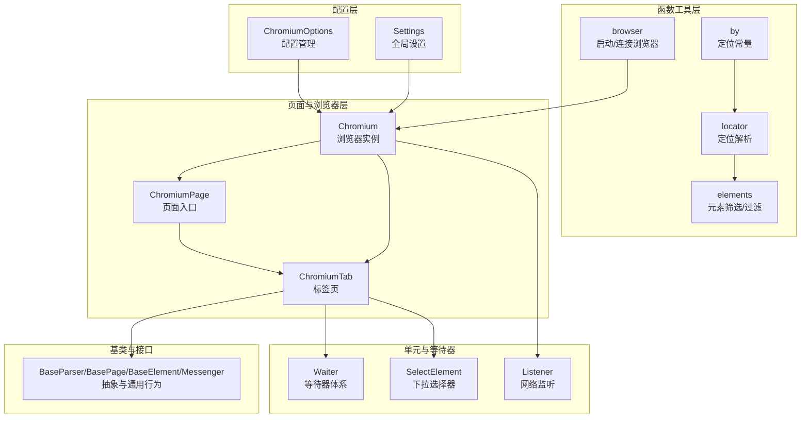
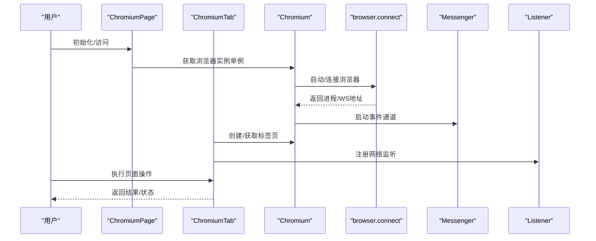
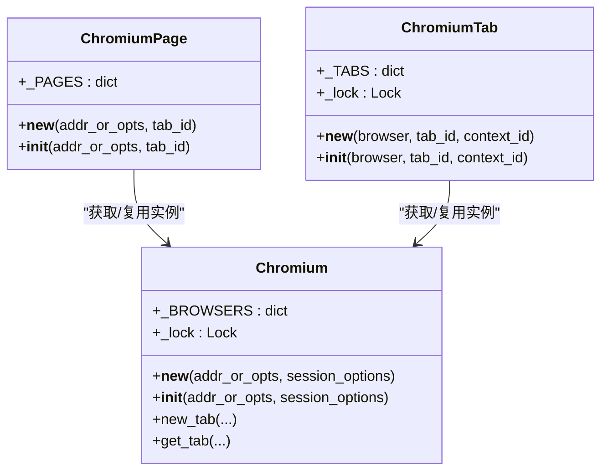
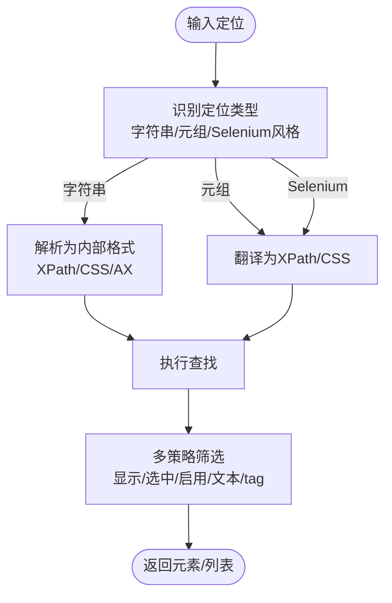
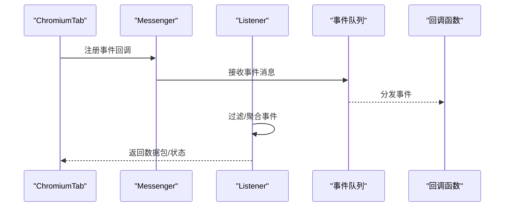
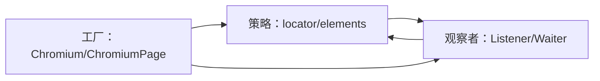
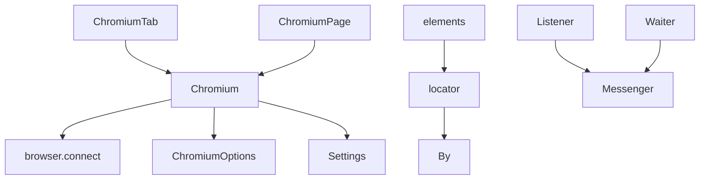

# 设计模式应用

<cite>
**本文引用的文件**
- [DrissionPage\__init__.py](file://DrissionPage/__init__.py)
- [DrissionPage\_base\base.py](file://DrissionPage/_base/base.py)
- [DrissionPage\_browsers\chromium.py](file://DrissionPage/_browsers/chromium.py)
- [DrissionPage\_pages\chromium_page.py](file://DrissionPage/_pages/chromium_page.py)
- [DrissionPage\_pages\chromium_tab.py](file://DrissionPage/_pages/chromium_tab.py)
- [DrissionPage\_functions\browser.py](file://DrissionPage/_functions/browser.py)
- [DrissionPage\_functions\by.py](file://DrissionPage/_functions/by.py)
- [DrissionPage\_functions\locator.py](file://DrissionPage/_functions/locator.py)
- [DrissionPage\_functions\elements.py](file://DrissionPage/_functions/elements.py)
- [DrissionPage\_functions\settings.py](file://DrissionPage/_functions/settings.py)
- [DrissionPage\_configs\chromium_options.py](file://DrissionPage/_configs/chromium_options.py)
- [DrissionPage\_units\listener.py](file://DrissionPage/_units/listener.py)
- [DrissionPage\_units\waiter.py](file://DrissionPage/_units/waiter.py)
- [DrissionPage\_units\selector.py](file://DrissionPage/_units/selector.py)
</cite>

## 目录
1. [引言](#引言)
2. [项目结构](#项目结构)
3. [核心组件](#核心组件)
4. [架构总览](#架构总览)
5. [详细组件分析](#详细组件分析)
6. [依赖分析](#依赖分析)
7. [性能考虑](#性能考虑)
8. [故障排查指南](#故障排查指南)
9. [结论](#结论)
10. [附录](#附录)

## 引言
本文件聚焦 DrissionPage 在浏览器自动化场景下的设计模式应用，系统梳理并深入分析其在“浏览器实例创建（工厂）”、“浏览器会话管理（单例）”、“定位策略（策略）”、“事件监听（观察者）”、“适配器（适配）”等方面的实现与价值，并结合具体代码路径给出可视化图示与实践建议。文档旨在帮助读者理解 DrissionPage 如何通过模式组合提升可扩展性与可维护性，并提供替代方案对比与技术权衡。

## 项目结构
DrissionPage 采用按职责分层的模块化组织方式：
- 配置层：ChromiumOptions、Settings 等，负责参数与全局配置
- 函数工具层：browser、locator、elements、settings 等，提供连接、定位、元素筛选等通用能力
- 页面与浏览器层：Chromium、ChromiumPage、ChromiumTab，封装浏览器生命周期与页面操作
- 单元与等待器：listener、waiter、selector 等，提供事件监听、等待与交互辅助
- 基类与接口：base.py 中的 BaseParser、BasePage、BaseElement、Messenger 等，定义抽象与通用行为

图表来源
- [DrissionPage\_configs\chromium_options.py:16-417](file://DrissionPage/_configs/chromium_options.py#L16-L417)
- [DrissionPage\_functions\browser.py:24-87](file://DrissionPage/_functions/browser.py#L24-L87)
- [DrissionPage\_functions\by.py:10-19](file://DrissionPage/_functions/by.py#L10-L19)
- [DrissionPage\_functions\locator.py:15-579](file://DrissionPage/_functions/locator.py#L15-L579)
- [DrissionPage\_functions\elements.py:276-461](file://DrissionPage/_functions/elements.py#L276-L461)
- [DrissionPage\_browsers\chromium.py:33-730](file://DrissionPage/_browsers/chromium.py#L33-L730)
- [DrissionPage\_pages\chromium_page.py:17-103](file://DrissionPage/_pages/chromium_page.py#L17-L103)
- [DrissionPage\_pages\chromium_tab.py:22-238](file://DrissionPage/_pages/chromium_tab.py#L22-L238)
- [DrissionPage\_units\listener.py:20-543](file://DrissionPage/_units/listener.py#L20-L543)
- [DrissionPage\_units\waiter.py:15-433](file://DrissionPage/_units/waiter.py#L15-L433)
- [DrissionPage\_units\selector.py:13-161](file://DrissionPage/_units/selector.py#L13-L161)
- [DrissionPage\_base\base.py:29-434](file://DrissionPage/_base/base.py#L29-L434)

章节来源
- [DrissionPage\__init__.py:22-28](file://DrissionPage/__init__.py#L22-L28)

## 核心组件
- 工厂与单例：Chromium 通过类变量与锁实现浏览器实例的单例缓存；ChromiumPage/ChromiumTab 通过类变量与锁实现标签页单例
- 策略：By 定义定位常量；locator 将多种输入统一转换为 XPath/CSS 策略；elements 提供多维度筛选策略
- 观察者：Messenger 事件队列与回调注册；Listener 网络事件监听；Waiter 等待器基于轮询/超时机制
- 适配器：ChromiumTab 在“浏览器模式”和“会话模式”之间切换，适配不同数据源与行为

章节来源
- [DrissionPage\_browsers\chromium.py:33-120](file://DrissionPage/_browsers/chromium.py#L33-L120)
- [DrissionPage\_pages\chromium_page.py:18-31](file://DrissionPage/_pages/chromium_page.py#L18-L31)
- [DrissionPage\_pages\chromium_tab.py:22-47](file://DrissionPage/_pages/chromium_tab.py#L22-L47)
- [DrissionPage\_functions\by.py:10-19](file://DrissionPage/_functions/by.py#L10-L19)
- [DrissionPage\_functions\locator.py:15-115](file://DrissionPage/_functions/locator.py#L15-L115)
- [DrissionPage\_functions\elements.py:43-62](file://DrissionPage/_functions/elements.py#L43-L62)
- [DrissionPage\_base\base.py:373-434](file://DrissionPage/_base/base.py#L373-L434)
- [DrissionPage\_units\listener.py:20-174](file://DrissionPage/_units/listener.py#L20-L174)
- [DrissionPage\_units\waiter.py:85-235](file://DrissionPage/_units/waiter.py#L85-L235)

## 架构总览
DrissionPage 的运行时架构围绕“浏览器实例（Chromium）—标签页（ChromiumTab）—页面（ChromiumPage）—元素/等待/监听”的层次展开。ChromiumOptions/Settings 提供配置注入，browser 负责启动/连接，locator/elements 提供定位与筛选，listener/waiter 提供事件与等待能力，Messeger 统一事件通道。

图表来源
- [DrissionPage\_pages\chromium_page.py:18-41](file://DrissionPage/_pages/chromium_page.py#L18-L41)
- [DrissionPage\_browsers\chromium.py:33-120](file://DrissionPage/_browsers/chromium.py#L33-L120)
- [DrissionPage\_functions\browser.py:24-87](file://DrissionPage/_functions/browser.py#L24-L87)
- [DrissionPage\_base\base.py:373-434](file://DrissionPage/_base/base.py#L373-L434)
- [DrissionPage\_units\listener.py:78-167](file://DrissionPage/_units/listener.py#L78-L167)

## 详细组件分析

### 工厂模式：浏览器实例创建与单例
- 实现要点
  - Chromium 使用类变量与线程锁缓存已创建实例，避免重复启动
  - handle_options/run_browser 负责参数解析与启动流程
  - ChromiumPage/ChromiumTab 也采用类变量与锁实现对象单例，支持 Settings.singleton_tab_obj 控制
- 优势
  - 避免重复启动浏览器，降低资源消耗
  - 统一实例管理，便于事件与会话共享
- 适用场景
  - 多页面/多标签页并发场景
  - 需要跨会话共享浏览器上下文的场景

图表来源
- [DrissionPage\_browsers\chromium.py:33-120](file://DrissionPage/_browsers/chromium.py#L33-L120)
- [DrissionPage\_pages\chromium_page.py:18-31](file://DrissionPage/_pages/chromium_page.py#L18-L31)
- [DrissionPage\_pages\chromium_tab.py:22-35](file://DrissionPage/_pages/chromium_tab.py#L22-L35)

章节来源
- [DrissionPage\_browsers\chromium.py:33-120](file://DrissionPage/_browsers/chromium.py#L33-L120)
- [DrissionPage\_pages\chromium_page.py:18-31](file://DrissionPage/_pages/chromium_page.py#L18-L31)
- [DrissionPage\_pages\chromium_tab.py:22-35](file://DrissionPage/_pages/chromium_tab.py#L22-L35)
- [DrissionPage\_functions\settings.py:13-69](file://DrissionPage/_functions/settings.py#L13-L69)

### 单例模式：浏览器会话管理
- 实现要点
  - Chromium 内部维护浏览器实例映射与会话集合，通过 Messenger 统一事件通道
  - Tabs 类管理 session_id/target_id 映射、上下文、代理等
- 优势
  - 事件与会话集中管理，降低耦合
  - 支持多标签页/上下文隔离与共享
- 适用场景
  - 多标签页并发控制、下载管理、代理设置

章节来源
- [DrissionPage\_browsers\chromium.py:565-684](file://DrissionPage/_browsers/chromium.py#L565-L684)
- [DrissionPage\_base\base.py:373-434](file://DrissionPage/_base/base.py#L373-L434)

### 策略模式：多种定位策略
- 实现要点
  - By 定义定位常量（id/xpath/css 等）
  - locator 提供字符串/元组/Selenium 风格定位到内部统一格式
  - elements 提供多维度筛选（显示、选中、启用、文本等），形成“策略链”
- 优势
  - 输入多样化，输出统一，便于扩展新定位方式
  - 筛选策略可组合，提高定位灵活性
- 适用场景
  - 复杂页面结构、动态内容、多框架嵌套

图表来源
- [DrissionPage\_functions\by.py:10-19](file://DrissionPage/_functions/by.py#L10-L19)
- [DrissionPage\_functions\locator.py:96-115](file://DrissionPage/_functions/locator.py#L96-L115)
- [DrissionPage\_functions\locator.py:468-503](file://DrissionPage/_functions/locator.py#L468-L503)
- [DrissionPage\_functions\elements.py:386-418](file://DrissionPage/_functions/elements.py#L386-L418)

章节来源
- [DrissionPage\_functions\by.py:10-19](file://DrissionPage/_functions/by.py#L10-L19)
- [DrissionPage\_functions\locator.py:15-115](file://DrissionPage/_functions/locator.py#L15-L115)
- [DrissionPage\_functions\elements.py:43-62](file://DrissionPage/_functions/elements.py#L43-L62)

### 观察者模式：事件监听与等待
- 实现要点
  - Messenger 提供事件回调注册、队列与线程处理
  - Listener 注册 Network.* 事件，按目标/正则/方法/资源类型过滤
  - Waiter 提供等待器族（页面加载、元素状态、URL/标题变化、下载完成等）
- 优势
  - 解耦事件产生与消费，支持异步处理
  - 等待器统一超时与错误处理
- 适用场景
  - 网络请求监控、动态内容加载、弹窗/告警处理

图表来源
- [DrissionPage\_base\base.py:373-434](file://DrissionPage/_base/base.py#L373-L434)
- [DrissionPage\_units\listener.py:78-167](file://DrissionPage/_units/listener.py#L78-L167)
- [DrissionPage\_units\listener.py:200-321](file://DrissionPage/_units/listener.py#L200-L321)

章节来源
- [DrissionPage\_base\base.py:373-434](file://DrissionPage/_base/base.py#L373-L434)
- [DrissionPage\_units\listener.py:20-174](file://DrissionPage/_units/listener.py#L20-L174)
- [DrissionPage\_units\waiter.py:85-235](file://DrissionPage/_units/waiter.py#L85-L235)

### 适配器模式：不同模式间的适配
- 实现要点
  - ChromiumTab 在“浏览器模式”（d 模式）与“会话模式”（s 模式）间切换
  - 切换时复制 Cookie、同步 URL、调整超时与加载策略
- 优势
  - 对上层屏蔽底层差异，提供一致的 API
  - 支持混合模式，兼顾 DOM 操作与 HTTP 请求能力
- 适用场景
  - 需要 DOM 与 HTTP 并行处理的复杂任务

章节来源
- [DrissionPage\_pages\chromium_tab.py:156-234](file://DrissionPage/_pages/chromium_tab.py#L156-L234)

### 模式组合：工厂+策略+观察者的协同
- 场景描述
  - 用户通过 ChromiumPage 获取浏览器实例（工厂）
  - 页面内使用 locator/elements（策略）定位与筛选
  - 同时通过 Listener/Waiter（观察者）监控网络与等待状态
- 效果
  - 工厂保证实例唯一与高效；策略提供灵活定位；观察者解耦事件处理
  - 三者协同提升系统可扩展性与可维护性

图表来源
- [DrissionPage\_browsers\chromium.py:33-120](file://DrissionPage/_browsers/chromium.py#L33-L120)
- [DrissionPage\_functions\locator.py:15-115](file://DrissionPage/_functions/locator.py#L15-L115)
- [DrissionPage\_functions\elements.py:276-302](file://DrissionPage/_functions/elements.py#L276-L302)
- [DrissionPage\_units\listener.py:78-167](file://DrissionPage/_units/listener.py#L78-L167)
- [DrissionPage\_units\waiter.py:85-162](file://DrissionPage/_units/waiter.py#L85-L162)

## 依赖分析
- 组件内聚与耦合
  - Chromium 作为核心枢纽，依赖 browser/Options/Settings，向上提供 ChromiumPage/ChromiumTab
  - Locator/Elements 与 By 紧密耦合，形成稳定的定位策略层
  - Listener/Waiter 依赖 Messenger 与 Driver，形成事件与等待的基础设施
- 外部依赖
  - requests、subprocess、threading、queue 等标准库用于网络、进程与并发
  - DrissionGet、lxml.cssselect 等用于下载与 CSS 转 XPath

图表来源
- [DrissionPage\_browsers\chromium.py:33-120](file://DrissionPage/_browsers/chromium.py#L33-L120)
- [DrissionPage\_functions\browser.py:24-87](file://DrissionPage/_functions/browser.py#L24-L87)
- [DrissionPage\_functions\by.py:10-19](file://DrissionPage/_functions/by.py#L10-L19)
- [DrissionPage\_functions\locator.py:15-115](file://DrissionPage/_functions/locator.py#L15-L115)
- [DrissionPage\_functions\elements.py:276-302](file://DrissionPage/_functions/elements.py#L276-L302)
- [DrissionPage\_base\base.py:373-434](file://DrissionPage/_base/base.py#L373-L434)
- [DrissionPage\_units\listener.py:78-167](file://DrissionPage/_units/listener.py#L78-L167)
- [DrissionPage\_units\waiter.py:85-162](file://DrissionPage/_units/waiter.py#L85-L162)

## 性能考虑
- 工厂与单例
  - 使用锁保护实例缓存，避免竞态；合理设置 singleton_tab_obj 以平衡内存占用
- 定位与筛选
  - 优先使用 CSS/XPath 精确表达式，减少全树扫描；利用 elements 的多策略组合降低误判
- 事件与等待
  - Listener 的队列与线程分离处理，注意清理与暂停以避免内存泄漏
  - Waiter 的轮询间隔与超时应根据业务场景调优，避免过度轮询
- 下载与网络
  - 下载路径与并发任务需合理配置，避免磁盘与网络瓶颈

## 故障排查指南
- 浏览器连接失败
  - 检查地址/端口、自动端口与用户数据目录设置；确认浏览器进程与 WS 地址可用
- 定位不到元素
  - 核对定位字符串/元组是否符合规范；检查页面是否加载完成；尝试切换 d/s 模式
- 事件未触发
  - 确认 Listener 已 start/pause/resume 正确调用；检查过滤条件（目标/正则/方法/类型）
- 等待超时
  - 调整超时时间与轮询间隔；确认等待条件是否合理；必要时开启调试日志

章节来源
- [DrissionPage\_functions\browser.py:192-210](file://DrissionPage/_functions/browser.py#L192-L210)
- [DrissionPage\_functions\locator.py:96-115](file://DrissionPage/_functions/locator.py#L96-L115)
- [DrissionPage\_units\listener.py:145-167](file://DrissionPage/_units/listener.py#L145-L167)
- [DrissionPage\_units\waiter.py:164-235](file://DrissionPage/_units/waiter.py#L164-L235)

## 结论
DrissionPage 通过工厂（实例单例）、单例（会话管理）、策略（定位与筛选）、观察者（事件与等待）、适配器（模式切换）等多种设计模式的协同应用，构建了高内聚、低耦合且易于扩展的浏览器自动化框架。这些模式不仅提升了系统的可维护性与可扩展性，也为复杂业务场景提供了稳定而灵活的解决方案。在实际工程中，建议结合业务需求对超时、并发与资源管理进行精细化调优，并持续关注模式组合带来的长期收益。

## 附录
- 模式选择的技术考量
  - 工厂/单例：优先考虑实例复用与资源控制
  - 策略：优先保证输入多样性与输出一致性
  - 观察者：优先保证事件解耦与可扩展过滤
  - 适配器：优先保证对外 API 稳定与内部实现灵活
- 替代方案对比
  - 定位策略：可引入插件化策略注册器，便于第三方扩展
  - 事件监听：可引入事件总线或消息中间件，支持分布式场景
  - 等待器：可引入协程/异步 IO，进一步降低轮询成本