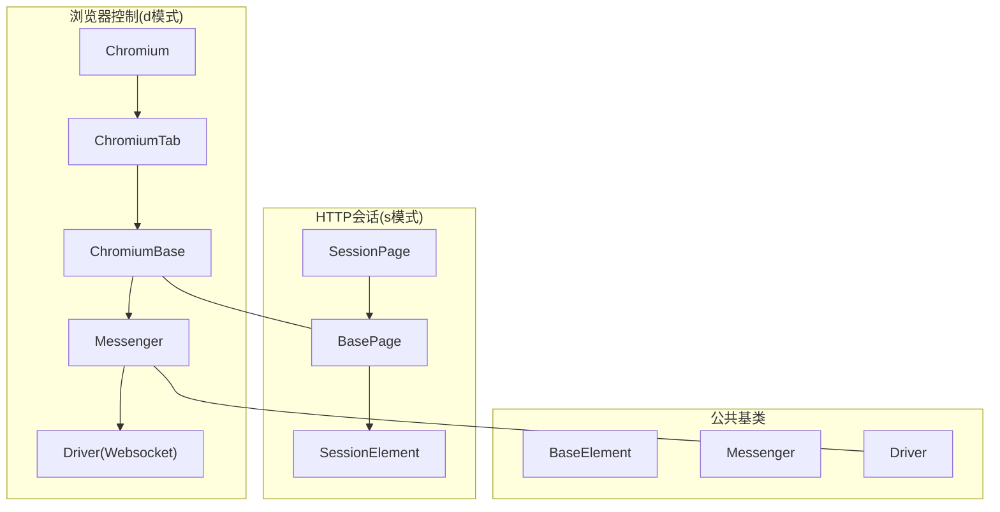
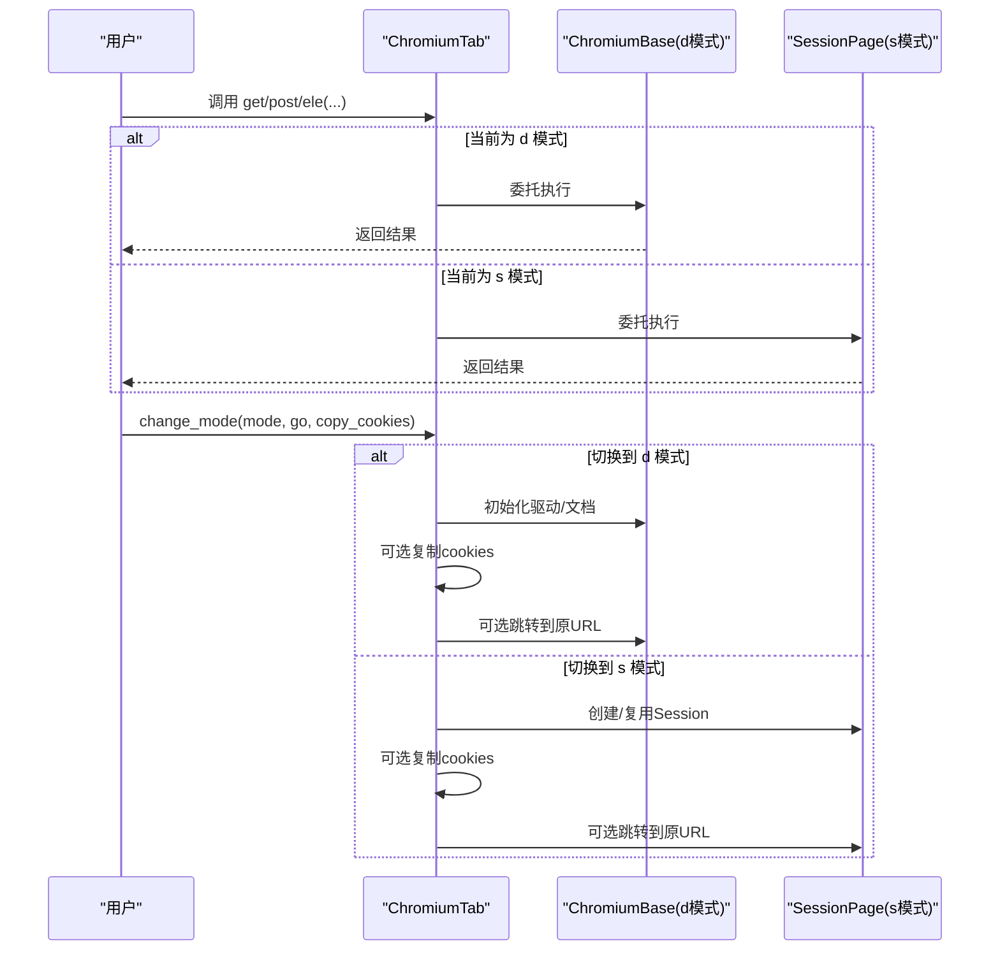
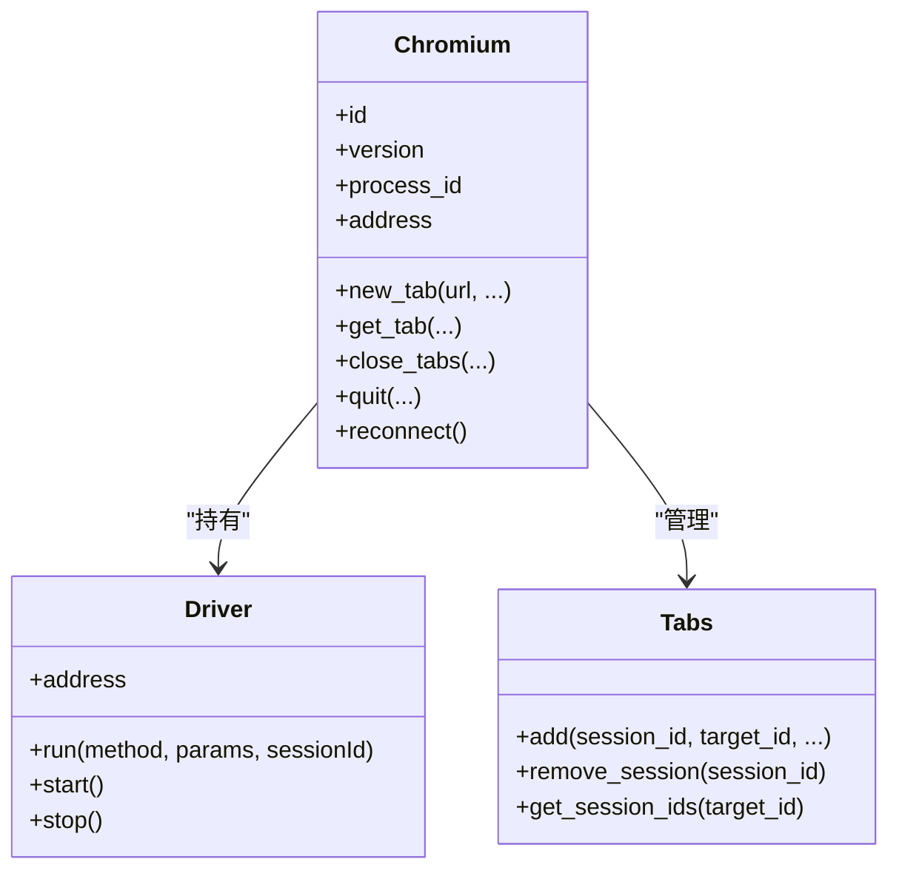
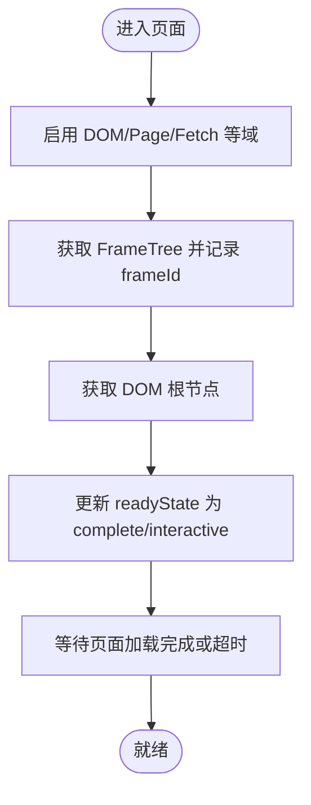
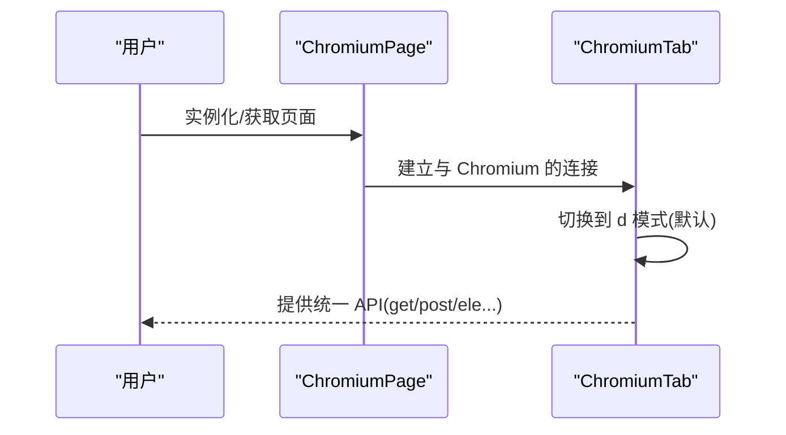
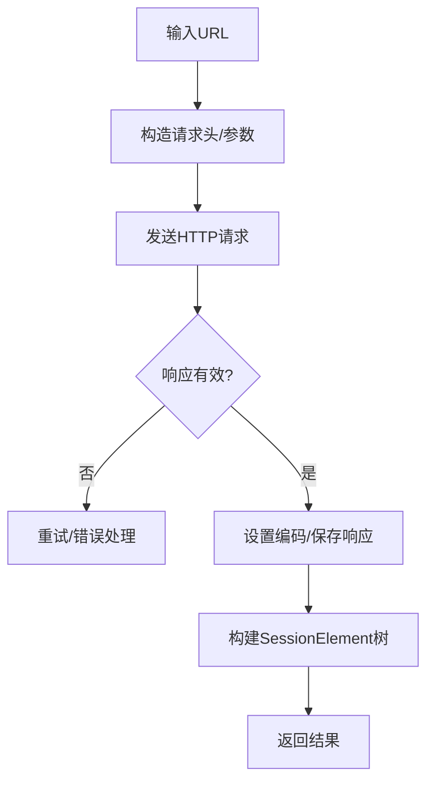
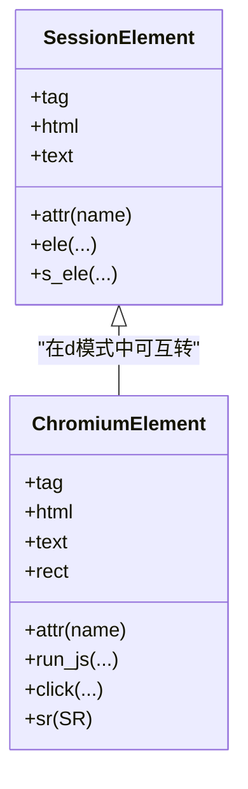
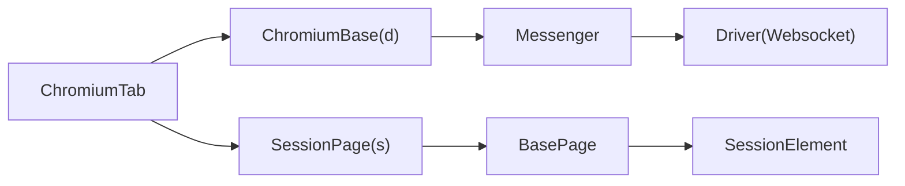

# 双模式架构

<cite>
**本文引用的文件**
- [__init__.py](file://DrissionPage/__init__.py)
- [base.py](file://DrissionPage/_base/base.py)
- [driver.py](file://DrissionPage/_base/driver.py)
- [chromium.py](file://DrissionPage/_browsers/chromium.py)
- [chromium_base.py](file://DrissionPage/_pages/chromium_base.py)
- [chromium_tab.py](file://DrissionPage/_pages/chromium_tab.py)
- [chromium_page.py](file://DrissionPage/_pages/chromium_page.py)
- [session_page.py](file://DrissionPage/_pages/session_page.py)
- [session_element.py](file://DrissionPage/_elements/session_element.py)
- [chromium_element.py](file://DrissionPage/_elements/chromium_element.py)
- [chromium_options.py](file://DrissionPage/_configs/chromium_options.py)
- [session_options.py](file://DrissionPage/_configs/session_options.py)
- [settings.py](file://DrissionPage/_functions/settings.py)
</cite>

## 目录
1. [引言](#引言)
2. [项目结构](#项目结构)
3. [核心组件](#核心组件)
4. [架构总览](#架构总览)
5. [详细组件分析](#详细组件分析)
6. [依赖关系分析](#依赖关系分析)
7. [性能考量](#性能考量)
8. [故障排查指南](#故障排查指南)
9. [结论](#结论)
10. [附录：切换与使用示例](#附录切换与使用示例)

## 引言
本文件系统性阐述 DrissionPage 的“双模式架构”，即两种运行模式的协同设计与切换机制：
- 基于 CDP 协议的浏览器控制模式（简称 d 模式）
- 基于 HTTP 会话的轻量处理模式（简称 s 模式）

该架构通过统一的页面抽象层，让同一套 API 在不同模式下无缝切换，既能在复杂页面中发挥浏览器控制的完整能力，也能在静态资源或简单交互场景中以 HTTP 会话高效处理，兼顾速度、稳定性和功能完整性。

## 项目结构
DrissionPage 将“浏览器控制”和“HTTP 会话”两条主线分别封装在不同的页面类中，并通过公共基类与混入类实现共享能力：
- 浏览器控制链路：Chromium → ChromiumTab/ChromiumPage → ChromiumBase → Messenger/Driver
- HTTP 会话链路：SessionPage → BasePage → SessionElement
- 共享基类：BasePage、BaseElement、BaseParser、Messenger、Driver

图示来源
- [chromium.py:33-127](file://DrissionPage/_browsers/chromium.py#L33-L127)
- [chromium_base.py:39-124](file://DrissionPage/_pages/chromium_base.py#L39-L124)
- [chromium_tab.py:22-75](file://DrissionPage/_pages/chromium_tab.py#L22-L75)
- [chromium_page.py:17-55](file://DrissionPage/_pages/chromium_page.py#L17-L55)
- [session_page.py:25-103](file://DrissionPage/_pages/session_page.py#L25-L103)
- [base.py:29-118](file://DrissionPage/_base/base.py#L29-L118)
- [driver.py:24-152](file://DrissionPage/_base/driver.py#L24-L152)

章节来源
- [__init__.py:22-28](file://DrissionPage/__init__.py#L22-L28)
- [chromium.py:33-127](file://DrissionPage/_browsers/chromium.py#L33-L127)
- [chromium_base.py:39-124](file://DrissionPage/_pages/chromium_base.py#L39-L124)
- [chromium_tab.py:22-75](file://DrissionPage/_pages/chromium_tab.py#L22-L75)
- [chromium_page.py:17-55](file://DrissionPage/_pages/chromium_page.py#L17-L55)
- [session_page.py:25-103](file://DrissionPage/_pages/session_page.py#L25-L103)
- [base.py:29-118](file://DrissionPage/_base/base.py#L29-L118)
- [driver.py:24-152](file://DrissionPage/_base/driver.py#L24-L152)

## 核心组件
- Chromium：浏览器实例管理、标签页生命周期、CDP 会话绑定、事件分发
- ChromiumBase：d 模式的页面核心，封装 DOM、JS 执行、网络、存储等能力
- ChromiumTab/ChromiumPage：标签页与页面对象，支持模式切换与上下文管理
- SessionPage：s 模式的页面对象，基于 requests.Session 处理 HTTP 请求与响应
- Messenger/Driver：CDP 通信层，负责 WebSocket 连接、消息队列、事件回调
- SessionElement/ChromiumElement：两类元素模型，分别对应 s/d 模式下的元素操作

章节来源
- [chromium.py:33-127](file://DrissionPage/_browsers/chromium.py#L33-L127)
- [chromium_base.py:39-124](file://DrissionPage/_pages/chromium_base.py#L39-L124)
- [chromium_tab.py:22-75](file://DrissionPage/_pages/chromium_tab.py#L22-L75)
- [chromium_page.py:17-55](file://DrissionPage/_pages/chromium_page.py#L17-L55)
- [session_page.py:25-103](file://DrissionPage/_pages/session_page.py#L25-L103)
- [base.py:29-118](file://DrissionPage/_base/base.py#L29-L118)
- [driver.py:24-152](file://DrissionPage/_base/driver.py#L24-L152)
- [session_element.py:23-110](file://DrissionPage/_elements/session_element.py#L23-L110)
- [chromium_element.py:38-120](file://DrissionPage/_elements/chromium_element.py#L38-L120)

## 架构总览
双模式的核心在于“统一入口 + 模式切换”。ChromiumTab 提供统一接口，内部维护一个“当前模式”标志位，通过委托模式在 d 模式与 s 模式对象之间切换。切换时可选择是否复制 cookies 并同步 URL。

图示来源
- [chromium_tab.py:156-194](file://DrissionPage/_pages/chromium_tab.py#L156-L194)
- [chromium_base.py:103-124](file://DrissionPage/_pages/chromium_base.py#L103-L124)
- [session_page.py:104-134](file://DrissionPage/_pages/session_page.py#L104-L134)

章节来源
- [chromium_tab.py:156-194](file://DrissionPage/_pages/chromium_tab.py#L156-L194)
- [chromium_base.py:103-124](file://DrissionPage/_pages/chromium_base.py#L103-L124)
- [session_page.py:104-134](file://DrissionPage/_pages/session_page.py#L104-L134)

## 详细组件分析

### 组件一：Chromium（浏览器控制核心）
- 负责启动/连接浏览器、创建/管理标签页、上下文隔离、下载管理、代理设置等
- 通过 Driver 与浏览器建立 WebSocket 连接，启用 Target/Page/DOM 等域
- 维护 Tabs 映射表，跟踪 session_id/target_id/frame_id 的关系

图示来源
- [chromium.py:33-127](file://DrissionPage/_browsers/chromium.py#L33-L127)
- [chromium.py:565-684](file://DrissionPage/_browsers/chromium.py#L565-L684)
- [driver.py:24-152](file://DrissionPage/_base/driver.py#L24-L152)

章节来源
- [chromium.py:33-127](file://DrissionPage/_browsers/chromium.py#L33-L127)
- [chromium.py:565-684](file://DrissionPage/_browsers/chromium.py#L565-L684)
- [driver.py:24-152](file://DrissionPage/_base/driver.py#L24-L152)

### 组件二：ChromiumBase（d 模式页面核心）
- 启动 DOM/Page 事件监听，获取文档根节点，支持 JS 执行、元素查找、滚动截图、对话框处理等
- 提供 run_cdp/run_js 等底层能力，封装 readyState 加载状态机
- 与 Chromium 的 Tabs 表配合，维护 frameId、sessionId、contextId

图示来源
- [chromium_base.py:103-124](file://DrissionPage/_pages/chromium_base.py#L103-L124)
- [chromium_base.py:126-160](file://DrissionPage/_pages/chromium_base.py#L126-L160)
- [chromium_base.py:745-761](file://DrissionPage/_pages/chromium_base.py#L745-L761)

章节来源
- [chromium_base.py:103-124](file://DrissionPage/_pages/chromium_base.py#L103-L124)
- [chromium_base.py:126-160](file://DrissionPage/_pages/chromium_base.py#L126-L160)
- [chromium_base.py:745-761](file://DrissionPage/_pages/chromium_base.py#L745-L761)

### 组件三：ChromiumTab/ChromiumPage（统一入口与页面对象）
- ChromiumTab 维护当前模式（d/s）与模式对象委托，提供 change_mode、cookies_to_session/cookies_to_browser 等切换能力
- ChromiumPage 是单例化封装，提供标签页集合、窗口信息、进程版本等属性

图示来源
- [chromium_page.py:17-55](file://DrissionPage/_pages/chromium_page.py#L17-L55)
- [chromium_tab.py:156-194](file://DrissionPage/_pages/chromium_tab.py#L156-L194)

章节来源
- [chromium_page.py:17-55](file://DrissionPage/_pages/chromium_page.py#L17-L55)
- [chromium_tab.py:156-194](file://DrissionPage/_pages/chromium_tab.py#L156-L194)

### 组件四：SessionPage（s 模式页面）
- 基于 requests.Session，封装 get/post、响应解析、编码处理、重试策略、Cookie 管理
- 提供 ele/s_ele 等元素查找接口，内部通过 lxml 解析 HTML 并包装为 SessionElement

图示来源
- [session_page.py:180-265](file://DrissionPage/_pages/session_page.py#L180-L265)
- [session_page.py:148-149](file://DrissionPage/_pages/session_page.py#L148-L149)
- [session_element.py:169-301](file://DrissionPage/_elements/session_element.py#L169-L301)

章节来源
- [session_page.py:180-265](file://DrissionPage/_pages/session_page.py#L180-L265)
- [session_page.py:148-149](file://DrissionPage/_pages/session_page.py#L148-L149)
- [session_element.py:169-301](file://DrissionPage/_elements/session_element.py#L169-L301)

### 组件五：元素模型（SessionElement vs ChromiumElement）
- SessionElement：基于 lxml，适合静态/半静态页面的快速解析与定位
- ChromiumElement：基于 CDP，支持真实 DOM、Shadow DOM、JS 属性、样式、截图、拖拽等完整能力

图示来源
- [session_element.py:23-110](file://DrissionPage/_elements/session_element.py#L23-L110)
- [chromium_element.py:38-120](file://DrissionPage/_elements/chromium_element.py#L38-L120)

章节来源
- [session_element.py:23-110](file://DrissionPage/_elements/session_element.py#L23-L110)
- [chromium_element.py:38-120](file://DrissionPage/_elements/chromium_element.py#L38-L120)

## 依赖关系分析
- d 模式依赖 Chromium/Driver/Messenger，通过 WebSocket 与浏览器交互
- s 模式依赖 requests.Session，通过 HTTP 请求与服务器交互
- 两者共享 BasePage/BaseElement/Messenger/Driver 的部分能力（如事件、超时、等待）
- ChromiumTab 在运行时动态切换模式对象，实现“同一 API，双倍能力”

图示来源
- [chromium_tab.py:156-194](file://DrissionPage/_pages/chromium_tab.py#L156-L194)
- [chromium_base.py:39-124](file://DrissionPage/_pages/chromium_base.py#L39-L124)
- [session_page.py:25-103](file://DrissionPage/_pages/session_page.py#L25-L103)
- [base.py:29-118](file://DrissionPage/_base/base.py#L29-L118)
- [driver.py:24-152](file://DrissionPage/_base/driver.py#L24-L152)

章节来源
- [chromium_tab.py:156-194](file://DrissionPage/_pages/chromium_tab.py#L156-L194)
- [chromium_base.py:39-124](file://DrissionPage/_pages/chromium_base.py#L39-L124)
- [session_page.py:25-103](file://DrissionPage/_pages/session_page.py#L25-L103)
- [base.py:29-118](file://DrissionPage/_base/base.py#L29-L118)
- [driver.py:24-152](file://DrissionPage/_base/driver.py#L24-L152)

## 性能考量
- d 模式
  - 优点：可执行真实 JS、支持 DOM/样式/截图/拖拽等完整能力；适合复杂交互与动态页面
  - 成本：启动浏览器、维护 WebSocket、事件循环带来额外开销
- s 模式
  - 优点：基于 HTTP 会话，解析速度快、内存占用低；适合静态/半静态页面与批量抓取
  - 成本：无法执行 JS、缺少真实 DOM 能力
- 模式切换
  - 切换时可选择复制 cookies 与 UA，避免重复登录与降低被识别概率
  - 切换后可选择同步 URL，保证状态一致性

[本节为通用性能讨论，无需列出具体文件来源]

## 故障排查指南
- 连接失败
  - 检查浏览器地址与端口是否正确，确认 WebSocket 地址可达
  - 若握手 403，参考环境升级提示
- 页面加载超时
  - 调整超时配置（Settings 或选项对象），检查网络与目标站点稳定性
- 元素定位失败
  - d 模式下确保页面已完全加载；s 模式下检查 HTML 结构与定位符有效性
- 对话框/弹窗
  - d 模式下可通过自动处理或手动处理；注意在弹窗期间某些 CDP 方法会被阻塞

章节来源
- [driver.py:120-132](file://DrissionPage/_base/driver.py#L120-L132)
- [chromium_base.py:745-761](file://DrissionPage/_pages/chromium_base.py#L745-L761)
- [settings.py:13-69](file://DrissionPage/_functions/settings.py#L13-L69)

## 结论
DrissionPage 的双模式架构通过“统一入口 + 动态委托”的设计，在不改变上层 API 的前提下，实现了“浏览器控制”与“HTTP 会话”的灵活切换。d 模式提供完整的浏览器能力，s 模式提供高效的 HTTP 处理能力，二者互补，既能覆盖复杂场景，又能兼顾性能与稳定性。

## 附录：切换与使用示例
以下示例展示如何在两种模式间切换，以及各自的典型使用场景与注意事项。请根据实际需求选择合适的模式，并在切换时考虑 cookies 与 UA 的复制。

- 切换到 d 模式
  - 使用场景：需要执行 JS、操作 DOM、处理弹窗、截图、拖拽等
  - 关键点：切换后会初始化驱动与文档，必要时复制 cookies 并跳转到原 URL
  - 参考路径：[chromium_tab.py:156-194](file://DrissionPage/_pages/chromium_tab.py#L156-L194)

- 切换到 s 模式
  - 使用场景：静态页面解析、批量抓取、轻量级元素定位
  - 关键点：创建/复用 Session，必要时复制 cookies 并跳转到原 URL
  - 参考路径：[chromium_tab.py:180-194](file://DrissionPage/_pages/chromium_tab.py#L180-L194)，[session_page.py:104-134](file://DrissionPage/_pages/session_page.py#L104-L134)

- 模式切换参数说明
  - mode：'d' 或 's'，其他值默认切换到 d 模式
  - go：切换后是否跳转到原模式的 URL
  - copy_cookies：是否复制 cookies 与 UA
  - 参考路径：[chromium_tab.py:280-289](file://DrissionPage/_pages/chromium_tab.py#L280-L289)

- 配置与选项
  - ChromiumOptions：浏览器路径、用户数据目录、无头模式、代理、超时、重试等
  - SessionOptions：请求头、Cookie、代理、超时、重试等
  - 参考路径：[chromium_options.py:16-171](file://DrissionPage/_configs/chromium_options.py#L16-L171)，[session_options.py:20-133](file://DrissionPage/_configs/session_options.py#L20-L133)