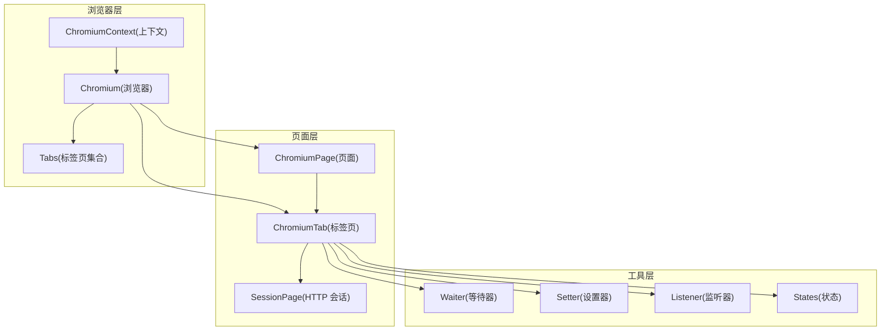
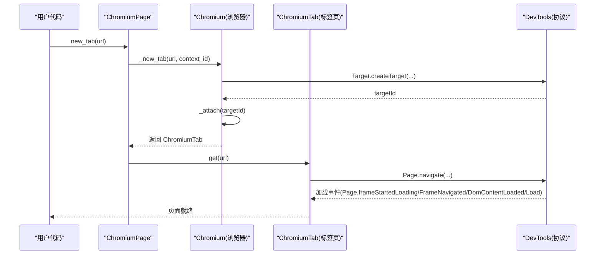
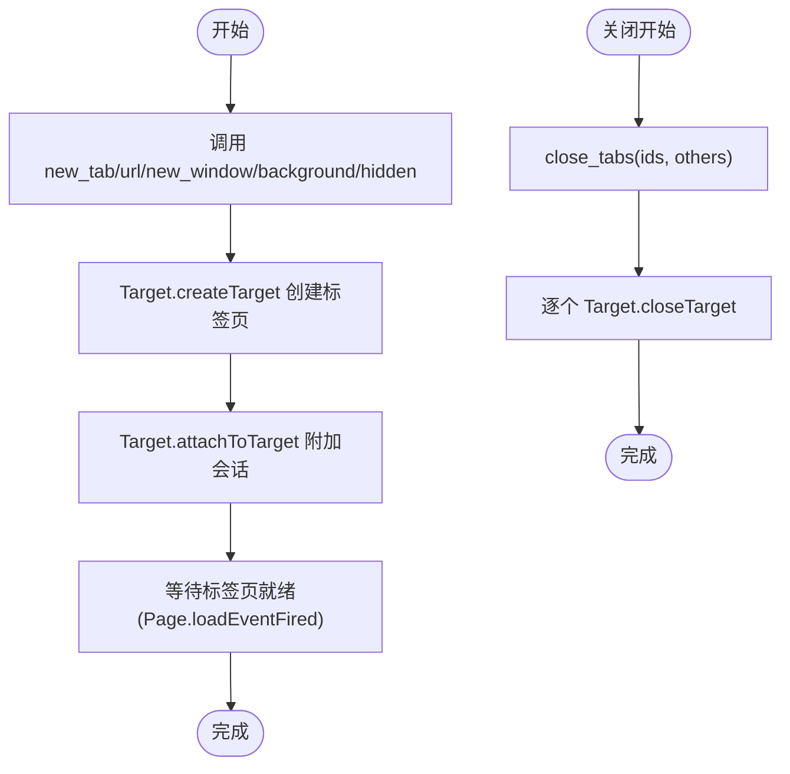
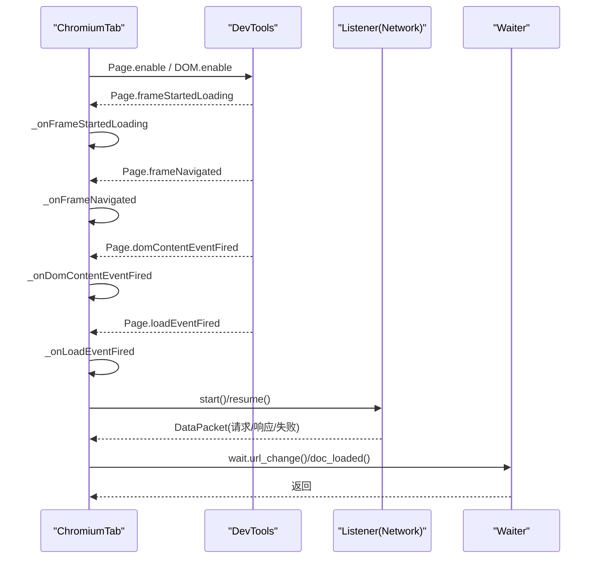
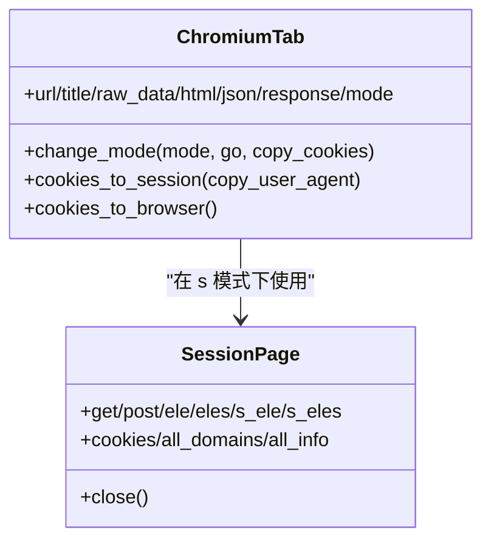
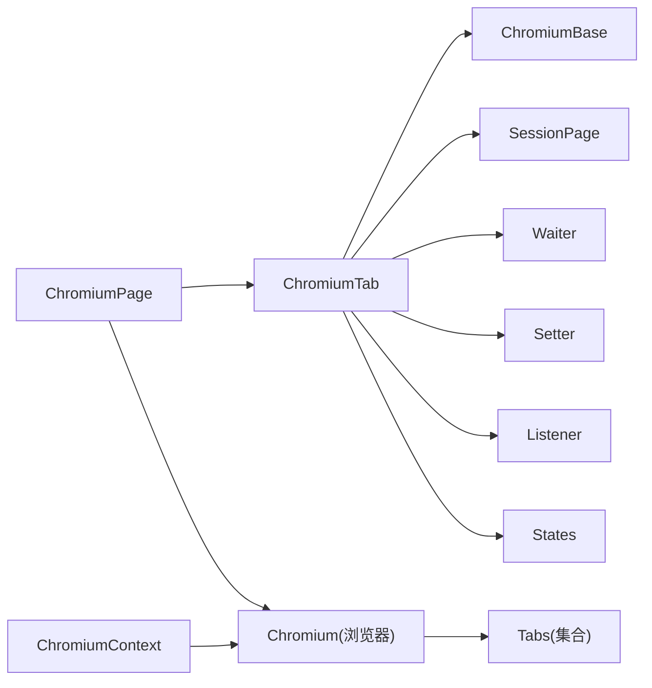

# 多标签页管理

<cite>
**本文引用的文件列表**
- [chromium_tab.py](file://DrissionPage/_pages/chromium_tab.py)
- [chromium_page.py](file://DrissionPage/_pages/chromium_page.py)
- [session_page.py](file://DrissionPage/_pages/session_page.py)
- [chromium_base.py](file://DrissionPage/_pages/chromium_base.py)
- [chromium.py](file://DrissionPage/_browsers/chromium.py)
- [chromium_context.py](file://DrissionPage/_browsers/chromium_context.py)
- [waiter.py](file://DrissionPage/_units/waiter.py)
- [setter.py](file://DrissionPage/_units/setter.py)
- [listener.py](file://DrissionPage/_units/listener.py)
- [states.py](file://DrissionPage/_units/states.py)
- [chromium_options.py](file://DrissionPage/_configs/chromium_options.py)
</cite>

## 目录
1. [简介](#简介)
2. [项目结构](#项目结构)
3. [核心组件](#核心组件)
4. [架构总览](#架构总览)
5. [详细组件分析](#详细组件分析)
6. [依赖关系分析](#依赖关系分析)
7. [性能考量](#性能考量)
8. [故障排查指南](#故障排查指南)
9. [结论](#结论)
10. [附录](#附录)

## 简介
本文件系统性阐述 DrissionPage 的多标签页管理系统，覆盖标签页的创建、切换、关闭与监控；生命周期管理、事件监听与状态同步；标签页隔离与资源共享策略；以及批量标签页操作（并行处理、错误恢复与资源清理）的最佳实践，包括多窗口管理、标签页分组与会话持久化策略。

## 项目结构
DrissionPage 将浏览器控制与页面抽象解耦：
- 浏览器层：负责与 Chromium DevTools 协议交互，维护标签页集合与上下文。
- 页面层：提供两种模式的页面对象，分别面向 DOM 控制与 HTTP 会话。
- 工具层：等待器、设置器、监听器、状态机等支撑能力。

图表来源
- [chromium.py:33-127](file://DrissionPage/_browsers/chromium.py#L33-L127)
- [chromium_page.py:17-41](file://DrissionPage/_pages/chromium_page.py#L17-L41)
- [chromium_tab.py:22-47](file://DrissionPage/_pages/chromium_tab.py#L22-L47)
- [session_page.py:25-36](file://DrissionPage/_pages/session_page.py#L25-L36)
- [waiter.py:85-235](file://DrissionPage/_units/waiter.py#L85-L235)
- [setter.py:167-417](file://DrissionPage/_units/setter.py#L167-L417)
- [listener.py:20-174](file://DrissionPage/_units/listener.py#L20-L174)
- [states.py:113-182](file://DrissionPage/_units/states.py#L113-L182)

章节来源
- [chromium.py:33-127](file://DrissionPage/_browsers/chromium.py#L33-L127)
- [chromium_page.py:17-41](file://DrissionPage/_pages/chromium_page.py#L17-L41)
- [chromium_tab.py:22-47](file://DrissionPage/_pages/chromium_tab.py#L22-L47)
- [session_page.py:25-36](file://DrissionPage/_pages/session_page.py#L25-L36)

## 核心组件
- Chromium：浏览器主控，负责启动/连接、标签页创建与销毁、事件分发、下载管理、上下文管理。
- ChromiumPage：页面入口，封装常用标签页操作与上下文访问。
- ChromiumTab：单个标签页对象，支持 DOM 模式与 Session 模式切换，提供等待、设置、监听、状态查询等能力。
- SessionPage：基于 HTTP 会话的页面抽象，适合无头抓取与数据获取。
- Tabs：内部标签页集合管理器，维护会话、目标、上下文、帧映射与代理等。
- Waiter/Setter/Listener/States：等待、设置、监听与状态查询的通用工具。

章节来源
- [chromium.py:33-127](file://DrissionPage/_browsers/chromium.py#L33-L127)
- [chromium_page.py:17-41](file://DrissionPage/_pages/chromium_page.py#L17-L41)
- [chromium_tab.py:22-47](file://DrissionPage/_pages/chromium_tab.py#L22-L47)
- [session_page.py:25-36](file://DrissionPage/_pages/session_page.py#L25-L36)
- [waiter.py:85-235](file://DrissionPage/_units/waiter.py#L85-L235)
- [setter.py:167-417](file://DrissionPage/_units/setter.py#L167-L417)
- [listener.py:20-174](file://DrissionPage/_units/listener.py#L20-L174)
- [states.py:113-182](file://DrissionPage/_units/states.py#L113-L182)

## 架构总览
DrissionPage 的标签页管理以 Chromium DevTools 协议为核心，通过 Target 域进行标签页生命周期管理，通过 Page、Network、DOM、Emulation 等域实现页面行为与网络监听。浏览器层维护 Tabs 集合，页面层通过 ChromiumTab 统一对外暴露能力，并在需要时在 DOM 与 Session 两种模式之间切换。

图表来源
- [chromium_page.py:89-96](file://DrissionPage/_pages/chromium_page.py#L89-L96)
- [chromium.py:239-269](file://DrissionPage/_browsers/chromium.py#L239-L269)
- [chromium_base.py:168-206](file://DrissionPage/_pages/chromium_base.py#L168-L206)

## 详细组件分析

### 标签页创建与生命周期
- 创建：Chromium.new_tab/_new_tab 通过 Target.createTarget 创建新标签页，若失败则回退至通过现有标签页执行 window.open。
- 激活：activate_tab 支持按索引、ID 或对象激活目标标签页。
- 关闭：close_tabs 支持批量关闭或仅保留 others 指定的标签页；ChromiumTab.close 可选择同时关闭关联的 Session。

图表来源
- [chromium.py:235-305](file://DrissionPage/_browsers/chromium.py#L235-L305)
- [chromium.py:442-460](file://DrissionPage/_browsers/chromium.py#L442-L460)
- [chromium_tab.py:213-222](file://DrissionPage/_pages/chromium_tab.py#L213-L222)

章节来源
- [chromium.py:235-305](file://DrissionPage/_browsers/chromium.py#L235-L305)
- [chromium.py:442-460](file://DrissionPage/_browsers/chromium.py#L442-L460)
- [chromium_tab.py:213-222](file://DrissionPage/_pages/chromium_tab.py#L213-L222)

### 标签页切换与激活
- 支持按 ID、索引或对象激活；索引从 1 开始，负数表示从末尾计数。
- 通过 Target.activateTarget 实现激活。

章节来源
- [chromium.py:306-312](file://DrissionPage/_browsers/chromium.py#L306-L312)
- [chromium_page.py:92-93](file://DrissionPage/_pages/chromium_page.py#L92-L93)

### 标签页监控与事件监听
- 事件订阅：ChromiumBase 初始化时注册 Page.* 事件回调，涵盖导航开始、DOMContentLoaded、Load 等。
- 监听器：Listener 提供 Network.* 请求/响应捕获，支持正则匹配、方法过滤、资源类型过滤与额外信息合并。
- 等待器：BaseWaiter/ChromiumTabWaiter 提供 URL/标题变化、加载完成、下载完成、弹窗关闭等等待能力。

图表来源
- [chromium_base.py:71-84](file://DrissionPage/_pages/chromium_base.py#L71-L84)
- [chromium_base.py:168-206](file://DrissionPage/_pages/chromium_base.py#L168-L206)
- [listener.py:78-174](file://DrissionPage/_units/listener.py#L78-L174)
- [waiter.py:164-235](file://DrissionPage/_units/waiter.py#L164-L235)

章节来源
- [chromium_base.py:71-84](file://DrissionPage/_pages/chromium_base.py#L71-L84)
- [chromium_base.py:168-206](file://DrissionPage/_pages/chromium_base.py#L168-L206)
- [listener.py:78-174](file://DrissionPage/_units/listener.py#L78-L174)
- [waiter.py:164-235](file://DrissionPage/_units/waiter.py#L164-L235)

### 标签页模式切换（DOM 与 Session）
- 切换逻辑：ChromiumTab.change_mode 在 d 模式（DOM）与 s 模式（Session）之间切换，必要时迁移 Cookie、自动处理 UA、必要时重新 get。
- 会话与浏览器 Cookie 同步：cookies_to_session/cookies_to_browser 在两种模式间复制 Cookie。
- 模式属性：mode 属性返回当前模式标识；url/title/raw_data/html/json/response 等属性根据模式返回不同来源的数据。

图表来源
- [chromium_tab.py:156-221](file://DrissionPage/_pages/chromium_tab.py#L156-L221)
- [session_page.py:104-196](file://DrissionPage/_pages/session_page.py#L104-L196)

章节来源
- [chromium_tab.py:156-221](file://DrissionPage/_pages/chromium_tab.py#L156-L221)
- [session_page.py:104-196](file://DrissionPage/_pages/session_page.py#L104-L196)

### 标签页隔离与资源共享
- 隔离维度：每个标签页拥有独立的 DOM 树、运行时对象、网络会话与存储；通过 TargetId/SessionId 明确区分。
- 资源共享：可通过 ChromiumContext 创建独立上下文，共享代理、下载行为；跨标签页共享 Cookie 可通过 cookies_to_session/cookies_to_browser 实现。
- 上下文管理：ChromiumContext 提供独立的标签页集合与 Cookie 管理，支持 disposeOnDetach 自动回收。

章节来源
- [chromium.py:565-684](file://DrissionPage/_browsers/chromium.py#L565-L684)
- [chromium_context.py:7-62](file://DrissionPage/_browsers/chromium_context.py#L7-L62)
- [chromium_tab.py:195-209](file://DrissionPage/_pages/chromium_tab.py#L195-L209)

### 批量标签页操作与并发
- 批量创建：ChromiumPage.new_tab 可在循环中多次调用；建议结合等待器确保每个标签页就绪后再继续。
- 并行处理：可使用线程池对多个标签页任务并行执行，注意避免同一浏览器实例内的竞争条件。
- 错误恢复：使用 try/except 包裹每个标签页操作，失败时记录并清理资源；必要时回滚到上一个稳定状态。
- 资源清理：批量关闭时使用 close_tabs(others=True) 保留关键标签页；每个标签页结束后调用 close(session=True) 清理会话。

章节来源
- [chromium_page.py:89-96](file://DrissionPage/_pages/chromium_page.py#L89-L96)
- [chromium.py:278-298](file://DrissionPage/_browsers/chromium.py#L278-L298)
- [chromium_tab.py:213-222](file://DrissionPage/_pages/chromium_tab.py#L213-L222)

### 复杂场景最佳实践
- 多窗口管理：通过 ChromiumContext 为每个窗口分配独立上下文，避免 Cookie/Storage 冲突；使用 WindowSetter 控制窗口尺寸与位置。
- 标签页分组：利用 ChromiumContext 的标签页集合与过滤能力，按业务域划分标签页；通过 get_tabs(title/url/tab_type) 定位目标。
- 会话持久化：ChromiumOptions 支持设置 user_data_path、load_mode、超时与重试策略；结合 ChromiumContext 的 disposeOnDetach 实现按需回收。

章节来源
- [chromium_context.py:44-58](file://DrissionPage/_browsers/chromium_context.py#L44-L58)
- [setter.py:553-619](file://DrissionPage/_units/setter.py#L553-L619)
- [chromium_options.py:340-358](file://DrissionPage/_configs/chromium_options.py#L340-L358)

## 依赖关系分析

图表来源
- [chromium_tab.py:22-47](file://DrissionPage/_pages/chromium_tab.py#L22-L47)
- [chromium_page.py:17-41](file://DrissionPage/_pages/chromium_page.py#L17-L41)
- [chromium.py:33-127](file://DrissionPage/_browsers/chromium.py#L33-L127)
- [chromium_context.py:7-27](file://DrissionPage/_browsers/chromium_context.py#L7-L27)

章节来源
- [chromium_tab.py:22-47](file://DrissionPage/_pages/chromium_tab.py#L22-L47)
- [chromium_page.py:17-41](file://DrissionPage/_pages/chromium_page.py#L17-L41)
- [chromium.py:33-127](file://DrissionPage/_browsers/chromium.py#L33-L127)
- [chromium_context.py:7-27](file://DrissionPage/_browsers/chromium_context.py#L7-L27)

## 性能考量
- 加载模式：load_mode 支持 normal/eager/none，eager 模式下会在交互完成后停止加载，减少资源消耗。
- 超时与重试：通过 ChromiumOptions 与 Setter 设置 timeouts/retry_times/retry_interval，平衡稳定性与性能。
- 下载管理：启用下载时设置下载路径与命名策略，避免阻塞主线程。
- 监听器：仅在需要时启用 Listener，避免过多 Network.* 事件导致的性能开销。

章节来源
- [chromium_options.py:246-254](file://DrissionPage/_configs/chromium_options.py#L246-L254)
- [setter.py:135-144](file://DrissionPage/_units/setter.py#L135-L144)
- [waiter.py:53-82](file://DrissionPage/_units/waiter.py#L53-L82)

## 故障排查指南
- 标签页未就绪：使用 wait.doc_loaded()/load_start() 等等待器；检查 Page.* 事件回调是否触发。
- 弹窗处理：通过 handle_alert/auto_handle_alert 或 Waiter.alert_closed 自动处理。
- 下载问题：确认下载路径已设置；使用 BrowserWaiter.download_begin/downloads_done 等等待器。
- 断连与重连：Chromium.reconnect 可重建连接；注意断开时清理资源并重建会话。
- 资源监听：Listener.start()/pause()/resume() 控制监听范围与粒度；使用 wait_silent() 等待静默。

章节来源
- [chromium_base.py:687-717](file://DrissionPage/_pages/chromium_base.py#L687-L717)
- [waiter.py:53-82](file://DrissionPage/_units/waiter.py#L53-L82)
- [chromium.py:314-320](file://DrissionPage/_browsers/chromium.py#L314-L320)
- [listener.py:145-174](file://DrissionPage/_units/listener.py#L145-L174)

## 结论
DrissionPage 的多标签页管理以 Chromium DevTools 协议为基础，提供了完善的标签页生命周期、事件监听与状态同步能力。通过 ChromiumContext 实现上下文隔离，通过模式切换满足 DOM 与 HTTP 抓取的不同需求。配合等待器、监听器与设置器，可实现稳定的批量标签页操作与复杂场景下的多窗口管理与会话持久化。

## 附录
- 常用 API 快速参考
  - 创建/激活/关闭：new_tab/activate_tab/close_tabs
  - 导航与内容：get/post/ele/eles/s_ele/s_eles
  - 等待与状态：wait.url_change/wait.doc_loaded/states.ready_state
  - 监听与下载：listen.start()/wait()/stop()，wait.download_begin()/downloads_done()
  - 模式切换：change_mode/cookies_to_session/cookies_to_browser