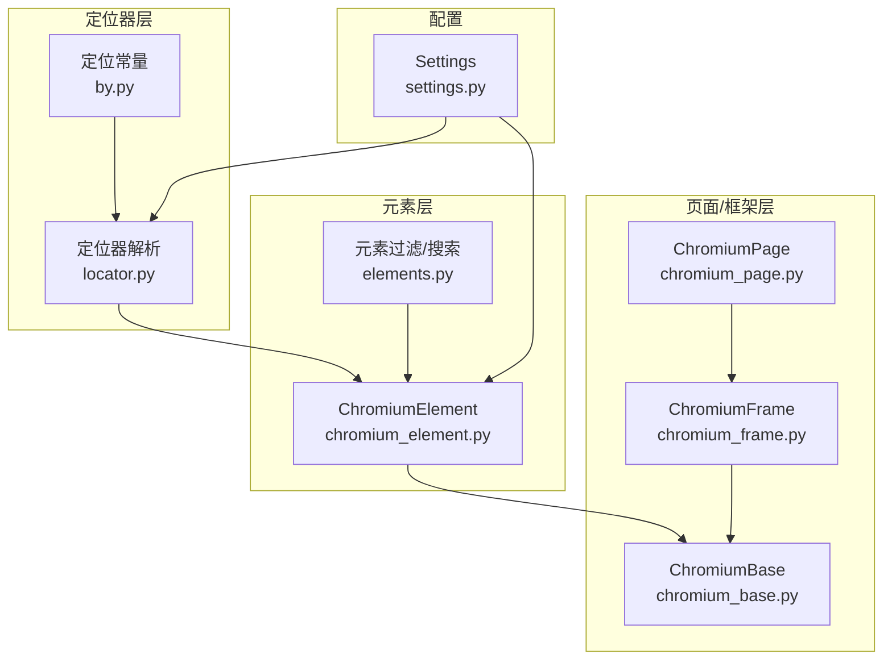
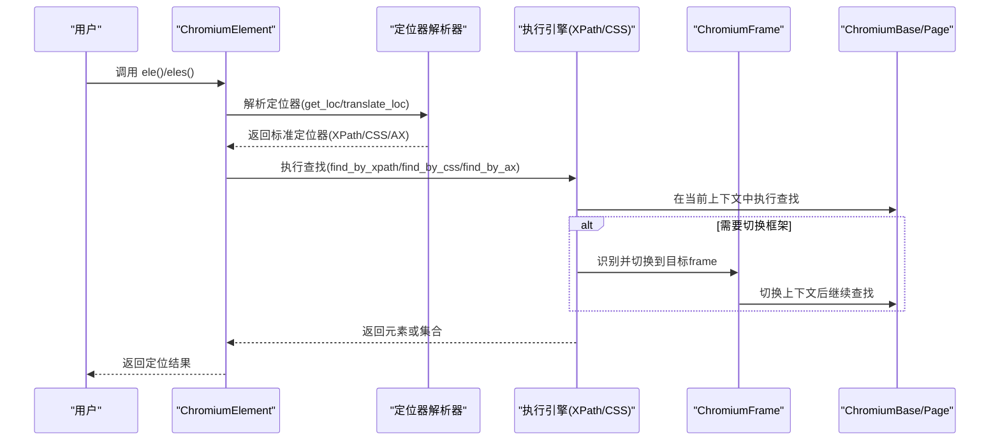
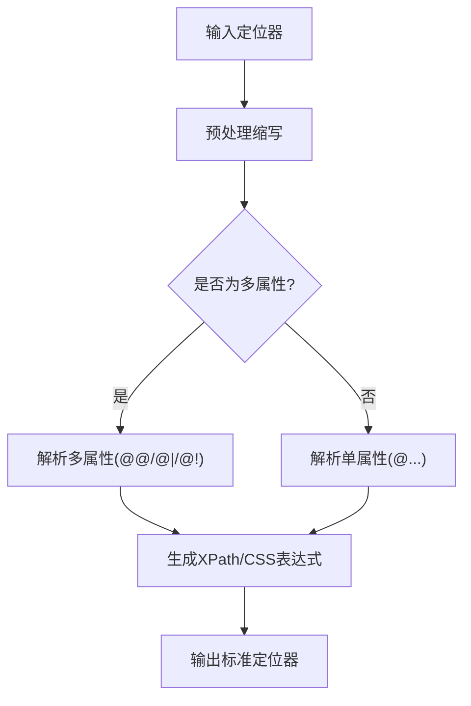
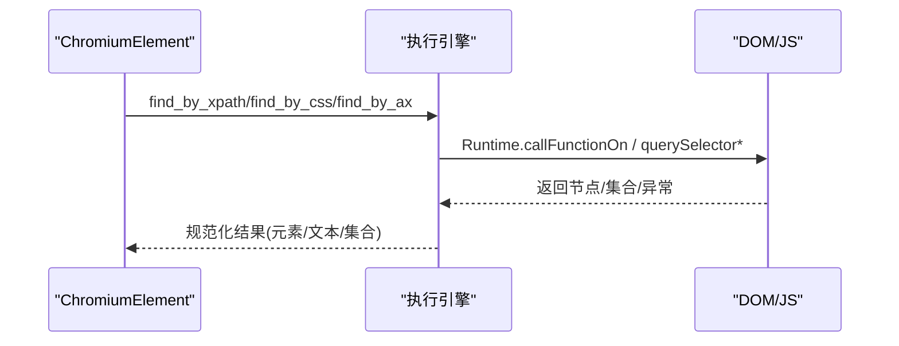
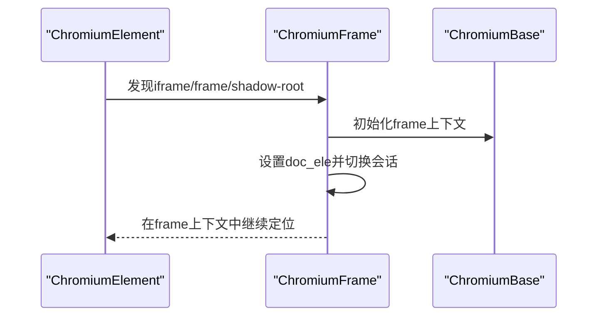
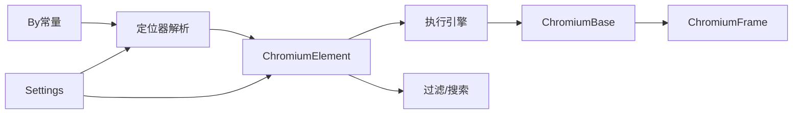

# 智能元素定位

<cite>
**本文引用的文件列表**
- [locator.py](file://DrissionPage/_functions/locator.py)
- [by.py](file://DrissionPage/_functions/by.py)
- [elements.py](file://DrissionPage/_functions/elements.py)
- [chromium_element.py](file://DrissionPage/_elements/chromium_element.py)
- [chromium_frame.py](file://DrissionPage/_pages/chromium_frame.py)
- [chromium_base.py](file://DrissionPage/_pages/chromium_base.py)
- [chromium_page.py](file://DrissionPage/_pages/chromium_page.py)
- [settings.py](file://DrissionPage/_functions/settings.py)
</cite>

## 目录
1. [简介](#简介)
2. [项目结构与定位系统架构](#项目结构与定位系统架构)
3. [核心组件](#核心组件)
4. [架构总览](#架构总览)
5. [详细组件分析](#详细组件分析)
6. [依赖关系分析](#依赖关系分析)
7. [性能考量与优化策略](#性能考量与优化策略)
8. [故障排查指南](#故障排查指南)
9. [结论](#结论)
10. [附录：定位语法与示例](#附录定位语法与示例)

## 简介
本文件面向 DrissionPage 的智能元素定位系统，系统性阐述其多策略定位能力（XPath、CSS 选择器、文本匹配、链接文本、部分文本等）、定位器语法、优先级与组合规则、跨框架元素定位机制（含自动切换 iframe 与多层嵌套），以及性能优化与最佳实践。文档同时提供代码级架构图与流程图，帮助读者快速理解定位器在页面与元素层级上的工作原理。

## 项目结构与定位系统架构
定位系统围绕“定位器语法解析 + 定位执行引擎 + 跨框架支持”三大模块构建：
- 定位器语法解析：将用户输入的字符串或元组转换为标准定位器（XPath/CSS/AX）。
- 定位执行引擎：在 DOM 中执行查找，支持相对定位、索引选择、集合返回、异常处理与超时重试。
- 跨框架支持：自动识别并切换到 iframe/shadow-root 等子上下文，确保在正确文档树内执行定位。

图表来源
- [locator.py:15-195](file://DrissionPage/_functions/locator.py#L15-L195)
- [by.py:10-19](file://DrissionPage/_functions/by.py#L10-L19)
- [chromium_element.py:419-934](file://DrissionPage/_elements/chromium_element.py#L419-L934)
- [chromium_frame.py:25-488](file://DrissionPage/_pages/chromium_frame.py#L25-L488)
- [chromium_base.py:39-200](file://DrissionPage/_pages/chromium_base.py#L39-L200)
- [chromium_page.py:17-103](file://DrissionPage/_pages/chromium_page.py#L17-L103)
- [settings.py:13-69](file://DrissionPage/_functions/settings.py#L13-L69)

章节来源
- [locator.py:15-195](file://DrissionPage/_functions/locator.py#L15-L195)
- [chromium_element.py:419-934](file://DrissionPage/_elements/chromium_element.py#L419-L934)
- [chromium_frame.py:25-488](file://DrissionPage/_pages/chromium_frame.py#L25-L488)
- [chromium_base.py:39-200](file://DrissionPage/_pages/chromium_base.py#L39-L200)
- [chromium_page.py:17-103](file://DrissionPage/_pages/chromium_page.py#L17-L103)
- [settings.py:13-69](file://DrissionPage/_functions/settings.py#L13-L69)

## 核心组件
- 定位器解析器：负责将字符串或 Selenium 风格元组转换为内部统一的定位器（XPath/CSS/AX），并支持多属性组合、文本模糊匹配、标签限定等。
- 元素定位执行器：在 DOM 上执行查找，支持相对路径、索引选择、集合返回、异常与超时处理。
- 跨框架定位器：自动识别 iframe/shadow-root，并在必要时切换上下文，确保在正确的文档树中执行定位。
- 过滤与搜索：提供按状态（可见、可点击、选中等）与文本条件的二次筛选，提升定位精度。

章节来源
- [locator.py:96-115](file://DrissionPage/_functions/locator.py#L96-L115)
- [chromium_element.py:948-1111](file://DrissionPage/_elements/chromium_element.py#L948-L1111)
- [chromium_frame.py:473-485](file://DrissionPage/_pages/chromium_frame.py#L473-L485)
- [elements.py:276-302](file://DrissionPage/_functions/elements.py#L276-L302)

## 架构总览
下图展示了从用户输入到最终返回元素对象的端到端流程，涵盖定位器解析、执行与跨框架切换。

图表来源
- [chromium_element.py:419-934](file://DrissionPage/_elements/chromium_element.py#L419-L934)
- [chromium_element.py:948-1111](file://DrissionPage/_elements/chromium_element.py#L948-L1111)
- [chromium_frame.py:473-485](file://DrissionPage/_pages/chromium_frame.py#L473-L485)
- [chromium_base.py:119-160](file://DrissionPage/_pages/chromium_base.py#L119-L160)

## 详细组件分析

### 定位器语法与解析
- 支持的输入形式
  - 字符串：如 tag:div@id=foo、text=登录、text:包含、text^开头、text$结尾、css:、xpath:、ax: 等。
  - Selenium 风格元组：(By.XPATH, '...')、(By.CSS_SELECTOR, '...') 等。
- 解析与转换
  - 字符串预处理：.class、#id、t:、tx:、c:、x: 等缩写展开为 @class=、@id=、tag:、text= 等。
  - 多属性与单属性：@@、@|、@! 组合，分别表示 AND/OR/排除；支持精确、模糊、前缀、后缀匹配。
  - 文本匹配：text=、text:、text^、text$；未显式前缀时默认模糊匹配。
  - CSS 与 XPath 的互转：当 CSS 无法直接表达时，会回退到 XPath。
- 输出格式
  - 统一为 ('xpath'|'css selector'|'ax', '表达式')，便于后续执行。

图表来源
- [locator.py:15-51](file://DrissionPage/_functions/locator.py#L15-L51)
- [locator.py:54-71](file://DrissionPage/_functions/locator.py#L54-L71)
- [locator.py:74-82](file://DrissionPage/_functions/locator.py#L74-L82)
- [locator.py:147-195](file://DrissionPage/_functions/locator.py#L147-L195)
- [locator.py:198-235](file://DrissionPage/_functions/locator.py#L198-L235)

章节来源
- [locator.py:15-195](file://DrissionPage/_functions/locator.py#L15-L195)
- [locator.py:238-374](file://DrissionPage/_functions/locator.py#L238-L374)
- [locator.py:397-442](file://DrissionPage/_functions/locator.py#L397-L442)
- [locator.py:445-465](file://DrissionPage/_functions/locator.py#L445-L465)
- [locator.py:468-503](file://DrissionPage/_functions/locator.py#L468-L503)
- [locator.py:506-543](file://DrissionPage/_functions/locator.py#L506-L543)
- [locator.py:552-579](file://DrissionPage/_functions/locator.py#L552-L579)

### XPath/CSS 选择器执行引擎
- XPath 执行
  - 将 XPath 表达式封装为 JS 函数，通过 Runtime.callFunctionOn 在 DOM 上执行。
  - 支持单个元素、集合、属性、文本节点返回；对空结果与异常进行处理。
- CSS 选择器执行
  - 使用 querySelector/querySelectorAll；对无效选择器抛出错误。
- AX（无障碍）树查询
  - 通过 Accessibility.queryAXTree 获取节点，支持 role、name 等属性筛选。

图表来源
- [chromium_element.py:1006-1068](file://DrissionPage/_elements/chromium_element.py#L1006-L1068)
- [chromium_element.py:1071-1110](file://DrissionPage/_elements/chromium_element.py#L1071-L1110)
- [chromium_element.py:974-1003](file://DrissionPage/_elements/chromium_element.py#L974-L1003)

章节来源
- [chromium_element.py:1006-1110](file://DrissionPage/_elements/chromium_element.py#L1006-L1110)
- [chromium_element.py:974-1003](file://DrissionPage/_elements/chromium_element.py#L974-L1003)

### 文本匹配与属性匹配
- 文本匹配
  - text=：精确匹配
  - text:：模糊包含
  - text^：前缀匹配
  - text$：后缀匹配
- 属性匹配
  - 支持 @id=、@class=、@name=、@title= 等精确匹配
  - 支持 @id:、@class:、@name: 等模糊匹配
  - 支持 @id^、@class^、@name^ 等前缀匹配
  - 支持 @id$、@class$、@name$ 等后缀匹配
- 组合匹配
  - @@：AND 关系
  - @|：OR 关系
  - @!：排除某条件
- 标签限定
  - tag:div 或 @tag():div 限定标签名
- 文本与属性的混合
  - 当包含 text() 或 tx() 时，优先使用 XPath 实现

章节来源
- [locator.py:43-49](file://DrissionPage/_functions/locator.py#L43-L49)
- [locator.py:147-195](file://DrissionPage/_functions/locator.py#L147-L195)
- [locator.py:238-298](file://DrissionPage/_functions/locator.py#L238-L298)
- [locator.py:301-374](file://DrissionPage/_functions/locator.py#L301-L374)
- [locator.py:397-442](file://DrissionPage/_functions/locator.py#L397-L442)
- [chromium_element.py:1385-1438](file://DrissionPage/_elements/chromium_element.py#L1385-L1438)

### 跨框架元素定位
- 自动识别与切换
  - 当定位到 iframe/frame/shadow-root 时，系统将其转换为 ChromiumFrame 对象，并在该上下文中继续查找。
  - ChromiumFrame 内部持有文档对象（doc_ele），并在需要时切换上下文。
- 多层嵌套
  - 通过递归或链式切换，支持多层 iframe 嵌套的定位。
- 加载与事件
  - 页面导航、frameDetached 等事件触发时，系统会同步更新 frame 映射并处理上下文切换。

图表来源
- [chromium_element.py:1190-1196](file://DrissionPage/_elements/chromium_element.py#L1190-L1196)
- [chromium_frame.py:40-68](file://DrissionPage/_pages/chromium_frame.py#L40-L68)
- [chromium_frame.py:473-485](file://DrissionPage/_pages/chromium_frame.py#L473-L485)
- [chromium_base.py:119-160](file://DrissionPage/_pages/chromium_base.py#L119-L160)

章节来源
- [chromium_element.py:1190-1196](file://DrissionPage/_elements/chromium_element.py#L1190-L1196)
- [chromium_frame.py:25-488](file://DrissionPage/_pages/chromium_frame.py#L25-L488)
- [chromium_base.py:119-160](file://DrissionPage/_pages/chromium_base.py#L119-L160)

### 过滤与搜索（按状态/文本）
- 按状态过滤
  - displayed、checked、selected、enabled、clickable、have_rect、have_text、tag 等。
- 文本过滤
  - 支持模糊/精确、包含/不包含。
- 索引选择
  - filter_one(index=1) 获取第 N 个满足条件的元素；否则返回 NoneElement。

章节来源
- [elements.py:386-461](file://DrissionPage/_functions/elements.py#L386-L461)
- [elements.py:64-128](file://DrissionPage/_functions/elements.py#L64-L128)
- [elements.py:163-204](file://DrissionPage/_functions/elements.py#L163-L204)

## 依赖关系分析
- 定位器解析依赖 By 常量与 Settings 错误提示语言包。
- 元素定位执行依赖 ChromiumElement 的运行时环境（CDP 会话、对象 ID、节点 ID）。
- 跨框架定位依赖 ChromiumFrame 的上下文切换与 ChromiumBase 的事件回调。
- 过滤与搜索依赖元素状态对象（ElementStates/FrameStates）。

图表来源
- [by.py:10-19](file://DrissionPage/_functions/by.py#L10-L19)
- [locator.py:10-12](file://DrissionPage/_functions/locator.py#L10-L12)
- [chromium_element.py:22-24](file://DrissionPage/_elements/chromium_element.py#L22-L24)
- [chromium_frame.py:13-22](file://DrissionPage/_pages/chromium_frame.py#L13-L22)
- [chromium_base.py:39-36](file://DrissionPage/_pages/chromium_base.py#L39-L36)
- [settings.py:13-21](file://DrissionPage/_functions/settings.py#L13-L21)

章节来源
- [by.py:10-19](file://DrissionPage/_functions/by.py#L10-L19)
- [locator.py:10-12](file://DrissionPage/_functions/locator.py#L10-L12)
- [chromium_element.py:22-24](file://DrissionPage/_elements/chromium_element.py#L22-L24)
- [chromium_frame.py:13-22](file://DrissionPage/_pages/chromium_frame.py#L13-L22)
- [chromium_base.py:39-36](file://DrissionPage/_pages/chromium_base.py#L39-L36)
- [settings.py:13-21](file://DrissionPage/_functions/settings.py#L13-L21)

## 性能考量与优化策略
- 优先使用 CSS 选择器
  - CSS 选择器在现代浏览器中通常比 XPath 更快；仅在 CSS 无法表达时回退到 XPath。
- 缩小作用域
  - 使用相对定位（例如在某个元素内部查找），减少全局扫描范围。
- 合理设置超时
  - 根据页面复杂度与网络状况调整 timeout；对静态页面可缩短超时。
- 避免过度模糊匹配
  - text:、@class: 等模糊匹配会增加匹配成本；尽量使用更精确的选择器。
- 使用过滤器
  - 先粗定位，再用 filter_one/filter 按状态/文本进一步缩小范围。
- 单次查询与批量查询
  - 需要多个元素时使用 eles() 一次性获取集合，避免多次往返。
- 跨框架定位
  - 尽可能在最近的上下文中定位；避免不必要的 frame 切换。

[本节为通用建议，无需特定文件引用]

## 故障排查指南
- 定位器格式错误
  - 现象：抛出定位器格式错误或无效表达式。
  - 排查：确认字符串前缀（text=/css=/xpath=/ax:）与符号（=/:/^/$）使用正确。
- XPath/CSS 无效
  - 现象：XPath 或 CSS 选择器无效。
  - 排查：检查表达式合法性；必要时使用调试工具验证。
- 元素不存在
  - 现象：返回 NoneElement。
  - 排查：增大超时；确认页面是否加载完成；检查是否处于正确上下文。
- 跨框架问题
  - 现象：定位不到 iframe 内元素。
  - 排查：确认已正确切换到目标 frame；检查 frame 是否同域/异域；关注 frameDetached 事件。
- 状态判断异常
  - 现象：is_displayed/is_clickable 等状态不符合预期。
  - 排查：等待页面稳定后再判断；确认元素是否被遮挡或不可交互。

章节来源
- [chromium_element.py:1017-1026](file://DrissionPage/_elements/chromium_element.py#L1017-L1026)
- [chromium_element.py:1083-1087](file://DrissionPage/_elements/chromium_element.py#L1083-L1087)
- [chromium_frame.py:190-198](file://DrissionPage/_pages/chromium_frame.py#L190-L198)
- [chromium_base.py:188-198](file://DrissionPage/_pages/chromium_base.py#L188-L198)

## 结论
DrissionPage 的智能元素定位系统通过统一的定位器语法、高效的执行引擎与完善的跨框架支持，实现了灵活且高性能的元素定位。结合合理的超时设置、作用域控制与过滤策略，可以在复杂页面中稳定、高效地定位目标元素。

[本节为总结，无需特定文件引用]

## 附录：定位语法与示例
以下示例仅描述语法与行为，不展示具体代码内容。请参考相应源码路径了解实现细节。

- 标签限定
  - 语法：tag:div、tag^iframe、tag$frame
  - 说明：限定标签名，支持精确、前缀、后缀匹配
  - 参考路径：[locator.py:160-167](file://DrissionPage/_functions/locator.py#L160-L167)
- 单属性匹配
  - 语法：@id=foo、@class=bar、@name=baz、@title=tip
  - 说明：支持 =、:、^、$ 四种匹配方式
  - 参考路径：[locator.py:238-298](file://DrissionPage/_functions/locator.py#L238-L298)
- 多属性组合
  - 语法：@@、@|、@! 组合，AND/OR/排除
  - 说明：多条件组合，支持与/或/排除
  - 参考路径：[locator.py:301-374](file://DrissionPage/_functions/locator.py#L301-L374)
- 文本匹配
  - 语法：text=、text:、text^、text$
  - 说明：精确、模糊、前缀、后缀
  - 参考路径：[locator.py:170-178](file://DrissionPage/_functions/locator.py#L170-L178)
- CSS 与 XPath
  - 语法：css:、xpath:；或 c:、x:
  - 说明：CSS 优先，无法表达时回退 XPath
  - 参考路径：[locator.py:185-187](file://DrissionPage/_functions/locator.py#L185-L187)
- AX（无障碍）
  - 语法：ax:role=button@name=OK
  - 说明：基于无障碍树查询
  - 参考路径：[locator.py:118-144](file://DrissionPage/_functions/locator.py#L118-L144)
- Selenium 风格元组
  - 语法：(By.XPATH, "...")、(By.CSS_SELECTOR, "...") 等
  - 说明：translate_loc 将其转换为内部定位器
  - 参考路径：[locator.py:468-503](file://DrissionPage/_functions/locator.py#L468-L503)

章节来源
- [locator.py:147-195](file://DrissionPage/_functions/locator.py#L147-L195)
- [locator.py:238-374](file://DrissionPage/_functions/locator.py#L238-L374)
- [locator.py:118-144](file://DrissionPage/_functions/locator.py#L118-L144)
- [locator.py:468-503](file://DrissionPage/_functions/locator.py#L468-L503)