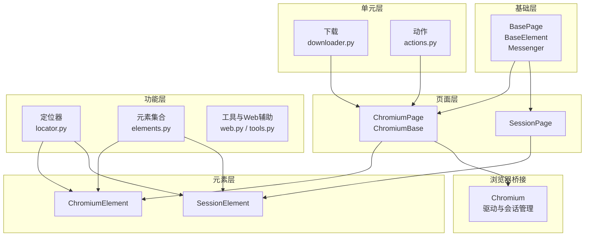
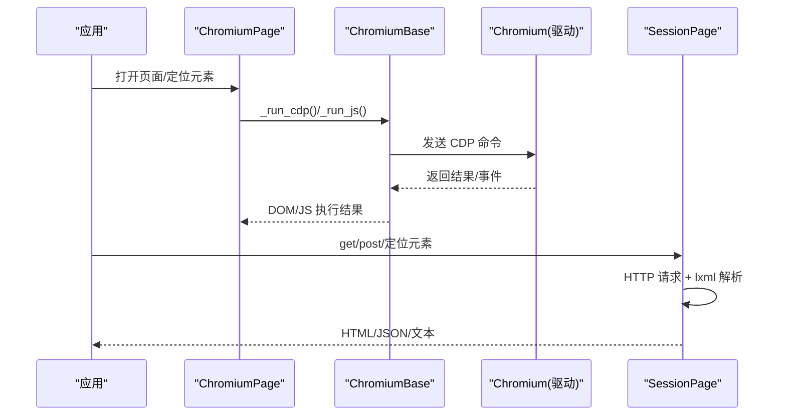
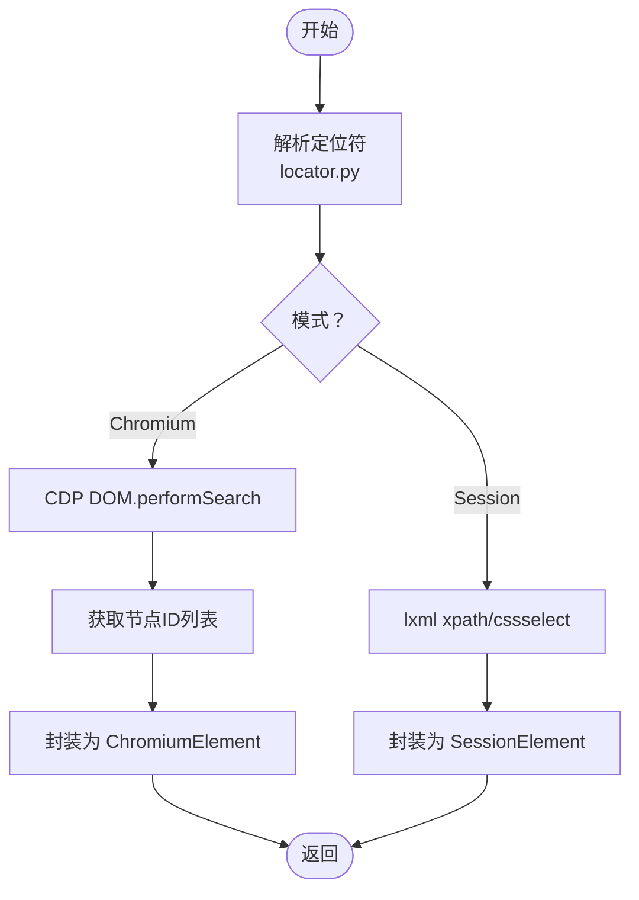
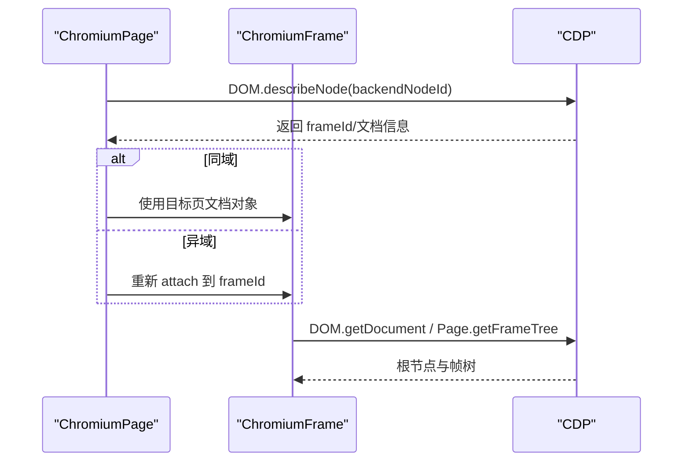
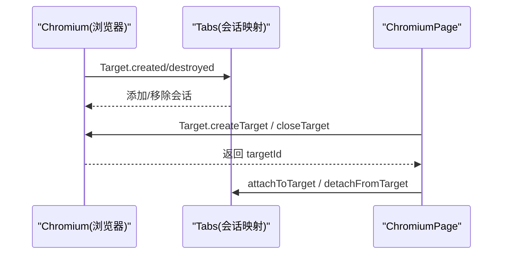
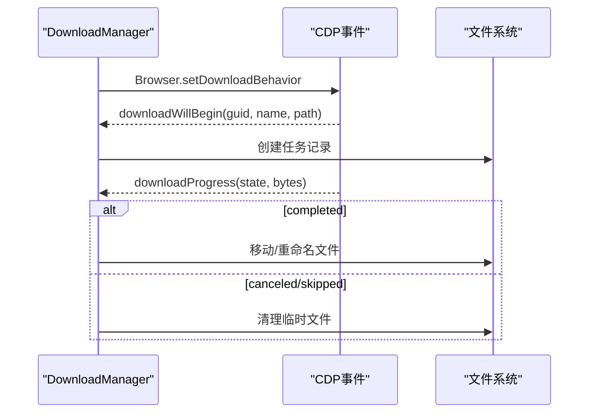
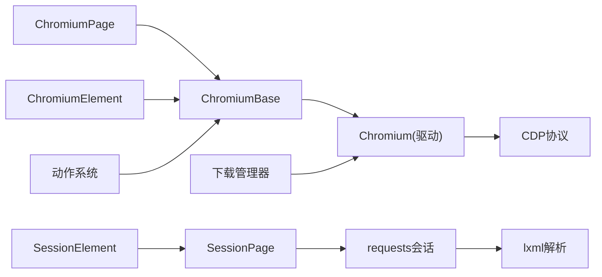

# 核心特性

<cite>
**本文引用的文件**
- [__init__.py](file://DrissionPage/__init__.py)
- [base.py](file://DrissionPage/_base/base.py)
- [chromium.py](file://DrissionPage/_browsers/chromium.py)
- [chromium_page.py](file://DrissionPage/_pages/chromium_page.py)
- [chromium_base.py](file://DrissionPage/_pages/chromium_base.py)
- [chromium_frame.py](file://DrissionPage/_pages/chromium_frame.py)
- [session_page.py](file://DrissionPage/_pages/session_page.py)
- [chromium_element.py](file://DrissionPage/_elements/chromium_element.py)
- [session_element.py](file://DrissionPage/_elements/session_element.py)
- [locator.py](file://DrissionPage/_functions/locator.py)
- [elements.py](file://DrissionPage/_functions/elements.py)
- [web.py](file://DrissionPage/_functions/web.py)
- [tools.py](file://DrissionPage/_functions/tools.py)
- [downloader.py](file://DrissionPage/_units/downloader.py)
- [actions.py](file://DrissionPage/_units/actions.py)
</cite>

## 目录
1. [简介](#简介)
2. [项目结构](#项目结构)
3. [核心组件](#核心组件)
4. [架构总览](#架构总览)
5. [详细组件分析](#详细组件分析)
6. [依赖分析](#依赖分析)
7. [性能考量](#性能考量)
8. [故障排查指南](#故障排查指南)
9. [结论](#结论)
10. [附录](#附录)

## 简介
本文件聚焦 DrissionPage 的核心特性与架构设计，系统阐述其“双模式架构”（基于 CDP 的浏览器控制与基于 HTTP 的会话处理）如何协同工作，以及智能元素定位、跨框架操作、批量标签页管理、高级下载等功能如何实现。同时，通过与传统 WebDriver 方案的对比，突出 CDP 协议在实时性、可控性与扩展性方面的技术优势，并给出特性间的协同机制、典型使用场景与性能建议。

## 项目结构
DrissionPage 采用模块化分层设计：
- 基础层：统一的基类与消息通道（CDP 事件/命令），支撑两类页面对象的通用能力
- 页面层：ChromiumPage（基于 CDP）、SessionPage（基于 HTTP 会话）
- 元素层：ChromiumElement、SessionElement，分别面向 DOM 与 HTML 解析树
- 功能层：定位器、元素集合、工具函数、动作与等待器等
- 单元层：下载、截图、滚动、监听、状态等子系统

图示来源
- [chromium_page.py](file://DrissionPage/_pages/chromium_page.py)
- [session_page.py](file://DrissionPage/_pages/session_page.py)
- [chromium_base.py](file://DrissionPage/_pages/chromium_base.py)
- [chromium_element.py](file://DrissionPage/_elements/chromium_element.py)
- [session_element.py](file://DrissionPage/_elements/session_element.py)
- [locator.py](file://DrissionPage/_functions/locator.py)
- [elements.py](file://DrissionPage/_functions/elements.py)
- [web.py](file://DrissionPage/_functions/web.py)
- [tools.py](file://DrissionPage/_functions/tools.py)
- [downloader.py](file://DrissionPage/_units/downloader.py)
- [actions.py](file://DrissionPage/_units/actions.py)
- [chromium.py](file://DrissionPage/_browsers/chromium.py)

章节来源
- [__init__.py](file://DrissionPage/__init__.py)
- [chromium_page.py](file://DrissionPage/_pages/chromium_page.py)
- [session_page.py](file://DrissionPage/_pages/session_page.py)
- [chromium_base.py](file://DrissionPage/_pages/chromium_base.py)
- [chromium.py](file://DrissionPage/_browsers/chromium.py)

## 核心组件
- 双模式页面对象
  - ChromiumPage：通过 CDP 控制真实浏览器，支持 DOM 操作、事件监听、截图、滚动、动作模拟等
  - SessionPage：基于 HTTP 会话与 HTML 解析，适合快速抓取、无头场景与轻量级交互
- 统一基类与消息通道
  - BasePage/BaseElement/Messenger 提供定位、等待、错误处理、事件队列与 CDP 命令封装
- 智能定位与元素集合
  - 支持 XPath/CSS/无障碍定位；提供链式过滤与批量元素操作
- 跨框架与上下文
  - ChromiumFrame 支持 iframe/frame 的跨域/同域切换与文档重建
- 批量标签页管理
  - Chromium 浏览器侧统一管理 Target，支持新建、激活、关闭、遍历
- 高级下载
  - 下载管理器订阅 CDP 下载事件，支持命名、覆盖/重命名策略、进度与完成回调

章节来源
- [base.py](file://DrissionPage/_base/base.py)
- [chromium_page.py](file://DrissionPage/_pages/chromium_page.py)
- [session_page.py](file://DrissionPage/_pages/session_page.py)
- [chromium_base.py](file://DrissionPage/_pages/chromium_base.py)
- [chromium_frame.py](file://DrissionPage/_pages/chromium_frame.py)
- [chromium.py](file://DrissionPage/_browsers/chromium.py)
- [downloader.py](file://DrissionPage/_units/downloader.py)

## 架构总览
DrissionPage 的“双模式架构”通过统一的页面接口屏蔽底层差异：
- ChromiumPage：以 CDP 为核心，直接与浏览器通信，具备 DOM、网络、存储、控制等全能力
- SessionPage：以 HTTP 会话为核心，结合 lxml 解析，专注页面内容与资源获取
- 两者共享定位器与元素集合体系，形成一致的 API 体验

图示来源
- [chromium_page.py](file://DrissionPage/_pages/chromium_page.py)
- [chromium_base.py](file://DrissionPage/_pages/chromium_base.py)
- [chromium.py](file://DrissionPage/_browsers/chromium.py)
- [session_page.py](file://DrissionPage/_pages/session_page.py)

## 详细组件分析

### 双模式架构设计与优势
- 设计要点
  - ChromiumPage：启用 DOM/Page/Fetch 等 CDP 能力，建立事件回调与会话映射，支持动态注入脚本、文件上传、弹窗处理、屏幕录制等
  - SessionPage：基于 requests 会话，自动设置 Host/Referer/超时等头部，支持重试与编码推断，适合静态/半静态页面抓取
- 技术优势（对比 WebDriver）
  - 更细粒度的控制：CDP 可直接调用底层 API，避免远程驱动的延迟与不确定性
  - 更强的可观测性：事件回调与异步命令返回，便于构建稳定等待与重试逻辑
  - 更高的扩展性：可按需启用 Fetch/Storage/Accessibility 等模块，灵活适配复杂业务

章节来源
- [chromium_base.py](file://DrissionPage/_pages/chromium_base.py)
- [chromium.py](file://DrissionPage/_browsers/chromium.py)
- [session_page.py](file://DrissionPage/_pages/session_page.py)
- [base.py](file://DrissionPage/_base/base.py)

### 智能元素定位系统
- 定位语法
  - XPath/CSS/文本模糊/多属性组合；支持无障碍 AX 定位
  - 自动将多种简写转换为标准表达式，提升易用性
- 查找流程
  - Chromium：通过 DOM.performSearch + getSearchResults 获取节点 ID 列表，再封装为 ChromiumElement
  - Session：基于 lxml 的 xpath/cssselect，将 HtmlElement 包装为 SessionElement
- 过滤与批量
  - 提供链式过滤器（按标签、属性、样式、状态等）与批量元素集合，支持索引与切片访问

图示来源
- [locator.py](file://DrissionPage/_functions/locator.py)
- [chromium_base.py](file://DrissionPage/_pages/chromium_base.py)
- [chromium_element.py](file://DrissionPage/_elements/chromium_element.py)
- [session_element.py](file://DrissionPage/_elements/session_element.py)
- [elements.py](file://DrissionPage/_functions/elements.py)

章节来源
- [locator.py](file://DrissionPage/_functions/locator.py)
- [chromium_base.py](file://DrissionPage/_pages/chromium_base.py)
- [elements.py](file://DrissionPage/_functions/elements.py)

### 跨框架操作能力
- 框架识别与切换
  - ChromiumFrame 通过 DOM.describeNode 获取 frameId，区分同域/异域，必要时重建会话与文档对象
  - 支持 frame 内元素定位、滚动、截图与状态检测
- 事件联动
  - 监听 Page.frameDetached/Attached 等事件，维护 frame 与 tab 的映射关系

图示来源
- [chromium_frame.py](file://DrissionPage/_pages/chromium_frame.py)
- [chromium_base.py](file://DrissionPage/_pages/chromium_base.py)

章节来源
- [chromium_frame.py](file://DrissionPage/_pages/chromium_frame.py)
- [chromium_base.py](file://DrissionPage/_pages/chromium_base.py)

### 批量标签页管理
- 统一入口
  - Chromium 浏览器侧维护 Target 与会话映射，提供新建、激活、关闭、遍历等能力
- 生命周期
  - 监听 Target.created/destroyed/detached 事件，清理下载与会话资源
- 便捷方法
  - ChromiumPage 直接暴露 get_tab/get_tabs/new_tab/activate_tab/close_tabs 等

图示来源
- [chromium.py](file://DrissionPage/_browsers/chromium.py)
- [chromium_page.py](file://DrissionPage/_pages/chromium_page.py)

章节来源
- [chromium.py](file://DrissionPage/_browsers/chromium.py)
- [chromium_page.py](file://DrissionPage/_pages/chromium_page.py)

### 高级下载功能
- 事件驱动
  - 订阅 Browser.downloadWillBegin/downloadProgress，按任务 GUID 管理下载生命周期
- 策略与重命名
  - 支持按标签页设置保存路径、重命名、后缀替换、冲突处理（跳过/重命名/覆盖）
- 状态与进度
  - 实时更新 received_bytes/total_bytes，完成后移动临时文件至目标路径

图示来源
- [downloader.py](file://DrissionPage/_units/downloader.py)
- [chromium.py](file://DrissionPage/_browsers/chromium.py)

章节来源
- [downloader.py](file://DrissionPage/_units/downloader.py)
- [chromium.py](file://DrissionPage/_browsers/chromium.py)

### 与传统 WebDriver 的对比（CDP 技术优势）
- 实时性与可控性
  - CDP 事件回调与命令返回，可精确控制页面生命周期与资源加载阶段
- 能力覆盖
  - CDP 提供 DOM、Page、Network、Storage、Accessibility、Fetch 等丰富模块，WebDriver 无法直接调用
- 扩展性
  - 可按需启用模块与事件，灵活适配复杂业务场景

章节来源
- [chromium_base.py](file://DrissionPage/_pages/chromium_base.py)
- [chromium.py](file://DrissionPage/_browsers/chromium.py)

## 依赖分析
- 组件耦合
  - 页面层依赖基础层与浏览器桥接；元素层依赖定位器与页面对象；单元层依赖页面对象
- 关键依赖链
  - ChromiumPage → ChromiumBase → Chromium(驱动) → CDP
  - SessionPage → requests 会话 → lxml 解析
- 事件与会话
  - Messenger 统一管理 CDP 事件队列与回调注册，避免循环依赖

图示来源
- [chromium_page.py](file://DrissionPage/_pages/chromium_page.py)
- [chromium_base.py](file://DrissionPage/_pages/chromium_base.py)
- [chromium.py](file://DrissionPage/_browsers/chromium.py)
- [session_page.py](file://DrissionPage/_pages/session_page.py)
- [chromium_element.py](file://DrissionPage/_elements/chromium_element.py)
- [session_element.py](file://DrissionPage/_elements/session_element.py)
- [downloader.py](file://DrissionPage/_units/downloader.py)
- [actions.py](file://DrissionPage/_units/actions.py)

章节来源
- [chromium_page.py](file://DrissionPage/_pages/chromium_page.py)
- [session_page.py](file://DrissionPage/_pages/session_page.py)
- [chromium_base.py](file://DrissionPage/_pages/chromium_base.py)
- [chromium.py](file://DrissionPage/_browsers/chromium.py)
- [chromium_element.py](file://DrissionPage/_elements/chromium_element.py)
- [session_element.py](file://DrissionPage/_elements/session_element.py)
- [downloader.py](file://DrissionPage/_units/downloader.py)
- [actions.py](file://DrissionPage/_units/actions.py)

## 性能考量
- 定位性能
  - Chromium 优先使用 DOM.performSearch 并限制超时，避免长时间阻塞
  - Session 使用 lxml 快速解析，适合静态页面抓取
- 下载性能
  - 事件驱动避免轮询，完成后立即落盘；冲突处理策略可减少 IO 开销
- 动作与滚动
  - Actions 将鼠标移动拆分为多步，兼顾精度与性能；滚动前先确保元素可见，减少无效重试
- 错误与重试
  - 统一的异常映射与重试策略，降低不稳定环境下的失败率

章节来源
- [chromium_base.py](file://DrissionPage/_pages/chromium_base.py)
- [downloader.py](file://DrissionPage/_units/downloader.py)
- [actions.py](file://DrissionPage/_units/actions.py)
- [tools.py](file://DrissionPage/_functions/tools.py)

## 故障排查指南
- 常见错误与处理
  - 上下文丢失/元素丢失：触发重连与重试，必要时重建文档对象
  - 连接断开：自动停止消息通道并清理会话映射
  - 无效 URL/HTTP 错误：捕获并抛出明确异常，支持重试与提示
- 调试与日志
  - Messenger 支持事件打印与回调注册，便于定位问题
  - 工具函数提供端口探测、窗口隐藏/显示等辅助能力

章节来源
- [tools.py](file://DrissionPage/_functions/tools.py)
- [base.py](file://DrissionPage/_base/base.py)
- [chromium_base.py](file://DrissionPage/_pages/chromium_base.py)

## 结论
DrissionPage 的双模式架构以统一接口屏蔽底层差异，既能在 CDP 模式下获得强大的浏览器控制能力，又能在 HTTP 模式下实现高效的页面抓取。智能定位、跨框架操作、批量标签页管理与高级下载等特性相互协同，形成完整的自动化解决方案。相较传统 WebDriver，CDP 提供更高的可控性与扩展性，适合复杂与高性能场景。

## 附录
- 典型使用场景
  - 数据采集：SessionPage 快速抓取静态/半静态页面
  - 交互测试：ChromiumPage 模拟用户操作、监听事件、截图验证
  - 资源下载：下载管理器自动命名与冲突处理，保障稳定性
- 性能建议
  - 合理设置超时与重试，避免长时阻塞
  - 使用链式过滤减少不必要的 DOM 查询
  - 对大文件下载启用合适的冲突策略，减少 IO 争用