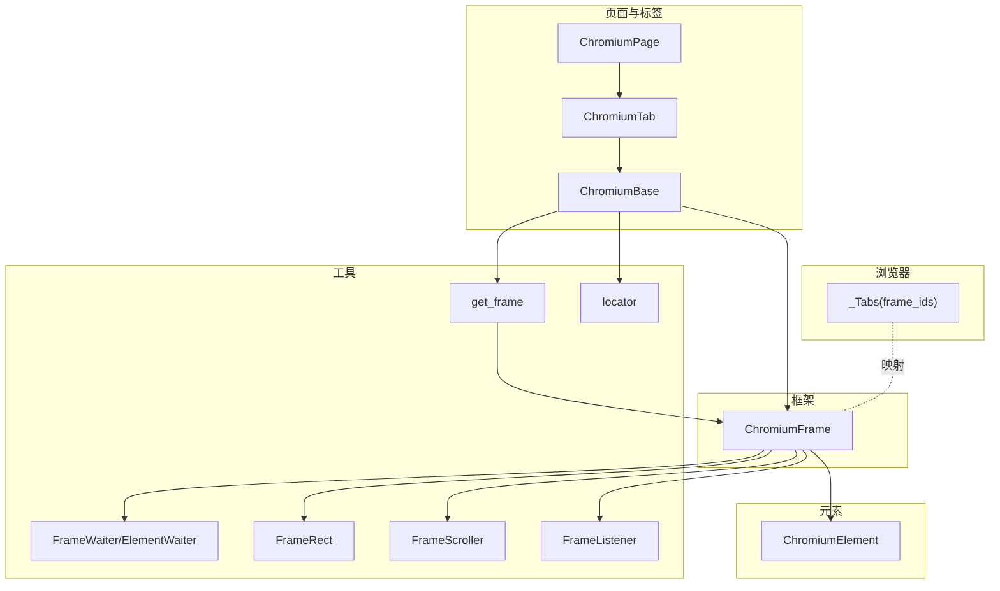
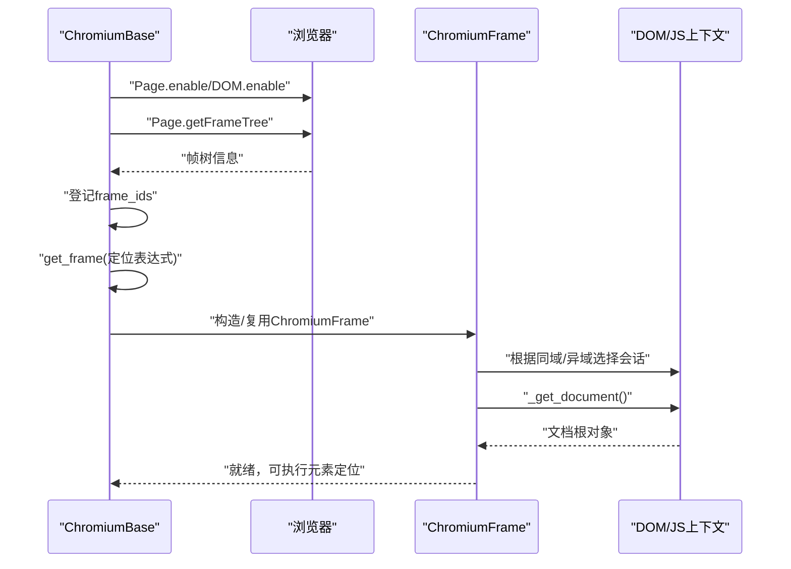
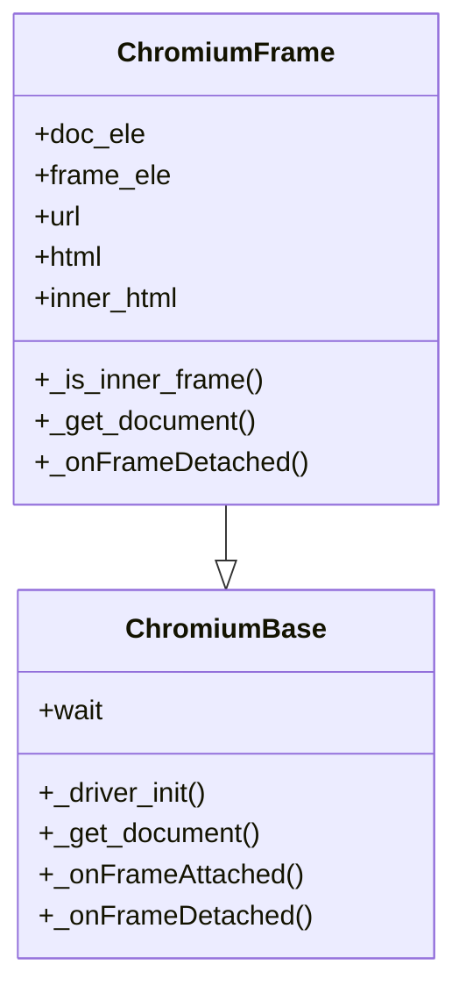
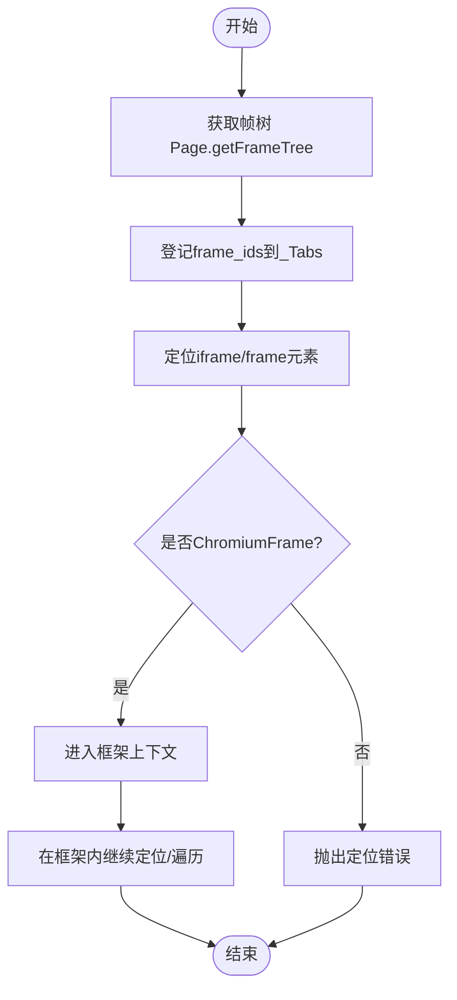
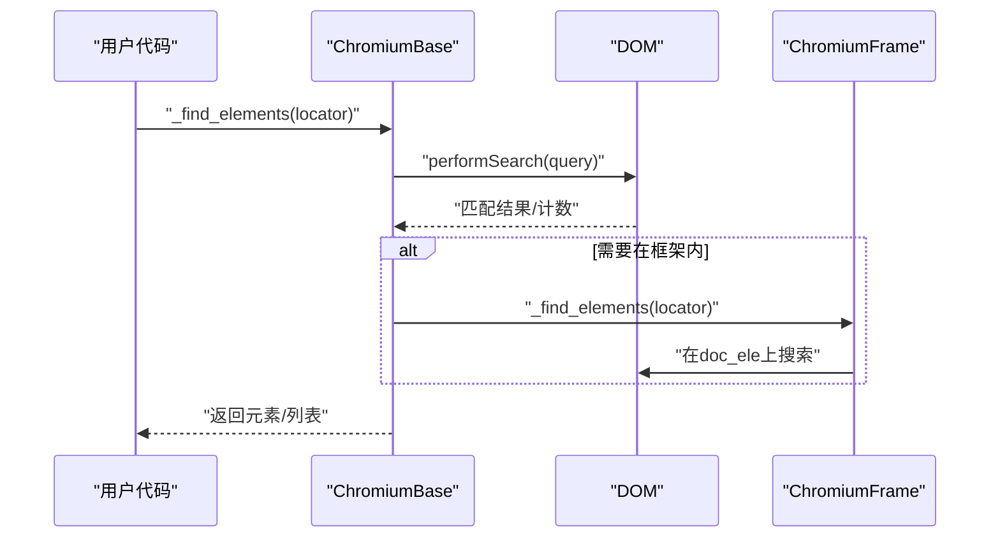
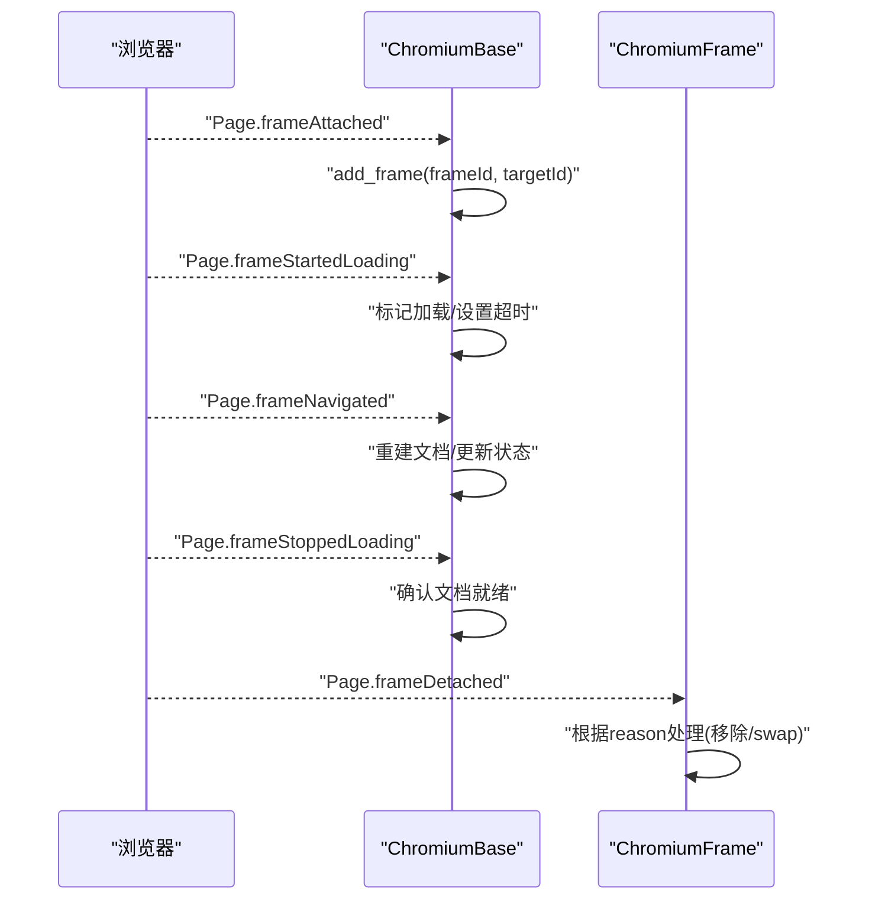
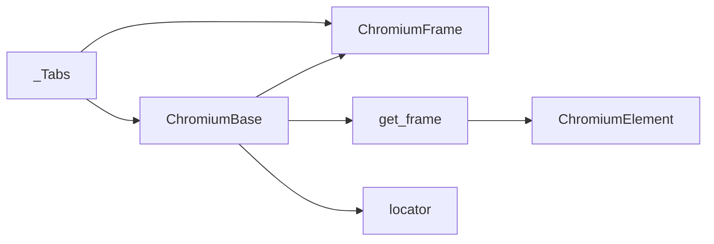

# 跨框架操作

<cite>
**本文引用的文件**
- [chromium_frame.py](file://DrissionPage/_pages/chromium_frame.py)
- [chromium_base.py](file://DrissionPage/_pages/chromium_base.py)
- [chromium_page.py](file://DrissionPage/_pages/chromium_page.py)
- [chromium_tab.py](file://DrissionPage/_pages/chromium_tab.py)
- [chromium_element.py](file://DrissionPage/_elements/chromium_element.py)
- [elements.py](file://DrissionPage/_functions/elements.py)
- [locator.py](file://DrissionPage/_functions/locator.py)
- [waiter.py](file://DrissionPage/_units/waiter.py)
- [chromium.py](file://DrissionPage/_browsers/chromium.py)
- [base.py](file://DrissionPage/_base/base.py)
</cite>

## 目录
1. [简介](#简介)
2. [项目结构](#项目结构)
3. [核心组件](#核心组件)
4. [架构总览](#架构总览)
5. [详细组件分析](#详细组件分析)
6. [依赖分析](#依赖分析)
7. [性能考量](#性能考量)
8. [故障排查指南](#故障排查指南)
9. [结论](#结论)
10. [附录](#附录)

## 简介
本篇文档聚焦 DrissionPage 在 Chromium 系列浏览器中的跨框架操作能力，系统阐述 iframe 与多框架页面的自动识别、切换与遍历机制；解释框架层级的遍历方法与嵌套框架处理策略；剖析跨框架元素定位的实现原理与性能优化技巧；并提供复杂嵌套场景下的操作指南（动态框架加载、框架内容变更、框架间数据传递）以及最佳实践与常见问题解决方案。

## 项目结构
围绕跨框架操作的关键模块如下：
- 页面与标签页层：ChromiumPage、ChromiumTab、ChromiumBase
- 框架层：ChromiumFrame
- 元素层：ChromiumElement
- 定位与框架工具：elements.get_frame、locator
- 等待与状态：waiter.FrameWaiter、FrameStates、FrameScroller、FrameRect、FrameListener
- 浏览器会话与帧映射：chromium._Tabs（frame_ids、add_frame、remove_frame）

**图表来源**
- [chromium_page.py:17-40](file://DrissionPage/_pages/chromium_page.py#L17-L40)
- [chromium_tab.py:22-47](file://DrissionPage/_pages/chromium_tab.py#L22-L47)
- [chromium_base.py:39-96](file://DrissionPage/_pages/chromium_base.py#L39-L96)
- [chromium_frame.py:25-70](file://DrissionPage/_pages/chromium_frame.py#L25-L70)
- [chromium_element.py:38-54](file://DrissionPage/_elements/chromium_element.py#L38-L54)
- [elements.py:305-338](file://DrissionPage/_functions/elements.py#L305-L338)
- [locator.py:96-115](file://DrissionPage/_functions/locator.py#L96-L115)
- [waiter.py:411-419](file://DrissionPage/_units/waiter.py#L411-L419)
- [chromium.py:589-616](file://DrissionPage/_browsers/chromium.py#L589-L616)

**章节来源**
- [chromium_page.py:17-40](file://DrissionPage/_pages/chromium_page.py#L17-L40)
- [chromium_tab.py:22-47](file://DrissionPage/_pages/chromium_tab.py#L22-L47)
- [chromium_base.py:39-96](file://DrissionPage/_pages/chromium_base.py#L39-L96)
- [chromium_frame.py:25-70](file://DrissionPage/_pages/chromium_frame.py#L25-L70)
- [chromium_element.py:38-54](file://DrissionPage/_elements/chromium_element.py#L38-L54)
- [elements.py:305-338](file://DrissionPage/_functions/elements.py#L305-L338)
- [locator.py:96-115](file://DrissionPage/_functions/locator.py#L96-L115)
- [waiter.py:411-419](file://DrissionPage/_units/waiter.py#L411-L419)
- [chromium.py:589-616](file://DrissionPage/_browsers/chromium.py#L589-L616)

## 核心组件
- ChromiumFrame：封装单个 iframe/frame 的上下文，负责与目标页面建立会话、文档获取、事件回调、等待与状态等。
- ChromiumBase：页面级基类，负责 DOM/Puppeteer 协议交互、文档树维护、帧事件监听、等待与超时控制。
- ChromiumTab/ChromiumPage：标签页与页面对象，提供导航、等待、截图、下载等通用能力。
- ChromiumElement：页面/框架内元素抽象，支持属性、文本、样式、等待、滚动、选择等。
- elements.get_frame：将定位表达式解析为框架元素，校验并返回 ChromiumFrame 或 NoneElement。
- waiter.FrameWaiter：基于框架元素的等待器，复用 ElementWaiter 与 BaseWaiter 的能力。
- _Tabs：浏览器侧维护 frame_ids 到 target_id 的映射，用于事件与会话管理。

**章节来源**
- [chromium_frame.py:25-70](file://DrissionPage/_pages/chromium_frame.py#L25-L70)
- [chromium_base.py:39-96](file://DrissionPage/_pages/chromium_base.py#L39-L96)
- [chromium_tab.py:22-47](file://DrissionPage/_pages/chromium_tab.py#L22-L47)
- [chromium_page.py:17-40](file://DrissionPage/_pages/chromium_page.py#L17-L40)
- [chromium_element.py:38-54](file://DrissionPage/_elements/chromium_element.py#L38-L54)
- [elements.py:305-338](file://DrissionPage/_functions/elements.py#L305-L338)
- [waiter.py:411-419](file://DrissionPage/_units/waiter.py#L411-L419)
- [chromium.py:589-616](file://DrissionPage/_browsers/chromium.py#L589-L616)

## 架构总览
跨框架操作的总体流程：
- 页面初始化时启用 Page.enable、DOM.enable，并通过 Page.getFrameTree 获取帧树，登记 frame_ids。
- 通过 get_frame 定位到 iframe/frame 元素，构造或复用 ChromiumFrame 对象。
- ChromiumFrame 依据是否同域（diff domain）选择不同会话与文档对象，建立与目标的 JS 上下文。
- 通过 wait/doc_loaded 等等待器确保文档就绪后执行元素定位与操作。
- 事件驱动：Page.frameAttached/frameDetached/frameStartedLoading/frameStoppedLoading 等触发帧生命周期管理。

**图表来源**
- [chromium_base.py:119-124](file://DrissionPage/_pages/chromium_base.py#L119-L124)
- [chromium_base.py:154-156](file://DrissionPage/_pages/chromium_base.py#L154-L156)
- [chromium_base.py:619-629](file://DrissionPage/_pages/chromium_base.py#L619-L629)
- [chromium_frame.py:149-178](file://DrissionPage/_pages/chromium_frame.py#L149-L178)
- [chromium_frame.py:25-70](file://DrissionPage/_pages/chromium_frame.py#L25-L70)

**章节来源**
- [chromium_base.py:119-124](file://DrissionPage/_pages/chromium_base.py#L119-L124)
- [chromium_base.py:154-156](file://DrissionPage/_pages/chromium_base.py#L154-L156)
- [chromium_base.py:619-629](file://DrissionPage/_pages/chromium_base.py#L619-L629)
- [chromium_frame.py:149-178](file://DrissionPage/_pages/chromium_frame.py#L149-L178)
- [chromium_frame.py:25-70](file://DrissionPage/_pages/chromium_frame.py#L25-L70)

## 详细组件分析

### 组件一：ChromiumFrame 自动识别与切换
- 单例缓存：使用类内字典按 frameId 缓存实例，避免重复创建。
- 同域/异域判定：通过 Page.getFrameTree 与 DOM.describeNode 判断是否内联帧（同域），决定 doc_ele 的获取方式与会话初始化。
- 生命周期事件：监听 Page.frameDetached，处理移除与 swap（同域变异域）情形，必要时触发 reload。
- 文档获取：_get_document 根据是否 diff domain 选择 DOM.getDocument 或通过对象 ID 获取文档根。
- 截图与滚动：针对异域帧，通过合成图片与坐标换算实现截图；滚动采用 FrameScroller。

**图表来源**
- [chromium_frame.py:25-70](file://DrissionPage/_pages/chromium_frame.py#L25-L70)
- [chromium_frame.py:149-178](file://DrissionPage/_pages/chromium_frame.py#L149-L178)
- [chromium_frame.py:190-198](file://DrissionPage/_pages/chromium_frame.py#L190-L198)
- [chromium_base.py:119-124](file://DrissionPage/_pages/chromium_base.py#L119-L124)

**章节来源**
- [chromium_frame.py:25-70](file://DrissionPage/_pages/chromium_frame.py#L25-L70)
- [chromium_frame.py:149-178](file://DrissionPage/_pages/chromium_frame.py#L149-L178)
- [chromium_frame.py:190-198](file://DrissionPage/_pages/chromium_frame.py#L190-L198)
- [chromium_base.py:119-124](file://DrissionPage/_pages/chromium_base.py#L119-L124)

### 组件二：框架层级遍历与嵌套处理
- 帧树获取：通过 Page.getFrameTree 获取所有 frameId 并登记至 _Tabs，保证事件回调能正确映射到目标。
- get_frames：默认定位 iframe/frame 标签，返回元素列表，便于进一步进入框架上下文。
- get_frame：支持字符串、元组、整数索引与已知框架对象，统一解析为 ChromiumFrame 或 NoneElement。
- 嵌套处理：ChromiumFrame 内部以 owner 与 target_page 关联，形成“框架链”，可在任意层级上继续定位。

**图表来源**
- [chromium_base.py:119-124](file://DrissionPage/_pages/chromium_base.py#L119-L124)
- [chromium_base.py:619-629](file://DrissionPage/_pages/chromium_base.py#L619-L629)
- [elements.py:305-338](file://DrissionPage/_functions/elements.py#L305-L338)

**章节来源**
- [chromium_base.py:119-124](file://DrissionPage/_pages/chromium_base.py#L119-L124)
- [chromium_base.py:619-629](file://DrissionPage/_pages/chromium_base.py#L619-L629)
- [elements.py:305-338](file://DrissionPage/_functions/elements.py#L305-L338)

### 组件三：跨框架元素定位原理与性能优化
- 定位入口：ChromiumBase._find_elements 将定位表达式标准化为 XPath/CSS，调用 DOM.performSearch 获取匹配节点。
- 框架内定位：ChromiumFrame._find_elements 在 doc_ele 上执行 _ele，确保在正确上下文中解析。
- 性能要点：
  - 使用 wait.doc_loaded 提前等待文档就绪，减少重试成本。
  - 优先使用 CSS/XPath 精准定位，缩小搜索范围。
  - 对频繁查询的框架，保持 ChromiumFrame 实例复用，避免重复构造。
  - 在异域帧截图时，尽量缩小截图区域，减少数据传输与合成开销。

**图表来源**
- [chromium_base.py:444-512](file://DrissionPage/_pages/chromium_base.py#L444-L512)
- [chromium_frame.py:473-484](file://DrissionPage/_pages/chromium_frame.py#L473-L484)

**章节来源**
- [chromium_base.py:444-512](file://DrissionPage/_pages/chromium_base.py#L444-L512)
- [chromium_frame.py:473-484](file://DrissionPage/_pages/chromium_frame.py#L473-L484)

### 组件四：动态框架加载、内容变更与事件联动
- 动态加载：Page.frameAttached 时登记 frame_id；frameStartedLoading 时标记加载状态，必要时停止加载。
- 内容变更：Page.frameNavigated 与 Page.frameStoppedLoading 触发文档重建与 ready_state 更新。
- 事件回调：ChromiumBase._onFrameAttached/_onFrameDetached/_onFrameStartedLoading/_onFrameStoppedLoading 等统一处理。
- 异域帧：frameDetached.reason==swap 时触发 reload，确保会话与上下文一致。

**图表来源**
- [chromium_base.py:162-167](file://DrissionPage/_pages/chromium_base.py#L162-L167)
- [chromium_base.py:168-206](file://DrissionPage/_pages/chromium_base.py#L168-L206)
- [chromium_frame.py:190-198](file://DrissionPage/_pages/chromium_frame.py#L190-L198)

**章节来源**
- [chromium_base.py:162-167](file://DrissionPage/_pages/chromium_base.py#L162-L167)
- [chromium_base.py:168-206](file://DrissionPage/_pages/chromium_base.py#L168-L206)
- [chromium_frame.py:190-198](file://DrissionPage/_pages/chromium_frame.py#L190-L198)

### 组件五：框架间数据传递与操作建议
- 数据传递：通过 run_js 在框架上下文中读取/写入 window/document 对象，注意同域/异域差异。
- 操作建议：
  - 优先在框架内完成交互，避免跨上下文切换带来的不稳定。
  - 使用 wait.clickable/visible 等等待器确保元素可交互。
  - 对异域帧截图，先滚动到可视区域，再按边界裁剪，减少合成成本。

**章节来源**
- [chromium_frame.py:366-374](file://DrissionPage/_pages/chromium_frame.py#L366-L374)
- [chromium_frame.py:402-471](file://DrissionPage/_pages/chromium_frame.py#L402-L471)
- [waiter.py:411-419](file://DrissionPage/_units/waiter.py#L411-L419)

## 依赖分析
- ChromiumBase 依赖浏览器事件与 DOM 协议，负责文档树与帧树维护。
- ChromiumFrame 依赖 ChromiumBase 的会话与等待能力，同时管理自身文档对象。
- elements.get_frame 依赖 locator 解析与 ChromiumElementsList，确保返回框架元素。
- _Tabs 提供 frame_ids 到 target_id 的映射，贯穿事件与会话管理。

**图表来源**
- [chromium_base.py:39-96](file://DrissionPage/_pages/chromium_base.py#L39-L96)
- [chromium_frame.py:25-70](file://DrissionPage/_pages/chromium_frame.py#L25-L70)
- [elements.py:305-338](file://DrissionPage/_functions/elements.py#L305-L338)
- [locator.py:96-115](file://DrissionPage/_functions/locator.py#L96-L115)
- [chromium.py:589-616](file://DrissionPage/_browsers/chromium.py#L589-L616)

**章节来源**
- [chromium_base.py:39-96](file://DrissionPage/_pages/chromium_base.py#L39-L96)
- [chromium_frame.py:25-70](file://DrissionPage/_pages/chromium_frame.py#L25-L70)
- [elements.py:305-338](file://DrissionPage/_functions/elements.py#L305-L338)
- [locator.py:96-115](file://DrissionPage/_functions/locator.py#L96-L115)
- [chromium.py:589-616](file://DrissionPage/_browsers/chromium.py#L589-L616)

## 性能考量
- 减少跨上下文切换：优先在框架内完成定位与操作，避免频繁切换导致的协议往返。
- 精准定位：使用 CSS/XPath 精确选择器，缩小搜索范围，降低 DOM.performSearch 成本。
- 文档就绪等待：使用 wait.doc_loaded 提前等待，避免多次失败重试。
- 异域帧截图：限制截图区域，减少数据传输与合成时间。
- 事件驱动：利用 Page.getFrameTree 与事件回调及时更新帧映射，避免无效轮询。

[本节为通用指导，无需列出具体文件来源]

## 故障排查指南
- 定位不到框架：检查定位表达式是否符合 get_frame 支持的格式（字符串、元组、索引、框架对象），并确认元素类型为 iframe/frame。
- 框架丢失或异常：关注 Page.frameDetached 的 reason，若为 remove 则需重新定位；若为 swap 则触发 reload。
- 文档未就绪：使用 wait.doc_loaded 或 wait.load_start 等等待器，避免在加载过程中执行操作。
- 异域帧异常：确认 _is_diff_domain 判定逻辑与会话切换流程，必要时手动触发 _do_reload。
- 截图异常：在异域帧中先滚动到元素可视区域，再按边界裁剪，避免坐标换算错误。

**章节来源**
- [elements.py:305-338](file://DrissionPage/_functions/elements.py#L305-L338)
- [chromium_frame.py:190-198](file://DrissionPage/_pages/chromium_frame.py#L190-L198)
- [chromium_base.py:168-206](file://DrissionPage/_pages/chromium_base.py#L168-L206)
- [waiter.py:167-168](file://DrissionPage/_units/waiter.py#L167-L168)

## 结论
DrissionPage 通过 ChromiumBase/ChromiumFrame 的协同，结合浏览器事件与 DOM 协议，实现了对 iframe/frame 的自动识别、稳定切换与高效定位。借助等待器、状态机与事件驱动机制，能够在复杂嵌套与动态加载场景下保持可靠性。实践中应重视文档就绪、精准定位与跨上下文切换的成本控制，以获得更优的稳定性与性能。

[本节为总结性内容，无需列出具体文件来源]

## 附录
- 最佳实践清单
  - 使用 wait.doc_loaded 等待器确保文档就绪后再定位。
  - 优先使用 CSS/XPath 精准选择器，减少搜索范围。
  - 复用 ChromiumFrame 实例，避免重复构造。
  - 异域帧截图时限定区域，减少合成开销。
  - 动态框架场景下，依赖 Page 事件回调及时更新帧映射。

[本节为补充性内容，无需列出具体文件来源]