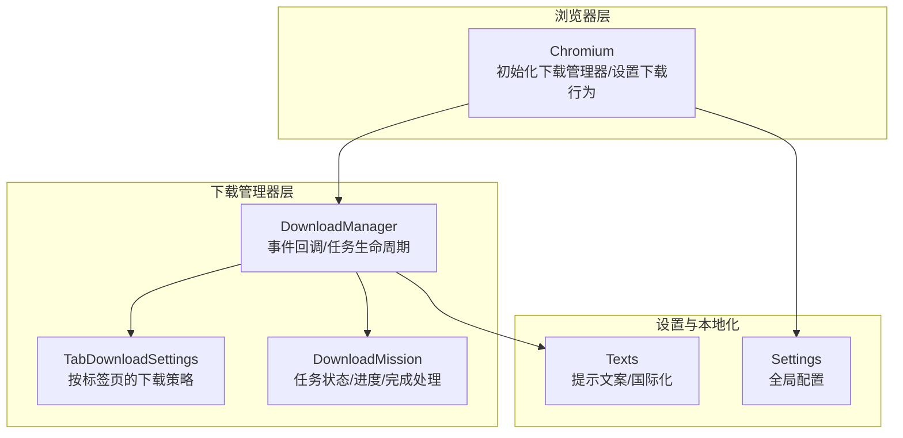
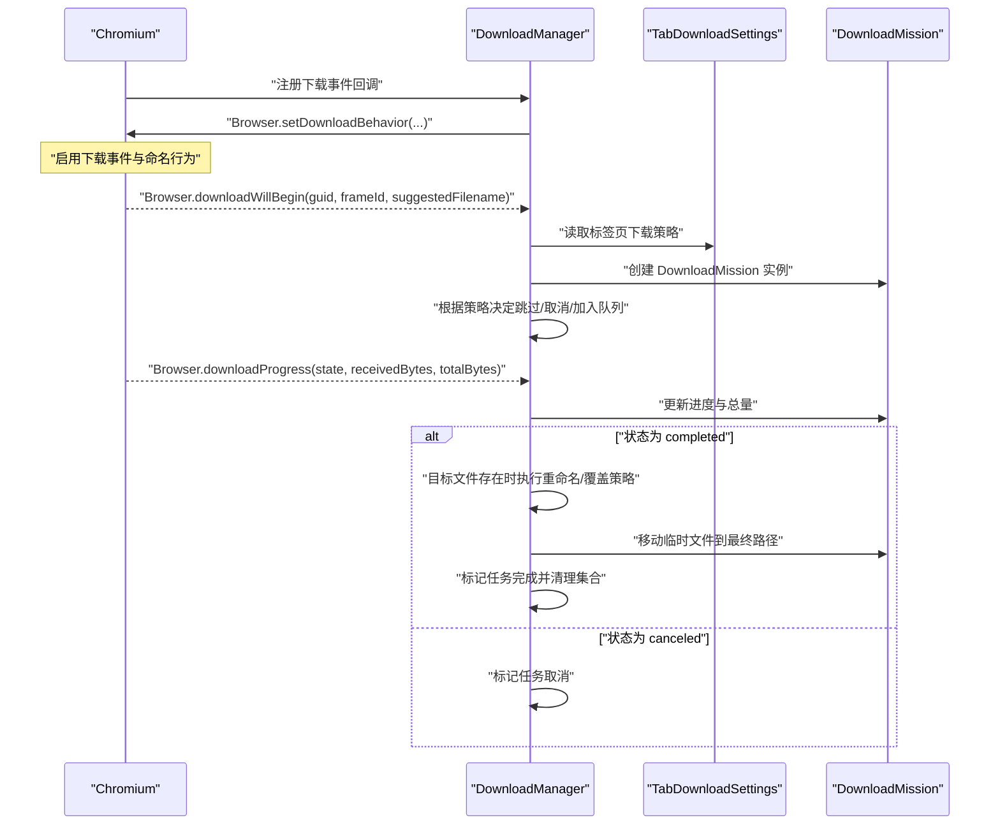
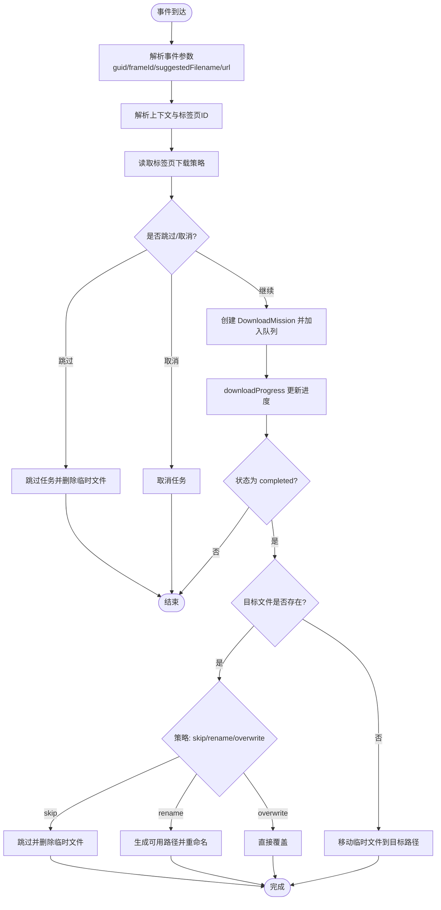
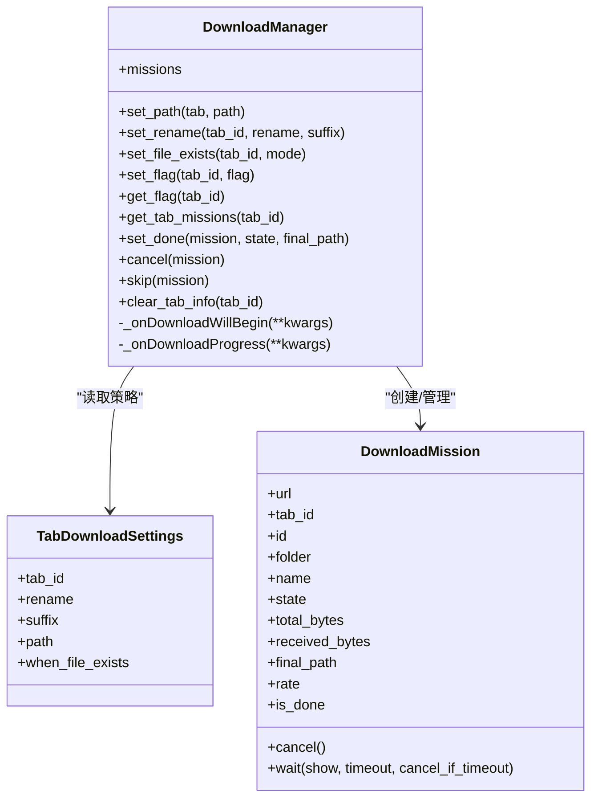
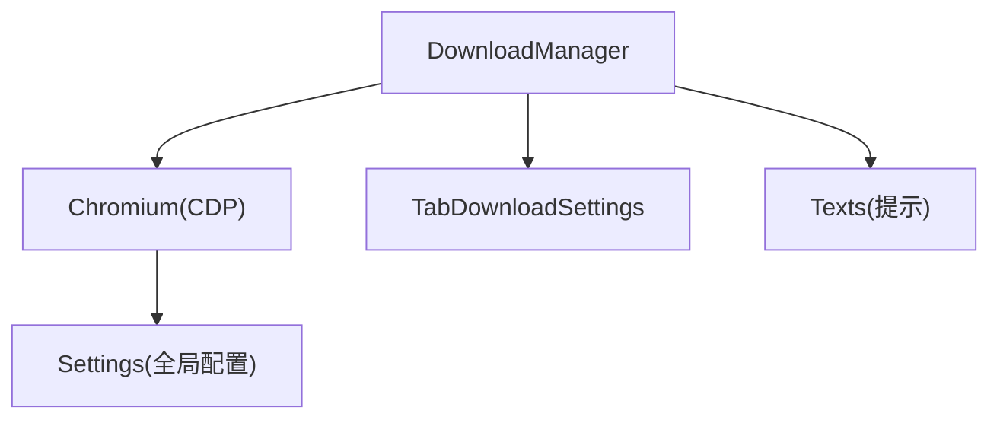

# 高级下载系统

<cite>
**本文引用的文件**
- [下载器模块 downloader.py](file://DrissionPage/_units/downloader.py)
- [下载器类型定义 downloader.pyi](file://DrissionPage/_units/downloader.pyi)
- [浏览器核心 chromium.py](file://DrissionPage/_browsers/chromium.py)
- [设置模块 settings.py](file://DrissionPage/_functions/settings.py)
- [文本与本地化 texts.py](file://DrissionPage/_functions/texts.py)
</cite>

## 目录
1. [简介](#简介)
2. [项目结构](#项目结构)
3. [核心组件](#核心组件)
4. [架构总览](#架构总览)
5. [详细组件分析](#详细组件分析)
6. [依赖分析](#依赖分析)
7. [性能考虑](#性能考虑)
8. [故障排查指南](#故障排查指南)
9. [结论](#结论)
10. [附录](#附录)

## 简介
本文件面向 DrissionPage 的高级下载系统，系统性阐述下载任务的创建、监控与管理机制，覆盖断点续传能力、批量下载、下载队列与优先级管理、Cookie 处理、代理设置与认证、并发与带宽控制、磁盘空间管理以及大文件、加密资源与失败重试等复杂场景的处理策略。文档以代码为依据，结合可视化图示帮助读者快速掌握下载系统的内部工作原理与最佳实践。

## 项目结构
下载系统主要由三部分构成：
- 浏览器层：Chromium 对象负责初始化下载管理器、设置下载行为与回调，并承载代理与上下文信息。
- 下载管理器层：DownloadManager 负责接收 CDP 下载事件、创建与跟踪 DownloadMission、执行文件落盘与重命名/覆盖策略。
- 设置与本地化层：Settings 提供全局配置入口；Texts 提供下载过程中的提示文案与国际化支持。

**图表来源**
- [浏览器核心 chromium.py:119](file://DrissionPage/_browsers/chromium.py#L119)
- [下载器模块 downloader.py:18](file://DrissionPage/_units/downloader.py#L18)
- [下载器模块 downloader.py:214](file://DrissionPage/_units/downloader.py#L214)
- [下载器模块 downloader.py:238](file://DrissionPage/_units/downloader.py#L238)
- [设置模块 settings.py:13](file://DrissionPage/_functions/settings.py#L13)
- [文本与本地化 texts.py:13](file://DrissionPage/_functions/texts.py#L13)

**章节来源**
- [浏览器核心 chromium.py:119](file://DrissionPage/_browsers/chromium.py#L119)
- [下载器模块 downloader.py:18](file://DrissionPage/_units/downloader.py#L18)
- [设置模块 settings.py:13](file://DrissionPage/_functions/settings.py#L13)
- [文本与本地化 texts.py:13](file://DrissionPage/_functions/texts.py#L13)

## 核心组件
- DownloadManager：负责注册 CDP 下载事件、创建 DownloadMission、更新任务进度、执行最终落盘与重命名/覆盖策略、取消与跳过任务、清理标签页信息。
- TabDownloadSettings：按标签页维护下载路径、重命名规则、后缀替换与“文件已存在”策略。
- DownloadMission：封装单个下载任务的状态、进度、目标路径与完成后的最终路径，提供等待与取消接口。

关键职责与交互：
- 初始化阶段：Chromium 在实例化时创建 DownloadManager 并设置下载行为（允许并命名、启用事件）。
- 事件驱动：CDP 回调触发后，DownloadManager 创建任务、根据策略决定是否跳过或取消，下载完成后移动临时文件至目标路径并应用重命名/覆盖策略。
- 生命周期：任务在完成、取消、跳过后从内部集合移除，确保内存与状态一致性。

**章节来源**
- [下载器模块 downloader.py:18](file://DrissionPage/_units/downloader.py#L18)
- [下载器模块 downloader.py:214](file://DrissionPage/_units/downloader.py#L214)
- [下载器模块 downloader.py:238](file://DrissionPage/_units/downloader.py#L238)
- [浏览器核心 chromium.py:119](file://DrissionPage/_browsers/chromium.py#L119)

## 架构总览
下图展示了下载系统从浏览器到任务管理的关键交互流程：

**图表来源**
- [下载器模块 downloader.py:47](file://DrissionPage/_units/downloader.py#L47)
- [下载器模块 downloader.py:115](file://DrissionPage/_units/downloader.py#L115)
- [下载器模块 downloader.py:169](file://DrissionPage/_units/downloader.py#L169)
- [下载器模块 downloader.py:176](file://DrissionPage/_units/downloader.py#L176)
- [下载器模块 downloader.py:182](file://DrissionPage/_units/downloader.py#L182)
- [下载器模块 downloader.py:208](file://DrissionPage/_units/downloader.py#L208)
- [下载器模块 downloader.py:210](file://DrissionPage/_units/downloader.py#L210)

## 详细组件分析

### DownloadManager 组件
职责与特性：
- 注册下载事件回调，设置浏览器下载行为（允许并命名、启用事件），统一管理下载路径与策略。
- 响应 downloadWillBegin 与 downloadProgress 事件，创建/更新任务，执行重命名/覆盖/跳过/取消逻辑。
- 提供任务取消、跳过、等待与清理接口，维护任务集合与标签页映射。

关键流程图（基于 downloadWillBegin 与 downloadProgress）：

**图表来源**
- [下载器模块 downloader.py:115](file://DrissionPage/_units/downloader.py#L115)
- [下载器模块 downloader.py:169](file://DrissionPage/_units/downloader.py#L169)
- [下载器模块 downloader.py:176](file://DrissionPage/_units/downloader.py#L176)
- [下载器模块 downloader.py:182](file://DrissionPage/_units/downloader.py#L182)
- [下载器模块 downloader.py:190](file://DrissionPage/_units/downloader.py#L190)
- [下载器模块 downloader.py:196](file://DrissionPage/_units/downloader.py#L196)
- [下载器模块 downloader.py:208](file://DrissionPage/_units/downloader.py#L208)

类关系图：

**图表来源**
- [下载器模块 downloader.py:18](file://DrissionPage/_units/downloader.py#L18)
- [下载器模块 downloader.py:214](file://DrissionPage/_units/downloader.py#L214)
- [下载器模块 downloader.py:238](file://DrissionPage/_units/downloader.py#L238)

**章节来源**
- [下载器模块 downloader.py:18](file://DrissionPage/_units/downloader.py#L18)
- [下载器模块 downloader.py:41](file://DrissionPage/_units/downloader.py#L41)
- [下载器模块 downloader.py:58](file://DrissionPage/_units/downloader.py#L58)
- [下载器模块 downloader.py:64](file://DrissionPage/_units/downloader.py#L64)
- [下载器模块 downloader.py:77](file://DrissionPage/_units/downloader.py#L77)
- [下载器模块 downloader.py:89](file://DrissionPage/_units/downloader.py#L89)
- [下载器模块 downloader.py:99](file://DrissionPage/_units/downloader.py#L99)
- [下载器模块 downloader.py:109](file://DrissionPage/_units/downloader.py#L109)
- [下载器模块 downloader.py:115](file://DrissionPage/_units/downloader.py#L115)
- [下载器模块 downloader.py:169](file://DrissionPage/_units/downloader.py#L169)
- [下载器模块 downloader.py:238](file://DrissionPage/_units/downloader.py#L238)

### TabDownloadSettings 组件
职责与特性：
- 按标签页缓存下载策略，支持重命名（含后缀推断）、显式后缀替换、文件存在时的处理策略（跳过/重命名/覆盖）。
- 默认继承浏览器级策略，标签页级可独立覆盖。

使用要点：
- 通过静态方法设置某标签页的重命名与后缀策略，或设置“文件已存在”的处理模式。
- 策略在任务创建时生效，影响文件名与落盘行为。

**章节来源**
- [下载器模块 downloader.py:214](file://DrissionPage/_units/downloader.py#L214)
- [下载器模块 downloader.py:58](file://DrissionPage/_units/downloader.py#L58)
- [下载器模块 downloader.py:64](file://DrissionPage/_units/downloader.py#L64)

### DownloadMission 组件
职责与特性：
- 记录任务状态、进度、目标路径与最终路径，提供等待接口与取消接口。
- 支持以百分比形式计算下载速率，便于 UI 展示与日志输出。

使用要点：
- 通过 wait 方法阻塞等待任务完成，支持超时与取消策略。
- 任务完成后返回最终路径，便于后续处理。

**章节来源**
- [下载器模块 downloader.py:238](file://DrissionPage/_units/downloader.py#L238)
- [下载器模块 downloader.py:260](file://DrissionPage/_units/downloader.py#L260)
- [下载器模块 downloader.py:270](file://DrissionPage/_units/downloader.py#L270)
- [下载器模块 downloader.py:292](file://DrissionPage/_units/downloader.py#L292)

## 依赖分析
- DownloadManager 依赖 Chromium 的 CDP 接口以注册下载行为与接收事件回调。
- DownloadManager 依赖 TabDownloadSettings 以按标签页应用下载策略。
- DownloadManager 依赖 Texts 以输出本地化提示信息。
- Settings 提供全局配置入口，影响下载路径与语言等行为。

**图表来源**
- [下载器模块 downloader.py:47](file://DrissionPage/_units/downloader.py#L47)
- [下载器模块 downloader.py:115](file://DrissionPage/_units/downloader.py#L115)
- [下载器模块 downloader.py:169](file://DrissionPage/_units/downloader.py#L169)
- [下载器模块 downloader.py:214](file://DrissionPage/_units/downloader.py#L214)
- [下载器模块 downloader.py:238](file://DrissionPage/_units/downloader.py#L238)
- [浏览器核心 chromium.py:119](file://DrissionPage/_browsers/chromium.py#L119)
- [设置模块 settings.py:13](file://DrissionPage/_functions/settings.py#L13)
- [文本与本地化 texts.py:13](file://DrissionPage/_functions/texts.py#L13)

**章节来源**
- [浏览器核心 chromium.py:119](file://DrissionPage/_browsers/chromium.py#L119)
- [下载器模块 downloader.py:47](file://DrissionPage/_units/downloader.py#L47)
- [下载器模块 downloader.py:115](file://DrissionPage/_units/downloader.py#L115)
- [下载器模块 downloader.py:169](file://DrissionPage/_units/downloader.py#L169)
- [下载器模块 downloader.py:214](file://DrissionPage/_units/downloader.py#L214)
- [下载器模块 downloader.py:238](file://DrissionPage/_units/downloader.py#L238)
- [设置模块 settings.py:13](file://DrissionPage/_functions/settings.py#L13)
- [文本与本地化 texts.py:13](file://DrissionPage/_functions/texts.py#L13)

## 性能考虑
- 并发控制
  - 任务并发由浏览器 CDP 控制，建议通过外部调度器对任务进行分组与限速，避免同时触发大量下载导致磁盘与网络拥塞。
  - 使用 DownloadManager 的队列与标签页维度策略，将高优先级任务置于独立标签页，减少相互干扰。
- 带宽限制
  - 通过浏览器代理或网络层限速工具配合使用，避免下载占用全部带宽。
- 磁盘空间管理
  - 下载前检查目标路径剩余空间，若不足则提前跳过或重定向到可用路径。
  - 利用“文件已存在”策略（重命名/覆盖）避免重复写入造成碎片。
- 断点续传
  - 当前实现采用临时文件与最终路径移动的方式，未内置断点续传逻辑。如需断点续传，可在上层业务中结合外部库或自定义策略，例如在任务开始前检测目标文件大小并与 total_bytes 对比，决定是否继续下载。
- 大文件下载
  - 建议分块下载与校验，结合进度回调进行超时与重试判断；对超大文件可采用后台下载与异步通知机制。
- 加密资源下载
  - 若资源受 DRM 或服务端加密，需在上层处理证书与鉴权；下载器本身不包含加密解密逻辑。
- 失败重试
  - 结合任务状态与网络异常进行指数退避重试；对不可恢复错误（如 403/404）应快速失败并记录原因。

[本节为通用性能指导，不直接分析具体文件，故无“章节来源”]

## 故障排查指南
常见问题与处理：
- 浏览器版本过低不支持下载管理
  - 现象：设置下载行为时报错提示不支持下载管理。
  - 处理：升级浏览器版本或降级到受支持的版本。
- 下载路径未设置
  - 现象：需要显式设置下载路径才能使用下载功能。
  - 处理：通过配置对象或 ini 文件设置下载路径。
- 文件已存在策略
  - 现象：目标文件存在时的行为取决于策略（跳过/重命名/覆盖）。
  - 处理：根据业务需求设置 when_file_exists 策略。
- 代理与认证
  - 现象：下载过程中需要代理或账号密码认证。
  - 处理：在 Chromium 初始化时设置代理与认证信息；注意当前不支持特定类型的代理与 SOCKS 代理，需使用插件或自定义方案。
- 任务取消与跳过
  - 现象：任务被取消或跳过，临时文件被清理。
  - 处理：检查策略与回调逻辑，必要时调整标志位或重命名规则。

**章节来源**
- [文本与本地化 texts.py:199](file://DrissionPage/_functions/texts.py#L199)
- [文本与本地化 texts.py:304](file://DrissionPage/_functions/texts.py#L304)
- [文本与本地化 texts.py:396](file://DrissionPage/_functions/texts.py#L396)
- [下载器模块 downloader.py:99](file://DrissionPage/_units/downloader.py#L99)
- [下载器模块 downloader.py:109](file://DrissionPage/_units/downloader.py#L109)
- [下载器模块 downloader.py:159](file://DrissionPage/_units/downloader.py#L159)

## 结论
DrissionPage 的高级下载系统以事件驱动为核心，通过 DownloadManager 统一管理下载生命周期，结合 TabDownloadSettings 实现细粒度的标签页级策略控制。系统具备完善的任务状态跟踪、文件落盘与重命名/覆盖策略、取消与跳过机制，并通过 Settings 与 Texts 提供全局配置与本地化支持。对于断点续传、批量下载、队列与优先级管理、并发与带宽控制、磁盘空间管理以及复杂场景（大文件、加密资源、失败重试）等需求，建议在上层业务中结合外部工具与策略进行扩展与优化。

[本节为总结性内容，不直接分析具体文件，故无“章节来源”]

## 附录
- API 与属性参考（摘自类型定义）
  - DownloadManager
    - 属性：missions（返回所有未完成的下载任务）
    - 方法：set_path、set_rename、set_file_exists、set_flag、get_flag、get_tab_missions、set_done、cancel、skip、clear_tab_info、_onDownloadWillBegin、_onDownloadProgress
  - TabDownloadSettings
    - 属性：tab_id、rename、suffix、path、when_file_exists
  - DownloadMission
    - 属性：url、tab_id、id、folder、name、state、total_bytes、received_bytes、final_path、rate、is_done
    - 方法：cancel、wait

**章节来源**
- [下载器模块 downloader.pyi:16](file://DrissionPage/_units/downloader.pyi#L16)
- [下载器模块 downloader.pyi:130](file://DrissionPage/_units/downloader.pyi#L130)
- [下载器模块 downloader.pyi:146](file://DrissionPage/_units/downloader.pyi#L146)