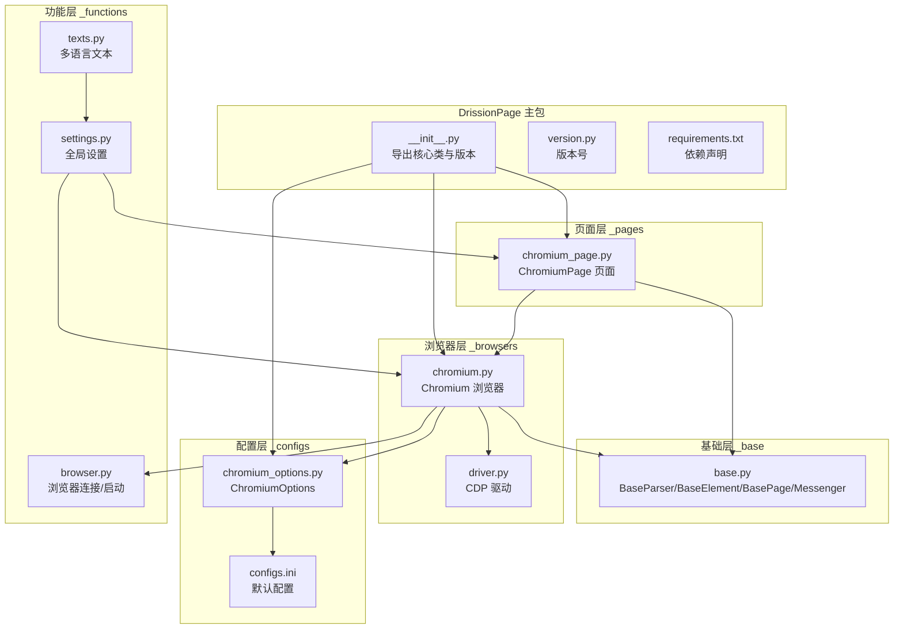
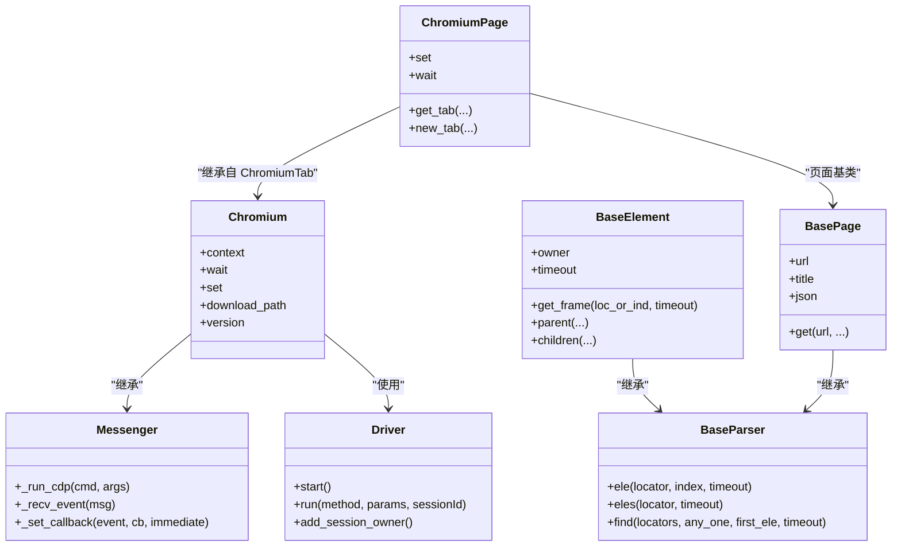
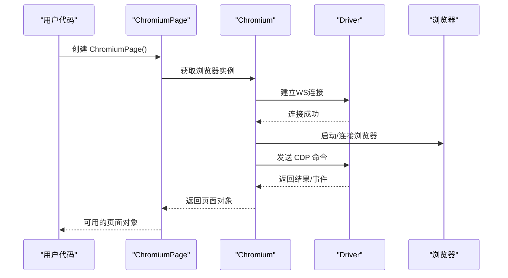
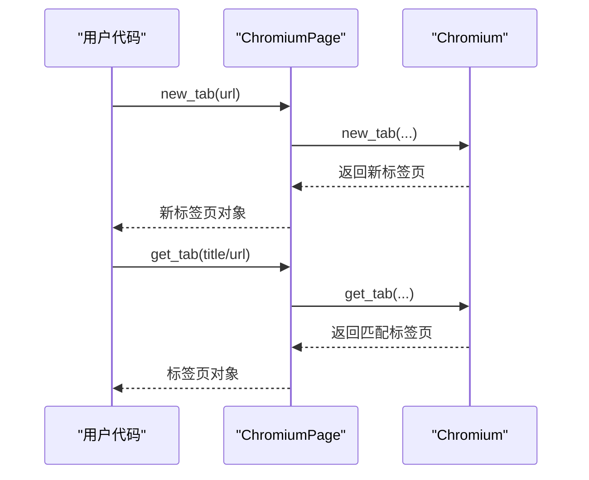
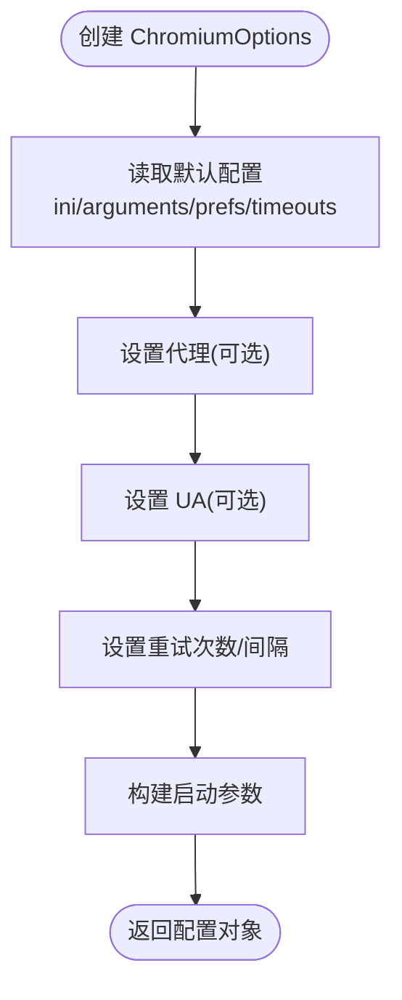
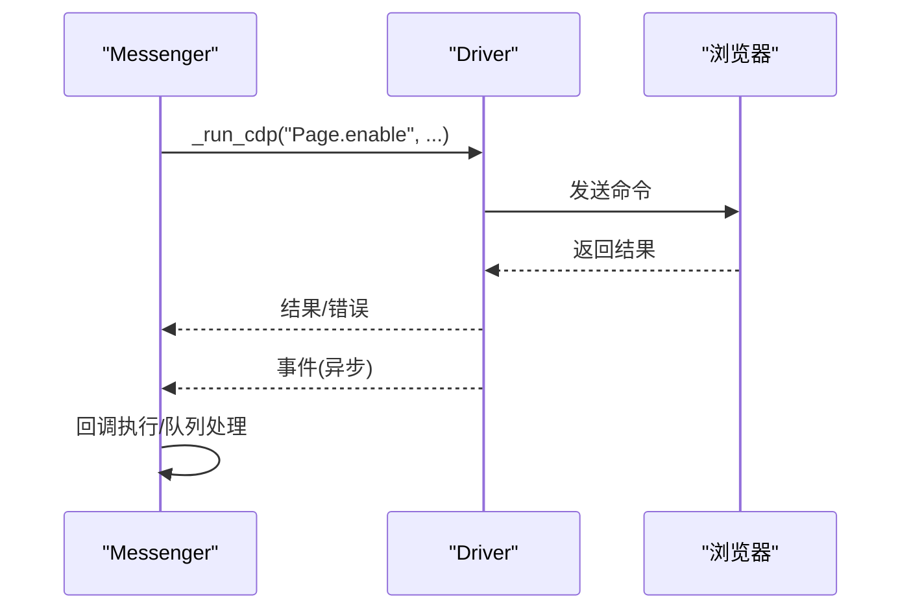
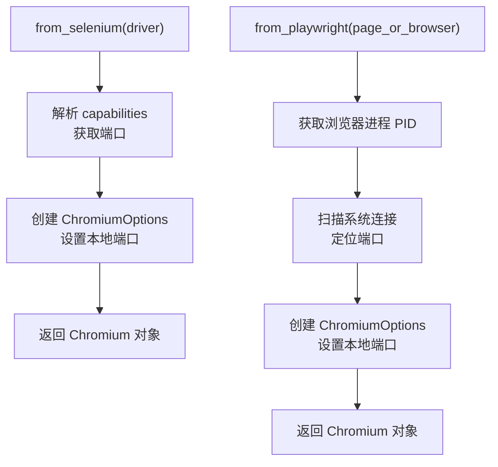
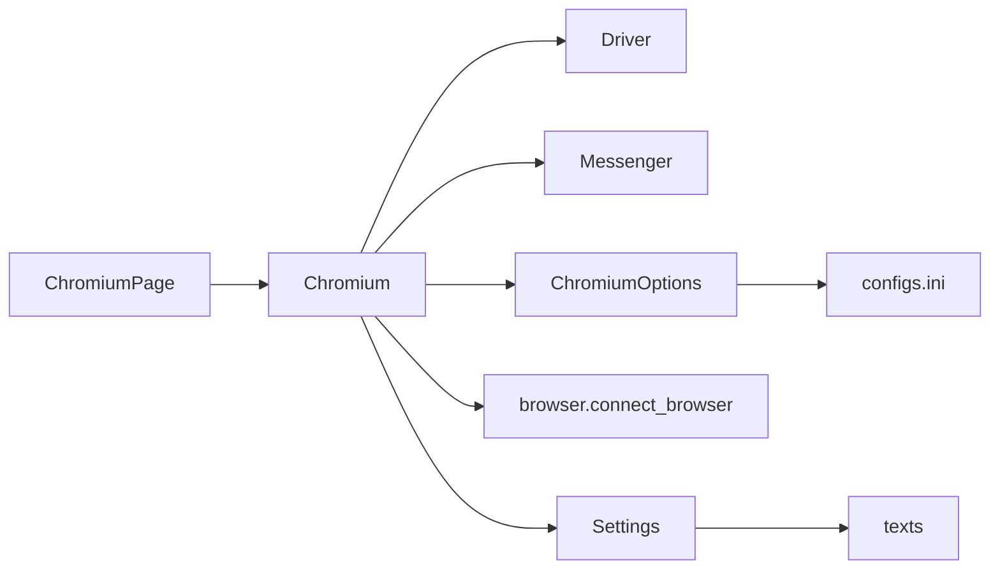

# 项目介绍

<cite>
**本文引用的文件**
- [__init__.py](file://DrissionPage/__init__.py)
- [version.py](file://DrissionPage/version.py)
- [requirements.txt](file://requirements.txt)
- [common.py](file://DrissionPage/common.py)
- [base.py](file://DrissionPage/_base/base.py)
- [chromium.py](file://DrissionPage/_browsers/chromium.py)
- [chromium_page.py](file://DrissionPage/_pages/chromium_page.py)
- [chromium_options.py](file://DrissionPage/_configs/chromium_options.py)
- [browser.py](file://DrissionPage/_functions/browser.py)
- [settings.py](file://DrissionPage/_functions/settings.py)
- [configs.ini](file://DrissionPage/_configs/configs.ini)
- [texts.py](file://DrissionPage/_functions/texts.py)
</cite>

## 目录
1. [引言](#引言)
2. [项目结构](#项目结构)
3. [核心组件](#核心组件)
4. [架构总览](#架构总览)
5. [详细组件分析](#详细组件分析)
6. [依赖分析](#依赖分析)
7. [性能考虑](#性能考虑)
8. [故障排查指南](#故障排查指南)
9. [结论](#结论)
10. [附录](#附录)

## 引言
DrissionPage 是一个双模式网页自动化框架，旨在为用户提供统一、稳定、高性能的网页控制能力。项目以 Chromium 为基础，通过 CDP（Chrome DevTools Protocol）直接与浏览器交互，提供“页面模式”和“会话模式”两种使用形态，兼顾易用性与灵活性。项目强调：
- 双模式设计：既可像 Selenium 那样以“页面”为单位进行操作，也可像 Requests 那样以“会话”为单位进行 HTTP 请求与数据抓取。
- CDP 原生直连：避免 WebDriver 的额外抽象层，减少延迟与不确定性，提升稳定性与可控性。
- 易于集成：提供丰富的配置、工具与适配函数，便于与现有生态（如 Selenium、Playwright）协同。

项目价值与适用性：
- 初学者：通过统一的 API 降低学习成本，快速上手页面自动化与数据抓取。
- 开发者：提供细粒度的控制与扩展点，支持复杂业务场景与高并发任务。
- 企业用户：以 CDP 为核心，具备更高的稳定性与可控性，适合生产级任务。

## 项目结构
项目采用按职责分层的组织方式，核心目录与职责概览如下：
- DrissionPage：主包，对外暴露统一入口与版本信息
- _base：基础抽象与通用能力（元素、页面、消息通道等）
- _browsers：浏览器与上下文相关实现（Chromium、驱动、状态等）
- _pages：页面层级实现（ChromiumPage、Tab、Frame 等）
- _configs：配置与选项（ChromiumOptions、SessionOptions、配置文件等）
- _functions：功能函数（浏览器连接、定位、工具、设置、文本等）
- _elements：元素实现（ChromiumElement、SessionElement 等）
- _units：单元能力（动作、下载、监听、等待、权限等）
- 错误与公共模块：错误定义、公共常量等

图表来源
- [__init__.py:1-29](file://DrissionPage/__init__.py#L1-L29)
- [version.py:1-9](file://DrissionPage/version.py#L1-L9)
- [requirements.txt:1-9](file://DrissionPage/requirements.txt#L1-L9)
- [base.py:1-434](file://DrissionPage/_base/base.py#L1-L434)
- [chromium.py:1-200](file://DrissionPage/_browsers/chromium.py#L1-L200)
- [chromium_page.py:1-103](file://DrissionPage/_pages/chromium_page.py#L1-L103)
- [chromium_options.py:1-200](file://DrissionPage/_configs/chromium_options.py#L1-L200)
- [browser.py:1-200](file://DrissionPage/_functions/browser.py#L1-L200)
- [settings.py:1-69](file://DrissionPage/_functions/settings.py#L1-L69)
- [configs.ini:1-34](file://DrissionPage/_configs/configs.ini#L1-L34)
- [texts.py:1-200](file://DrissionPage/_functions/texts.py#L1-L200)

章节来源
- [__init__.py:1-29](file://DrissionPage/__init__.py#L1-L29)
- [version.py:1-9](file://DrissionPage/version.py#L1-L9)
- [requirements.txt:1-9](file://DrissionPage/requirements.txt#L1-L9)

## 核心组件
- 统一入口与版本
  - 入口导出 Chromium、ChromiumPage、SessionPage、ChromiumOptions、SessionOptions，并暴露版本号，便于用户直接导入使用。
- 基础抽象
  - BaseParser：统一的元素查找接口，支持 ele()/eles()/find() 等。
  - BaseElement：元素基类，提供相对定位、父子兄弟查询、文本提取等能力。
  - BasePage：页面基类，提供 get()、url/title/json 等页面级能力。
  - Messenger：基于 CDP 的消息通道，封装事件接收、命令发送、回调注册等。
- 浏览器与驱动
  - Chromium：浏览器实例，负责启动/连接、上下文管理、标签页管理、下载管理、状态与等待器等。
  - Driver/DebugDriver：CDP WebSocket 客户端，负责命令发送、结果接收、事件分发。
- 页面实现
  - ChromiumPage：页面级封装，继承自 ChromiumTab，提供页面级等待器、setter、标签页切换与管理等。
- 配置与启动
  - ChromiumOptions：浏览器启动参数、用户数据目录、代理、超时、重试等配置。
  - browser.connect_browser()：根据配置启动或连接浏览器，处理端口、用户数据、偏好设置等。
- 设置与国际化
  - Settings：全局超时、异常策略、单例标签页、语言等。
  - texts：多语言文本映射，用于错误与提示信息。

章节来源
- [__init__.py:22-28](file://DrissionPage/__init__.py#L22-L28)
- [base.py:29-434](file://DrissionPage/_base/base.py#L29-L434)
- [chromium.py:33-200](file://DrissionPage/_browsers/chromium.py#L33-L200)
- [chromium_page.py:17-103](file://DrissionPage/_pages/chromium_page.py#L17-L103)
- [chromium_options.py:16-200](file://DrissionPage/_configs/chromium_options.py#L16-L200)
- [browser.py:24-200](file://DrissionPage/_functions/browser.py#L24-L200)
- [settings.py:13-69](file://DrissionPage/_functions/settings.py#L13-L69)
- [texts.py:13-200](file://DrissionPage/_functions/texts.py#L13-L200)

## 架构总览
DrissionPage 的核心是“浏览器 + 页面 + 元素”的三层结构，配合 CDP 消息通道实现高效稳定的自动化控制。Chromium 负责浏览器生命周期与上下文管理；ChromiumPage 提供页面级操作；BaseElement/ChromiumElement 提供元素级操作；Messenger/Driver 实现 CDP 命令与事件的收发。

图表来源
- [base.py:29-434](file://DrissionPage/_base/base.py#L29-L434)
- [chromium.py:33-200](file://DrissionPage/_browsers/chromium.py#L33-L200)
- [chromium_page.py:17-103](file://DrissionPage/_pages/chromium_page.py#L17-L103)

## 详细组件分析

### 组件一：Chromium（浏览器）
- 角色与职责
  - 启动/连接浏览器，维护会话与事件循环，提供上下文、标签页、下载、状态与等待器等能力。
  - 通过 CDP 控制浏览器行为，如启用 DOM/Page、设置代理、获取版本等。
- 关键流程
  - 初始化：根据 ChromiumOptions 决定是否新建或复用浏览器，建立 WebSocket 连接，启动事件接收线程。
  - 标签页管理：提供获取最新标签页、创建新标签页、激活/关闭标签页等。
  - 下载管理：通过 DownloadManager 管理下载路径与任务。
- 设计要点
  - 使用单例缓存浏览器实例，避免重复启动。
  - 通过 Messenger 注册事件回调，异步处理页面事件。

图表来源
- [chromium.py:54-120](file://DrissionPage/_browsers/chromium.py#L54-L120)
- [base.py:385-415](file://DrissionPage/_base/base.py#L385-L415)
- [browser.py:24-87](file://DrissionPage/_functions/browser.py#L24-L87)

章节来源
- [chromium.py:33-200](file://DrissionPage/_browsers/chromium.py#L33-L200)
- [base.py:373-434](file://DrissionPage/_base/base.py#L373-L434)
- [browser.py:24-200](file://DrissionPage/_functions/browser.py#L24-L200)

### 组件二：ChromiumPage（页面）
- 角色与职责
  - 页面级封装，提供页面级等待器、setter、标签页管理等。
  - 继承自 ChromiumTab，内部持有浏览器实例，统一管理下载与标签页。
- 关键流程
  - 单例化：同一浏览器 ID 的页面对象复用，避免重复初始化。
  - 标签页操作：获取/新建/激活/关闭标签页，支持按标题、URL、类型过滤。
- 设计要点
  - 将浏览器级能力下沉到 Chromium，页面只做组合与转发。
  - 通过 Settings 控制单例标签页对象行为。

图表来源
- [chromium_page.py:33-103](file://DrissionPage/_pages/chromium_page.py#L33-L103)

章节来源
- [chromium_page.py:17-103](file://DrissionPage/_pages/chromium_page.py#L17-L103)
- [settings.py:13-69](file://DrissionPage/_functions/settings.py#L13-L69)

### 组件三：ChromiumOptions（配置）
- 角色与职责
  - 提供浏览器启动参数、用户数据目录、代理、超时、重试次数等配置。
  - 支持从 ini 文件读取默认配置，支持动态设置与覆盖。
- 关键流程
  - 初始化：从 ini 加载默认值，合并用户参数。
  - 动态设置：支持 set_argument/remove_argument、set_proxy、set_retry 等。
- 设计要点
  - 将配置与启动逻辑解耦，便于测试与复用。
  - 与 browser.connect_browser 协作，确保启动参数正确传递。

图表来源
- [chromium_options.py:16-200](file://DrissionPage/_configs/chromium_options.py#L16-L200)
- [configs.ini:1-34](file://DrissionPage/_configs/configs.ini#L1-L34)

章节来源
- [chromium_options.py:16-200](file://DrissionPage/_configs/chromium_options.py#L16-L200)
- [configs.ini:1-34](file://DrissionPage/_configs/configs.ini#L1-L34)

### 组件四：Messenger 与 Driver（CDP 通道）
- 角色与职责
  - Messenger：在浏览器/页面/元素对象中注入，负责 CDP 命令发送、事件接收与回调分发。
  - Driver：WebSocket 客户端，负责与浏览器建立连接、发送命令、接收响应与事件。
- 关键流程
  - 启动：Driver 建立 WS 连接，启动接收线程。
  - 命令：Messenger 调用 _run_cdp，Driver 发送命令并等待结果。
  - 事件：Driver 接收事件后按 sessionId 分发给对应对象。
- 设计要点
  - 事件队列与线程模型保证异步事件处理的可靠性。
  - 支持调试模式与即时事件回调。

图表来源
- [base.py:385-415](file://DrissionPage/_base/base.py#L385-L415)
- [base.py:75-141](file://DrissionPage/_base/base.py#L75-L141)

章节来源
- [base.py:373-434](file://DrissionPage/_base/base.py#L373-L434)
- [base.py:385-415](file://DrissionPage/_base/base.py#L385-L415)

### 组件五：跨生态适配（from_selenium/from_playwright）
- 角色与职责
  - 提供从 Selenium WebDriver 与 Playwright 的 Page/Browser 对象生成 Chromium 对象的能力，便于迁移与混用。
- 关键流程
  - 从 Selenium：解析 capabilities 中的 debuggerAddress，生成 ChromiumOptions 并创建 Chromium。
  - 从 Playwright：通过 CDP 获取浏览器进程端口，再生成 ChromiumOptions 并创建 Chromium。
- 设计要点
  - 通过端口反查与系统连接信息，实现跨生态桥接。
  - 统一设置 UA 标记，保持一致性。

图表来源
- [common.py:22-57](file://DrissionPage/common.py#L22-L57)

章节来源
- [common.py:22-57](file://DrissionPage/common.py#L22-L57)

## 依赖分析
- 外部依赖
  - requests、lxml、cssselect、websocket-client、click、tldextract、psutil 等，分别用于 HTTP、解析、定位、通信、命令行、域名解析与进程监控。
- 内部依赖
  - ChromiumPage 依赖 Chromium；Chromium 依赖 Driver/Messenger；ChromiumOptions 与 configs.ini 提供配置；browser.connect_browser 负责启动/连接；settings 与 texts 提供全局设置与文本。
- 循环依赖
  - 通过模块拆分与延迟导入避免循环依赖，Chromium 与 ChromiumPage 之间为组合关系，非继承循环。

图表来源
- [chromium_page.py:17-103](file://DrissionPage/_pages/chromium_page.py#L17-L103)
- [chromium.py:33-200](file://DrissionPage/_browsers/chromium.py#L33-L200)
- [chromium_options.py:16-200](file://DrissionPage/_configs/chromium_options.py#L16-L200)
- [configs.ini:1-34](file://DrissionPage/_configs/configs.ini#L1-L34)
- [browser.py:24-200](file://DrissionPage/_functions/browser.py#L24-L200)
- [settings.py:13-69](file://DrissionPage/_functions/settings.py#L13-L69)
- [texts.py:13-200](file://DrissionPage/_functions/texts.py#L13-L200)

章节来源
- [requirements.txt:1-9](file://DrissionPage/requirements.txt#L1-L9)

## 性能考虑
- CDP 直连优势
  - 减少中间层，降低延迟与不确定性，提高稳定性与可控性。
- 超时与重试
  - Settings 提供 CDP 超时、浏览器连接超时、重试次数与间隔等配置，可根据场景调整。
- 事件处理
  - 异步事件队列与线程模型，避免阻塞主线程，提升并发处理能力。
- 下载与会话
  - 通过 DrissionGet 与 SessionOptions 提供高效的下载与 HTTP 会话能力，减少额外开销。

## 故障排查指南
- 浏览器连接失败
  - 检查端口占用与地址配置，参考错误提示与连接超时设置。
  - 若为系统限制，可尝试添加必要启动参数或以管理员权限运行。
- 事件未触发或回调未执行
  - 确认事件订阅与回调注册是否正确，检查即时事件开关与调试模式。
- 元素定位失败
  - 检查定位符类型与超时设置，必要时开启抛错策略以便快速定位问题。
- 多语言提示
  - texts 提供中英双语错误信息，结合日志与异常堆栈定位问题。

章节来源
- [browser.py:192-200](file://DrissionPage/_functions/browser.py#L192-L200)
- [base.py:385-415](file://DrissionPage/_base/base.py#L385-L415)
- [settings.py:13-69](file://DrissionPage/_functions/settings.py#L13-L69)
- [texts.py:35-200](file://DrissionPage/_functions/texts.py#L35-L200)

## 结论
DrissionPage 以 CDP 为核心，构建了统一、稳定、高性能的双模式网页自动化框架。通过清晰的分层设计与完善的配置体系，既能满足初学者的快速上手，也能支撑开发者与企业用户的复杂需求。未来建议持续优化事件处理与并发模型，完善生态适配与文档示例，进一步提升易用性与可维护性。

## 附录
- 版本信息
  - 当前版本：见 [version.py:8](file://DrissionPage/version.py#L8)
- 许可与使用条款
  - 项目许可与使用条款见 [__init__.py:8-21](file://DrissionPage/__init__.py#L8-L21)
- 默认配置
  - 默认配置项见 [configs.ini:1-34](file://DrissionPage/_configs/configs.ini#L1-L34)
- 依赖清单
  - 依赖声明见 [requirements.txt:1-9](file://DrissionPage/requirements.txt#L1-L9)