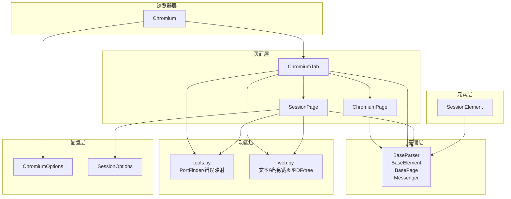
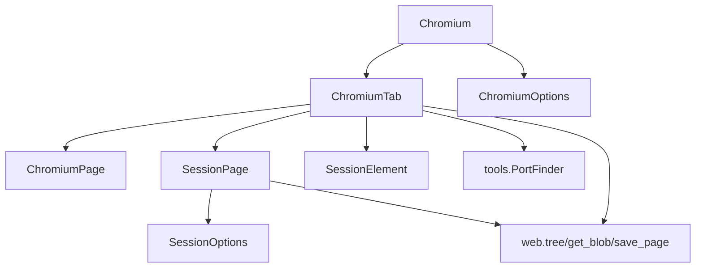
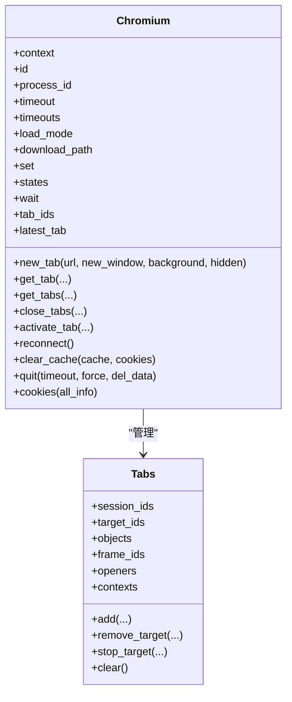
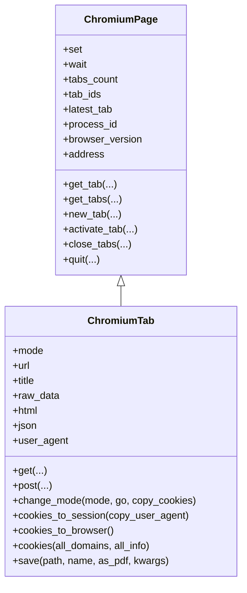
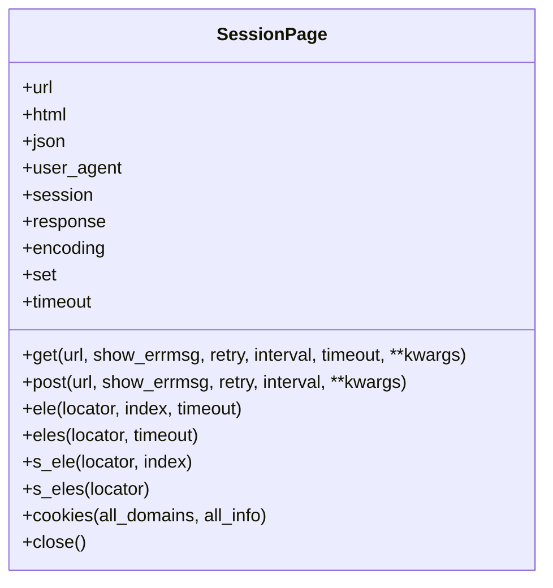
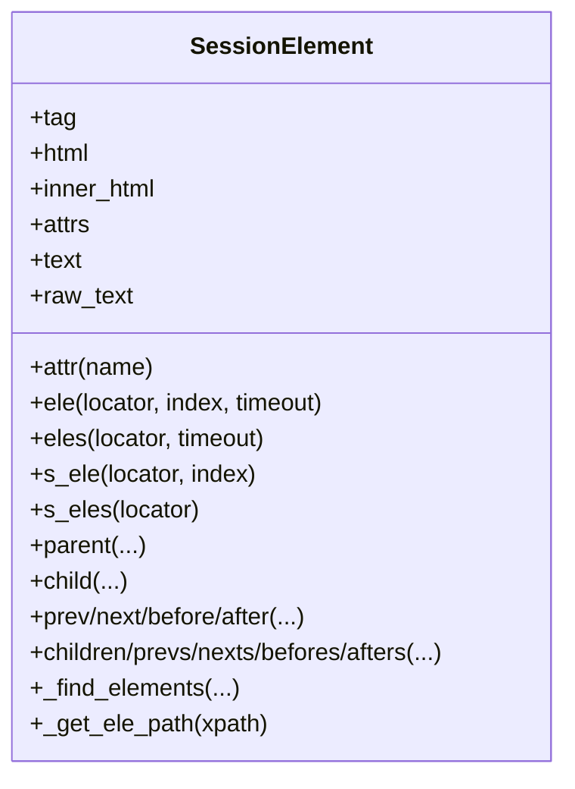
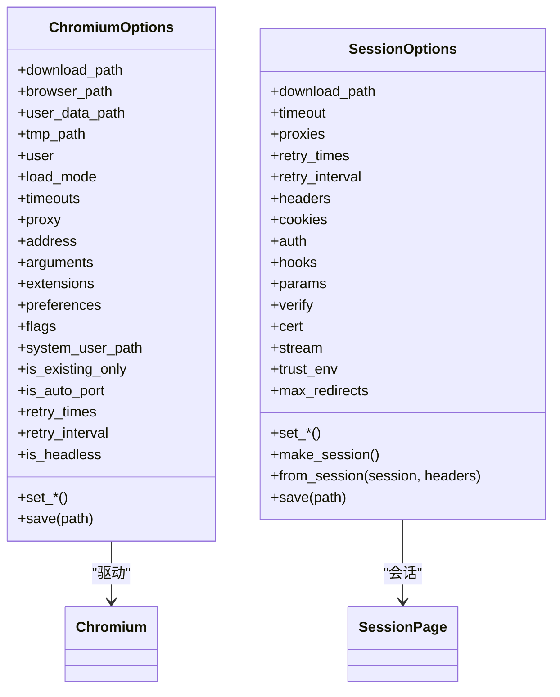
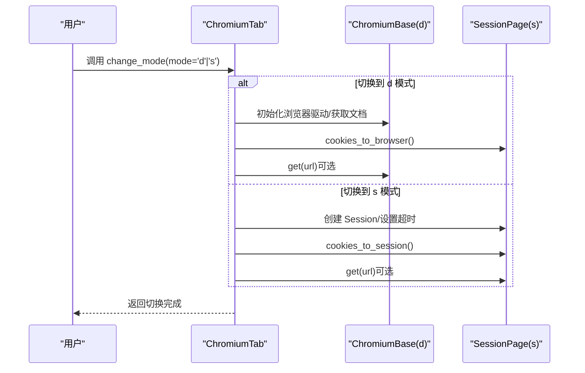
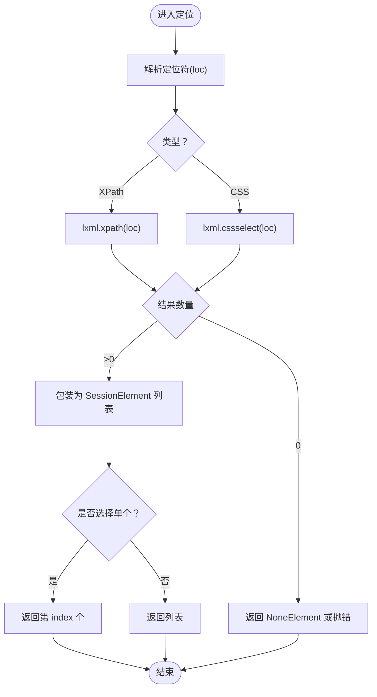
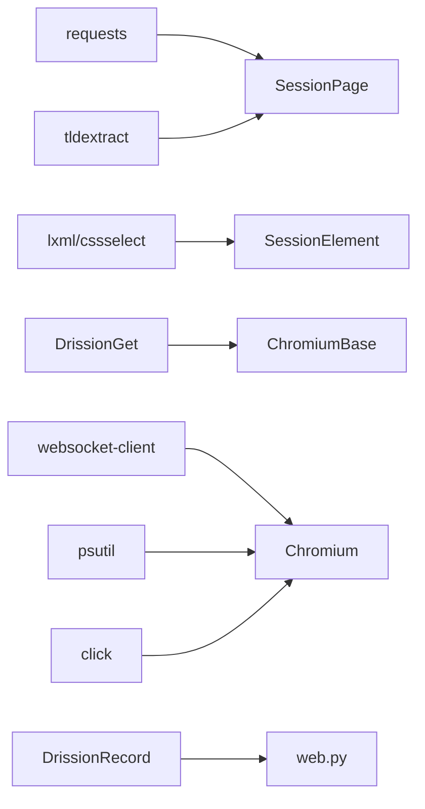

# 项目概述

<cite>
**本文引用的文件**
- [DrissionPage/__init__.py](file://DrissionPage/__init__.py)
- [DrissionPage/version.py](file://DrissionPage/version.py)
- [requirements.txt](file://requirements.txt)
- [DrissionPage/common.py](file://DrissionPage/common.py)
- [DrissionPage/_base/base.py](file://DrissionPage/_base/base.py)
- [DrissionPage/_browsers/chromium.py](file://DrissionPage/_browsers/chromium.py)
- [DrissionPage/_pages/chromium_page.py](file://DrissionPage/_pages/chromium_page.py)
- [DrissionPage/_pages/session_page.py](file://DrissionPage/_pages/session_page.py)
- [DrissionPage/_configs/chromium_options.py](file://DrissionPage/_configs/chromium_options.py)
- [DrissionPage/_configs/session_options.py](file://DrissionPage/_configs/session_options.py)
- [DrissionPage/_functions/tools.py](file://DrissionPage/_functions/tools.py)
- [DrissionPage/_functions/web.py](file://DrissionPage/_functions/web.py)
- [DrissionPage/_elements/session_element.py](file://DrissionPage/_elements/session_element.py)
- [DrissionPage/_pages/chromium_tab.py](file://DrissionPage/_pages/chromium_tab.py)
</cite>

## 目录
1. [引言](#引言)
2. [项目结构](#项目结构)
3. [核心组件](#核心组件)
4. [架构总览](#架构总览)
5. [详细组件分析](#详细组件分析)
6. [依赖分析](#依赖分析)
7. [性能考虑](#性能考虑)
8. [故障排查指南](#故障排查指南)
9. [结论](#结论)
10. [附录](#附录)

## 引言
DrissionPage 是一个双模式网页自动化框架，融合了基于 CDP 协议的浏览器控制与基于 HTTP 会话的网页抓取能力，提供“驱动模式（d 模式）+ 会话模式（s 模式）”的统一抽象。它通过 Chromium 浏览器的 DevTools 协议实现真实 DOM 的操作与事件监听，同时通过 requests 会话处理静态资源与接口请求，兼顾速度、稳定与灵活性。该框架适用于需要在真实渲染环境下进行交互的场景，以及对性能敏感的批量抓取任务。

- 版本与许可：当前版本为 4.2.0b10；项目提供使用条款与免责声明，强调仅限学习与合法非商业用途，并要求遵守相关法律法规与 Robots 协议。
- 目标用户：自动化工程师、数据采集工程师、测试工程师、研究者与开发者。

**章节来源**
- [DrissionPage/__init__.py:1-29](file://DrissionPage/__init__.py#L1-L29)
- [DrissionPage/version.py:1-9](file://DrissionPage/version.py#L1-L9)

## 项目结构
项目采用按职责分层的模块化组织方式：
- 基础层：定义通用解析器、元素基类、页面基类与消息通道等抽象。
- 配置层：封装 Chromium 与 Session 的运行参数与默认配置。
- 功能层：提供浏览器连接、元素定位、文本提取、下载、截图、PDF 导出等工具函数。
- 页面层：ChromiumPage、ChromiumTab、SessionPage 提供统一的页面操作接口。
- 元素层：SessionElement 等实现基于 lxml 的元素包装与查询。
- 浏览器层：Chromium 类管理浏览器生命周期、上下文、标签页与 CDP 会话。

**图表来源**
- [DrissionPage/_base/base.py:29-434](file://DrissionPage/_base/base.py#L29-L434)
- [DrissionPage/_browsers/chromium.py:33-730](file://DrissionPage/_browsers/chromium.py#L33-L730)
- [DrissionPage/_pages/chromium_page.py:17-103](file://DrissionPage/_pages/chromium_page.py#L17-L103)
- [DrissionPage/_pages/chromium_tab.py:22-238](file://DrissionPage/_pages/chromium_tab.py#L22-L238)
- [DrissionPage/_pages/session_page.py:25-294](file://DrissionPage/_pages/session_page.py#L25-L294)
- [DrissionPage/_configs/chromium_options.py:16-417](file://DrissionPage/_configs/chromium_options.py#L16-L417)
- [DrissionPage/_configs/session_options.py:20-372](file://DrissionPage/_configs/session_options.py#L20-L372)
- [DrissionPage/_functions/tools.py:21-213](file://DrissionPage/_functions/tools.py#L21-L213)
- [DrissionPage/_functions/web.py:1-349](file://DrissionPage/_functions/web.py#L1-L349)
- [DrissionPage/_elements/session_element.py:23-301](file://DrissionPage/_elements/session_element.py#L23-L301)

**章节来源**
- [DrissionPage/_base/base.py:29-434](file://DrissionPage/_base/base.py#L29-L434)
- [DrissionPage/_browsers/chromium.py:33-730](file://DrissionPage/_browsers/chromium.py#L33-L730)
- [DrissionPage/_pages/chromium_page.py:17-103](file://DrissionPage/_pages/chromium_page.py#L17-L103)
- [DrissionPage/_pages/chromium_tab.py:22-238](file://DrissionPage/_pages/chromium_tab.py#L22-L238)
- [DrissionPage/_pages/session_page.py:25-294](file://DrissionPage/_pages/session_page.py#L25-L294)
- [DrissionPage/_configs/chromium_options.py:16-417](file://DrissionPage/_configs/chromium_options.py#L16-L417)
- [DrissionPage/_configs/session_options.py:20-372](file://DrissionPage/_configs/session_options.py#L20-L372)
- [DrissionPage/_functions/tools.py:21-213](file://DrissionPage/_functions/tools.py#L21-L213)
- [DrissionPage/_functions/web.py:1-349](file://DrissionPage/_functions/web.py#L1-L349)
- [DrissionPage/_elements/session_element.py:23-301](file://DrissionPage/_elements/session_element.py#L23-L301)

## 核心组件
- Chromium：浏览器进程管理、CDP 会话、标签页集合、上下文隔离、下载管理、事件分发与断线处理。
- ChromiumPage：单浏览器实例下的页面对象，提供统一的页面操作入口。
- ChromiumTab：双模式页面对象，支持 d/s 模式切换，桥接浏览器与会话两种能力。
- SessionPage：基于 requests 的会话页面，提供 HTTP 请求、响应解析、Cookie 管理与重试机制。
- SessionElement：基于 lxml 的元素包装，提供 XPath/CSS 定位、文本提取、属性访问与相对定位。
- 配置选项：ChromiumOptions 与 SessionOptions 提供参数化配置与持久化保存。
- 工具与功能：PortFinder 自动端口分配、错误映射、文本格式化、PDF/MHTML 导出、树形结构打印等。

**章节来源**
- [DrissionPage/_browsers/chromium.py:33-730](file://DrissionPage/_browsers/chromium.py#L33-L730)
- [DrissionPage/_pages/chromium_page.py:17-103](file://DrissionPage/_pages/chromium_page.py#L17-L103)
- [DrissionPage/_pages/chromium_tab.py:22-238](file://DrissionPage/_pages/chromium_tab.py#L22-L238)
- [DrissionPage/_pages/session_page.py:25-294](file://DrissionPage/_pages/session_page.py#L25-L294)
- [DrissionPage/_elements/session_element.py:23-301](file://DrissionPage/_elements/session_element.py#L23-L301)
- [DrissionPage/_configs/chromium_options.py:16-417](file://DrissionPage/_configs/chromium_options.py#L16-L417)
- [DrissionPage/_configs/session_options.py:20-372](file://DrissionPage/_configs/session_options.py#L20-L372)
- [DrissionPage/_functions/tools.py:21-213](file://DrissionPage/_functions/tools.py#L21-L213)
- [DrissionPage/_functions/web.py:1-349](file://DrissionPage/_functions/web.py#L1-L349)

## 架构总览
DrissionPage 的架构围绕“浏览器（Chromium）+ 会话（Session）+ 页面（ChromiumPage/ChromiumTab/SessionPage）+ 元素（SessionElement）+ 配置（Options）+ 工具（tools/web）”展开。Chromium 通过 CDP 与浏览器通信，ChromiumTab 在 d/s 模式之间切换，SessionPage 使用 requests 处理 HTTP 请求，SessionElement 将 lxml 查询结果包装为可操作的元素对象。

**图表来源**
- [DrissionPage/_browsers/chromium.py:33-730](file://DrissionPage/_browsers/chromium.py#L33-L730)
- [DrissionPage/_pages/chromium_page.py:17-103](file://DrissionPage/_pages/chromium_page.py#L17-L103)
- [DrissionPage/_pages/chromium_tab.py:22-238](file://DrissionPage/_pages/chromium_tab.py#L22-L238)
- [DrissionPage/_pages/session_page.py:25-294](file://DrissionPage/_pages/session_page.py#L25-L294)
- [DrissionPage/_elements/session_element.py:23-301](file://DrissionPage/_elements/session_element.py#L23-L301)
- [DrissionPage/_configs/chromium_options.py:16-417](file://DrissionPage/_configs/chromium_options.py#L16-L417)
- [DrissionPage/_configs/session_options.py:20-372](file://DrissionPage/_configs/session_options.py#L20-L372)
- [DrissionPage/_functions/tools.py:21-213](file://DrissionPage/_functions/tools.py#L21-L213)
- [DrissionPage/_functions/web.py:1-349](file://DrissionPage/_functions/web.py#L1-L349)

## 详细组件分析

### 组件一：Chromium（浏览器）
- 角色：管理浏览器生命周期、CDP 会话、标签页集合、上下文隔离、下载策略、事件订阅与断线恢复。
- 关键点：
  - 单例浏览器缓存、锁保护、WS 地址与 HTTP 地址切换。
  - Target 发现与事件回调、会话绑定与解绑。
  - 新建标签页、激活标签页、关闭标签页、清理缓存与 Cookie。
  - 代理设置、隐私沙盒弹窗处理、进程 ID 获取。
- 双模式桥接：通过 ChromiumTab 实现 d/s 模式切换。

**图表来源**
- [DrissionPage/_browsers/chromium.py:33-730](file://DrissionPage/_browsers/chromium.py#L33-L730)

**章节来源**
- [DrissionPage/_browsers/chromium.py:33-730](file://DrissionPage/_browsers/chromium.py#L33-L730)

### 组件二：ChromiumPage 与 ChromiumTab
- 角色：ChromiumPage 代表浏览器中的页面对象；ChromiumTab 是双模式页面对象，支持 d/s 切换。
- 关键点：
  - ChromiumPage：单例缓存、继承 Chromium 的能力、暴露浏览器与标签页集合。
  - ChromiumTab：d 模式（浏览器控制）与 s 模式（HTTP 会话）切换；cookies 双向同步；URL 与标题一致性；保存 PDF/MHTML。
- 设计优势：统一接口下，既可进行真实 DOM 操作，也可进行高效 HTTP 请求。

**图表来源**
- [DrissionPage/_pages/chromium_page.py:17-103](file://DrissionPage/_pages/chromium_page.py#L17-L103)
- [DrissionPage/_pages/chromium_tab.py:22-238](file://DrissionPage/_pages/chromium_tab.py#L22-L238)

**章节来源**
- [DrissionPage/_pages/chromium_page.py:17-103](file://DrissionPage/_pages/chromium_page.py#L17-L103)
- [DrissionPage/_pages/chromium_tab.py:22-238](file://DrissionPage/_pages/chromium_tab.py#L22-L238)

### 组件三：SessionPage（HTTP 会话）
- 角色：基于 requests 的会话页面，提供 GET/POST、响应解析、编码处理、Cookie 管理与重试。
- 关键点：
  - 支持本地文件加载、URL 可用性判断、状态码检查。
  - 自动设置 Referer/Host、超时与重试策略、字符集推断。
  - Cookie 域过滤、多域聚合、与浏览器 Cookie 同步。

**图表来源**
- [DrissionPage/_pages/session_page.py:25-294](file://DrissionPage/_pages/session_page.py#L25-L294)

**章节来源**
- [DrissionPage/_pages/session_page.py:25-294](file://DrissionPage/_pages/session_page.py#L25-L294)

### 组件四：SessionElement（元素包装）
- 角色：将 lxml 解析后的元素包装为可操作的对象，提供 XPath/CSS 定位、文本提取、属性访问与相对定位。
- 关键点：
  - 支持绝对/相对路径定位、父子兄弟元素导航、CSS 路径生成。
  - 属性访问时对 href/src 进行绝对链接补全，支持 innerHTML/outerHTML。
  - 与不同页面对象（SessionPage、ChromiumPage、ChromiumTab）兼容。

**图表来源**
- [DrissionPage/_elements/session_element.py:23-301](file://DrissionPage/_elements/session_element.py#L23-L301)

**章节来源**
- [DrissionPage/_elements/session_element.py:23-301](file://DrissionPage/_elements/session_element.py#L23-L301)

### 组件五：配置与工具
- ChromiumOptions：浏览器启动参数、用户数据目录、代理、下载路径、超时、重试、标志位等。
- SessionOptions：请求头、Cookie、认证、代理、钩子、参数、证书、流式传输、信任环境、最大重定向等。
- tools：端口分配、进程窗口隐藏、等待 until、错误映射、目录清理。
- web：文本格式化、绝对链接补全、Blob 读取、PDF/MHTML 导出、树形结构打印。

**图表来源**
- [DrissionPage/_configs/chromium_options.py:16-417](file://DrissionPage/_configs/chromium_options.py#L16-L417)
- [DrissionPage/_configs/session_options.py:20-372](file://DrissionPage/_configs/session_options.py#L20-L372)

**章节来源**
- [DrissionPage/_configs/chromium_options.py:16-417](file://DrissionPage/_configs/chromium_options.py#L16-L417)
- [DrissionPage/_configs/session_options.py:20-372](file://DrissionPage/_configs/session_options.py#L20-L372)
- [DrissionPage/_functions/tools.py:21-213](file://DrissionPage/_functions/tools.py#L21-L213)
- [DrissionPage/_functions/web.py:1-349](file://DrissionPage/_functions/web.py#L1-L349)

### 组件六：双模式切换流程（ChromiumTab.change_mode）

**图表来源**
- [DrissionPage/_pages/chromium_tab.py:156-194](file://DrissionPage/_pages/chromium_tab.py#L156-L194)

**章节来源**
- [DrissionPage/_pages/chromium_tab.py:156-194](file://DrissionPage/_pages/chromium_tab.py#L156-L194)

### 组件七：元素定位与文本提取流程（SessionElement）

**图表来源**
- [DrissionPage/_elements/session_element.py:169-301](file://DrissionPage/_elements/session_element.py#L169-L301)

**章节来源**
- [DrissionPage/_elements/session_page.py:148-149](file://DrissionPage/_pages/session_page.py#L148-L149)
- [DrissionPage/_elements/session_element.py:169-301](file://DrissionPage/_elements/session_element.py#L169-L301)

## 依赖分析
- 外部依赖：requests、lxml、cssselect、DrissionGet、DrissionRecord、websocket-client、click、tldextract、psutil。
- 内部模块耦合：
  - Chromium 依赖 ChromiumOptions、SessionOptions、tools、web、下载器与等待器。
  - ChromiumTab 继承 ChromiumBase 与 SessionPage，实现双模式切换。
  - SessionPage 依赖 SessionOptions、tldextract、web 工具。
  - SessionElement 依赖 lxml、web 工具、定位器与错误类型。

**图表来源**
- [requirements.txt:1-9](file://requirements.txt#L1-L9)
- [DrissionPage/_pages/session_page.py:13-22](file://DrissionPage/_pages/session_page.py#L13-L22)
- [DrissionPage/_elements/session_element.py:9-20](file://DrissionPage/_elements/session_element.py#L9-L20)
- [DrissionPage/_functions/web.py:14-17](file://DrissionPage/_functions/web.py#L14-L17)
- [DrissionPage/_browsers/chromium.py:13-29](file://DrissionPage/_browsers/chromium.py#L13-L29)

**章节来源**
- [requirements.txt:1-9](file://requirements.txt#L1-L9)
- [DrissionPage/_pages/session_page.py:13-22](file://DrissionPage/_pages/session_page.py#L13-L22)
- [DrissionPage/_elements/session_element.py:9-20](file://DrissionPage/_elements/session_element.py#L9-L20)
- [DrissionPage/_functions/web.py:14-17](file://DrissionPage/_functions/web.py#L14-L17)
- [DrissionPage/_browsers/chromium.py:13-29](file://DrissionPage/_browsers/chromium.py#L13-L29)

## 性能考虑
- 双模式切换：在需要真实 DOM 与事件时使用 d 模式，在大批量抓取时使用 s 模式，减少浏览器开销。
- 会话复用：SessionPage 使用 requests.Session，减少 TCP 握手与连接开销。
- 超时与重试：ChromiumOptions 与 SessionOptions 提供统一的超时与重试配置，避免网络抖动影响稳定性。
- 下载与编码：DrissionGet 与字符集推断减少重复解析成本。
- 端口与进程：PortFinder 与进程清理工具降低资源占用与冲突概率。

[本节为通用指导，无需特定文件来源]

## 故障排查指南
- 连接失败与断线：
  - CDP 错误映射到具体异常类型，便于快速定位（上下文丢失、元素丢失、断开连接、JavaScript 错误、存储错误、Cookie 格式错误、无效 URL、超时等）。
  - 断线后自动停止消息循环与会话，必要时调用 reconnect() 重建连接。
- 端口与进程：
  - 使用 PortFinder 分配可用端口；确保 Windows 环境下具备 win32gui/win32con 依赖以便隐藏/显示浏览器窗口。
- 会话与 Cookie：
  - d/s 模式切换时注意 cookies 同步；SessionPage 的 Cookie 域过滤与 TLD 提取有助于精准匹配。
- 超时与重试：
  - 合理设置 retry_times 与 retry_interval，避免频繁重试造成资源浪费。

**章节来源**
- [DrissionPage/_functions/tools.py:157-197](file://DrissionPage/_functions/tools.py#L157-L197)
- [DrissionPage/_functions/tools.py:21-55](file://DrissionPage/_functions/tools.py#L21-L55)
- [DrissionPage/_pages/session_page.py:180-265](file://DrissionPage/_pages/session_page.py#L180-L265)
- [DrissionPage/_pages/chromium_tab.py:156-194](file://DrissionPage/_pages/chromium_tab.py#L156-L194)

## 结论
DrissionPage 通过“浏览器 + 会话”的双模式设计，实现了在真实渲染与高效抓取之间的灵活平衡。Chromium 提供强大的浏览器控制能力，SessionPage 提供稳定的 HTTP 交互能力，二者在 ChromiumTab 中无缝切换。配合完善的配置体系与工具库，该框架适合从入门到高级的各类自动化与数据采集场景。

[本节为总结性内容，无需特定文件来源]

## 附录
- 许可与使用条款：项目明确使用限制与免责声明，强调仅限学习与合法非商业用途，并要求遵守相关法律法规与 Robots 协议。
- 版本信息：当前版本为 4.2.0b10。

**章节来源**
- [DrissionPage/__init__.py:1-29](file://DrissionPage/__init__.py#L1-L29)
- [DrissionPage/version.py:1-9](file://DrissionPage/version.py#L1-L9)