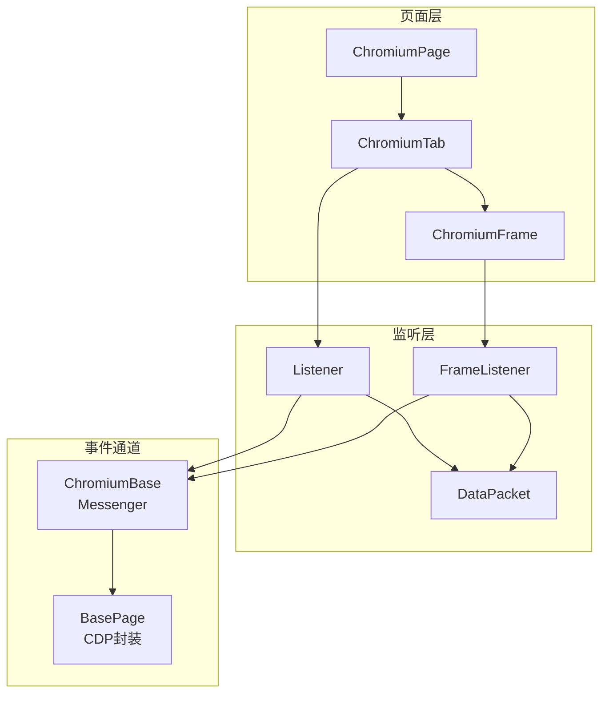
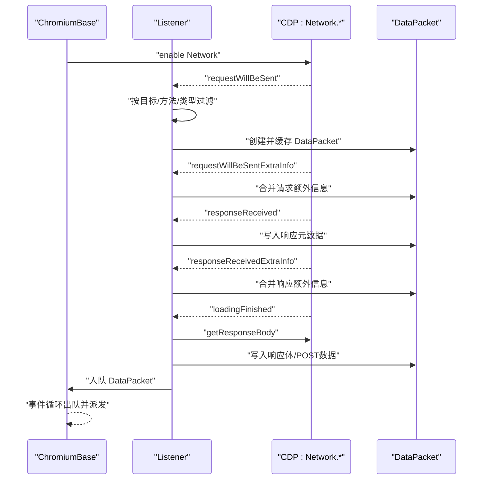
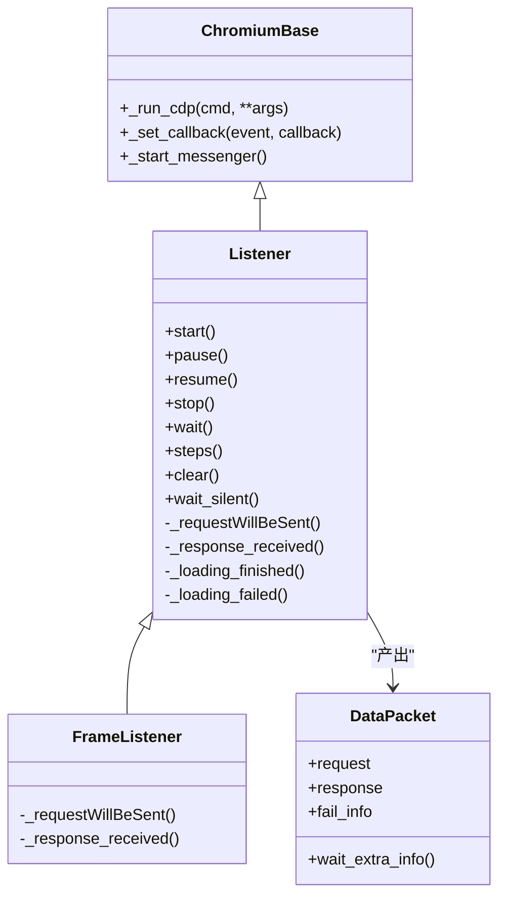

# 事件监听机制

<cite>
**本文引用的文件**
- [listener.py](file://DrissionPage/_units/listener.py)
- [chromium_frame.py](file://DrissionPage/_pages/chromium_frame.py)
- [chromium_page.py](file://DrissionPage/_pages/chromium_page.py)
- [chromium_tab.py](file://DrissionPage/_pages/chromium_tab.py)
- [chromium_base.py](file://DrissionPage/_pages/chromium_base.py)
- [base.py](file://DrissionPage/_base/base.py)
- [__init__.py](file://DrissionPage/__init__.py)
</cite>

## 目录
1. [简介](#简介)
2. [项目结构](#项目结构)
3. [核心组件](#核心组件)
4. [架构总览](#架构总览)
5. [详细组件分析](#详细组件分析)
6. [依赖分析](#依赖分析)
7. [性能考虑](#性能考虑)
8. [故障排查指南](#故障排查指南)
9. [结论](#结论)
10. [附录：使用示例与最佳实践](#附录使用示例与最佳实践)

## 简介
本文系统性阐述 DrissionPage 的事件监听机制，重点围绕 Listener 类及其子类 FrameListener 的设计与使用，解释网络请求监听的工作原理（requestWillBeSent、responseReceived、loadingFinished、loadingFailed 及其 ExtraInfo 事件）、DataPacket 数据包的结构与属性解析、监听目标设置（正则匹配、HTTP 方法过滤、资源类型过滤）、以及监听状态管理与生命周期控制。同时给出同步等待、异步处理、批量监听等典型场景的使用思路，并说明 FrameListener 在跨域场景下的特殊用途。

## 项目结构
DrissionPage 的监听体系由“页面/标签基类”承载事件通道，“监听器”订阅并聚合网络事件，最终产出“数据包”。关键文件与职责如下：
- 监听器与数据包：listener.py
- 页面与帧对象：chromium_page.py、chromium_tab.py、chromium_frame.py
- 事件通道与 CDP 封装：chromium_base.py、base.py
- 入口模块：__init__.py

图表来源
- [chromium_page.py:17-43](file://DrissionPage/_pages/chromium_page.py#L17-L43)
- [chromium_tab.py:22-47](file://DrissionPage/_pages/chromium_tab.py#L22-L47)
- [chromium_frame.py:25-70](file://DrissionPage/_pages/chromium_frame.py#L25-L70)
- [listener.py:20-37](file://DrissionPage/_units/listener.py#L20-L37)
- [chromium_base.py:39-96](file://DrissionPage/_pages/chromium_base.py#L39-L96)
- [base.py:381-415](file://DrissionPage/_base/base.py#L381-L415)

章节来源
- [chromium_page.py:17-43](file://DrissionPage/_pages/chromium_page.py#L17-L43)
- [chromium_tab.py:22-47](file://DrissionPage/_pages/chromium_tab.py#L22-L47)
- [chromium_frame.py:25-70](file://DrissionPage/_pages/chromium_frame.py#L25-L70)
- [listener.py:20-37](file://DrissionPage/_units/listener.py#L20-L37)
- [chromium_base.py:39-96](file://DrissionPage/_pages/chromium_base.py#L39-L96)
- [base.py:381-415](file://DrissionPage/_base/base.py#L381-L415)

## 核心组件
- Listener：通用网络事件监听器，负责订阅 Network.* 事件，按目标条件筛选，聚合请求/响应/失败信息，产出 DataPacket。
- FrameListener：继承自 Listener，针对 ChromiumFrame 的跨域场景做特殊过滤（仅接收同 frameId 的事件）。
- DataPacket：封装单次网络请求的完整信息，包含 request、response、fail_info、额外信息等属性。
- ChromiumBase/Messenger：提供 CDP 会话、事件队列、回调注册与分发能力，是监听器运行的基础。

章节来源
- [listener.py:20-37](file://DrissionPage/_units/listener.py#L20-L37)
- [listener.py:323-334](file://DrissionPage/_units/listener.py#L323-L334)
- [listener.py:335-417](file://DrissionPage/_units/listener.py#L335-L417)
- [chromium_base.py:39-96](file://DrissionPage/_pages/chromium_base.py#L39-L96)
- [base.py:381-415](file://DrissionPage/_base/base.py#L381-L415)

## 架构总览
DrissionPage 的事件监听采用“CDP 事件驱动 + 内部队列聚合”的模式：
- ChromiumBase 启动消息循环，将 CDP 事件入队。
- Listener 注册 Network.* 回调，按条件过滤并缓存请求上下文。
- loadingFinished 时拉取响应体与额外信息，封装为 DataPacket 并入队。
- 上层通过 wait/steps 等接口消费队列中的 DataPacket。

图表来源
- [listener.py:200-206](file://DrissionPage/_units/listener.py#L200-L206)
- [listener.py:208-294](file://DrissionPage/_units/listener.py#L208-L294)
- [listener.py:295-321](file://DrissionPage/_units/listener.py#L295-L321)
- [chromium_base.py:39-96](file://DrissionPage/_pages/chromium_base.py#L39-L96)
- [base.py:381-415](file://DrissionPage/_base/base.py#L381-L415)

## 详细组件分析

### Listener 类：核心功能与使用方法
- 监听目标设置
  - targets：支持 True（全部）、字符串、列表/元组/集合；当为 True 时不限制 URL。
  - is_regex：启用正则匹配 URL。
  - method：HTTP 方法过滤，True 或字符串/集合。
  - res_type：资源类型过滤，True 或字符串/集合。
- 生命周期与状态
  - start：初始化目标、清空状态、恢复监听、启用 Network。
  - resume/pause：注册/移除回调，控制 listening 状态。
  - stop：暂停并关闭 Network。
  - clear：清空内部队列与计数。
- 等待与消费
  - wait：阻塞等待指定数量的 DataPacket，支持超时与异常策略。
  - steps：流式迭代，按 gap 分批产出，适合翻页等批量场景。
  - wait_silent：等待活跃请求数降至阈值，支持仅针对目标计数。
- 事件回调与数据聚合
  - requestWillBeSent：计数+过滤+创建 DataPacket，必要时拉取 POST 数据。
  - requestWillBeSentExtraInfo：缓存请求额外信息。
  - responseReceived：写入响应元数据与资源类型。
  - responseReceivedExtraInfo：合并响应额外信息，清理临时映射。
  - loadingFinished：拉取响应体、补充 POST 数据，产出 DataPacket。
  - loadingFailed：记录失败信息，标记 is_failed。

章节来源
- [listener.py:43-77](file://DrissionPage/_units/listener.py#L43-L77)
- [listener.py:78-86](file://DrissionPage/_units/listener.py#L78-L86)
- [listener.py:145-161](file://DrissionPage/_units/listener.py#L145-L161)
- [listener.py:162-167](file://DrissionPage/_units/listener.py#L162-L167)
- [listener.py:168-174](file://DrissionPage/_units/listener.py#L168-L174)
- [listener.py:88-117](file://DrissionPage/_units/listener.py#L88-L117)
- [listener.py:118-143](file://DrissionPage/_units/listener.py#L118-L143)
- [listener.py:175-192](file://DrissionPage/_units/listener.py#L175-L192)
- [listener.py:208-294](file://DrissionPage/_units/listener.py#L208-L294)
- [listener.py:295-321](file://DrissionPage/_units/listener.py#L295-L321)

### FrameListener：跨域与帧级监听
- 特殊用途
  - 在跨域 iframe 场景下，仅接收来自当前 frameId 的事件，避免“异域转同域/交换”导致的事件错配。
- 实现要点
  - 重写 requestWillBeSent/responseReceived，在跨域且 frameId 不匹配时直接返回。
  - 与 ChromiumFrame 的 _is_diff_domain/_frame_id 协作，确保对当前帧的事件可见。

章节来源
- [listener.py:323-334](file://DrissionPage/_units/listener.py#L323-L334)
- [chromium_frame.py:54-63](file://DrissionPage/_pages/chromium_frame.py#L54-L63)
- [chromium_frame.py:121-140](file://DrissionPage/_pages/chromium_frame.py#L121-L140)

### DataPacket 数据包：结构与属性
- 关键字段
  - 请求：url、method、headers、params、postData、cookies、extra_info。
  - 响应：headers、raw_body、body、extra_info。
  - 失败：fail_info（含 errorText/canceled 等）。
  - 元信息：frameId、resourceType、is_failed。
- 解析与延迟加载
  - request/response/fail_info 属性首次访问时才构建对应对象，减少不必要的解析成本。
  - body 支持 base64 与 JSON 自动解码。
  - wait_extra_info 提供等待额外信息就绪的阻塞接口。

章节来源
- [listener.py:335-417](file://DrissionPage/_units/listener.py#L335-L417)
- [listener.py:419-468](file://DrissionPage/_units/listener.py#L419-L468)
- [listener.py:470-514](file://DrissionPage/_units/listener.py#L470-L514)
- [listener.py:516-542](file://DrissionPage/_units/listener.py#L516-L542)

### 监听目标设置：URL、方法与资源类型
- URL 匹配
  - targets=True：不限制 URL。
  - targets 为字符串/集合：精确包含匹配；is_regex=True 时使用正则匹配。
- HTTP 方法过滤
  - method=True：不限制方法；否则限制为指定集合。
- 资源类型过滤
  - res_type=True：不限制类型；否则限制为指定集合（统一转大写后比较）。

章节来源
- [listener.py:43-77](file://DrissionPage/_units/listener.py#L43-L77)
- [listener.py:208-234](file://DrissionPage/_units/listener.py#L208-L234)

### 事件触发时机与处理逻辑
- requestWillBeSent：开始一次请求，计数+过滤+创建 DataPacket；若请求声明了 POST 但未内嵌 postData，则尝试拉取。
- requestWillBeSentExtraInfo：缓存请求额外信息（如头部、关联 Cookie 等）。
- responseReceived：写入响应元数据与资源类型。
- responseReceivedExtraInfo：合并响应额外信息，清理临时映射。
- loadingFinished：拉取响应体与 POST 数据，产出 DataPacket。
- loadingFailed：记录失败信息并标记 is_failed。

章节来源
- [listener.py:208-294](file://DrissionPage/_units/listener.py#L208-L294)
- [listener.py:295-321](file://DrissionPage/_units/listener.py#L295-L321)

### 监听状态管理与生命周期
- start：初始化目标、清空状态、恢复监听、启用 Network。
- resume/pause：注册/移除回调，控制 listening 状态。
- stop：暂停并关闭 Network。
- clear：清空内部队列与计数。
- wait_silent：等待活跃请求数降至阈值，支持仅针对目标计数。

章节来源
- [listener.py:78-86](file://DrissionPage/_units/listener.py#L78-L86)
- [listener.py:145-161](file://DrissionPage/_units/listener.py#L145-L161)
- [listener.py:162-167](file://DrissionPage/_units/listener.py#L162-L167)
- [listener.py:168-174](file://DrissionPage/_units/listener.py#L168-L174)
- [listener.py:175-192](file://DrissionPage/_units/listener.py#L175-L192)

## 依赖分析
- 监听器依赖页面/标签对象提供的 CDP 会话与事件分发能力。
- ChromiumFrame 通过 FrameListener 限定事件范围，避免跨域干扰。
- DataPacket 对请求/响应对象进行惰性解析，降低内存与 CPU 开销。

图表来源
- [chromium_base.py:39-96](file://DrissionPage/_pages/chromium_base.py#L39-L96)
- [listener.py:20-37](file://DrissionPage/_units/listener.py#L20-L37)
- [listener.py:323-334](file://DrissionPage/_units/listener.py#L323-L334)
- [listener.py:335-417](file://DrissionPage/_units/listener.py#L335-L417)

章节来源
- [chromium_base.py:39-96](file://DrissionPage/_pages/chromium_base.py#L39-L96)
- [listener.py:20-37](file://DrissionPage/_units/listener.py#L20-L37)
- [listener.py:323-334](file://DrissionPage/_units/listener.py#L323-L334)
- [listener.py:335-417](file://DrissionPage/_units/listener.py#L335-L417)

## 性能考虑
- 惰性解析：DataPacket 的 request/response/fail_info 属性在首次访问时才构建，避免无谓的解析。
- 流式消费：steps 支持按 gap 分批消费，适合高并发场景下的批量处理。
- 额外信息合并：通过 requestId 映射合并 ExtraInfo，减少重复存储。
- 计数与阈值：wait_silent 使用 running_requests/running_targets 计数，便于在复杂页面中精准等待。

## 故障排查指南
- 未开始监听即调用 wait：会抛出运行时错误。请先调用 start 或 resume。
- 超时未返回：检查目标过滤条件是否过于严格；确认 is_regex/method/res_type 设置；使用 wait_silent 辅助判断是否仍有活跃请求。
- 跨域事件缺失：在 iframe 跨域场景，请使用 ChromiumFrame.listen 获取 FrameListener，确保仅接收当前 frameId 的事件。
- 失败请求未产出：loadingFailed 会标记 is_failed 并写入 fail_info，确认监听器仍在运行且未被 clear。

章节来源
- [listener.py:88-91](file://DrissionPage/_units/listener.py#L88-L91)
- [listener.py:175-192](file://DrissionPage/_units/listener.py#L175-L192)
- [chromium_frame.py:237-240](file://DrissionPage/_pages/chromium_frame.py#L237-L240)
- [listener.py:295-321](file://DrissionPage/_units/listener.py#L295-L321)

## 结论
DrissionPage 的事件监听机制以 Listener 为核心，结合 ChromiumBase 的 CDP 事件通道，实现了对网络请求的精细化监控与数据聚合。通过灵活的目标设置、完善的生命周期管理与惰性解析策略，既能覆盖常规场景，也能在跨域与高并发环境下保持稳定与高效。FrameListener 则进一步增强了跨域场景下的可用性与准确性。

## 附录：使用示例与最佳实践
以下为常见使用场景的思路与步骤，便于快速上手与扩展。

- 同步等待单个请求
  - 步骤：调用 start 设置目标与过滤条件 → 执行触发请求的操作 → 调用 wait(count=1) 获取 DataPacket → 解析 request/response/fail_info。
  - 注意：若超时且 raise_err=True，将抛出等待异常；否则返回 False。
  - 参考路径
    - [listener.py:78-86](file://DrissionPage/_units/listener.py#L78-L86)
    - [listener.py:88-117](file://DrissionPage/_units/listener.py#L88-L117)

- 异步处理与批量监听
  - 步骤：调用 start → 使用 steps(count, timeout, gap) 迭代消费 → 每接收到 gap 个 DataPacket 执行一次业务处理（如翻页）。
  - 参考路径
    - [listener.py:118-143](file://DrissionPage/_units/listener.py#L118-L143)

- 跨域场景下的帧级监听
  - 步骤：在 ChromiumFrame 上通过 listen 获取 FrameListener → start → 仅接收当前 frameId 的事件。
  - 参考路径
    - [chromium_frame.py:237-240](file://DrissionPage/_pages/chromium_frame.py#L237-L240)
    - [listener.py:323-334](file://DrissionPage/_units/listener.py#L323-L334)

- 精准等待请求结束
  - 步骤：使用 wait_silent(timeout, targets_only=True, limit=0) 等待目标请求数降至阈值。
  - 参考路径
    - [listener.py:175-192](file://DrissionPage/_units/listener.py#L175-L192)

- 监听目标设置
  - URL：targets=True 或传入字符串/集合；is_regex=True 时启用正则匹配。
  - 方法：method={'GET','POST'} 或 True。
  - 资源类型：res_type={'xmlhttprequest','script',...} 或 True。
  - 参考路径
    - [listener.py:43-77](file://DrissionPage/_units/listener.py#L43-L77)

- 数据包属性解析
  - request：url、method、headers、params、postData、cookies、extra_info。
  - response：headers、raw_body、body、extra_info。
  - fail_info：errorText、canceled 等。
  - 参考路径
    - [listener.py:335-417](file://DrissionPage/_units/listener.py#L335-L417)
    - [listener.py:419-468](file://DrissionPage/_units/listener.py#L419-L468)
    - [listener.py:470-514](file://DrissionPage/_units/listener.py#L470-L514)
    - [listener.py:536-542](file://DrissionPage/_units/listener.py#L536-L542)

- 生命周期控制
  - start → resume → pause → stop → clear。
  - 参考路径
    - [listener.py:78-86](file://DrissionPage/_units/listener.py#L78-L86)
    - [listener.py:145-161](file://DrissionPage/_units/listener.py#L145-L161)
    - [listener.py:162-167](file://DrissionPage/_units/listener.py#L162-L167)
    - [listener.py:168-174](file://DrissionPage/_units/listener.py#L168-L174)