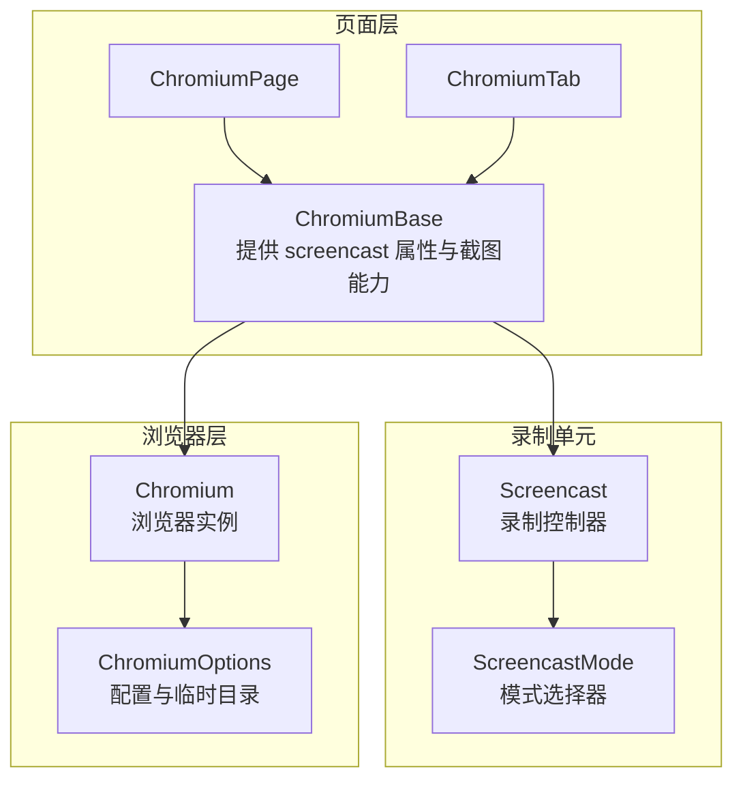
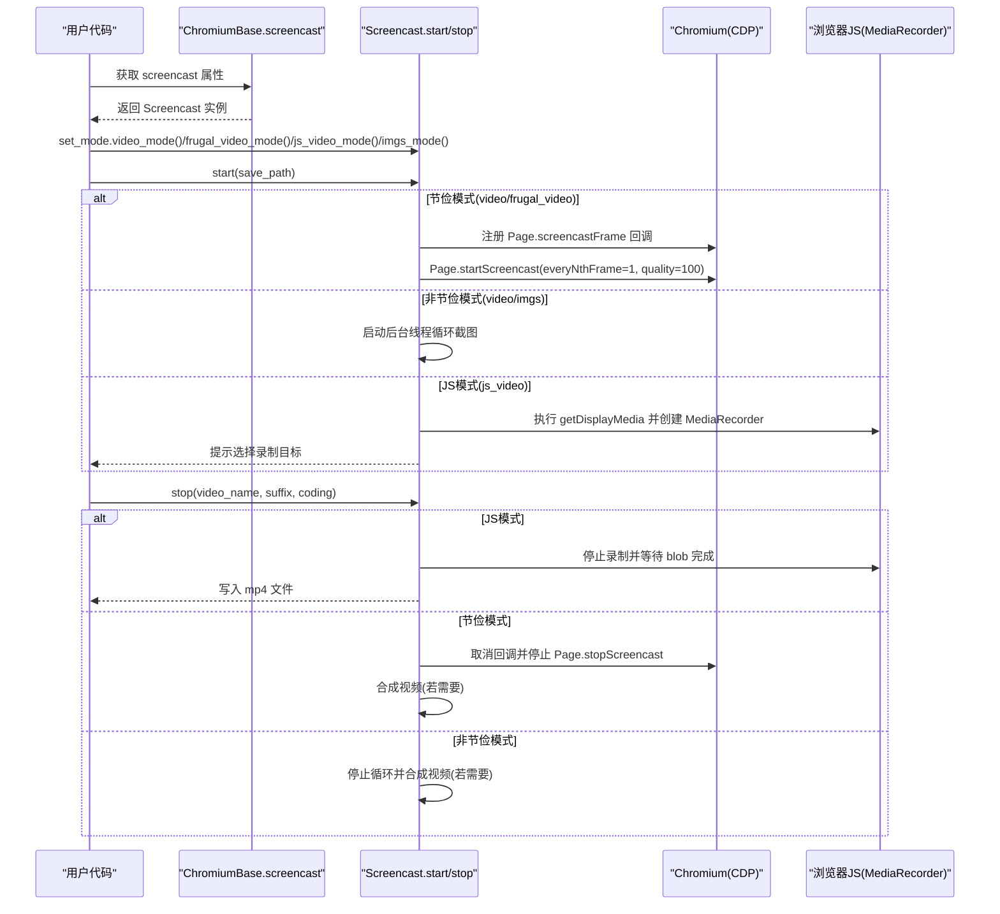
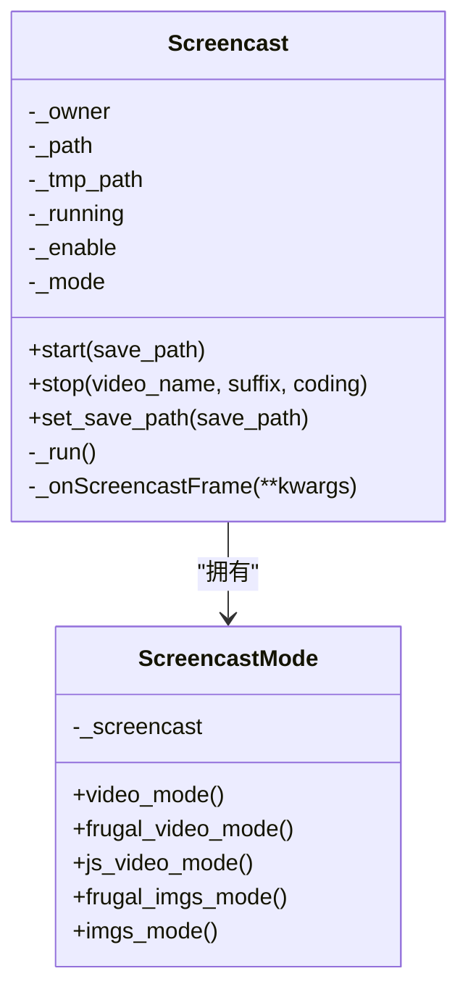
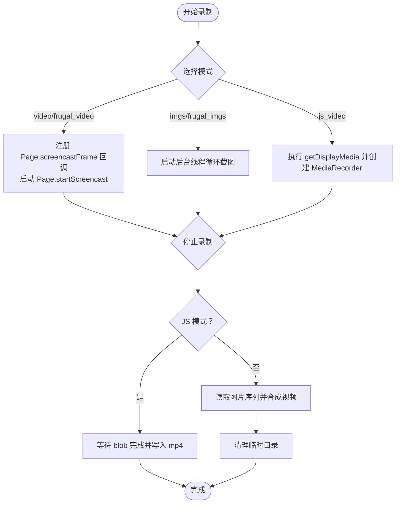
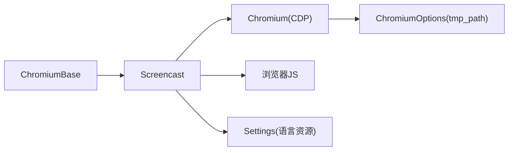

# 屏幕录制功能

<cite>
**本文引用的文件列表**
- [screencast.py](file://DrissionPage/_units/screencast.py)
- [screencast.pyi](file://DrissionPage/_units/screencast.pyi)
- [chromium_base.py](file://DrissionPage/_pages/chromium_base.py)
- [chromium_page.py](file://DrissionPage/_pages/chromium_page.py)
- [chromium_tab.py](file://DrissionPage/_pages/chromium_tab.py)
- [chromium.py](file://DrissionPage/_browsers/chromium.py)
- [chromium_options.py](file://DrissionPage/_configs/chromium_options.py)
- [settings.py](file://DrissionPage/_functions/settings.py)
</cite>

## 目录
1. [简介](#简介)
2. [项目结构](#项目结构)
3. [核心组件](#核心组件)
4. [架构总览](#架构总览)
5. [详细组件分析](#详细组件分析)
6. [依赖关系分析](#依赖关系分析)
7. [性能考量](#性能考量)
8. [故障排查指南](#故障排查指南)
9. [结论](#结论)
10. [附录](#附录)

## 简介
本章节系统性介绍 DrissionPage 的屏幕录制能力，重点围绕 Screencast 类的实现原理、使用方法与最佳实践展开。内容涵盖：
- 录制模式与参数：视频模式、节俭模式、JS 模式、图片模式及其适用场景
- 录制参数设置：保存路径、视频编码、帧率控制、临时目录等
- 性能优化与内存管理：线程化采集、按需写入、临时目录清理
- 使用示例：全屏录制、指定区域录制、录制指定时长、JS 模式录制音频
- 错误处理与异常：缺失依赖、路径限制、语言资源提示
- 与浏览器控制的集成：通过 CDP 事件与 JS API 协作完成录制

## 项目结构
DrissionPage 将屏幕录制能力封装在独立单元中，并通过页面对象暴露统一入口。关键文件与职责如下：
- Screencast 核心类：负责录制生命周期、模式切换、帧采集与合成
- 页面基类：提供 screencast 属性与截图能力（供非节俭模式使用）
- 浏览器与会话：提供 CDP 通道与回调注册，支撑节俭模式帧事件
- 配置模块：提供临时目录、下载路径等环境配置，影响录制中间产物存放

图表来源
- [chromium_base.py:252-256](file://DrissionPage/_pages/chromium_base.py#L252-L256)
- [screencast.py:20-31](file://DrissionPage/_units/screencast.py#L20-L31)
- [chromium.py:33-127](file://DrissionPage/_browsers/chromium.py#L33-L127)
- [chromium_options.py:40-47](file://DrissionPage/_configs/chromium_options.py#L40-L47)

章节来源
- [chromium_base.py:252-256](file://DrissionPage/_pages/chromium_base.py#L252-L256)
- [screencast.py:20-31](file://DrissionPage/_units/screencast.py#L20-L31)
- [chromium.py:33-127](file://DrissionPage/_browsers/chromium.py#L33-L127)
- [chromium_options.py:40-47](file://DrissionPage/_configs/chromium_options.py#L40-L47)

## 核心组件
- Screencast：录制控制器，负责启动/停止录制、设置保存路径、选择录制模式、处理帧数据与合成视频
- ScreencastMode：录制模式选择器，提供多种录制模式的便捷切换
- ChromiumBase：页面基类，提供 screencast 属性与截图能力；内部持有 Screencast 实例
- Chromium：浏览器实例，提供 CDP 通道与事件回调注册，支持节俭模式的 Page.screencastFrame 事件
- ChromiumOptions：配置对象，提供 tmp_path 等环境参数，影响录制中间产物的临时目录

章节来源
- [screencast.py:20-180](file://DrissionPage/_units/screencast.py#L20-L180)
- [screencast.pyi:14-92](file://DrissionPage/_units/screencast.pyi#L14-L92)
- [chromium_base.py:252-256](file://DrissionPage/_pages/chromium_base.py#L252-L256)
- [chromium.py:33-127](file://DrissionPage/_browsers/chromium.py#L33-L127)
- [chromium_options.py:40-47](file://DrissionPage/_configs/chromium_options.py#L40-L47)

## 架构总览
下图展示从页面对象到录制控制器、再到浏览器 CDP 的调用链路，以及不同录制模式下的执行分支。

图表来源
- [screencast.py:33-107](file://DrissionPage/_units/screencast.py#L33-L107)
- [screencast.py:147-159](file://DrissionPage/_units/screencast.py#L147-L159)
- [chromium_base.py:252-256](file://DrissionPage/_pages/chromium_base.py#L252-L256)

## 详细组件分析

### Screencast 类
- 职责
  - 统一录制入口：start/stop 生命周期管理
  - 模式选择：通过 set_mode 切换不同录制模式
  - 帧采集：节俭模式订阅 Page.screencastFrame，非节俭模式定时截图
  - 合成输出：将图片序列合成视频或返回图片目录
  - 临时目录：根据 ChromiumOptions.tmp_path 或系统临时目录创建中间目录
- 关键属性
  - _owner：所属页面对象（ChromiumBase）
  - _path：最终输出目录
  - _tmp_path：节俭模式/非节俭模式的临时目录
  - _mode：当前模式标识
  - _enable/_running：控制录制线程启停
- 关键方法
  - start：初始化保存路径，按模式启动录制
  - stop：停止录制，按模式处理输出（JS 模式直接写文件；节俭/非节俭模式合成视频）
  - set_save_path：设置输出目录
  - _run：非节俭模式的截图循环
  - _onScreencastFrame：节俭模式的帧回调，写入图片并确认帧

图表来源
- [screencast.py:20-180](file://DrissionPage/_units/screencast.py#L20-L180)
- [screencast.pyi:14-92](file://DrissionPage/_units/screencast.pyi#L14-L92)

章节来源
- [screencast.py:20-180](file://DrissionPage/_units/screencast.py#L20-L180)
- [screencast.pyi:14-92](file://DrissionPage/_units/screencast.pyi#L14-L92)

### 录制模式详解
- video_mode
  - 非节俭视频模式，持续截图并合成视频
  - 适合需要稳定帧率与可控编码的场景
- frugal_video_mode
  - 节俭视频模式，仅在页面变化时录制，减少磁盘占用
  - 通过 Page.screencastFrame 事件驱动，适合长时间录制
- js_video_mode
  - 使用浏览器 JS 的 MediaRecorder API 进行录制，可捕获音频
  - 需要用户手动选择录制目标，适合需要音视频一体化的场景
- frugal_imgs_mode
  - 节俭图片模式，仅在页面变化时截图，输出图片目录
  - 适合离线分析或自定义后处理
- imgs_mode
  - 非节俭图片模式，持续截图，输出图片目录
  - 适合高帧率抓取或离线分析

章节来源
- [screencast.py:166-179](file://DrissionPage/_units/screencast.py#L166-L179)
- [screencast.pyi:73-91](file://DrissionPage/_units/screencast.pyi#L73-L91)

### 录制参数与配置
- 保存路径
  - set_save_path：确保传入的是目录，不存在则创建
  - 若未设置，start 会抛出缺少参数错误
- 临时目录
  - ChromiumOptions.tmp_path 存在时优先使用，否则使用系统临时目录
  - 目录结构包含 Screencast 专属子目录，避免冲突
- 视频编码与帧率
  - stop 中的 coding 参数对应 OpenCV 的 VideoWriter_fourcc 编码
  - 帧率固定为 5fps（硬编码），如需更高帧率请参考节俭模式的 Page.screencastFrame 事件
- 输出文件名
  - 支持自定义文件名与后缀，默认使用 mp4
- JS 模式
  - 自动选择 VP9 或 WebM 编码，输出 mp4 文件

章节来源
- [screencast.py:33-87](file://DrissionPage/_units/screencast.py#L33-L87)
- [screencast.py:116-137](file://DrissionPage/_units/screencast.py#L116-L137)
- [chromium_options.py:40-47](file://DrissionPage/_configs/chromium_options.py#L40-L47)

### 录制流程与数据流
- 非节俭模式
  - 后台线程循环调用页面截图，间隔约 0.04 秒
  - 图片写入临时目录，stop 时读取并合成视频
- 节俭模式
  - 注册 Page.screencastFrame 回调，收到帧即写入图片
  - stop 时取消回调并停止 CDP 会话
- JS 模式
  - 通过浏览器 JS 创建 MediaRecorder，等待 blob 完成后写入文件

图表来源
- [screencast.py:33-107](file://DrissionPage/_units/screencast.py#L33-L107)
- [screencast.py:116-137](file://DrissionPage/_units/screencast.py#L116-L137)

## 依赖关系分析
- 页面到录制
  - ChromiumBase.screencast 属性返回 Screencast 实例
  - 非节俭模式依赖页面截图能力（ChromiumBase.get_screenshot）
- 浏览器到录制
  - 节俭模式依赖 Chromium._set_callback 与 Page.screencastFrame 事件
  - JS 模式依赖浏览器 JS API（getDisplayMedia/MediaRecorder）
- 配置到录制
  - ChromiumOptions.tmp_path 决定临时目录位置
  - settings 语言资源用于提示信息

图表来源
- [chromium_base.py:252-256](file://DrissionPage/_pages/chromium_base.py#L252-L256)
- [screencast.py:38-44](file://DrissionPage/_units/screencast.py#L38-L44)
- [chromium_options.py:40-47](file://DrissionPage/_configs/chromium_options.py#L40-L47)
- [settings.py:13-23](file://DrissionPage/_functions/settings.py#L13-L23)

章节来源
- [chromium_base.py:252-256](file://DrissionPage/_pages/chromium_base.py#L252-L256)
- [screencast.py:38-44](file://DrissionPage/_units/screencast.py#L38-L44)
- [chromium_options.py:40-47](file://DrissionPage/_configs/chromium_options.py#L40-L47)
- [settings.py:13-23](file://DrissionPage/_functions/settings.py#L13-L23)

## 性能考量
- 线程化采集
  - 非节俭模式采用后台线程循环截图，避免阻塞主线程
- 按需写入
  - 节俭模式仅在页面变化时写入帧，显著降低 I/O 压力
- 临时目录管理
  - 使用随机子目录隔离多轮录制，stop 后自动清理
- 帧率与编码
  - 合成阶段固定帧率为 5fps，编码由调用方指定（OpenCV VideoWriter_fourcc）
- 依赖库
  - 需要 opencv-python 与 numpy，否则在 stop 时抛出环境错误

章节来源
- [screencast.py:147-159](file://DrissionPage/_units/screencast.py#L147-L159)
- [screencast.py:116-137](file://DrissionPage/_units/screencast.py#L116-L137)

## 故障排查指南
- 缺少依赖库
  - 现象：stop 时抛出环境错误，提示安装 opencv-python 与 numpy
  - 处理：pip 安装所需库
- 保存路径非法
  - 现象：路径包含非 ASCII 字符时报错
  - 处理：确保输出目录为英文路径
- 未设置保存路径
  - 现象：start 抛出缺少参数错误
  - 处理：调用 set_save_path 或在 start 传入 save_path
- JS 模式未选择录制目标
  - 现象：提示选择录制目标后无响应
  - 处理：按浏览器弹窗选择屏幕/窗口/标签页
- 录制文件损坏或无法播放
  - 现象：合成后的视频无法播放
  - 排查：检查编码参数与 OpenCV 版本兼容性；尝试更换编码或使用其他工具重新封装

章节来源
- [screencast.py:116-121](file://DrissionPage/_units/screencast.py#L116-L121)
- [screencast.py:35-36](file://DrissionPage/_units/screencast.py#L35-L36)
- [screencast.py:78-81](file://DrissionPage/_units/screencast.py#L78-L81)
- [screencast.py:113-114](file://DrissionPage/_units/screencast.py#L113-L114)

## 结论
DrissionPage 的 Screencast 提供了灵活且高效的屏幕录制方案，覆盖节俭与非节俭两种采集策略，并支持 JS 模式以满足音视频一体化需求。通过合理的参数配置与临时目录管理，能够在保证稳定性的同时兼顾性能。建议在生产环境中结合业务场景选择合适模式，并注意依赖库与路径规范。

## 附录

### 使用示例（步骤说明）
以下为常见场景的使用步骤，便于快速上手。具体代码请参考源码路径定位相应方法。

- 全屏录制（视频模式）
  - 步骤
    - 获取页面对象的 screencast 属性
    - 选择 video_mode
    - 设置保存路径
    - 调用 start 开始录制
    - 在需要时调用 stop，生成 mp4 文件
  - 参考路径
    - [screencast.py:20-31](file://DrissionPage/_units/screencast.py#L20-L31)
    - [screencast.py:166-167](file://DrissionPage/_units/screencast.py#L166-L167)
    - [screencast.py:33-36](file://DrissionPage/_units/screencast.py#L33-L36)
    - [screencast.py:83-87](file://DrissionPage/_units/screencast.py#L83-L87)

- 指定区域录制（节俭图片模式）
  - 步骤
    - 选择 frugal_imgs_mode
    - 设置保存路径
    - 调用 start
    - 停止后返回图片目录路径
  - 参考路径
    - [screencast.py:175-176](file://DrissionPage/_units/screencast.py#L175-L176)
    - [screencast.py:109-111](file://DrissionPage/_units/screencast.py#L109-L111)

- 录制指定时长（非节俭图片模式）
  - 步骤
    - 选择 imgs_mode
    - 设置保存路径
    - 启动录制后等待指定时间
    - 调用 stop 合成视频（或直接使用图片目录）
  - 参考路径
    - [screencast.py:178-179](file://DrissionPage/_units/screencast.py#L178-L179)
    - [screencast.py:116-137](file://DrissionPage/_units/screencast.py#L116-L137)

- JS 模式录制（含音频）
  - 步骤
    - 选择 js_video_mode
    - 设置保存路径
    - 调用 start，按提示选择录制目标
    - 调用 stop，生成 mp4 文件
  - 参考路径
    - [screencast.py:172-173](file://DrissionPage/_units/screencast.py#L172-L173)
    - [screencast.py:78-81](file://DrissionPage/_units/screencast.py#L78-L81)
    - [screencast.py:89-99](file://DrissionPage/_units/screencast.py#L89-L99)

### 与浏览器控制的集成要点
- 节俭模式
  - 通过 Chromium._set_callback 注册 Page.screencastFrame 事件
  - 通过 Page.startScreencast/stopScreencast 控制录制开关
- 非节俭模式
  - 通过后台线程调用页面截图接口，按需写入
- JS 模式
  - 通过页面 JS 执行 getDisplayMedia 与 MediaRecorder，等待 blob 完成后再写入

章节来源
- [chromium_base.py:252-256](file://DrissionPage/_pages/chromium_base.py#L252-L256)
- [screencast.py:46-53](file://DrissionPage/_units/screencast.py#L46-L53)
- [screencast.py:101-107](file://DrissionPage/_units/screencast.py#L101-L107)
- [screencast.py:56-81](file://DrissionPage/_units/screencast.py#L56-L81)