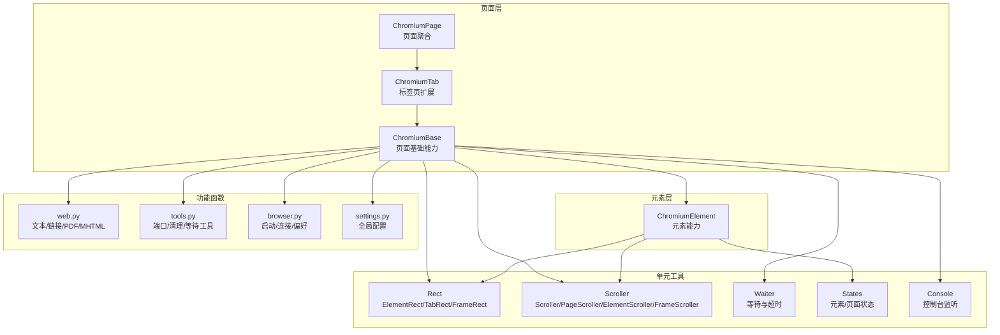
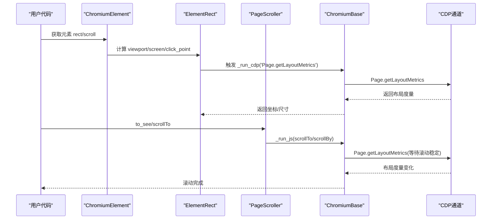
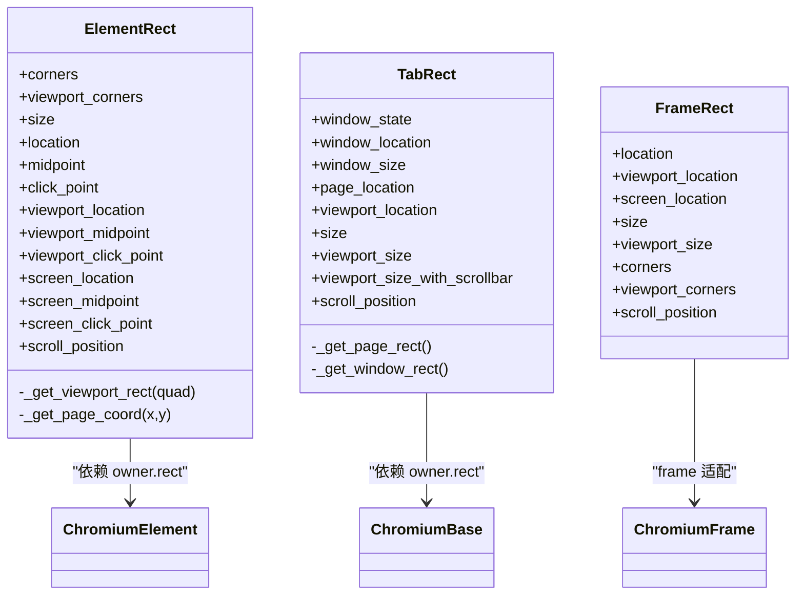
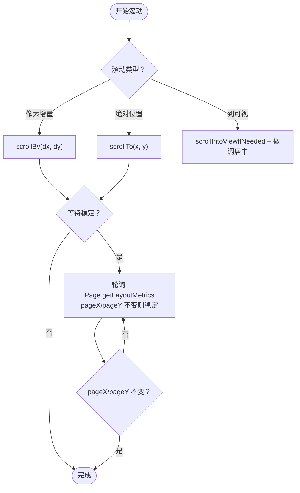
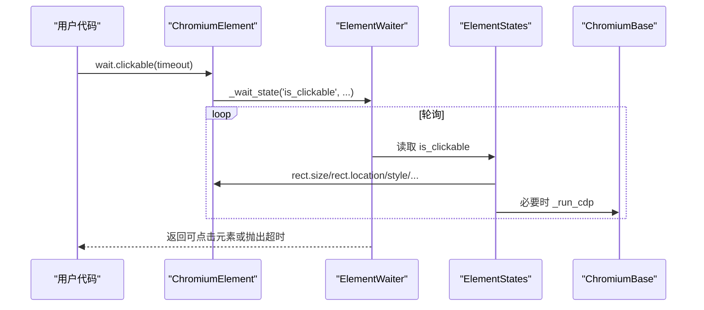
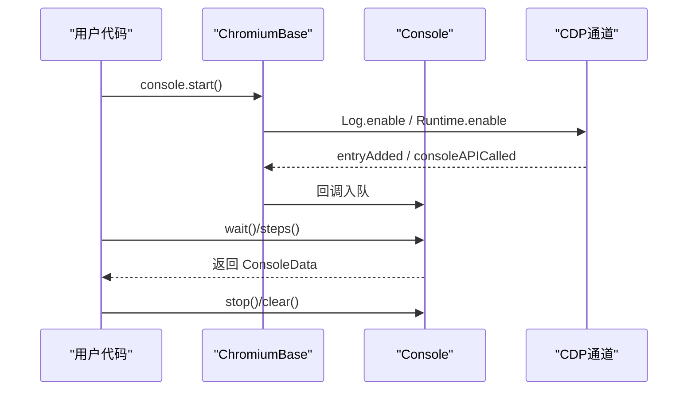
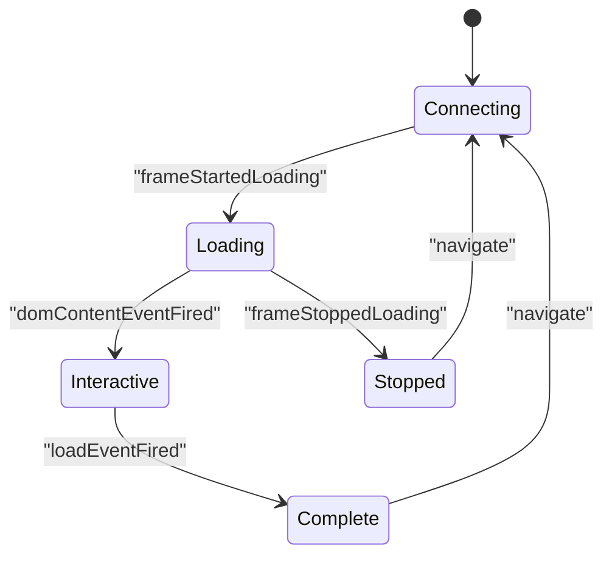
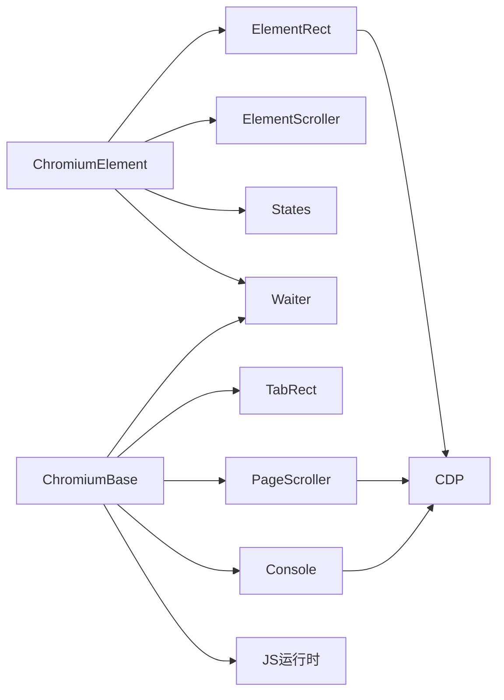

# 性能监控与调试

<cite>
**本文引用的文件**
- [rect.py](file://DrissionPage/_units/rect.py)
- [scroller.py](file://DrissionPage/_units/scroller.py)
- [web.py](file://DrissionPage/_functions/web.py)
- [chromium_element.py](file://DrissionPage/_elements/chromium_element.py)
- [chromium_base.py](file://DrissionPage/_pages/chromium_base.py)
- [chromium_tab.py](file://DrissionPage/_pages/chromium_tab.py)
- [chromium_page.py](file://DrissionPage/_pages/chromium_page.py)
- [waiter.py](file://DrissionPage/_units/waiter.py)
- [states.py](file://DrissionPage/_units/states.py)
- [console.py](file://DrissionPage/_units/console.py)
- [tools.py](file://DrissionPage/_functions/tools.py)
- [browser.py](file://DrissionPage/_functions/browser.py)
- [settings.py](file://DrissionPage/_functions/settings.py)
</cite>

## 目录
1. [简介](#简介)
2. [项目结构](#项目结构)
3. [核心组件](#核心组件)
4. [架构总览](#架构总览)
5. [详细组件分析](#详细组件分析)
6. [依赖分析](#依赖分析)
7. [性能考量](#性能考量)
8. [故障排查指南](#故障排查指南)
9. [结论](#结论)
10. [附录](#附录)

## 简介
本章节聚焦 DrissionPage 的性能监控与调试能力，围绕以下主题展开：
- 页面元素位置与尺寸获取：Rect 类族（ElementRect、TabRect、FrameRect）的使用与坐标体系。
- 滚动控制与优化：Scroller 体系（Scroller、ElementScroller、PageScroller、FrameScroller）的自动滚动、精准滚动、滚动到可视区域等策略。
- 性能指标采集与分析：页面加载阶段、元素渲染状态、等待与超时控制、CDP 计时点等。
- 调试工具：开发者控制台监听、日志输出、错误追踪与异常映射。
- 最佳实践与常见问题：等待策略、滚动策略、坐标换算、跨域与设备像素比处理。

## 项目结构
DrissionPage 将“页面”“元素”“滚动”“等待/状态”“调试”等能力模块化组织，核心路径如下：
- 页面层：ChromiumBase、ChromiumTab、ChromiumPage 提供页面生命周期、导航、截图、缓存清理、CDP/JS 执行等。
- 元素层：ChromiumElement 提供元素属性、文本、样式、属性、运行 JS、滚动到可视、截图等。
- 单元工具：rect（元素/页面坐标）、scroller（滚动）、waiter（等待）、states（状态）、console（控制台）、screencast（录屏）等。
- 功能函数：web（文本提取、链接补全、保存 PDF/MHTML）、tools（端口管理、错误映射）、browser（启动/连接）、settings（全局配置）。

图表来源
- [chromium_base.py:39-304](file://DrissionPage/_pages/chromium_base.py#L39-L304)
- [chromium_tab.py:22-75](file://DrissionPage/_pages/chromium_tab.py#L22-L75)
- [chromium_page.py:17-103](file://DrissionPage/_pages/chromium_page.py#L17-L103)
- [chromium_element.py:38-174](file://DrissionPage/_elements/chromium_element.py#L38-L174)
- [rect.py:10-217](file://DrissionPage/_units/rect.py#L10-L217)
- [scroller.py:11-142](file://DrissionPage/_units/scroller.py#L11-L142)
- [waiter.py:15-433](file://DrissionPage/_units/waiter.py#L15-L433)
- [states.py:12-182](file://DrissionPage/_units/states.py#L12-L182)
- [console.py:14-99](file://DrissionPage/_units/console.py#L14-L99)
- [web.py:110-135](file://DrissionPage/_functions/web.py#L110-L135)
- [tools.py:21-213](file://DrissionPage/_functions/tools.py#L21-L213)
- [browser.py:24-87](file://DrissionPage/_functions/browser.py#L24-L87)
- [settings.py:13-69](file://DrissionPage/_functions/settings.py#L13-L69)

章节来源
- [chromium_base.py:39-304](file://DrissionPage/_pages/chromium_base.py#L39-L304)
- [chromium_tab.py:22-75](file://DrissionPage/_pages/chromium_tab.py#L22-L75)
- [chromium_page.py:17-103](file://DrissionPage/_pages/chromium_page.py#L17-L103)
- [chromium_element.py:38-174](file://DrissionPage/_elements/chromium_element.py#L38-L174)

## 核心组件
- 坐标与尺寸（Rect）
  - ElementRect：提供元素边界盒、视口坐标、屏幕坐标、点击点、滚动位置等；支持跨域与设备像素比换算。
  - TabRect：提供窗口状态、窗口位置/大小、页面位置、视口位置/大小、滚动位置等。
  - FrameRect：针对异域 iframe 的坐标适配。
- 滚动（Scroller）
  - Scroller：通用滚动基类，支持上/下/左/右滚动、跳转到顶部/底部/最右/最左、指定坐标滚动。
  - PageScroller：基于 window/document 的滚动，支持滚动到可视区域（含居中）。
  - ElementScroller：委托 PageScroller 实现元素滚动到可视。
  - FrameScroller：frame 内部滚动适配。
- 等待与状态（Waiter/States）
  - Waiter：统一的等待接口，覆盖元素可见/隐藏/可点击、文档加载、URL/标题变化、下载/上传等。
  - States：元素状态（显示/启用/可点击/有矩形/被遮挡等），页面状态（加载中/存活/就绪等）。
- 调试（Console）
  - Console：启用/禁用 Log/Runtime 回调，捕获 consoleAPICalled 与 entryAdded 日志，支持阻塞/非阻塞等待与迭代消费。
- 页面与元素能力（ChromiumBase/ChromiumElement）
  - ChromiumBase：CDP/JS 执行、事件回调、截图、会话存储、缓存清理、导航、历史前进后退、停止加载等。
  - ChromiumElement：元素属性/文本/样式/属性、运行 JS、输入/清空、拖拽、滚动到可视、截图等。

章节来源
- [rect.py:10-217](file://DrissionPage/_units/rect.py#L10-L217)
- [scroller.py:11-142](file://DrissionPage/_units/scroller.py#L11-L142)
- [waiter.py:15-433](file://DrissionPage/_units/waiter.py#L15-L433)
- [states.py:12-182](file://DrissionPage/_units/states.py#L12-L182)
- [console.py:14-99](file://DrissionPage/_units/console.py#L14-L99)
- [chromium_base.py:39-304](file://DrissionPage/_pages/chromium_base.py#L39-L304)
- [chromium_element.py:38-174](file://DrissionPage/_elements/chromium_element.py#L38-L174)

## 架构总览
DrissionPage 的性能监控与调试通过“事件驱动 + CDP + JS”的方式实现：
- 事件驱动：页面生命周期事件（加载、导航、停止加载）触发状态更新与等待逻辑。
- CDP：获取布局度量、滚动位置、文档根节点、资源内容、截图等。
- JS：运行脚本判断元素状态、计算坐标、滚动到可视区域、处理 alert 等。
- 工具链：等待器统一超时与重试、控制台捕获前端日志、端口管理与浏览器连接。

图表来源
- [chromium_element.py:138-161](file://DrissionPage/_elements/chromium_element.py#L138-L161)
- [rect.py:99-106](file://DrissionPage/_units/rect.py#L99-L106)
- [scroller.py:102-127](file://DrissionPage/_units/scroller.py#L102-L127)
- [chromium_base.py:376-398](file://DrissionPage/_pages/chromium_base.py#L376-L398)

## 详细组件分析

### 坐标与尺寸（Rect）详解
- ElementRect
  - 视口坐标：通过 DOM.getBoxModel 获取 border/padding/corners。
  - 页面坐标：结合 visualViewport 的 pageX/pageY 偏移。
  - 屏幕坐标：考虑 devicePixelRatio，并处理跨域场景下的偏移叠加。
  - 点击点：基于 padding 区域微调，确保点击命中。
  - 滚动位置：读取 scrollLeft/scrollTop。
- TabRect
  - 窗口状态/位置/大小：根据 Browser.getWindowForTarget 与 windowState 判断最大化/全屏。
  - 页面位置/视口位置：结合 layoutViewport 与 visualViewport 计算。
  - 视口尺寸：支持带滚动条与不带滚动条两种测量。
  - 滚动位置：visualViewport 的 pageX/pageY。
- FrameRect
  - 针对异域 iframe 的 body/scrollWidth/scrollHeight 与元素 rect 的映射。

图表来源
- [rect.py:10-217](file://DrissionPage/_units/rect.py#L10-L217)
- [chromium_element.py:138-142](file://DrissionPage/_elements/chromium_element.py#L138-L142)
- [chromium_base.py:284-289](file://DrissionPage/_pages/chromium_base.py#L284-L289)

章节来源
- [rect.py:10-217](file://DrissionPage/_units/rect.py#L10-L217)
- [chromium_element.py:138-161](file://DrissionPage/_elements/chromium_element.py#L138-L161)
- [chromium_base.py:284-289](file://DrissionPage/_pages/chromium_base.py#L284-L289)

### 滚动控制与优化策略
- Scroller
  - 支持像素增量滚动（up/down/left/right）与绝对滚动（to_top/to_bottom/to_location）。
  - 可选等待滚动稳定：通过周期性查询 Page.getLayoutMetrics 的 pageX/pageY 判定稳定。
- PageScroller
  - 使用 window/document 对象滚动，支持 to_see（滚动到可视区域，必要时微调居中）。
- ElementScroller
  - 将元素滚动到可视委托给 PageScroller。
- FrameScroller
  - 针对 frame 内部滚动，使用 this.documentElement。

图表来源
- [scroller.py:19-90](file://DrissionPage/_units/scroller.py#L19-L90)
- [scroller.py:108-127](file://DrissionPage/_units/scroller.py#L108-L127)

章节来源
- [scroller.py:11-142](file://DrissionPage/_units/scroller.py#L11-L142)
- [chromium_element.py:157-161](file://DrissionPage/_elements/chromium_element.py#L157-L161)

### 等待与状态（性能观测的关键）
- Waiter
  - 页面加载：load_start/doc_loaded/load_stop。
  - 元素状态：displayed/hidden/clickable/covered/has_rect/stop_moving。
  - URL/标题变化：url_change/title_change。
  - 下载/上传：download_begin/downloads_done/upload_paths_inputted。
- States
  - 元素：is_displayed/is_enabled/is_clickable/has_rect/is_covered/is_in_viewport。
  - 页面：is_loading/is_alive/ready_state/has_alert。
  - 框架：is_loading/is_alive/ready_state/is_displayed/has_alert。

图表来源
- [waiter.py:289-408](file://DrissionPage/_units/waiter.py#L289-L408)
- [states.py:12-73](file://DrissionPage/_units/states.py#L12-L73)
- [chromium_element.py:138-161](file://DrissionPage/_elements/chromium_element.py#L138-L161)

章节来源
- [waiter.py:15-433](file://DrissionPage/_units/waiter.py#L15-L433)
- [states.py:12-182](file://DrissionPage/_units/states.py#L12-L182)

### 调试工具：控制台与日志
- Console
  - 启用 Log/Runtime 事件回调，捕获 consoleAPICalled 与 entryAdded。
  - 支持阻塞等待单条消息、非阻塞等待、迭代消费。
  - 提供 messages/clear/wait/steps 等接口。
- 日志与错误映射
  - tools.raise_error：将 CDP 错误映射为具体异常类型（如 NoRectError、PageDisconnectedError、JavaScriptError 等）。
  - settings.Settings：全局开关（如 raise_when_wait_failed、cdp_timeout、browser_connect_timeout）。

图表来源
- [console.py:30-86](file://DrissionPage/_units/console.py#L30-L86)
- [chromium_base.py:114-118](file://DrissionPage/_pages/chromium_base.py#L114-L118)

章节来源
- [console.py:14-99](file://DrissionPage/_units/console.py#L14-L99)
- [tools.py:157-197](file://DrissionPage/_functions/tools.py#L157-L197)
- [settings.py:13-69](file://DrissionPage/_functions/settings.py#L13-L69)

### 页面加载与导航（性能观测入口）
- ChromiumBase 生命周期事件
  - frameStartedLoading/frameNavigated/domContentEventFired/loadEventFired/frameStoppedLoading。
  - 控制 ready_state（connecting/loading/interactive/complete）与 _is_loading。
- 导航与历史
  - get/refresh/forward/back/navigateToHistoryEntry。
- 截图与缓存
  - 截图、清除缓存（cache/session/local/cookies）。

图表来源
- [chromium_base.py:168-206](file://DrissionPage/_pages/chromium_base.py#L168-L206)

章节来源
- [chromium_base.py:168-206](file://DrissionPage/_pages/chromium_base.py#L168-L206)

## 依赖分析
- 组件耦合
  - ChromiumElement 依赖 ElementRect、ElementScroller、States、Waiter。
  - ChromiumBase 依赖 TabRect、PageScroller、Console、Waiter、States。
  - Rect 依赖 CDP（DOM.getBoxModel、Page.getLayoutMetrics）与 JS（devicePixelRatio）。
  - Scroller 依赖 CDP（Page.getLayoutMetrics）与 JS（scrollTo/scrollBy）。
- 外部依赖
  - CDP（Chrome DevTools Protocol）：布局、文档、网络、存储、截图等。
  - JS：document/window 操作、readyState、activeElement、storage 等。
  - 平台库：win32gui/win32con（Windows 隐藏/显示浏览器窗口）。

图表来源
- [chromium_element.py:138-161](file://DrissionPage/_elements/chromium_element.py#L138-L161)
- [chromium_base.py:277-295](file://DrissionPage/_pages/chromium_base.py#L277-L295)
- [rect.py:99-106](file://DrissionPage/_units/rect.py#L99-L106)
- [scroller.py:69-90](file://DrissionPage/_units/scroller.py#L69-L90)
- [console.py:30-46](file://DrissionPage/_units/console.py#L30-L46)

章节来源
- [chromium_element.py:138-161](file://DrissionPage/_elements/chromium_element.py#L138-L161)
- [chromium_base.py:277-295](file://DrissionPage/_pages/chromium_base.py#L277-L295)

## 性能考量
- 坐标计算
  - 跨域 iframe：屏幕坐标需叠加父窗口偏移与 devicePixelRatio。
  - 视口与页面坐标：依赖 visualViewport 与 DOM.getBoxModel，避免 DOM 查询开销。
- 滚动稳定性
  - 使用 Page.getLayoutMetrics 轮询判定滚动稳定，合理设置等待时间与间隔。
  - to_see 中的微调居中仅在必要时进行，减少不必要的滚动。
- 等待策略
  - 使用 waiter 的 stop_moving/has_rect/clickable 等组合，避免盲目 sleep。
  - 设置合理的 timeout（Settings.cdp_timeout/browser_connect_timeout）。
- 资源与截图
  - 清理缓存与存储可降低后续加载时间。
  - 截图按需裁剪（left_top/right_bottom）减少 I/O。

[本节为通用指导，无需特定文件引用]

## 故障排查指南
- 常见异常映射
  - NoRectError：元素无布局或布局不可用。
  - PageDisconnectedError：CDP 会话断开。
  - JavaScriptError：JS 执行异常。
  - TimeoutError：CDP/导航/等待超时。
- 定位步骤
  - 启用 Console 并观察 entryAdded/consoleAPICalled。
  - 使用 waiter 的 url_change/title_change/doc_loaded 等确认页面状态。
  - 检查 Settings.raise_when_wait_failed 与 raise_when_click_failed。
  - 使用 tools.wait_until 或自定义轮询验证状态。

章节来源
- [tools.py:157-197](file://DrissionPage/_functions/tools.py#L157-L197)
- [console.py:51-80](file://DrissionPage/_units/console.py#L51-L80)
- [waiter.py:164-234](file://DrissionPage/_units/waiter.py#L164-L234)
- [settings.py:13-69](file://DrissionPage/_functions/settings.py#L13-L69)

## 结论
DrissionPage 在性能监控与调试方面提供了完善的基础设施：
- 以 Rect 为核心的坐标体系，覆盖视口/页面/屏幕多维坐标与跨域处理。
- 以 Scroller 为核心的滚动体系，支持精准滚动与滚动到可视区域，并具备滚动稳定检测。
- 以 Waiter/States 为核心的等待与状态判断，便于构建稳健的性能观测流程。
- 以 Console 为核心的前端日志捕获，配合错误映射与超时控制，提升问题定位效率。
建议在实际使用中结合业务场景选择合适的等待与滚动策略，并利用 Console 与状态检查进行持续监控。

[本节为总结，无需特定文件引用]

## 附录
- 保存页面为 PDF/MHTML：web.get_pdf/get_mhtml/save_page。
- 浏览器连接与启动：browser.connect_browser/_run_browser/test_connect。
- 端口管理与资源清理：tools.PortFinder/tools.ensure_del_dir。
- 全局配置：settings.Settings（超时、语言、单例对象等）。

章节来源
- [web.py:198-254](file://DrissionPage/_functions/web.py#L198-L254)
- [browser.py:24-87](file://DrissionPage/_functions/browser.py#L24-L87)
- [tools.py:21-213](file://DrissionPage/_functions/tools.py#L21-L213)
- [settings.py:13-69](file://DrissionPage/_functions/settings.py#L13-L69)