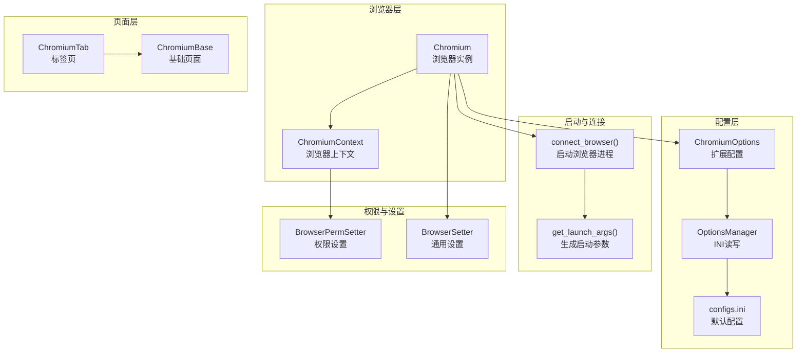
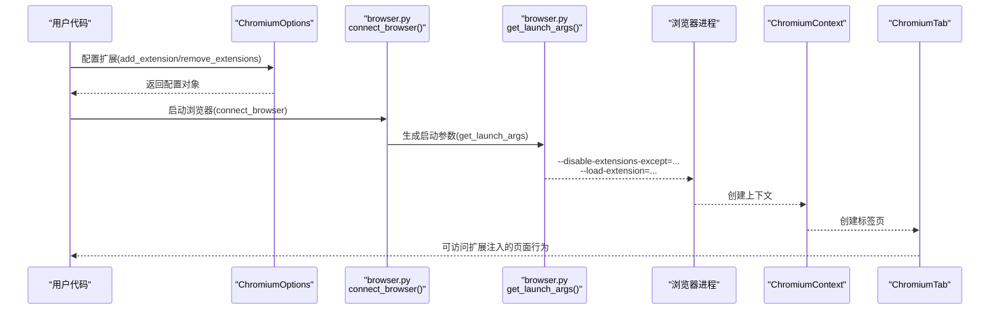
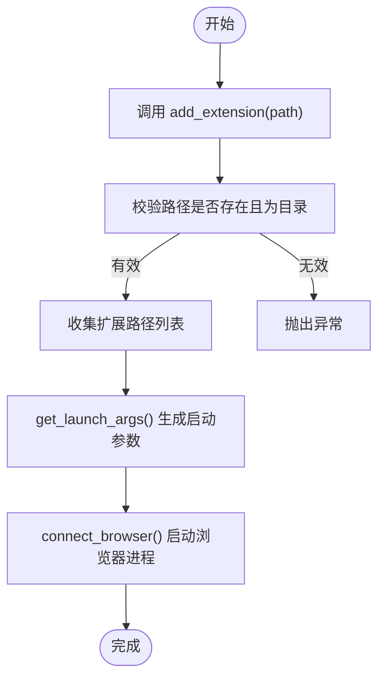
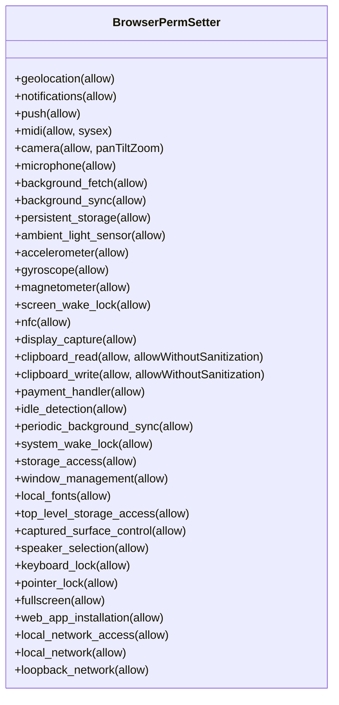
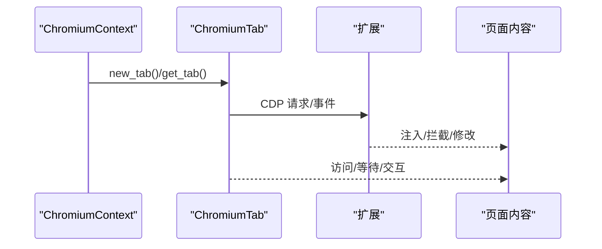
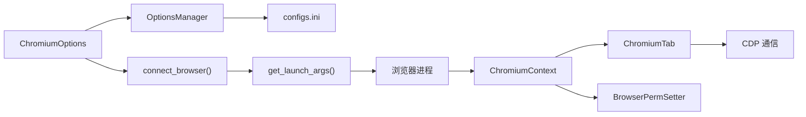

# 浏览器扩展支持

<cite>
**本文档引用的文件**
- [chromium.py](file://DrissionPage/_browsers/chromium.py)
- [chromium_context.py](file://DrissionPage/_browsers/chromium_context.py)
- [chromium_options.py](file://DrissionPage/_configs/chromium_options.py)
- [browser.py](file://DrissionPage/_functions/browser.py)
- [options_manage.py](file://DrissionPage/_configs/options_manage.py)
- [configs.ini](file://DrissionPage/_configs/configs.ini)
- [perm_setter.py](file://DrissionPage/_units/perm_setter.py)
- [setter.py](file://DrissionPage/_units/setter.py)
- [chromium_tab.py](file://DrissionPage/_pages/chromium_tab.py)
- [chromium_base.py](file://DrissionPage/_pages/chromium_base.py)
- [base.py](file://DrissionPage/_base/base.py)
</cite>

## 目录
1. [简介](#简介)
2. [项目结构](#项目结构)
3. [核心组件](#核心组件)
4. [架构总览](#架构总览)
5. [详细组件分析](#详细组件分析)
6. [依赖关系分析](#依赖关系分析)
7. [性能考虑](#性能考虑)
8. [故障排除指南](#故障排除指南)
9. [结论](#结论)
10. [附录](#附录)

## 简介
本章节概述 DrissionPage 对浏览器扩展（Chrome Extension）的支持能力与使用方法。文档重点涵盖：
- 如何加载和管理 Chrome 扩展（安装、启用、禁用）
- 扩展的配置选项与参数设置（扩展路径、启动参数、权限配置）
- 完整使用示例（内置扩展、自定义扩展、扩展间通信）
- 扩展对页面行为的影响与限制
- 扩展调试与故障排除方法
- 与 DrissionPage 核心功能的集成方式与注意事项

## 项目结构
围绕扩展支持的相关模块主要分布在以下目录：
- 浏览器与上下文：_browsers
- 配置与选项：_configs
- 功能函数：_functions
- 单元与设置器：_units
- 页面层：_pages
- 基础通信：_base

图表来源
- [chromium.py:33-120](file://DrissionPage/_browsers/chromium.py#L33-L120)
- [chromium_context.py:7-62](file://DrissionPage/_browsers/chromium_context.py#L7-L62)
- [chromium_options.py:16-85](file://DrissionPage/_configs/chromium_options.py#L16-L85)
- [options_manage.py:15-78](file://DrissionPage/_configs/options_manage.py#L15-L78)
- [configs.ini:5-17](file://DrissionPage/_configs/configs.ini#L5-L17)
- [browser.py:24-87](file://DrissionPage/_functions/browser.py#L24-L87)
- [browser.py:90-119](file://DrissionPage/_functions/browser.py#L90-L119)
- [perm_setter.py:2-311](file://DrissionPage/_units/perm_setter.py#L2-L311)
- [setter.py:106-124](file://DrissionPage/_units/setter.py#L106-L124)
- [chromium_tab.py:22-75](file://DrissionPage/_pages/chromium_tab.py#L22-L75)
- [chromium_base.py](file://DrissionPage/_pages/chromium_base.py)
- [base.py:385-415](file://DrissionPage/_base/base.py#L385-L415)

章节来源
- [chromium.py:33-120](file://DrissionPage/_browsers/chromium.py#L33-L120)
- [chromium_options.py:16-85](file://DrissionPage/_configs/chromium_options.py#L16-L85)
- [browser.py:24-87](file://DrissionPage/_functions/browser.py#L24-L87)

## 核心组件
- ChromiumOptions：扩展配置入口，支持添加扩展、设置扩展参数、偏好与标志位。
- connect_browser/get_launch_args：负责启动浏览器进程，并将扩展参数注入到启动命令行。
- Chromium/ChromiumContext：浏览器与上下文对象，承载扩展生命周期与会话管理。
- BrowserPermSetter：扩展权限控制（如通知、地理位置、剪贴板等）。
- ChromiumTab/ChromiumBase：页面层，通过 CDP 与扩展交互，处理扩展带来的页面行为变化。

章节来源
- [chromium_options.py:203-210](file://DrissionPage/_configs/chromium_options.py#L203-L210)
- [browser.py:90-119](file://DrissionPage/_functions/browser.py#L90-L119)
- [chromium.py:33-120](file://DrissionPage/_browsers/chromium.py#L33-L120)
- [perm_setter.py:2-311](file://DrissionPage/_units/perm_setter.py#L2-L311)
- [chromium_tab.py:22-75](file://DrissionPage/_pages/chromium_tab.py#L22-L75)

## 架构总览
DrissionPage 通过 ChromiumOptions 将扩展配置注入启动参数，再由 connect_browser/get_launch_args 生成实际启动命令行，最终由浏览器进程加载扩展。扩展运行期间，Chromium/ChromiumContext 通过 CDP 与扩展交互，BrowserPermSetter 提供权限控制，ChromiumTab/ChromiumBase 提供页面访问与扩展行为监控。

图表来源
- [chromium_options.py:203-210](file://DrissionPage/_configs/chromium_options.py#L203-L210)
- [browser.py:24-87](file://DrissionPage/_functions/browser.py#L24-L87)
- [browser.py:90-119](file://DrissionPage/_functions/browser.py#L90-L119)
- [chromium.py:33-120](file://DrissionPage/_browsers/chromium.py#L33-L120)
- [chromium_tab.py:22-75](file://DrissionPage/_pages/chromium_tab.py#L22-L75)

## 详细组件分析

### 组件一：扩展配置与加载（ChromiumOptions + browser.py）
- 扩展路径与加载
  - add_extension(path)：添加扩展目录路径，内部会校验路径有效性并转换为绝对路径。
  - get_launch_args()：将扩展路径拼接为 --disable-extensions-except=... 和 --load-extension=... 参数，注入启动命令行。
- 扩展配置持久化
  - OptionsManager/Configs.ini：INI 文件中包含 extensions 列表，可作为默认配置或保存/加载配置。
- 用户数据与偏好
  - set_prefs()/set_flags()：在用户数据目录下写入 Preferences 与 Local State，影响扩展运行环境。

图表来源
- [chromium_options.py:203-210](file://DrissionPage/_configs/chromium_options.py#L203-L210)
- [browser.py:90-119](file://DrissionPage/_functions/browser.py#L90-L119)
- [browser.py:122-158](file://DrissionPage/_functions/browser.py#L122-L158)
- [browser.py:160-189](file://DrissionPage/_functions/browser.py#L160-L189)

章节来源
- [chromium_options.py:203-210](file://DrissionPage/_configs/chromium_options.py#L203-L210)
- [browser.py:90-119](file://DrissionPage/_functions/browser.py#L90-L119)
- [browser.py:122-158](file://DrissionPage/_functions/browser.py#L122-L158)
- [browser.py:160-189](file://DrissionPage/_functions/browser.py#L160-L189)
- [options_manage.py:48-59](file://DrissionPage/_configs/options_manage.py#L48-L59)
- [configs.ini:9](file://DrissionPage/_configs/configs.ini#L9)

### 组件二：扩展权限控制（BrowserPermSetter）
- 权限类型覆盖
  - 支持 geolocation、notifications、push、midi、camera、microphone、background_*、persistent-storage、ambient-light-sensor、accelerometer、gyroscope、magnetometer、screen-wake-lock、nfc、display-capture、clipboard-read/write、payment-handler、idle-detection、periodic-background-sync、system-wake-lock、storage-access、window-management、local-fonts、top-level-storage-access、captured-surface-control、speaker-selection、keyboard-lock、pointer-lock、fullscreen、web-app-installation、local-network-access、local-network、loopback-network 等。
- 上下文隔离
  - 在非默认上下文（Incognito 或新建上下文）中，权限设置会附加 browserContextId，确保权限作用域限定。

图表来源
- [perm_setter.py:2-311](file://DrissionPage/_units/perm_setter.py#L2-L311)

章节来源
- [perm_setter.py:2-311](file://DrissionPage/_units/perm_setter.py#L2-L311)
- [setter.py:106-124](file://DrissionPage/_units/setter.py#L106-L124)

### 组件三：扩展生命周期与页面交互（Chromium/ChromiumContext/ChromiumTab）
- 生命周期
  - ChromiumContext.new_tab()/get_tab()：在指定上下文中创建或获取标签页，扩展在该上下文中生效。
  - ChromiumContext.close()：销毁上下文时，扩展随之失效。
- 页面交互
  - ChromiumTab 通过 CDP 与扩展交互，扩展可能改变页面行为（如拦截请求、注入脚本、修改 UA 等），ChromiumBase/ChromiumTab 提供统一的页面访问接口。

图表来源
- [chromium_context.py:44-58](file://DrissionPage/_browsers/chromium_context.py#L44-L58)
- [chromium_tab.py:22-75](file://DrissionPage/_pages/chromium_tab.py#L22-L75)
- [chromium_base.py](file://DrissionPage/_pages/chromium_base.py)
- [base.py:385-415](file://DrissionPage/_base/base.py#L385-L415)

章节来源
- [chromium_context.py:44-58](file://DrissionPage/_browsers/chromium_context.py#L44-L58)
- [chromium_tab.py:22-75](file://DrissionPage/_pages/chromium_tab.py#L22-L75)
- [base.py:385-415](file://DrissionPage/_base/base.py#L385-L415)

### 组件四：扩展配置参数与限制
- 扩展路径必须为目录（文件会被拒绝），否则抛出异常。
- 扩展加载通过启动参数 --disable-extensions-except=... 与 --load-extension=... 实现。
- 扩展偏好与 Flags 通过用户数据目录下的 Preferences 与 Local State 写入，影响扩展运行环境。
- 扩展对页面行为的影响取决于扩展本身，DrissionPage 通过 CDP 监听与控制扩展行为。

章节来源
- [browser.py:104-118](file://DrissionPage/_functions/browser.py#L104-L118)
- [browser.py:122-158](file://DrissionPage/_functions/browser.py#L122-L158)
- [browser.py:160-189](file://DrissionPage/_functions/browser.py#L160-L189)
- [chromium_options.py:46-47](file://DrissionPage/_configs/chromium_options.py#L46-L47)

## 依赖关系分析
- ChromiumOptions 依赖 OptionsManager/Configs.ini 提供默认配置与保存/加载能力。
- connect_browser/get_launch_args 依赖 ChromiumOptions 的扩展配置生成启动参数。
- Chromium/ChromiumContext 依赖 CDP 与浏览器进程交互，管理扩展上下文。
- BrowserPermSetter 依赖 Chromium/ChromiumContext 的 CDP 接口进行权限设置。
- ChromiumTab/ChromiumBase 依赖 CDP 与扩展交互，处理扩展带来的页面行为变化。

图表来源
- [chromium_options.py:16-85](file://DrissionPage/_configs/chromium_options.py#L16-L85)
- [options_manage.py:15-78](file://DrissionPage/_configs/options_manage.py#L15-L78)
- [configs.ini:5-17](file://DrissionPage/_configs/configs.ini#L5-L17)
- [browser.py:24-87](file://DrissionPage/_functions/browser.py#L24-L87)
- [browser.py:90-119](file://DrissionPage/_functions/browser.py#L90-L119)
- [chromium.py:33-120](file://DrissionPage/_browsers/chromium.py#L33-L120)
- [perm_setter.py:2-311](file://DrissionPage/_units/perm_setter.py#L2-L311)
- [chromium_tab.py:22-75](file://DrissionPage/_pages/chromium_tab.py#L22-L75)

章节来源
- [chromium_options.py:16-85](file://DrissionPage/_configs/chromium_options.py#L16-L85)
- [browser.py:24-87](file://DrissionPage/_functions/browser.py#L24-L87)
- [browser.py:90-119](file://DrissionPage/_functions/browser.py#L90-L119)
- [chromium.py:33-120](file://DrissionPage/_browsers/chromium.py#L33-L120)
- [perm_setter.py:2-311](file://DrissionPage/_units/perm_setter.py#L2-L311)
- [chromium_tab.py:22-75](file://DrissionPage/_pages/chromium_tab.py#L22-L75)

## 性能考虑
- 扩展数量与复杂度会影响启动时间与内存占用，建议仅加载必要的扩展。
- 使用用户数据目录复用（system_user_path）可减少重复初始化成本，但需注意扩展状态与偏好。
- 权限设置与网络拦截（如 blocked_urls）会增加 CDP 通信开销，按需启用。

## 故障排除指南
- 扩展路径错误
  - 现象：抛出“扩展需要是目录”或“扩展未找到”异常。
  - 处理：确认扩展路径为有效目录，且存在于磁盘上。
- 权限问题
  - 现象：扩展无法访问特定资源（如摄像头、剪贴板）。
  - 处理：使用 BrowserPermSetter 显式授权对应权限。
- 页面行为异常
  - 现象：扩展导致页面加载缓慢或行为异常。
  - 处理：检查扩展是否拦截了关键请求，必要时在非默认上下文中运行以隔离影响。
- 启动失败
  - 现象：connect_browser 无法连接到浏览器。
  - 处理：检查端口占用、浏览器路径与启动参数，确保浏览器版本兼容。

章节来源
- [browser.py:108-117](file://DrissionPage/_functions/browser.py#L108-L117)
- [browser.py:192-210](file://DrissionPage/_functions/browser.py#L192-L210)
- [perm_setter.py:2-311](file://DrissionPage/_units/perm_setter.py#L2-L311)

## 结论
DrissionPage 对 Chrome 扩展提供了完整的支持链路：从配置、启动、权限控制到页面交互。通过 ChromiumOptions 与 browser.py 的配合，扩展得以正确加载；通过 BrowserPermSetter 与 CDP，扩展权限与行为得到精细控制；通过 ChromiumContext/ChromiumTab，扩展对页面的影响得以监控与应对。合理使用这些能力，可在保证稳定性的前提下充分发挥扩展的作用。

## 附录
- 示例场景（概念性说明）
  - 内置扩展：通过 ChromiumOptions 设置扩展路径并启动浏览器，验证扩展是否生效。
  - 自定义扩展：将扩展目录加入 extensions 列表，启动后在页面中验证扩展注入的脚本或拦截逻辑。
  - 扩展间通信：利用 CDP 监听扩展触发的事件，结合 DrissionPage 的等待器与回调机制实现跨扩展协作。
- 注意事项
  - 扩展路径必须为目录；文件会被拒绝。
  - 在 Incognito 或独立上下文中运行扩展，可避免对主会话造成干扰。
  - 权限设置需与扩展需求匹配，避免过度授权引发安全风险。