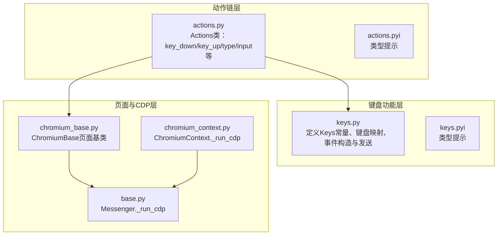
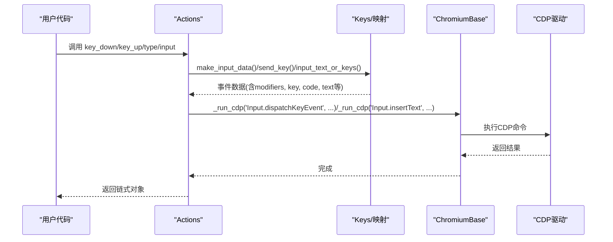
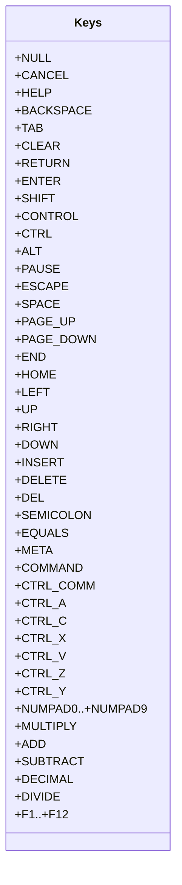
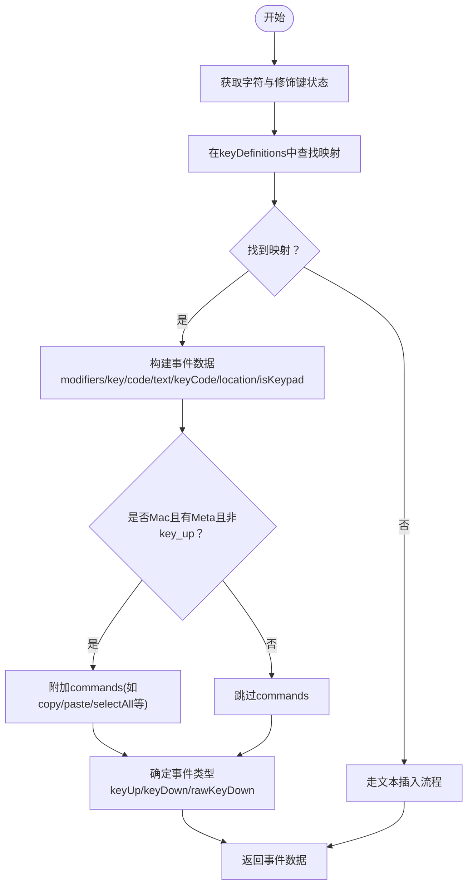
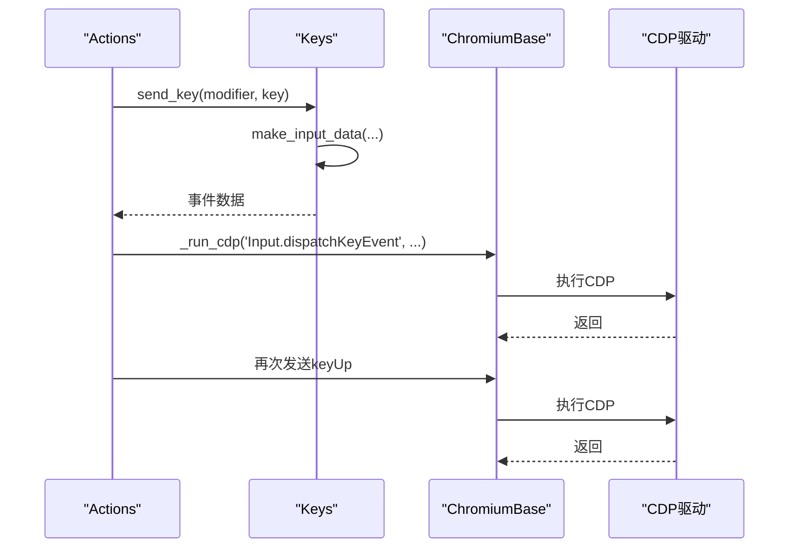
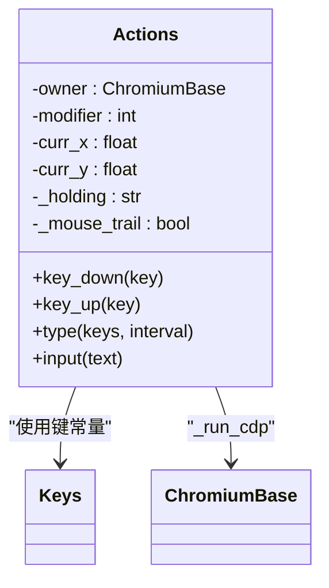
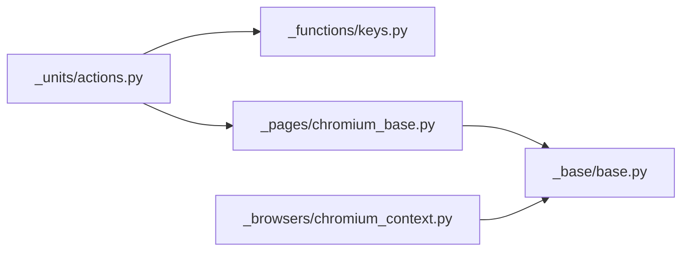

# 键盘快捷键模拟

<cite>
**本文引用的文件**
- [keys.py](file://DrissionPage/_functions/keys.py)
- [keys.pyi](file://DrissionPage/_functions/keys.pyi)
- [actions.py](file://DrissionPage/_units/actions.py)
- [actions.pyi](file://DrissionPage/_units/actions.pyi)
- [chromium_base.py](file://DrissionPage/_pages/chromium_base.py)
- [base.py](file://DrissionPage/_base/base.py)
- [chromium_context.py](file://DrissionPage/_browsers/chromium_context.py)
</cite>

## 目录
1. [简介](#简介)
2. [项目结构](#项目结构)
3. [核心组件](#核心组件)
4. [架构总览](#架构总览)
5. [详细组件分析](#详细组件分析)
6. [依赖分析](#依赖分析)
7. [性能考虑](#性能考虑)
8. [故障排查指南](#故障排查指南)
9. [结论](#结论)
10. [附录](#附录)

## 简介
本章节面向希望使用 DrissionPage 实现键盘快捷键模拟的开发者，系统讲解 Keys 类的实现与使用、修饰键与组合键处理、键盘事件的生成与发送机制（按键按下、按键释放、原始按键、重复按键等）、跨平台键盘映射与兼容性策略、键盘事件监听与捕获思路，以及与页面交互的最佳实践。文档同时提供可直接定位到源码的路径指引，便于深入理解与扩展。

## 项目结构
键盘快捷键模拟能力由以下模块协同实现：
- 键盘常量与事件数据：_functions/keys.py
- 动作链与键盘输入入口：_units/actions.py
- 页面与 CDP 调用封装：_pages/chromium_base.py、_base/base.py、_browsers/chromium_context.py

**图表来源**
- [keys.py:23-96](file://DrissionPage/_functions/keys.py#L23-L96)
- [actions.py:16-216](file://DrissionPage/_units/actions.py#L16-L216)
- [chromium_base.py:39-125](file://DrissionPage/_pages/chromium_base.py#L39-L125)
- [base.py:394-396](file://DrissionPage/_base/base.py#L394-L396)
- [chromium_context.py:60-61](file://DrissionPage/_browsers/chromium_context.py#L60-L61)

**章节来源**
- [keys.py:1-451](file://DrissionPage/_functions/keys.py#L1-L451)
- [actions.py:1-266](file://DrissionPage/_units/actions.py#L1-L266)
- [chromium_base.py:1-200](file://DrissionPage/_pages/chromium_base.py#L1-L200)
- [base.py:394-396](file://DrissionPage/_base/base.py#L394-L396)
- [chromium_context.py:60-61](file://DrissionPage/_browsers/chromium_context.py#L60-L61)

## 核心组件
- Keys 类：集中定义特殊键、功能键、数字小键盘键、功能键 F1-F12 等，提供跨平台兼容的键位常量与常用组合（如复制粘贴等）。
- 键盘映射与事件构造：通过 keyDefinitions 将字符映射为浏览器可识别的 keyCode、code、location、text 等字段；根据修饰键状态与平台差异生成最终事件数据。
- 事件发送：通过 Chromium DevTools Protocol 的 Input.dispatchKeyEvent 与 Input.insertText 发送键盘事件或插入文本。
- 动作链 Actions：对外暴露 key_down、key_up、type、input 等接口，内部统一调用键盘事件构造与发送逻辑。

**章节来源**
- [keys.py:23-96](file://DrissionPage/_functions/keys.py#L23-L96)
- [keys.py:98-350](file://DrissionPage/_functions/keys.py#L98-L350)
- [keys.py:371-434](file://DrissionPage/_functions/keys.py#L371-L434)
- [actions.py:160-216](file://DrissionPage/_units/actions.py#L160-L216)

## 架构总览
键盘事件从“动作链”进入，经“键盘映射与事件构造”，最终通过“CDP 输入接口”下发到浏览器。

**图表来源**
- [actions.py:160-216](file://DrissionPage/_units/actions.py#L160-L216)
- [keys.py:371-434](file://DrissionPage/_functions/keys.py#L371-L434)
- [chromium_base.py:382-384](file://DrissionPage/_pages/chromium_base.py#L382-L384)
- [base.py:394-396](file://DrissionPage/_base/base.py#L394-L396)

## 详细组件分析

### Keys 类与键位常量
- 特殊键与功能键：包含回车、退格、方向键、功能键 F1-F12、数字小键盘等。
- 修饰键：SHIFT、CONTROL/CTRL、ALT、META/CMD，支持跨平台映射（如 Mac 下 CMD 与 Windows CTRL 的区分）。
- 常用组合：CTRL_COMM 自动根据系统选择 CMD 或 CTRL；提供 CTRL_A、CTRL_C、CTRL_V、CTRL_X、CTRL_Z、CTRL_Y 等便捷组合。
- 数字小键盘与运算符：NUMPAD0-9、乘除加减、小数点等。
- 字母与符号：大小写字母、标点与修饰组合映射。

**图表来源**
- [keys.py:23-96](file://DrissionPage/_functions/keys.py#L23-L96)

**章节来源**
- [keys.py:23-96](file://DrissionPage/_functions/keys.py#L23-L96)

### 键盘映射与事件构造
- keyDefinitions：将字符映射为浏览器可识别的 keyCode、code、location、text、shiftKey 等字段，覆盖大小写、数字小键盘、Enter、Backspace 等。
- make_input_data：根据修饰键与字符生成最终事件数据，决定事件类型（keyDown/keyUp/rawKeyDown），并处理文本、位置与平台命令（Mac 上的 Meta 组合）。
- 修饰键位掩码：modifierBit 将 Ctrl/Alt/Meta/Shift 映射为位掩码，用于判断当前修饰状态与事件类型。

**图表来源**
- [keys.py:98-350](file://DrissionPage/_functions/keys.py#L98-L350)
- [keys.py:371-422](file://DrissionPage/_functions/keys.py#L371-L422)

**章节来源**
- [keys.py:98-350](file://DrissionPage/_functions/keys.py#L98-L350)
- [keys.py:371-422](file://DrissionPage/_functions/keys.py#L371-L422)

### 键盘事件发送与页面交互
- send_key：发送一次按键（按下后立即抬起），适用于单键输入与组合键触发。
- input_text_or_keys：根据输入内容是否包含修饰键，选择逐键发送或直接插入文本；对换行符做特殊处理。
- ChromiumBase._run_cdp：通过 Messenger._run_cdp 执行 CDP 命令，ChromiumContext._run_cdp 提供上下文级转发。

**图表来源**
- [keys.py:425-434](file://DrissionPage/_functions/keys.py#L425-L434)
- [chromium_base.py:382-384](file://DrissionPage/_pages/chromium_base.py#L382-L384)
- [base.py:394-396](file://DrissionPage/_base/base.py#L394-L396)
- [chromium_context.py:60-61](file://DrissionPage/_browsers/chromium_context.py#L60-L61)

**章节来源**
- [keys.py:425-434](file://DrissionPage/_functions/keys.py#L425-L434)
- [chromium_base.py:382-384](file://DrissionPage/_pages/chromium_base.py#L382-L384)
- [base.py:394-396](file://DrissionPage/_base/base.py#L394-L396)
- [chromium_context.py:60-61](file://DrissionPage/_browsers/chromium_context.py#L60-L61)

### 动作链 Actions：键盘输入入口
- key_down/key_up：处理修饰键与普通键，维护 modifier 位状态，调用 make_input_data 并发送事件。
- type：支持字符串、列表/元组混合输入，逐字符处理修饰键与文本，必要时自动补发 keyUp。
- input：委托给 input_text_or_keys，实现“文本或组合键”的统一输入。

**图表来源**
- [actions.py:16-216](file://DrissionPage/_units/actions.py#L16-L216)
- [actions.pyi:44-232](file://DrissionPage/_units/actions.pyi#L44-L232)

**章节来源**
- [actions.py:160-216](file://DrissionPage/_units/actions.py#L160-L216)
- [actions.pyi:203-232](file://DrissionPage/_units/actions.pyi#L203-L232)

### 跨平台键盘映射与兼容性
- 系统检测：根据 platform.system() 判断 macOS/darwin 与其他系统，控制修饰键与组合键映射。
- Mac 特性：在 Mac 上，Meta（CMD）与 Control 的作用常被替换；当修饰键包含 Meta 且非 key_up 时，会附加 commands（如 copy/paste/selectAll 等）。
- 数字小键盘：location 字段用于区分主键盘区与小键盘区，isKeypad 字段据此标记。

**章节来源**
- [keys.py:12-13](file://DrissionPage/_functions/keys.py#L12-L13)
- [keys.py:57-57](file://DrissionPage/_functions/keys.py#L57-L57)
- [keys.py:415-419](file://DrissionPage/_functions/keys.py#L415-L419)
- [keys.py:398-403](file://DrissionPage/_functions/keys.py#L398-L403)

### 键盘事件监听与捕获（概念）
- DrissionPage 的键盘输入主要通过 CDP 的 Input.dispatchKeyEvent 与 Input.insertText 发送事件，而非直接监听页面键盘事件。
- 若需要监听页面侧的键盘事件（如 keydown/keyup），可在页面脚本中注册监听器并通过 CDP 注入或通信方式获取事件流。该能力不在本节具体实现范围内，建议结合页面注入与消息通道实现。

[本节为概念性说明，不直接分析具体文件，故无“章节来源”]

## 依赖分析
- Actions 依赖 Keys 与键盘映射函数，依赖 ChromiumBase 的 _run_cdp 执行 CDP。
- ChromiumBase 与 ChromiumContext 提供 _run_cdp 的实现与转发。
- 键盘映射依赖 platform.system() 以实现跨平台兼容。

**图表来源**
- [actions.py:11-12](file://DrissionPage/_units/actions.py#L11-L12)
- [chromium_base.py:39-125](file://DrissionPage/_pages/chromium_base.py#L39-L125)
- [base.py:394-396](file://DrissionPage/_base/base.py#L394-L396)
- [chromium_context.py:60-61](file://DrissionPage/_browsers/chromium_context.py#L60-L61)

**章节来源**
- [actions.py:11-12](file://DrissionPage/_units/actions.py#L11-L12)
- [chromium_base.py:39-125](file://DrissionPage/_pages/chromium_base.py#L39-L125)
- [base.py:394-396](file://DrissionPage/_base/base.py#L394-L396)
- [chromium_context.py:60-61](file://DrissionPage/_browsers/chromium_context.py#L60-L61)

## 性能考虑
- 逐字符输入：type 支持 interval 控制字符间隔，避免过于频繁的 CDP 调用造成页面压力。
- 修饰键状态管理：Actions 维护 modifier 位，减少重复计算与不必要的事件发送。
- 文本批量插入：input_text_or_keys 在无修饰键时优先使用 Input.insertText，减少事件数量。

[本节为通用建议，不直接分析具体文件，故无“章节来源”]

## 故障排查指南
- “无此按键”错误：当输入的键不在 keyDefinitions 中时，key_down/key_up 会抛出异常。请确认键名大小写与 Keys 常量一致。
- 修饰键未释放：若使用 type 输入时中途打断，建议显式调用 key_up 释放修饰键，避免修饰状态残留。
- Mac 组合键无效：确认修饰键包含 Meta 且非 key_up，且目标页面支持相应命令；必要时检查浏览器快捷键冲突。
- 文本未输入：若输入包含修饰键，确保修饰键已正确发送并释放；否则文本可能为空。

**章节来源**
- [actions.py:175-187](file://DrissionPage/_units/actions.py#L175-L187)
- [keys.py:371-422](file://DrissionPage/_functions/keys.py#L371-L422)

## 结论
DrissionPage 的键盘快捷键模拟通过 Keys 常量、键盘映射与事件构造、CDP 输入接口三者协作，实现了对修饰键、组合键、功能键与文本输入的统一支持。借助 Actions 的链式接口，用户可以以最小成本完成复杂键盘操作，并在不同平台上保持一致的行为。结合页面交互与等待策略，可构建稳定可靠的自动化流程。

[本节为总结性内容，不直接分析具体文件，故无“章节来源”]

## 附录

### 常用使用示例（路径指引）
- 单字符输入：参考 [actions.py:214-216](file://DrissionPage/_units/actions.py#L214-L216) 与 [keys.py:436-451](file://DrissionPage/_functions/keys.py#L436-L451)
- 组合键输入（复制/粘贴/撤销/重做）：参考 [keys.py:59-64](file://DrissionPage/_functions/keys.py#L59-L64)
- 修饰键处理（按下/抬起）：参考 [actions.py:160-188](file://DrissionPage/_units/actions.py#L160-L188)
- 数字小键盘与功能键：参考 [keys.py:66-95](file://DrissionPage/_functions/keys.py#L66-L95)
- Enter/换行处理：参考 [keys.py:195-198](file://DrissionPage/_functions/keys.py#L195-L198) 与 [keys.py:446-449](file://DrissionPage/_functions/keys.py#L446-L449)

### 最佳实践
- 优先使用 Actions.input 或 Actions.type，避免直接调用底层 send_key。
- 对长文本输入设置合理的 interval，平衡速度与稳定性。
- 在 Mac 上使用 CTRL_COMM 或直接使用 Keys.META/CMD，确保组合键行为符合预期。
- 输入完成后及时释放修饰键，防止状态污染后续输入。

[本节为通用建议，不直接分析具体文件，故无“章节来源”]