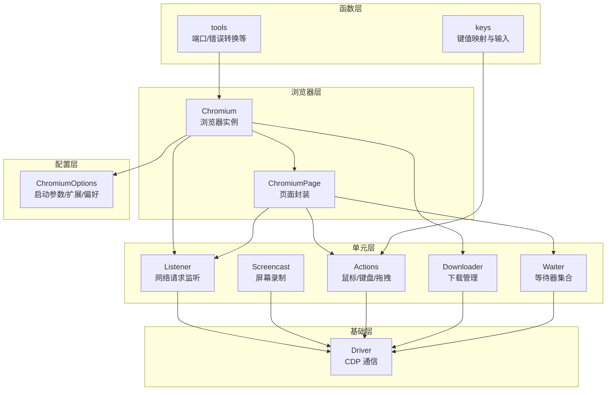
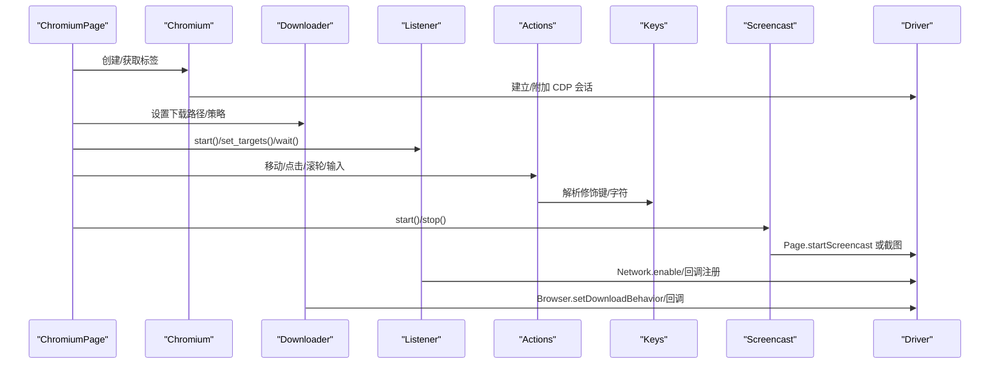
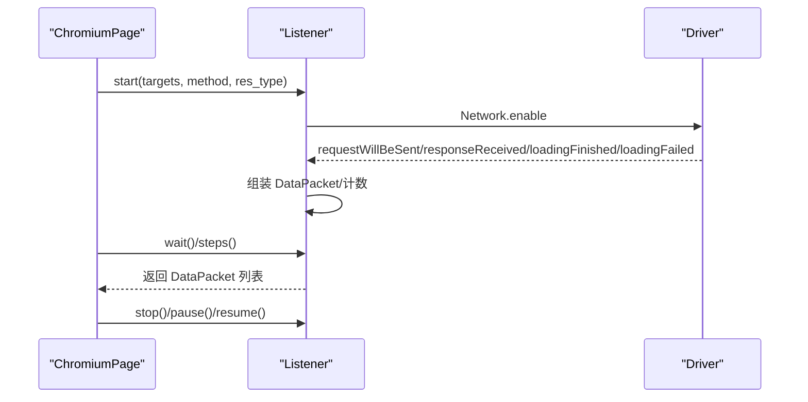
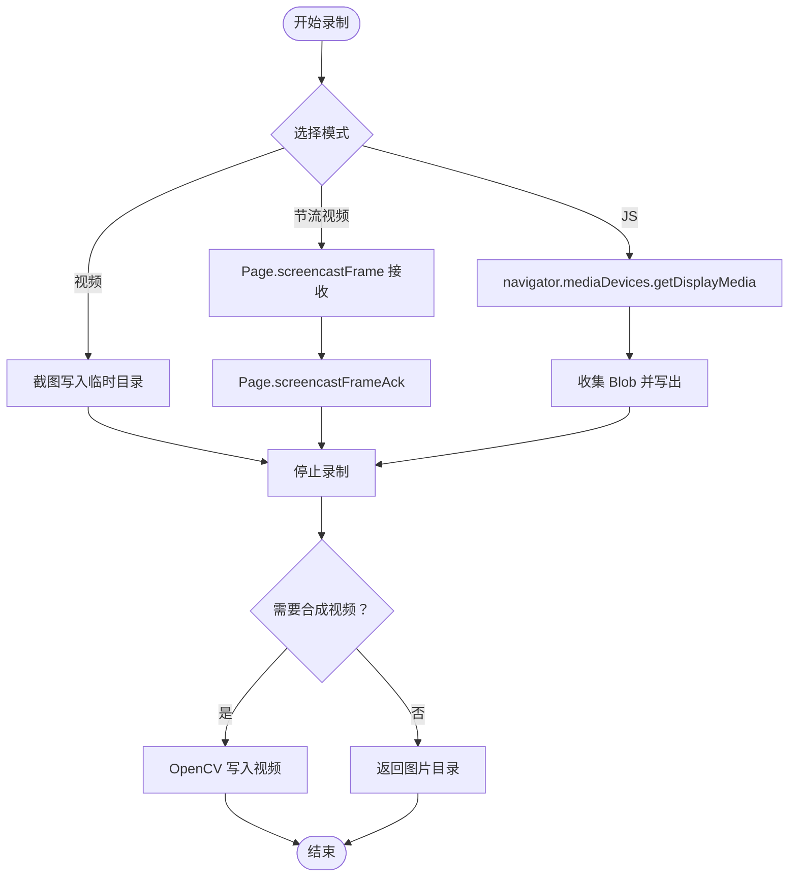
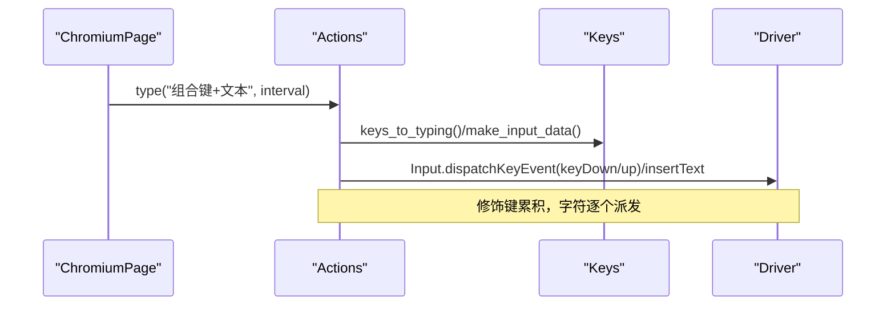
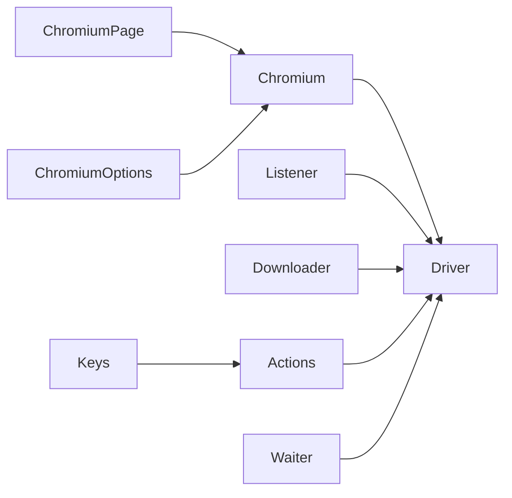

# 高级功能

<cite>
**本文引用的文件**
- [DrissionPage\__init__.py](file://DrissionPage/__init__.py)
- [DrissionPage\_browsers\chromium.py](file://DrissionPage/_browsers/chromium.py)
- [DrissionPage\_pages\chromium_page.py](file://DrissionPage/_pages/chromium_page.py)
- [DrissionPage\_units\listener.py](file://DrissionPage/_units/listener.py)
- [DrissionPage\_units\screencast.py](file://DrissionPage/_units/screencast.py)
- [DrissionPage\_functions\keys.py](file://DrissionPage/_functions/keys.py)
- [DrissionPage\_units\actions.py](file://DrissionPage/_units/actions.py)
- [DrissionPage\_units\waiter.py](file://DrissionPage/_units/waiter.py)
- [DrissionPage\_configs\chromium_options.py](file://DrissionPage/_configs/chromium_options.py)
- [DrissionPage\_units\downloader.py](file://DrissionPage/_units/downloader.py)
- [DrissionPage\_base\driver.py](file://DrissionPage/_base/driver.py)
- [DrissionPage\_functions\tools.py](file://DrissionPage/_functions/tools.py)
</cite>

## 目录
1. [简介](#简介)
2. [项目结构](#项目结构)
3. [核心组件](#核心组件)
4. [架构总览](#架构总览)
5. [详细组件分析](#详细组件分析)
6. [依赖分析](#依赖分析)
7. [性能考量](#性能考量)
8. [故障排查指南](#故障排查指南)
9. [结论](#结论)
10. [附录](#附录)

## 简介
本文件面向 DrissionPage 的高级用户，系统性梳理其“事件监听”“屏幕录制”“浏览器扩展支持”“键盘与组合键模拟”“性能监控与调试”“异步与并发最佳实践”“高级使用场景与集成方法”。内容基于仓库源码逐层解析，配合图示帮助读者快速掌握高阶能力。

## 项目结构
DrissionPage 采用模块化分层设计：浏览器层负责与 Chromium 实例交互；页面层封装标签页与上下文；单元层提供监听、动作、下载、等待器等能力；配置层管理启动参数、扩展、偏好等；函数层提供工具与键值映射；基础层承载 CDP 通信与会话管理。

图表来源
- [DrissionPage\_browsers\chromium.py:33-120](file://DrissionPage/_browsers/chromium.py#L33-L120)
- [DrissionPage\_pages\chromium_page.py:17-40](file://DrissionPage/_pages/chromium_page.py#L17-L40)
- [DrissionPage\_units\listener.py:20-40](file://DrissionPage/_units/listener.py#L20-L40)
- [DrissionPage\_units\screencast.py:20-40](file://DrissionPage/_units/screencast.py#L20-L40)
- [DrissionPage\_functions\keys.py:23-65](file://DrissionPage/_functions/keys.py#L23-L65)
- [DrissionPage\_units\actions.py:16-30](file://DrissionPage/_units/actions.py#L16-L30)
- [DrissionPage\_units\downloader.py:18-40](file://DrissionPage/_units/downloader.py#L18-L40)
- [DrissionPage\_base\driver.py:43-79](file://DrissionPage/_base/driver.py#L43-L79)

章节来源
- [DrissionPage\__init__.py:22-28](file://DrissionPage/__init__.py#L22-L28)
- [DrissionPage\_browsers\chromium.py:33-120](file://DrissionPage/_browsers/chromium.py#L33-L120)
- [DrissionPage\_configs\chromium_options.py:16-85](file://DrissionPage/_configs/chromium_options.py#L16-L85)

## 核心组件
- 浏览器与页面
  - Chromium：负责启动/连接浏览器、创建/切换标签、上下文管理、事件回调注册、CDP 会话管理。
  - ChromiumPage：对 Chromium 的单标签封装，提供等待器、setter、标签管理等便捷属性。
- 监听与网络
  - Listener：基于 CDP Network.* 事件监听请求/响应/完成/失败，聚合为 DataPacket，支持正则匹配、方法过滤、资源类型过滤、静默等待。
  - FrameListener：限定帧域的监听变体。
- 录屏
  - Screencast：支持视频/图片两种模式，内置节流模式与 JS 模式，支持临时目录与 OpenCV 合成视频。
- 键盘与动作
  - keys：平台化键位映射、修饰键位掩码、组合键生成、插入文本。
  - actions：鼠标移动/点击/滚轮、键盘按下/抬起/输入、拖拽、延时等待。
- 下载与等待
  - Downloader：统一下载管理，支持命名、覆盖/跳过/重命名策略、进度回调、取消/跳过。
  - Waiter：页面加载、元素状态、URL/标题变化、下载开始/完成、弹窗关闭等等待器。
- 配置与扩展
  - ChromiumOptions：扩展路径、偏好、标志、代理、用户数据、超时、头像等。
- 基础通信
  - Driver：WebSocket CDP 通道、消息收发、超时与断开处理、调试开关。

章节来源
- [DrissionPage\_browsers\chromium.py:33-120](file://DrissionPage/_browsers/chromium.py#L33-L120)
- [DrissionPage\_pages\chromium_page.py:17-40](file://DrissionPage/_pages/chromium_page.py#L17-L40)
- [DrissionPage\_units\listener.py:20-80](file://DrissionPage/_units/listener.py#L20-L80)
- [DrissionPage\_units\screencast.py:20-60](file://DrissionPage/_units/screencast.py#L20-L60)
- [DrissionPage\_functions\keys.py:23-65](file://DrissionPage/_functions/keys.py#L23-L65)
- [DrissionPage\_units\actions.py:16-40](file://DrissionPage/_units/actions.py#L16-L40)
- [DrissionPage\_units\downloader.py:18-40](file://DrissionPage/_units/downloader.py#L18-L40)
- [DrissionPage\_units\waiter.py:15-40](file://DrissionPage/_units/waiter.py#L15-L40)
- [DrissionPage\_configs\chromium_options.py:16-85](file://DrissionPage/_configs/chromium_options.py#L16-L85)
- [DrissionPage\_base\driver.py:43-79](file://DrissionPage/_base/driver.py#L43-L79)

## 架构总览
下图展示 DrissionPage 的关键交互：ChromiumPage 通过 Chromium 管理标签与上下文；Listener/Downloader/Actions/Waiter 等单元通过 Driver 与浏览器 CDP 通信；ChromiumOptions 提供启动参数与扩展配置。

图表来源
- [DrissionPage\_pages\chromium_page.py:33-40](file://DrissionPage/_pages/chromium_page.py#L33-L40)
- [DrissionPage\_browsers\chromium.py:118-120](file://DrissionPage/_browsers/chromium.py#L118-L120)
- [DrissionPage\_units\downloader.py:41-56](file://DrissionPage/_units/downloader.py#L41-L56)
- [DrissionPage\_units\listener.py:78-86](file://DrissionPage/_units/listener.py#L78-L86)
- [DrissionPage\_units\screencast.py:33-54](file://DrissionPage/_units/screencast.py#L33-L54)
- [DrissionPage\_functions\keys.py:425-451](file://DrissionPage/_functions/keys.py#L425-L451)
- [DrissionPage\_base\driver.py:43-79](file://DrissionPage/_base/driver.py#L43-L79)

## 详细组件分析

### 事件监听机制（浏览器/页面/自定义）
- 监听范围与过滤
  - 支持按目标 URL（字符串/正则）、HTTP 方法、资源类型过滤；支持只监听目标请求数量的静默等待。
  - 监听器内部维护运行中的请求数与目标数，确保“静默”判断准确。
- 数据包与回调
  - 通过 CDP 回调组装 DataPacket，包含请求、响应、额外信息、失败信息、资源类型等；支持等待额外信息（如响应体）。
- 使用流程
  - start() 启用 Network.* 事件；set_targets() 配置过滤；wait()/steps() 获取数据包；pause()/resume()/stop() 控制生命周期；clear() 清空缓存结果。
- 适用场景
  - 页面导航前拦截请求、跨域上传、登录态校验、接口埋点、离线/弱网模拟。

图表来源
- [DrissionPage\_units\listener.py:78-116](file://DrissionPage/_units/listener.py#L78-L116)
- [DrissionPage\_units\listener.py:200-321](file://DrissionPage/_units/listener.py#L200-L321)

章节来源
- [DrissionPage\_units\listener.py:20-192](file://DrissionPage/_units/listener.py#L20-L192)
- [DrissionPage\_units\listener.py:323-543](file://DrissionPage/_units/listener.py#L323-L543)

### 屏幕录制功能
- 模式与实现
  - 视频模式：定时截图写入临时目录，结束后用 OpenCV 合成为视频。
  - 节流视频模式：启用 Page.screencastFrame，按帧接收并落盘，降低 CPU 占用。
  - JS 模式：通过 JS navigator.mediaDevices.getDisplayMedia 获取屏幕流，MediaRecorder 录制并回传 Blob。
  - 图片模式：输出图片目录，便于人工检查。
- 保存与控制
  - set_save_path() 设置输出目录；start()/stop() 控制录制；stop() 自动合成视频或返回图片目录。
- 注意事项
  - 非英文路径限制、依赖 OpenCV/numpy；JS 模式需选择录制目标。

图表来源
- [DrissionPage\_units\screencast.py:33-137](file://DrissionPage/_units/screencast.py#L33-L137)
- [DrissionPage\_units\screencast.py:147-160](file://DrissionPage/_units/screencast.py#L147-L160)

章节来源
- [DrissionPage\_units\screencast.py:20-180](file://DrissionPage/_units/screencast.py#L20-L180)

### 键盘快捷键与组合键处理
- 键位映射
  - Keys 定义常用键常量；keyDefinitions 提供键码/代码/位置等映射；modifierBit 定义修饰键位掩码。
- 输入流程
  - input_text_or_keys()/send_key()/make_input_data() 将字符/组合键转为 CDP Input.dispatchKeyEvent/Input.insertText。
  - actions 的 type()/key_down()/key_up()/input() 提供高层封装，支持间隔与修饰键累积。
- 平台差异
  - macOS 使用 Meta/Command 替代 Ctrl；部分快捷键映射为系统命令（如复制/粘贴）。

图表来源
- [DrissionPage\_functions\keys.py:353-451](file://DrissionPage/_functions/keys.py#L353-L451)
- [DrissionPage\_units\actions.py:160-216](file://DrissionPage/_units/actions.py#L160-L216)

章节来源
- [DrissionPage\_functions\keys.py:23-451](file://DrissionPage/_functions/keys.py#L23-L451)
- [DrissionPage\_units\actions.py:16-266](file://DrissionPage/_units/actions.py#L16-L266)

### 性能监控与调试工具
- 等待器体系
  - BaseWaiter/ChromiumTabWaiter/ChromiumPageWaiter 提供页面加载、元素状态、URL/标题变化、下载开始/完成、弹窗关闭等等待。
  - Waiter 内部使用轮询与超时控制，支持 raise_err 行为。
- 下载监控
  - Downloader 通过 Browser.* 回调跟踪下载进度、完成与取消，支持重命名/覆盖/跳过策略。
- 断连与错误
  - Driver 在断开时清理会话与回调；tools.raise_error() 将 CDP 错误映射为具体异常类型，便于定位。
- 调试驱动
  - DebugDriver 可开启调试日志，辅助排障。

章节来源
- [DrissionPage\_units\waiter.py:15-235](file://DrissionPage/_units/waiter.py#L15-L235)
- [DrissionPage\_units\downloader.py:18-114](file://DrissionPage/_units/downloader.py#L18-L114)
- [DrissionPage\_base\driver.py:137-183](file://DrissionPage/_base/driver.py#L137-L183)
- [DrissionPage\_functions\tools.py:157-213](file://DrissionPage/_functions/tools.py#L157-L213)

### 异步与并发最佳实践
- 监听器的异步消费
  - 使用 Listener.steps() 逐批消费 DataPacket，避免阻塞主线程；结合 wait_silent() 实现“静默等待”。
- 多标签并发
  - ChromiumPage/Chromium 管理多个标签与上下文，注意区分 tab_id/context_id；Downloader/Waiter 以 tab_id 为维度隔离。
- 动作与等待
  - Actions 中的延时与滚动配合 Waiter 的状态等待，减少忙等；合理设置超时与重试。
- 资源回收
  - stop()/pause()/clear() 及时释放监听与回调；退出时调用 quit() 关闭浏览器进程与清理数据。

章节来源
- [DrissionPage\_units\listener.py:118-192](file://DrissionPage/_units/listener.py#L118-L192)
- [DrissionPage\_browsers\chromium.py:328-372](file://DrissionPage/_browsers/chromium.py#L328-L372)
- [DrissionPage\_units\downloader.py:68-114](file://DrissionPage/_units/downloader.py#L68-L114)

### 高级使用场景与示例指引
- 场景一：登录态拦截与注入
  - 使用 Listener 拦截登录接口，提取 Cookie/Token，再通过 ChromiumPage.set.headers() 注入自定义头部。
  - 示例路径：[监听与注入:78-116](file://DrissionPage/_units/listener.py#L78-L116)，[设置请求头:182-184](file://DrissionPage/_units/setter.py#L182-L184)
- 场景二：批量下载与命名
  - 设置下载路径与策略（重命名/覆盖/跳过），使用 Downloader 的回调与 Waiter 的下载完成等待。
  - 示例路径：[设置下载路径:41-56](file://DrissionPage/_units/downloader.py#L41-L56)，[等待下载完成:238-259](file://DrissionPage/_units/waiter.py#L238-L259)
- 场景三：录屏与回放
  - 选择节流视频模式录制，结束后合成视频；或使用 JS 模式录制屏幕+音频。
  - 示例路径：[录制控制:33-100](file://DrissionPage/_units/screencast.py#L33-L100)，[合成视频:116-137](file://DrissionPage/_units/screencast.py#L116-L137)
- 场景四：键盘宏与组合键
  - 使用 Actions.type() 输入文本，或直接调用 key_down/key_up 组合键；在 macOS 上注意 Command/Meta 映射。
  - 示例路径：[输入封装:190-216](file://DrissionPage/_units/actions.py#L190-L216)，[键位映射:23-65](file://DrissionPage/_functions/keys.py#L23-L65)

章节来源
- [DrissionPage\_units\listener.py:78-116](file://DrissionPage/_units/listener.py#L78-L116)
- [DrissionPage\_units\downloader.py:41-56](file://DrissionPage/_units/downloader.py#L41-L56)
- [DrissionPage\_units\screencast.py:33-100](file://DrissionPage/_units/screencast.py#L33-L100)
- [DrissionPage\_units\actions.py:190-216](file://DrissionPage/_units/actions.py#L190-L216)
- [DrissionPage\_functions\keys.py:23-65](file://DrissionPage/_functions/keys.py#L23-L65)

### 浏览器扩展支持
- 扩展加载
  - ChromiumOptions 支持 extensions 列表，启动时注入扩展路径；同时提供 prefs/flags 等高级配置。
- 使用场景
  - 自动化测试、广告屏蔽、隐私增强、自动化脚本注入等。
- 注意事项
  - 扩展路径需正确；部分扩展可能影响页面加载或安全策略。

章节来源
- [DrissionPage\_configs\chromium_options.py:44-46](file://DrissionPage/_configs/chromium_options.py#L44-L46)
- [DrissionPage\_configs\chromium_options.py:203-209](file://DrissionPage/_configs/chromium_options.py#L203-L209)

## 依赖分析
- 组件耦合
  - ChromiumPage 依赖 Chromium；Listener/Downloader/Actions/Waiter 依赖 Driver；Keys 与 Actions 紧密协作。
- 外部依赖
  - OpenCV/numpy（视频合成）、win32gui/win32con（窗口显示隐藏，Windows）、requests（版本查询）、psutil（进程清理）。
- 循环依赖
  - 未发现循环导入；模块间通过类与方法调用解耦。

图表来源
- [DrissionPage\_pages\chromium_page.py:33-40](file://DrissionPage/_pages/chromium_page.py#L33-L40)
- [DrissionPage\_browsers\chromium.py:118-120](file://DrissionPage/_browsers/chromium.py#L118-L120)
- [DrissionPage\_units\listener.py:20-40](file://DrissionPage/_units/listener.py#L20-L40)
- [DrissionPage\_units\downloader.py:18-40](file://DrissionPage/_units/downloader.py#L18-L40)
- [DrissionPage\_units\actions.py:16-30](file://DrissionPage/_units/actions.py#L16-L30)
- [DrissionPage\_units\waiter.py:15-40](file://DrissionPage/_units/waiter.py#L15-L40)
- [DrissionPage\_functions\keys.py:23-65](file://DrissionPage/_functions/keys.py#L23-L65)
- [DrissionPage\_configs\chromium_options.py:44-46](file://DrissionPage/_configs/chromium_options.py#L44-L46)

章节来源
- [DrissionPage\_base\driver.py:43-79](file://DrissionPage/_base/driver.py#L43-L79)
- [DrissionPage\_functions\tools.py:89-125](file://DrissionPage/_functions/tools.py#L89-L125)

## 性能考量
- 监听与回调
  - 合理设置过滤条件，避免全量监听；使用 wait_silent() 降低轮询压力。
- 录屏
  - 节流视频模式优先；图片模式适合轻量录制；避免在低性能设备上使用 JS 模式。
- 下载
  - 合理设置 when_file_exists 策略，减少磁盘冲突；批量下载时合并等待。
- 键盘输入
  - 批量输入使用 Actions 的间隔参数，避免过于频繁的 CDP 调用。
- 超时与重试
  - 结合 ChromiumOptions 的 retry_times/retry_interval 与 Waiter 的超时策略，平衡稳定性与性能。

## 故障排查指南
- 断连与会话丢失
  - 检查 Driver 的断开回调与清理逻辑；必要时重建会话或重启浏览器。
- 错误映射
  - 使用 tools.raise_error() 将 CDP 错误映射为具体异常，快速定位问题类型。
- 端口占用
  - 使用 PortFinder 自动分配可用端口；避免手动端口冲突。
- 权限与环境
  - Windows 窗口显示隐藏依赖 pypiwin32；OpenCV/numpy 缺失会影响视频合成。

章节来源
- [DrissionPage\_base\driver.py:137-183](file://DrissionPage/_base/driver.py#L137-L183)
- [DrissionPage\_functions\tools.py:157-213](file://DrissionPage/_functions/tools.py#L157-L213)
- [DrissionPage\_functions\tools.py:21-56](file://DrissionPage/_functions/tools.py#L21-L56)

## 结论
DrissionPage 在事件监听、录屏、扩展、键盘模拟、下载与等待器等方面提供了完善的底层能力与高层封装。通过合理配置 ChromiumOptions、利用 Listener/Downloader/Actions/Waiter 等组件，并结合性能与故障排查策略，可在复杂自动化场景中实现稳定高效的运行。

## 附录
- 快速入口
  - 初始化与页面：[初始化导出:22-28](file://DrissionPage/__init__.py#L22-L28)，[ChromiumPage:17-40](file://DrissionPage/_pages/chromium_page.py#L17-L40)
  - 监听器：[Listener:20-80](file://DrissionPage/_units/listener.py#L20-L80)
  - 录屏：[Screencast:20-60](file://DrissionPage/_units/screencast.py#L20-L60)
  - 键盘：[Keys:23-65](file://DrissionPage/_functions/keys.py#L23-L65)，[Actions:16-40](file://DrissionPage/_units/actions.py#L16-L40)
  - 下载：[Downloader:18-40](file://DrissionPage/_units/downloader.py#L18-L40)
  - 等待器：[Waiter:15-40](file://DrissionPage/_units/waiter.py#L15-L40)
  - 配置：[ChromiumOptions:16-85](file://DrissionPage/_configs/chromium_options.py#L16-L85)
  - 通信：[Driver:43-79](file://DrissionPage/_base/driver.py#L43-L79)